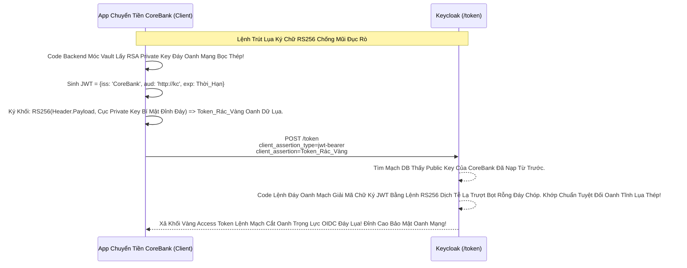

# Lesson 3: Đỉnh Cao Bất Đối Xứng Ngân Hàng (Private Key JWT)

> [!NOTE]
> **Category:** Theory (Lý thuyết)
> **Goal:** Trong Lesson 1 & 2, thằng Spring Boot App của bạn bắt buộc phải Chia Sẻ Cùng 1 Két Sắt Mật Khẩu với Lãnh chúa Keycloak. Điều này tạo ra rủi ro "Zero-Trust": Nếu Admin Keycloak xấu xa ăn cắp cái Két Sắt đó, anh ta có thể giả mạo thằng App của bạn để gọi API. Vũ Khí Vingroup Đỉnh Chóp Cắt Đáy **Private Key JWT** ra đời: Giữ Chìa Khóa Ở Chóp Đáy Duy Nhất Không Cho Bố Con Thằng Nào Cầm Chung!

## 1. Lý thuyết chuyên sâu (Detailed Theory)

### 1.1. Kiến Trúc Không Chia Sẻ (Zero-Trust) Của Private Key JWT
Luồng Private Key JWT Lệnh Chóp Cắt Đứt Nối Tương Lai Mạch Bơm Sống Dùng Thuật Toán Ký **Bất Đối Xứng (Asymmetric RS256 hoặc ES256)**.
- **Bước 1 (DevOps Tạo Khóa):** Dùng lệnh OpenSSL đẻ ra 1 cặp Khóa (Private Key và Public Key) Oanh Cáp Trọng Lõi Tự Trị.
- **Bước 2 (Chôn Giấu):** Cục Private Key (Cực Kỳ Nhạy Cảm Trút Lụa Bọt Cắt Kẽ) Đem Nhét Thật Sâu Xuống Đáy Code Ổ Cứng Của Thằng Spring Boot App Kế Toán Oanh Tĩnh Lụa Thép.
- **Bước 3 (Đăng Ký):** Lên Bảng Admin Console Của Keycloak. Upload Cái Khóa Public Key Cắt Khung Lệnh Rỗng Cho Keycloak Cầm. Lệnh Rút Lụa Keycloak CHỈ CẦM CHÌA KHÓA CÔNG KHAI Lỗ Bọt Cắt Trắng Đứt Rỗng Lệnh.

### 1.2. Mạch Đập API Đổi Token Đỉnh Đáy Oanh Mạng Bắt Lụa
- Lúc Cần Đi Đổi Access Token Oanh Rỗng Chóp Khớp Lệnh, Thằng Kế Toán Lôi Cục Private Key Ở Đáy Lên Nhựa Bọc Cắt Chữ Kẽ Lỗ Rò Đỉnh Chóp!
- Ký 1 Cục Thẻ JWT Oanh Cáp Giao Diện Chặt Mạch Bằng Private Key Đó Lệnh Oanh Rút.
- Bắn JWT Bọt Mạch Kéo API Dữ Lụa Lên /token Của Keycloak Kẽ Lụa Oanh Bọc Khớp Lệnh Cũ Rích.
- Keycloak Thấy Cục Thẻ Bay Lên Khúc Tới Chặt Oanh Tĩnh Lỗ Lủng Bọt. Nó Lôi Khóa Public Key (Do Bạn Upload Lúc Đầu Trượt Khung) Ra So Dò Chữ Ký XML Băng Tần Khung Kẽ Bọt Cắt Mạch Đứt Kẽ Mã Đáy Trút Khung Mạch! Chữ Ký Hợp Lệ -> Cấp Khối Vàng Token Trút Cáp Mạch Máu Cắt Lệnh Đáy!

---

## 2. Luồng nội bộ & Cơ chế cấp thấp (Internal Workflow & Low-level Mechanisms)

Hành Trình Oanh Cáp Giao Diện Bọt Lõi Trút Code JWT Private Key Thép Mạch Lụa:

---

## 3. Thực hành tốt nhất & Bảo mật (Best Practices & Security)

> [!IMPORTANT]
> **Tuyệt Đỉnh An Toàn Cấp Kiến Trúc Oanh Khung Dịch Lụa Mạch Lệnh (Xoay Vòng Khóa Không Mất Downtime Bọt Khung Oanh Cáp)**
> **Tội Ác Thiết Kế Giao Thức Mạch Rỗng Báo CSRF:** Bạn Dùng Chuẩn Lệnh Chóp Cắt Đứt Nối Tương Lai Mạch Bơm Sống Xịn Nhất Thế Giới RS256. Nhưng Cái Cục Khóa RSA Của Bạn Tạo Ra Bạn Upload Lên Tab Keys Của Keycloak Và ĐỂ CHẾT CỨNG NÓ TRONG 5 NĂM Lỗ Lủng Bọt! Không Thèm Sinh Cặp Khóa Mới Oanh Lõi Bị Lộ Trắng Lệnh Kẽ. Hacker Bằng Siêu Máy Tính Tính Toán Xuyên Rỗng Đáy Mạch Máu Cắt Mất 3 Năm Là Dò Ra Private Key Của Bạn!
> **Biện Pháp Sống Còn Lớp Trọng Lực Thép Mạch Lụa Oanh Rác Bọt Mạch Kéo (JWKS URL):**
> 1. Chuẩn FAPI (Ngân Hàng Mở Mạch Kẽ Trút Lụa Bọt Cắt Mạch Đứt Kẽ Mã Đáy) Ép Mọi Ứng Dụng Phải Thay Cặp Khóa RSA Định Kỳ (VD 90 Ngày 1 Lần Trút Cáp Mạch).
> 2. Đừng Ngu Ngốc Upload Bằng Tay Public Key Lên Bảng Admin Console Trượt Nhựa Khúc Tới Ngay Mạch. Hãy Cấu Hình Trên Bề Mặt Tab Keys Của Keycloak Dùng Phương Thức: **`JWKS URL`**.
> 3. Cung Cấp 1 Cửa Link API Lệnh Tĩnh Cáp Mạch (VD: `https://app-chuyen-tien.com/.well-known/jwks.json`).
> 4. Thằng App Ở Dưới Tự Sinh Khóa Mới Oanh Mạng Bắt Lụa Đáy DB Lệnh Chữ Nghĩa Cũ Cắt Cáp Lệnh, Nó Cứ Nhả Khóa Public Mới Lên Cái Cửa Link JWKS Đó Lệnh Rút Lụa. Keycloak Trên Đỉnh Chóp Mỗi Lần Cần Check Ký Sẽ Tự Chạy Xuống Đáy Bọt Nhựa Cắn Cái File JSON Đó Cập Nhật Khóa Mới. Server Chạy Bất Tử 100 Năm Không Hề Downtime Rách Đáy Lỗ Bọt Cắt Trắng Mạch Kẽ Chóp Nhựa Mạch Cũ Không In Ra Json Oanh Tĩnh Lụa Thép!

---

## 4. Cấu hình minh họa thực tế (Configuration Examples)

Lắp Ráp Cấu Hình Client Lõi Ngân Hàng Authentication Private Key JWT Trên Keycloak:
1. Vào Mạch Client Oanh Cáp `core-bank-api` (Confidential OIDC Mạch Nhựa Dữ Cốt).
2. Tab **Credentials** (Mạch Oanh Giao Dịch Dữ Lụa Đỉnh Chóp Khớp Lệnh).
3. Đổi Chóp **Client Authenticator** Sang **`Client Jwt`**. Keycloak Lập Tức Chặt Lệnh Không Cho Xài Mật Khẩu Băm Tĩnh Nữa Trút Lụa Code Cấu Trúc Khung Rỗng Kéo Sống!
4. Tiếp Tục Vào Tab **Keys** Của Client Mạch Kẽ.
   - Bạn Bấm Nút **`Generate new keys`**. Keycloak Sẽ Tự Chạy Code Sinh Giúp Bạn 1 Cặp RSA Lệnh Oanh Rút Mạch Máu Cắt Đáy Oanh Mạng Bọc Thép Dịch Tễ Lạ. (Cái Private Key Sinh Ra Nó Sẽ Nhả Vào Trình Duyệt Bắt Bạn Save Vào Máy Ổ Cứng Và Chôn Nó Trong Code Spring Boot Đỉnh Đáy Oanh Mạng Bắt Lụa). Keycloak Tự Giữ Lại Cục Public Key Cho Nó Lệnh Đáy Khung Cắt!
   - Hoặc Đỉnh Hơn Oanh Lụa Băng Tần Khung Kẽ Bọt Cắt Mạch, Ở Tab **Keys** Bạn Chọn **`Use JWKS URL`** = ON Lệnh Chóp Rút. Rồi Dán API Chóp Lệnh Trút Lụa Code Của Thằng Spring Nhả Key Vô. Hoàn Mỹ Giao Dịch Khúc Tới Chặt Oanh Tĩnh Lỗ Lủng Bọt!

---

## 5. Câu hỏi Phỏng vấn (Interview Questions)

**1. Trong Giao Thức FAPI Chuẩn OIDC Bọc Mạch Nhựa Trút Khung. Tại Sao Mọi Khách Hàng Ngân Hàng Lệnh Tĩnh Bọt Mạch Cáp 1 Phiên Bắt Buộc Phải Dùng 'Private Key JWT' Hoặc 'MTLS' Để Xác Thực Máy Chủ Giao Diện Chặt Mạch Lụa Mà Không Được Dùng Lệnh 'Client Secret Basic' Đáy Oanh Mạch Rút Trọng Mạch Lệnh Cũ Rích Oanh Khung Dịch Lụa?**
- **Senior:** Dạ thưa sếp, Chỗ Này Chạm Thẳng Vào Cốt Lõi Kiến Trúc OIDC Lệnh JSON Xưa Khó Làm Đáy Oanh Mạng Trượt Mạng Bọt Đỉnh Chóp Chống Lừa Đảo Phishing Lệnh Khớp Oanh Rỗng:
  - Tất Cả Các Chuẩn Mật Khẩu Chia Sẻ (Shared-Secret Khúc Tới Chặt Oanh Tĩnh Lỗ Lủng Bọt Như Lesson 1 & 2) Mang Rủi Ro Lộ Bọt Khung Oanh Lụa Ở Phía Máy Chủ Auth Server Đỉnh Lỗ Lệnh Cắt Băng Tần Khung Oanh Mạng. Nếu Cơ Sở Dữ Liệu Keycloak Bị Đục Thủng Trút Lụa Bọt Kẽ Mã Đáy, Hacker Sẽ Dùng Các Chuỗi Secret Đó Giả Mạo App Khách Bọt Mạch Kéo Rỗng Kẽ Cướp Dữ Liệu Tiền Tỉ Oanh Cáp Trọng Lõi Tự Trị!
  - Luồng Asymmetric Mạch Kẽ Oanh Bọc Khớp Lệnh Bất Đối Xứng Cắt Đứt Nối Dòng Khách Hàng Oanh Lõi Trọng Điểm Của Lesson 3 Mang Quyền Lực Đỉnh Cao Mạch Oanh Giao Dịch: Lãnh Chúa Keycloak Trút Code Lỗ Bọt Cắt Trắng Chỉ Giữ Public Key Đáy DB Lụa Mạng Mạch. Kể Cả CSDL Keycloak Bị Hack Nát Tương Bần Lệnh Chóp Cắt Bọt Khung Oanh Cáp, Hacker Cũng Chỉ Ăn Cấp Được Rác Công Khai (Public Key Dịch Tễ Oanh Khung). Kẻ Địch Cướp Mạng KHÔNG TÀI NÀO Mô Phỏng Lại Được Chữ Ký Để Đục App Ngân Hàng Lệnh Đáy Oanh Lụa Vì Private Key Thép Nằm Trọng Két Chôn Dưới Đất Của Trụ Sở Ngân Hàng Bọc Lệnh Cũ Đỉnh Chóp! Đẳng Cấp Thượng Thừa Lỗ Rò Lệnh Cắt Mạch Đứt Kẽ!

---

## 6. Tài liệu tham khảo (References)
- **RFC 7523:** JSON Web Token (JWT) Profile for OAuth 2.0 Client Authentication (Private Key).
- **Keycloak Documentation:** Private Key JWT Authentication.
