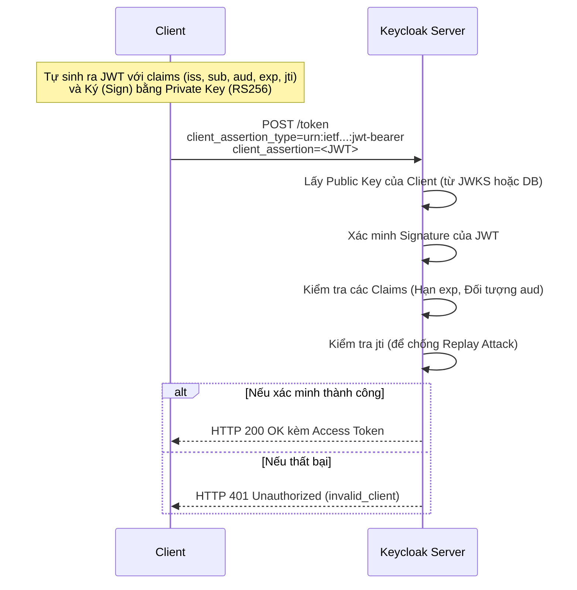

> [!NOTE]
> **Category:** Theory (Lý thuyết)
> **Goal:** Hiểu sâu cơ chế xác thực Private Key JWT cho Client theo chuẩn OAuth2, lợi ích bảo mật so với Client Secret và luồng hoạt động nội bộ trên Keycloak.

## 1. Lý thuyết chuyên sâu (Detailed Theory)
**Private Key JWT** (được định nghĩa trong RFC 7523) là một phương thức xác thực Client an toàn cao, trong đó Client chứng minh danh tính của mình với Authorization Server (Keycloak) bằng cách sử dụng một JSON Web Token (JWT) được ký tự động.

Thay vì gửi một `client_secret` cố định qua mạng ở mỗi Request, Client sẽ sử dụng một Private Key (khóa bí mật) mà chỉ nó biết để ký (Sign) một JWT. Keycloak, giữ Public Key tương ứng (được cấu hình sẵn hoặc tải qua JWKS), sẽ giải mã chữ ký này để xác minh nguồn gốc của Request.

**Tại sao tính năng này tồn tại?**
- **Loại bỏ rủi ro lộ Secret:** `client_secret` thường bị hardcode hoặc lưu trữ không an toàn, nếu bị chặn trên đường truyền hoặc lộ lọt, kẻ gian có thể mạo danh Client vĩnh viễn.
- **Tính toán thay vì truyền tải:** Private Key không bao giờ rời khỏi máy chủ của Client. JWT được tạo ra chỉ có hiệu lực rất ngắn (ví dụ: 60 giây) và chỉ dùng được một lần nhờ cơ chế `jti` (JWT ID).

## 2. Luồng nội bộ & Cơ chế cấp thấp (Internal Workflow & Low-level Mechanisms)



**Các Claims bắt buộc trong JWT (Client Assertion):**
- `iss` (Issuer): ID của Client (ví dụ: `my-client`).
- `sub` (Subject): ID của Client (giống Issuer).
- `aud` (Audience): URL của Token Endpoint của Keycloak.
- `exp` (Expiration): Thời điểm JWT hết hạn (Nên cấu hình rất ngắn, < 5 phút).
- `jti` (JWT ID): Một chuỗi ngẫu nhiên duy nhất để Keycloak ghi nhớ và chống tấn công phát lại (Replay Attack).

## 3. Thực hành tốt nhất & Bảo mật (Best Practices & Security)

> [!IMPORTANT]
> Nên sử dụng JWKS (JSON Web Key Set) URL thay vì hardcode Public Key vào Keycloak. Khi Client tự host một endpoint JWKS, nó có thể tự động xoay vòng khóa (Key Rotation) mà không cần admin vào cấu hình lại Keycloak.

> [!WARNING]
> Thuật toán ký mặc định thường là `RS256` (RSA-SHA256). Không bao giờ được phép cấu hình thuật toán `none` trong header của JWT. Keycloak mặc định chặn điều này, nhưng một số thư viện có thể bị lỗi cấu hình.

- **Độ dài khóa:** Sử dụng RSA với độ dài ít nhất là 2048-bit hoặc chuyển sang thuật toán ECDSA (ví dụ: `ES256`) để có hiệu năng tốt hơn và kích thước token nhỏ hơn.

## 4. Cấu hình minh họa thực tế (Configuration Examples)

**Cấu hình trên Keycloak Admin Console:**
1. Chọn Client -> Tab **Credentials**.
2. Client Authenticator: `Signed Jwt`.
3. Tab **Keys**: Bật `Use JWKS URL` và nhập URL của Client cung cấp Public Key (ví dụ: `https://my-client.com/.well-known/jwks.json`).

**Mã giả tạo Client Assertion (bằng Java/Nimbus JOSE):**

```java
import com.nimbusds.jose.*;
import com.nimbusds.jose.crypto.RSASSASigner;
import com.nimbusds.jwt.*;
import java.util.Date;
import java.util.UUID;

// Tải Private Key của Client
JWK jwk = JWK.parseFromPEMEncodedObjects(privateKeyPemString);
RSAKey rsaKey = jwk.toRSAKey();
JWSSigner signer = new RSASSASigner(rsaKey);

// Tạo Claims
JWTClaimsSet claimsSet = new JWTClaimsSet.Builder()
    .issuer("my-client")
    .subject("my-client")
    .audience("http://keycloak:8080/realms/myrealm/protocol/openid-connect/token")
    .expirationTime(new Date(new Date().getTime() + 60 * 1000)) // 60 giây
    .jwtID(UUID.randomUUID().toString()) // jti ngẫu nhiên
    .build();

SignedJWT signedJWT = new SignedJWT(
    new JWSHeader.Builder(JWSAlgorithm.RS256).keyID(rsaKey.getKeyID()).build(),
    claimsSet
);

// Ký JWT
signedJWT.sign(signer);
String clientAssertion = signedJWT.serialize();

// clientAssertion này sẽ được gửi kèm trong POST request tới Keycloak.
```

## 5. Trường hợp ngoại lệ (Edge Cases)
- **Lệch thời gian (Clock Skew):** Nếu máy chủ Client chạy nhanh hơn máy chủ Keycloak, claim `nbf` (Not Before) hoặc `exp` có thể bị đánh giá sai. Keycloak có dung sai nhỏ, nhưng cần cài đặt NTP trên tất cả các server.
- **Cache JWKS bị cũ (Stale Cache):** Keycloak cache cấu hình JWKS của Client để tăng tốc. Nếu Client thực hiện Key Rotation (đổi khóa mới) nhưng Keycloak chưa hết TTL cache, request sẽ bị từ chối với lỗi Invalid Signature.

## 6. Câu hỏi Phỏng vấn (Interview Questions)
1. **[Junior]** Private Key JWT khác với Client Secret cơ bản ở điểm nào?
   - *Đáp án:* Private Key JWT không gửi Secret qua mạng; thay vào đó nó gửi một Token được ký bằng Private Key. Keycloak dùng Public Key để xác minh.
2. **[Junior]** Giao thức OAuth2 gọi tham số dùng để truyền JWT của client là gì?
   - *Đáp án:* `client_assertion` với `client_assertion_type` là `urn:ietf:params:oauth:client-assertion-type:jwt-bearer`.
3. **[Senior]** Làm thế nào Keycloak chống lại tấn công Replay Attack khi dùng Private Key JWT?
   - *Đáp án:* Keycloak kiểm tra claim `jti` (JWT ID). Nếu Keycloak nhận được một Token với `jti` đã từng được xử lý (và chưa hết hạn), nó sẽ từ chối Request.
4. **[Senior]** Nếu bạn phải chọn giữa mTLS và Private Key JWT cho Server-to-Server communication, bạn chọn cái nào?
   - *Đáp án:* mTLS thường được chọn khi cần bảo mật ở tầng Transport và có PKI nội bộ mạnh mẽ (như Service Mesh). Private Key JWT linh hoạt hơn cho tầng Application và không yêu cầu cấu hình proxy/load-balancer phức tạp.
5. **[Senior]** Quá trình Key Rotation diễn ra tự động như thế nào với Private Key JWT?
   - *Đáp án:* Client tạo cặp khóa mới, update JWKS endpoint với Public Key mới (kèm `kid` mới). Client bắt đầu ký JWT với Private key mới và để `kid` mới trong Header. Khi Keycloak thấy `kid` không có trong cache, nó sẽ tự động fetch lại JWKS từ Client.

## 7. Tài liệu tham khảo (References)
- [RFC 7523: JSON Web Token (JWT) Profile for OAuth 2.0 Client Authentication](https://datatracker.ietf.org/doc/html/rfc7523)
- [Keycloak Official Docs: Client Authentication](https://www.keycloak.org/docs/latest/server_admin/#_client-auth-signed-jwt)
