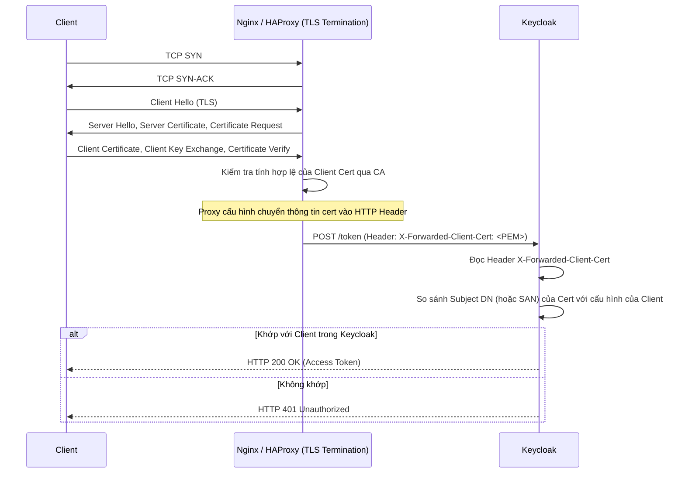

> [!NOTE]
> **Category:** Theory (Lý thuyết)
> **Goal:** Tìm hiểu cơ chế xác thực Mutual TLS (mTLS) bằng X.509 Certificate cho OAuth2 Clients, cách thiết lập bảo mật cấp Transport layer và ứng dụng trong môi trường Zero Trust.

## 1. Lý thuyết chuyên sâu (Detailed Theory)
Trong mô hình TLS thông thường (One-way TLS), chỉ có Client xác minh chứng chỉ (Certificate) của Server để đảm bảo kết nối đến đúng đích. Với **Mutual TLS (mTLS)** hay **Hai chiều TLS**, Server cũng yêu cầu Client phải xuất trình một chứng chỉ hợp lệ để chứng minh danh tính của nó trong quá trình bắt tay (TLS Handshake).

Trong ngữ cảnh của Keycloak và OAuth2 (theo RFC 8705), mTLS được sử dụng để xác thực Client. Thay vì gửi mật khẩu (Secret) ở tầng ứng dụng (HTTP), Client xuất trình chứng chỉ X.509 ở tầng Transport (TCP/TLS). Keycloak sẽ kiểm tra xem chứng chỉ này có hợp lệ không (được ký bởi CA tin cậy chưa hết hạn) và trích xuất thông tin (ví dụ Subject DN) để ánh xạ với một Client được cấu hình sẵn trong Realm.

Phương pháp này cực kỳ an toàn vì:
- Ngăn chặn hoàn toàn việc đánh cắp thông tin xác thực trên đường truyền (Man-in-the-Middle).
- Nếu kẻ tấn công có trộm được Access Token, chúng cũng không thể sử dụng nó nếu không có Client Certificate và Private Key tương ứng (Proof-of-Possession Token).

## 2. Luồng nội bộ & Cơ chế cấp thấp (Internal Workflow & Low-level Mechanisms)



Nếu không có Reverse Proxy, Client sẽ thực hiện mTLS trực tiếp với Undertow/Quarkus của Keycloak trên cổng 8443. Keycloak sẽ đọc trực tiếp từ context của kết nối TLS thay vì HTTP header.

## 3. Thực hành tốt nhất & Bảo mật (Best Practices & Security)

> [!IMPORTANT]
> Khi sử dụng Reverse Proxy (ví dụ Nginx) đứng trước Keycloak, bạn PHẢI cấu hình Proxy thực hiện "TLS Termination", yêu cầu mTLS từ client, và sau đó truyền Client Certificate dưới dạng URL-encoded trong một HTTP Header (ví dụ `X-Forwarded-Client-Cert` hoặc `ssl-client-cert`) tới Keycloak. Phải đảm bảo không ai có thể làm giả Header này bằng cách chặn (strip) các header tương tự từ client gốc.

> [!WARNING]
> Việc quản lý vòng đời chứng chỉ (PKI) rất phức tạp. Hãy sử dụng các công cụ tự động hóa như HashiCorp Vault, cert-manager hoặc Service Mesh (Istio) để tự động xoay vòng (rotate) chứng chỉ trước khi chúng hết hạn.

- **Sender-Constrained Tokens:** Khi sử dụng mTLS, Keycloak có thể phát hành các Access Token bị ràng buộc với chứng chỉ của Client. Resource Server khi nhận Token cũng yêu cầu Client phải kết nối qua mTLS để xác minh hàm băm (hash) của chứng chỉ trùng khớp với claim `cnf.x5t#S256` trong JWT.

## 4. Cấu hình minh họa thực tế (Configuration Examples)

**Cấu hình Nginx làm Reverse Proxy hỗ trợ mTLS:**
```nginx
server {
    listen 443 ssl;
    server_name auth.example.com;

    ssl_certificate /etc/nginx/certs/server.crt;
    ssl_certificate_key /etc/nginx/certs/server.key;

    # Kích hoạt xác thực Client
    ssl_client_certificate /etc/nginx/certs/ca.crt;
    ssl_verify_client optional_no_ca; # Cho phép client truy cập giao diện web bình thường mà không cần cert

    location / {
        proxy_pass http://keycloak:8080;
        
        # Truyền Client Certificate cho Keycloak
        proxy_set_header X-Forwarded-Client-Cert $ssl_client_escaped_cert;
        
        proxy_set_header Host $host;
        proxy_set_header X-Real-IP $remote_addr;
        proxy_set_header X-Forwarded-For $proxy_add_x_forwarded_for;
        proxy_set_header X-Forwarded-Proto $scheme;
    }
}
```

**Cấu hình Keycloak Server:**
1. Trong cấu hình hệ thống (hoặc `keycloak.conf`), bật tính năng đọc chứng chỉ từ Header:
   `spi-truststore-file-file=/path/to/truststore.jks` (nếu chạy trực tiếp).
2. Tại Admin Console, chọn Client -> **Credentials**.
3. Chọn Client Authenticator: `X509 Certificate`.
4. Nhập **Subject DN** dự kiến của client: `CN=my-service, O=MyCompany, C=VN`.

## 5. Trường hợp ngoại lệ (Edge Cases)
- **Certificate Revocation (Thu hồi chứng chỉ):** Nếu Client bị lộ Private Key, chứng chỉ cần được thu hồi. Keycloak và Proxy phải cấu hình kiểm tra CRL (Certificate Revocation List) hoặc OCSP để chặn chứng chỉ đã bị thu hồi, nếu không attacker vẫn dùng được chứng chỉ đó.
- **Header Injection:** Nếu Proxy không chặn (drop) các header `X-Forwarded-Client-Cert` gửi từ thiết bị đầu cuối (end-user), một kẻ tấn công có thể chèn một chuỗi PEM giả mạo vào HTTP request thông thường và vượt qua lớp bảo mật của Keycloak.

## 6. Câu hỏi Phỏng vấn (Interview Questions)
1. **[Junior]** Mutual TLS (mTLS) khác với TLS thông thường như thế nào?
   - *Đáp án:* TLS thông thường chỉ có Client xác thực Server. mTLS yêu cầu cả Server phải xác thực Client bằng cách yêu cầu Client gửi X.509 Certificate của nó.
2. **[Junior]** Làm thế nào Keycloak biết Request đến từ Client nào khi sử dụng mTLS?
   - *Đáp án:* Keycloak kiểm tra các thuộc tính của chứng chỉ (như Subject DN) và so sánh nó với Regex/Chuỗi đã cấu hình trong mục Credentials của Client.
3. **[Senior]** Khi triển khai Keycloak sau Nginx (Reverse Proxy), làm sao Keycloak nhận được Client Certificate?
   - *Đáp án:* Nginx kết thúc kết nối mTLS (TLS termination), trích xuất chứng chỉ client, mã hóa URL (url-encode) và chèn nó vào một HTTP Header (ví dụ: `X-Forwarded-Client-Cert`) trước khi forward request đến HTTP port của Keycloak.
4. **[Senior]** "Sender-Constrained Token" trong OAuth2 mTLS là gì và tại sao nó an toàn?
   - *Đáp án:* Là Access Token (JWT) có chứa claim `cnf` mang mã băm của Client Certificate. Khi Client gọi API (Resource Server), nó phải dùng mTLS. Resource server sẽ tính băm của chứng chỉ đang kết nối và so sánh với claim `cnf` trong Token. Nó chống lại việc trộm Token (Token theft) vì attacker không có Private Key mTLS của Client.
5. **[Senior]** Giải thích nguy cơ "Header Spoofing" khi sử dụng mTLS qua Reverse Proxy và cách phòng chống?
   - *Đáp án:* Nếu người dùng có thể cố tình gửi header `X-Forwarded-Client-Cert` từ bên ngoài internet, ứng dụng bên trong có thể tin tưởng sai lệch. Phòng chống bằng cách cấu hình Reverse Proxy luôn luôn ghi đè (overwrite) hoặc xóa (clear) header này nếu request không xuất phát từ quá trình mTLS hợp lệ.

## 7. Tài liệu tham khảo (References)
- [RFC 8705: OAuth 2.0 Mutual-TLS Client Authentication and Certificate-Bound Access Tokens](https://datatracker.ietf.org/doc/html/rfc8705)
- [Keycloak Documentation: Reverse Proxy Configuration](https://www.keycloak.org/server/reverseproxy)
