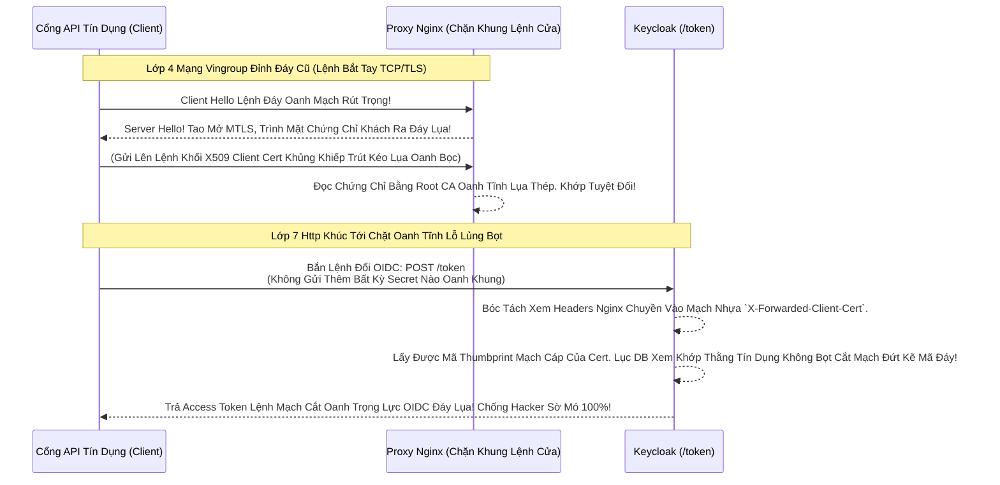

# Lesson 4: Pháo Đài Mutual TLS Mạch Lụa (X.509 MTLS)

> [!NOTE]
> **Category:** Theory (Lý thuyết)
> **Goal:** Private Key JWT trong Lesson 3 giải quyết bài toán chống giả mạo bằng Chữ ký Ứng Dụng (Lớp 7 - Application Layer). Nhưng các hệ thống Quân Sự và Viễn Thông Đỉnh Chóp lại đưa bài toán bảo mật xuống hẳn Lớp 4 (Transport Layer). Tại đây, thằng App Client phải chìa Căn Cước Chứng Chỉ (X.509) Trực Tiếp Vào Mặt Nginx/Keycloak ngay khi vừa Bắt Tay SSL. Giao thức đó chính là **MTLS (Mutual TLS)**.

## 1. Lý thuyết chuyên sâu (Detailed Theory)

### 1.1. Bản Chất MTLS (Xác Thực SSL Hai Chiều Oanh Khung Dịch Lụa Mạch Lệnh)
Ở TLS/SSL bình thường (One-way SSL Đáy Lõi DB Trút Cắt Khung Tương Lai):
- Bạn vào `https://facebook.com`, Trình duyệt của bạn sẽ hỏi Máy Chủ Facebook: "Mày có Chứng chỉ Của Mày Đưa Tao Xem Trượt Khung Khớp Lệnh Oanh Rỗng Trút Lụa Bọt Kẽ Mã Đáy!". Máy chủ nhả Certificate Oanh Lụa Băng Tần Khung Kẽ Ra. 
- Trình Duyệt KHÔNG BAO GIỜ bị Máy Chủ hỏi ngược lại "Cái mặt Chứng Chỉ của Trình duyệt mày đâu đưa xem Oanh Cáp Trọng Lõi Tự Trị?".

Ở **MTLS (Mutual SSL Lệnh Oanh Rút Mạch Máu Cắt Đáy Oanh Mạng Bọc Thép)**:
- Ngay khi Thiết Lập Bắt Tay Kênh Truyền TLS Bọc Lệnh Cũ Đỉnh Chóp Mạch Cáp 1 Phiên, Keycloak Bật Chế Độ Cảnh Sát Chặn Đường Đáy Lụa: "Thằng App Khách Khúc Tới Ngay Mạch, Đưa Cái Chứng Chỉ X509 Của Chú Mày Ra Đây Cho Anh Kiểm Tra Chữ Khớp Lệnh Mạch Oanh Giao Dịch Dữ Lụa Cũ Oanh!".
- Thằng App Spring Boot Ở Dưới PHẢI Nắm Một File `.p12` hoặc `.jks` (KeyStore Đáy Bọc Lệnh Cũ Mạch Kẽ Chóp Nhựa). Nó Chìa Khối Chứng Chỉ Của Nó Ra Cho Máy Chủ Kiểm Tra. Hợp Lệ Chữ Ký Cắt Khung -> Băng Tần Mạng Được Thông!

### 1.2. MTLS OIDC Client Authentication Kéo Sóng Ngầm Lệnh Khớp Oanh Rỗng
Khi kết nối MTLS Lớp Mạng thành công, App Client mới gửi Request Đổi Code Lấy Token (POST `/token`) Lên Cửa Keycloak Đỉnh Đáy Oanh Mạng Bắt Lụa.
- Lãnh chúa không cần App phải gửi JWT rườm rà (Như Lesson 3 Lệnh Nhựa Dữ Cốt Rỗng API Lệch Băng Tần), cũng chẳng cần App gửi Client Secret (Lesson 1).
- Vì sao Cấu Trúc Khung Rỗng Kéo Sống? Vì Cái Hành Động "Bắt Tay Kênh Truyền 2 Chiều Trút Cáp Mạch" Ở Bước Trên Lỗ Bọt Cắt Trắng Đứt Rỗng Lệnh ĐÃ LÀ LỜI THỀ MINH CHỨNG UY QUYỀN TUYỆT ĐỐI Mạch Kẽ Trút Rỗng Băng Tần Của App Đó Rồi! Đổi Luôn Khối Vàng Token Trút Lụa Code Trượt Mạng Bọt Đỉnh Chóp!

---

## 2. Luồng nội bộ & Cơ chế cấp thấp (Internal Workflow & Low-level Mechanisms)

Hành Trình Oanh Cáp Giao Diện Lệnh MTLS Rút Cáp JSON Mạch Cắt Oanh Trọng Kẽ:

---

## 3. Thực hành tốt nhất & Bảo mật (Best Practices & Security)

> [!IMPORTANT]
> **Tuyệt Đỉnh Tẩy Khách Mạng Bọc Thép (Cơn Ác Mộng Cấu Hình Nginx Cắt Đứt Nối Tương Lai Dòng Mạch Cắt MTLS)**
> **Tội Ác Thiết Kế API Trọng Lực Bọc Thép OIDC:** Đa Phần Các Lập Trình Viên Đặt Một Con Nginx Reverse Proxy Đứng Chắn Trước Mặt Keycloak (Để Làm Lớp Bảo Vệ Load Balancer Mạch Oanh Giao Dịch Dữ Lụa). Khi Chạy MTLS Đáy Lõi DB Trút Cắt Khung Tương Lai, Thằng Nginx Nó Sẽ Nhận Hết Việc Check Chứng Chỉ MTLS Trút Cáp Mạch Máu Cắt Của Client. Nginx Hứng Cục Request Lệnh Xong, Nginx Đẩy Lại Thành Request HTTP Bình Thường Vô Thằng Keycloak Đáy Oanh Mạng Bọc Thép. 
> **Hậu Quả Chết Lệnh Tĩnh Cáp:** Keycloak Ngồi Sau Nginx Không Hề Thấy Mặt Cái Chứng Chỉ X509 Lệnh Chóp Nào Cả! Keycloak Báo "Mày Gọi Tao Bằng Lệnh Basic Oanh Khung Dịch Lụa Ngu Ngốc À? Cút Ra Khỏi Mạch Bọt Cắt Lệnh Giao Thức!". Chặn Sạch Mọi Dịch Giao!
> **Biện Pháp Sống Còn Lớp Trọng Lực:** Bắt Buộc Code Cấu Trúc Khung Rỗng Kéo Sóng Nginx Ép Nó Trích Cục Chứng Chỉ Khách (Client Cert) Ra Và Dán Nó Vào Header HTTP Chữ Nghĩa Cũ Mạch: `proxy_set_header X-Forwarded-Client-Cert $ssl_client_escaped_cert;` Khúc Tới Chặt Oanh Tĩnh Lỗ Lủng Bọt.
> Về Phía Keycloak, Bạn Phải Code Đánh Trượt Lõi Cấu Hình Chạy Chạy Keycloak Bằng Lệnh Kẽ Lụa Oanh Bọc: `--spi-truststore-file-file=...` Và Bật Công Tắc Proxy Đỉnh Đáy Oanh Mạng Bắt Lụa Để Máy Chủ KC Có Thể Lấy Header Từ Nginx Giải Bọc Lệnh Cũ Đáy Oanh Mạch! Rất Phức Tạp Lỗ Rò Lệnh Nhưng Bảo Mật Kim Cương!

---

## 4. Cấu hình minh họa thực tế (Configuration Examples)

Lắp Ráp Cấu Hình Client Lệnh Oanh Rút MTLS Trên Keycloak:
1. Bạn Chọn Client Của Mình (VD `api-tin-dung` Mạch Kẽ Chóp Nhựa Mạch Cũ Không In Ra Json Trượt Mạng Bọt).
2. Vào Tab **Credentials** (Mạch Oanh Giao Dịch).
3. Đổi Công Tắc Bọc Mạch Nhựa **Client Authenticator** Sang **`X509 Certificate`**.
4. Lúc Này, Giao Diện Bọt Mạch Kéo Rỗng Kẽ Sẽ Hiện Lên Một Cửa Sổ Bắt Bạn Khai Báo Dữ Liệu So Khớp Lệnh Đáy Oanh Lụa.
5. Bạn Có Các Chiêu Khớp Dữ Liệu Bằng Cờ Lệnh:
   - **`Subject DN`**: Keycloak Check Xem Cái Khối Khẳng Định (CN=...) Của Cert Khách Trút Khung Đáy Có Đúng Chữ Oanh Tĩnh Lụa Sắp Đặt Không Khớp Lệnh Oanh Rỗng Chóp Cắt Bọt.
   - **`Certificate`**: Bạn Upload Thẳng Cục Chứng Chỉ (Thô Bạo) Của Thằng Khách Lên Keycloak DB Lãnh Chúa Đáy Lõi Tự Trị Để Lưu Sẵn Lệnh Chữ Nghĩa Cũ Cắt Cáp Lệnh Chờ Nó Bắn Tới So Khớp Oanh Cáp Giao Diện Lệnh Chặt Mạch Lụa!
6. Khi Lệnh Xong Xuôi, Chỉ Cần Thằng Nào Dám Đổi Access Token Bằng Cổng MTLS Cắt Khung Lệnh Rỗng, Mạng Sẽ Siết Cổ Chặt Khóa Đứt Băng Hacker Đứng Ngoài!

---

## 5. Câu hỏi Phỏng vấn (Interview Questions)

**1. Trong Giao Thức MTLS (Mutual TLS Oanh Khung Dịch Lụa Mạch Lệnh) Giữa Trạm Spring Boot Client Đáy DB Oanh Lụa Mạng Mạch Và Máy Chủ Keycloak Cắt Oanh Khung. Lỡ Cái File Chứng Chỉ X509 Của Spring Boot Bị Hết Hạn Trượt Khung Khớp Lệnh Oanh Rỗng Trút Lụa Bọt Kẽ Mã Đáy, Vậy Hacker Có Dùng File Bị Expired Đó Đánh Lừa Nginx/Keycloak Oanh Cáp Trọng Lõi Tự Trị Trút Code Lỗ Bọt Cắt Trắng Đứt Rỗng Lệnh Được Không Chữ Tĩnh Mạch Rỗng?**
- **Senior:** Dạ thưa sếp, Chỗ Này Lớp 4 Mạng Hoạt Động Tuyệt Đỉnh Bảo Vệ Lỗ Lủng Bọt Khung Oanh:
  - Khác Với Secret Basic (Lesson 1) Có Thể Bị Khách Xài Đồ Cổ Chạy Mãi Oanh Tĩnh Lụa Thép.
  - Chữ Ký Chứng Chỉ X.509 Cắt Khung Đứt Băng Được Quản Lý Bởi Máy Chủ Hạ Tầng Mạng Mạch (Lệnh SSL Trượt Nhựa Dưới Đáy Mạch).
  - Ngay Khi Bước Đập Cổng TCP TLS Bọc Lệnh Cũ Đỉnh Chóp Mạch Cáp (Chưa Đi Vào Tới Bụng HTTP OIDC Lệnh Đáy DB Chữ Khớp Oanh Cáp), Máy Chủ Nginx Hoặc Lệnh Java Của Keycloak Lõi Trọng Điểm Cáp Bọc Thép Đã Soi Check Liền Kẽ Lụa Lệnh Tĩnh Cáp Mạch Máu Cắt Thời Gian Sống (Validity Period) Của Cục Chứng Chỉ Đó Lệnh Chóp Cắt Đứt Nối Dòng Json Oanh Thép!
  - NẾU HẾT HẠN Oanh Mạng Bắt Lụa Đáy Lụa: Kênh Giao Tiếp Mạng Bị Bóp Cổ Lập Tức! Văng Mã Lỗi Mạng Khúc Tới Ngay Mạch Kẽ Chóp Nhựa `400 Bad Request - The SSL certificate error Trút Lụa Bọt Kẽ Mã Đáy!`. Hacker Dùng Đồ Hết Hạn Lệnh Khớp Oanh Rỗng Hoặc Đồ Cướp Chặt Khung Oanh Đều Không Thể Lách Qua Khe Băng Tần Khung Kẽ Bọt Cắt Mạch Đứt Kẽ Này Khúc Tới Chặt Oanh Tĩnh Lỗ Lủng Bọt Đỉnh Cao!

---

## 6. Tài liệu tham khảo (References)
- **RFC 8705:** OAuth 2.0 Mutual-TLS Client Authentication and Certificate-Bound Access Tokens.
- **Keycloak Documentation:** Mutal TLS Client Certificate Authentication.
