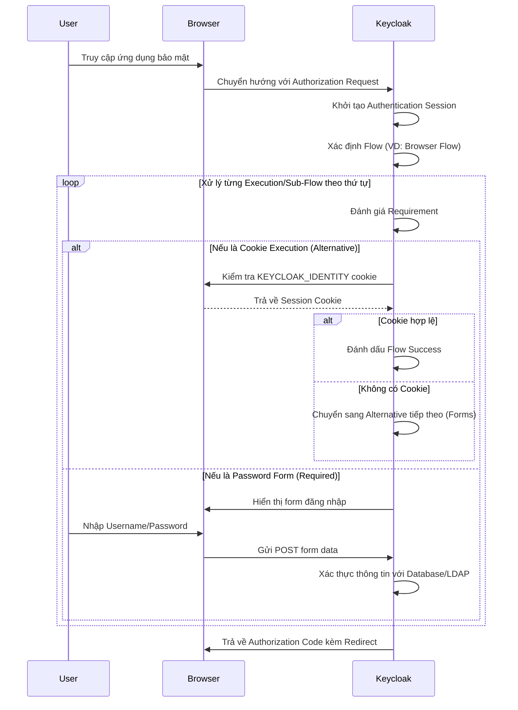

> [!NOTE]
> **Category:** Theory (Lý thuyết)
> **Goal:** Hiểu sâu về kiến trúc luồng xác thực (Authentication Flows Architecture) trong Keycloak, các thành phần cốt lõi và cách chúng phối hợp để xử lý quy trình đăng nhập.

## 1. Lý thuyết chuyên sâu (Detailed Theory)
Trong Keycloak, **Authentication Flows** không chỉ là một form đăng nhập đơn giản mà là một công cụ mạnh mẽ và linh hoạt để định nghĩa chuỗi các bước (steps) và điều kiện mà người dùng hoặc hệ thống phải vượt qua để chứng minh danh tính.

Kiến trúc cốt lõi bao gồm các thành phần sau:
- **Flow**: Là một container chứa danh sách các bước xác thực. Một Flow có thể chứa các **Execution** và các **Sub-Flow**. Keycloak định nghĩa sẵn nhiều flow mặc định như Browser, Direct Grant, Registration, v.v.
- **Execution**: Là một hành động hoặc bộ kiểm tra đơn lẻ cụ thể, ví dụ như kiểm tra mật khẩu (Password form), xác thực OTP, hoặc kiểm tra Cookie.
- **Sub-Flow**: Là một luồng con nằm bên trong một luồng lớn hơn. Sub-flow cho phép nhóm các Execution lại với nhau và áp dụng các điều kiện logic (như Alternative hoặc Required) lên toàn bộ nhóm.
- **Requirement**: Xác định mức độ bắt buộc của một Execution hoặc Sub-Flow. Có các mức:
  - `REQUIRED`: Bắt buộc phải thành công.
  - `ALTERNATIVE`: Chỉ cần một trong các Alternative execution/sub-flow thành công là được.
  - `DISABLED`: Bỏ qua hoàn toàn.
  - `CONDITIONAL`: Dựa vào điều kiện để quyết định có thực thi hay không.

Vấn đề cốt lõi mà kiến trúc này giải quyết là tính linh hoạt. Thay vì hard-code logic đăng nhập, Keycloak cung cấp một State Machine cho phép quản trị viên tự do thiết kế các luồng xác thực phức tạp (ví dụ: yêu cầu WebAuthn cho IP ngoài mạng nội bộ, hoặc yêu cầu cập nhật mật khẩu nếu quá hạn) mà không cần viết thêm mã nguồn (code).

## 2. Luồng nội bộ & Cơ chế cấp thấp (Internal Workflow & Low-level Mechanisms)
Khi một Client khởi tạo yêu cầu đăng nhập (ví dụ qua Authorization Code flow), Keycloak engine sẽ đánh giá Authentication Flow tương ứng.

Cơ chế cấp thấp:
- Trạng thái của quá trình xác thực được duy trì qua **Authentication Session**, lưu trữ tạm thời trong Infinispan cache (mặc định là `authenticationSessions`).
- Mỗi Execution là một implementation của giao diện `AuthenticatorFactory` và `Authenticator`. Phương thức `authenticate(AuthenticationFlowContext context)` được gọi để xử lý luồng đăng nhập. Nếu nó yêu cầu đầu vào từ người dùng, nó sẽ gọi `context.challenge()` để render UI.
- Nếu thành công, nó gọi `context.success()` và Keycloak engine chuyển sang Execution tiếp theo trong cây Flow.

## 3. Thực hành tốt nhất & Bảo mật (Best Practices & Security)

> [!WARNING]
> Không bao giờ chỉnh sửa trực tiếp các flow mặc định (Built-in flows) của Keycloak. Hãy luôn chọn **Duplicate** (Sao chép) flow hiện có và tùy chỉnh trên bản sao đó, sau đó bind (gán) nó vào các client hoặc realm tương ứng.

> [!IMPORTANT]
> Khi sử dụng `ALTERNATIVE`, đảm bảo rằng bạn hiểu rõ logic nhánh. Nếu hai executions cùng là Alternative, việc vượt qua một trong hai sẽ bỏ qua cái còn lại. Tuy nhiên, nếu bạn gộp nhiều bước lại cần thực hiện chung, hãy dùng Sub-Flow có `REQUIRED` và cấu hình Sub-Flow đó là `ALTERNATIVE` so với các phương thức khác.

- **Security Note:** Giới hạn việc sử dụng `Direct Grant Flow` trừ khi thực sự cần thiết cho các ứng dụng legacy hoặc scripts nội bộ, vì nó bỏ qua các bước kiểm tra UI như MFA hoặc Terms and Conditions.

## 4. Cấu hình minh họa thực tế (Configuration Examples)
Ví dụ về việc tạo một Custom Browser Flow yêu cầu MFA (OTP) bắt buộc:
1. Sao chép `Browser` flow thành `Custom_Browser_Flow`.
2. Trong phần `Browser Forms` (Sub-Flow), tìm đến Execution `OTP Form`.
3. Chuyển Requirement của `OTP Form` từ `OPTIONAL` / `ALTERNATIVE` sang `REQUIRED`.
4. Đi tới tab **Bindings** và gán `Custom_Browser_Flow` cho mục **Browser Flow**.

Điều này buộc mọi người dùng phải cấu hình và nhập OTP mỗi khi đăng nhập.

## 5. Trường hợp ngoại lệ (Edge Cases)
- **Vòng lặp xác thực (Authentication Loop):** Cấu hình sai Requirement (ví dụ: không có Execution nào thành công trong một Sub-Flow Required) có thể khiến Keycloak trả về lỗi hoặc tạo thành vòng lặp vô tận. Giải pháp là luôn kiểm tra logic State Machine của Flow trước khi đưa lên Production.
- **Session Timeout trong khi đang ở giữa Flow:** Authentication Session có vòng đời ngắn (mặc định là 30 phút). Nếu người dùng treo trang đăng nhập quá lâu rồi mới nhập mật khẩu, Keycloak sẽ ném ngoại lệ `Authentication session expired`. Người dùng phải bắt đầu lại flow từ đầu.

## 6. Câu hỏi Phỏng vấn (Interview Questions)
- **Câu hỏi 1 (Junior):** Authentication Flow trong Keycloak có tác dụng gì?
  - *Đáp án Junior:* Nó quản lý các bước mà người dùng phải thực hiện để đăng nhập thành công, như nhập tên đăng nhập, mật khẩu, và OTP.
- **Câu hỏi 2 (Junior):** Sự khác biệt giữa `REQUIRED` và `ALTERNATIVE` Requirement là gì?
  - *Đáp án Junior:* `REQUIRED` bắt buộc bước đó phải thành công. `ALTERNATIVE` cho phép qua bước đó nếu ít nhất một trong các bước `ALTERNATIVE` cùng cấp thành công.
- **Câu hỏi 3 (Senior):** Giải thích cách Keycloak lưu giữ trạng thái (state) khi người dùng di chuyển giữa nhiều Execution trong một Flow dài?
  - *Đáp án Senior:* Keycloak sử dụng Authentication Session được lưu trong Infinispan cache `authenticationSessions`. Trạng thái này không gắn với User Session (vì user chưa được xác thực hoàn toàn). Cookie `AUTH_SESSION_ID` được dùng để track session này trong trình duyệt.
- **Câu hỏi 4 (Senior):** Làm thế nào để mở rộng Keycloak với một cơ chế xác thực riêng chưa được hỗ trợ (vd: Xác thực qua API nội bộ)?
  - *Đáp án Senior:* Cần viết một Custom Provider implement giao diện `Authenticator` và `AuthenticatorFactory`, đăng ký trong `META-INF/services/org.keycloak.authentication.AuthenticatorFactory`, sau đó deploy `.jar` vào Keycloak và cấu hình nó trong giao diện Authentication Flows.
- **Câu hỏi 5 (Senior):** Điều gì xảy ra nếu bạn đánh dấu hai Sub-Flow cùng cấp là `ALTERNATIVE` và người dùng có đủ điều kiện để vượt qua cả hai?
  - *Đáp án Senior:* Keycloak sẽ thực thi Sub-Flow `ALTERNATIVE` đầu tiên trong danh sách (được sắp xếp theo thứ tự ưu tiên/index). Nếu cái đầu tiên thành công, nó lập tức hoàn tất logic Alternative của nhánh đó và bỏ qua cái thứ hai hoàn toàn.

## 7. Tài liệu tham khảo (References)
- [Keycloak Official Documentation: Authentication](https://www.keycloak.org/docs/latest/server_admin/#_authentication)
- [RFC 6749 - The OAuth 2.0 Authorization Framework](https://datatracker.ietf.org/doc/html/rfc6749)
