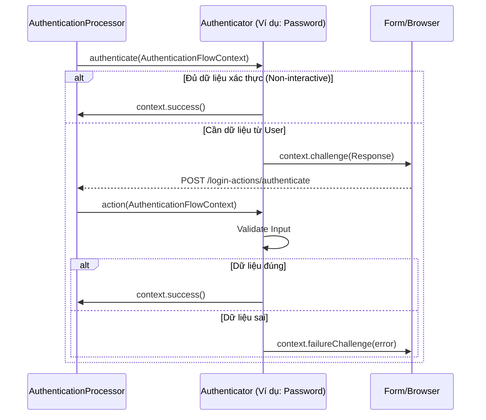

> [!NOTE]
> **Category:** Theory (Lý thuyết)
> **Goal:** Hiểu rõ bản chất của Authenticators trong Keycloak, vòng đời thực thi, và cách các Authenticator đóng vai trò là khối xây dựng cơ bản của Authentication Flow.

## 1. Lý thuyết chuyên sâu (Detailed Theory)
**Authenticator** (Bộ xác thực) là các module logic xử lý một phần nhỏ và cụ thể trong toàn bộ quy trình xác thực (Authentication Flow) của Keycloak. Mỗi Authenticator đại diện cho một bước duy nhất – một Execution – để xác minh danh tính, thiết lập context, hoặc thu thập thông tin từ user.

Các loại Authenticator phổ biến có sẵn trong Keycloak:
- **Username Password Form:** Hiển thị trang đăng nhập cổ điển.
- **Cookie Authenticator:** Xác thực trong suốt (Single Sign-On) dựa trên cookie `KEYCLOAK_IDENTITY` đã tồn tại từ trước.
- **OTP Form:** Xác thực mã Time-based One-time Password.
- **WebAuthn Authenticator:** Xác thực passwordless qua khóa sinh trắc học hoặc phần cứng FIDO2.
- **Identity Provider Redirector:** Chuyển hướng người dùng sang hệ thống đăng nhập của bên thứ ba (Google, Facebook, SAML IDP).

Bản chất của Authenticator là các lớp Java tuân theo giao diện (interface) `org.keycloak.authentication.Authenticator`. Chức năng của chúng là kiểm tra các thông tin truyền vào qua Context, tương tác với Database hoặc External Systems, hoặc ra lệnh cho trình duyệt hiển thị form (gọi là Challenge).

## 2. Luồng nội bộ & Cơ chế cấp thấp (Internal Workflow & Low-level Mechanisms)
Mỗi Authenticator phải trải qua một quy trình (Lifecycle) chuẩn được điều khiển bởi Keycloak engine trong lớp `AuthenticationProcessor`.



Hai phương thức quan trọng nhất:
1. `authenticate(AuthenticationFlowContext)`: Được gọi khi execution này được kích hoạt lần đầu. Nếu không cần tương tác người dùng (như đọc Cookie), nó có thể trả về `success()` ngay. Nếu cần form, nó gọi `challenge()`.
2. `action(AuthenticationFlowContext)`: Nếu `authenticate` đã trả về `challenge()`, sau khi người dùng gửi form (POST request), Keycloak sẽ gọi `action()` để Authenticator thẩm định dữ liệu đầu vào.

## 3. Thực hành tốt nhất & Bảo mật (Best Practices & Security)

> [!WARNING]
> Mặc dù bạn có thể viết Custom Authenticator dễ dàng, hãy cực kỳ cẩn trọng với các vấn đề bảo mật. Luôn thực hiện sanitize đầu vào và tránh việc rò rỉ thông tin người dùng qua các Exception ném ra giao diện.

> [!IMPORTANT]
> Hãy tận dụng tối đa các Authenticators có sẵn trước khi quyết định tự code. Keycloak cung cấp rất nhiều cơ chế mạnh mẽ (như Conditional flows, Script-based authenticators) có thể thay thế phần lớn nhu cầu code custom.

- **Thứ tự (Order):** Đảm bảo đặt các Authenticator ít tốn kém hiệu năng nhất lên đầu flow (như kiểm tra Cookie) thay vì gọi tới hệ thống ngoài (như LDAP) trước tiên, nhằm ngăn chặn các cuộc tấn công DDoS vào hệ thống xác thực.

## 4. Cấu hình minh họa thực tế (Configuration Examples)
Ví dụ sử dụng một Authenticator tùy biến qua Javascript (Script-based Authenticator) bằng tính năng (tuy đã bị deprecate ở các bản mới nhưng tốt để hiểu tư duy):
```javascript
// Mã Script đơn giản kiểm tra IP
AuthenticationFlowError = Java.type("org.keycloak.authentication.AuthenticationFlowError");

function authenticate(context) {
    var req = context.getConnection().getRemoteAddr();
    if (req === "127.0.0.1") {
        context.success();
    } else {
        context.failure(AuthenticationFlowError.ACCESS_DENIED);
    }
}
```
*Lưu ý: Thay vì JS Script, hiện tại Keycloak khuyến khích dùng Java SPI cho việc này.*

## 5. Trường hợp ngoại lệ (Edge Cases)
- **Xử lý Failure:** Khi một Authenticator gọi `context.failure()`, tuỳ theo Requirement (REQUIRED, ALTERNATIVE) mà luồng Flow có thể dừng lại, thông báo lỗi cho người dùng, hoặc bỏ qua thất bại đó để thử một Alternative khác. Lỗi thiết kế thường gặp là việc Authenticator không bắt được ngoại lệ (Exception) nội bộ, gây crash ra lỗi HTTP 500 thay vì xử lý êm đẹp thông qua `context.failureChallenge()`.
- **Trạng thái lưu đệm:** Nếu hệ thống bị downtime lúc user đang ở bước `action()`, thông tin AuthenticationSession trong Infinispan bị mất, dẫn đến lỗi "Invalid auth state".

## 6. Câu hỏi Phỏng vấn (Interview Questions)
- **Câu hỏi 1 (Junior):** Kể tên 3 Authenticators phổ biến có sẵn trong Keycloak.
  - *Đáp án Junior:* Username Password Form, Cookie, và Identity Provider Redirector.
- **Câu hỏi 2 (Junior):** Phương thức nào của Authenticator được dùng để hiển thị form cho user nhập liệu?
  - *Đáp án Junior:* Gọi `context.challenge(Response)` trong phương thức `authenticate()`.
- **Câu hỏi 3 (Senior):** Giải thích sự khác nhau về thời điểm kích hoạt của hàm `authenticate()` và hàm `action()` trong interface Authenticator?
  - *Đáp án Senior:* `authenticate()` được gọi lần đầu tiên khi Keycloak engine chạy qua execution đó. Nó quyết định xem có cần tương tác UI không. Nếu nó gọi `challenge()`, luồng tạm dừng. Khi user submit form, luồng tiếp tục bằng việc gọi `action()` của đúng Authenticator đó để validate dữ liệu vừa submit.
- **Câu hỏi 4 (Senior):** Khi xây dựng Custom Authenticator, làm sao lưu trữ thông tin tạm thời giữa hàm `authenticate` và `action`?
  - *Đáp án Senior:* Sử dụng `AuthenticationFlowContext.getAuthenticationSession().setAuthNote(key, value)`. Lưu ý dữ liệu này được lưu trong Infinispan memory, không nằm ở client cookie, nên rất an toàn cho các thông tin nhạy cảm.
- **Câu hỏi 5 (Senior):** Nếu Authenticator phát hiện user bị khóa tài khoản (Brute Force protection), nó xử lý thế nào?
  - *Đáp án Senior:* Nó nên kiểm tra context thông qua `context.getRealm().isBruteForceProtected()` và các API liên quan. Khi bị khóa, nó gọi `context.failure(AuthenticationFlowError.USER_DISABLED)` hoặc `INVALID_USER`.

## 7. Tài liệu tham khảo (References)
- [Keycloak SPI Documentation: Authentication SPI](https://www.keycloak.org/docs/latest/server_development/#_auth_spi)
- [Keycloak Server Administration Guide](https://www.keycloak.org/docs/latest/server_admin/)
