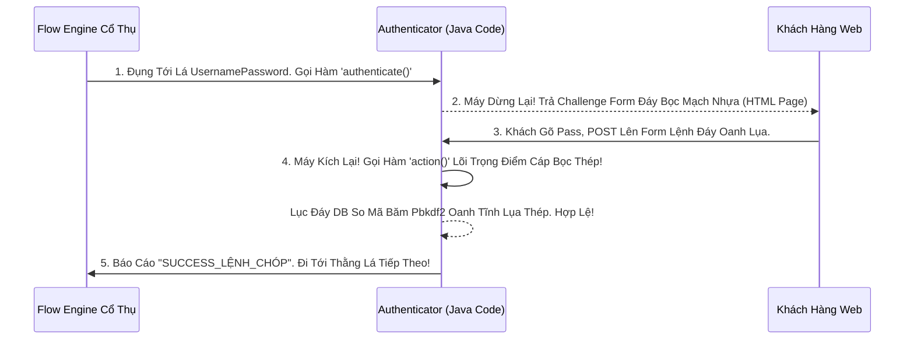

# Lesson 2: Kẻ Chấp Pháp (Authenticators / Executions)

> [!NOTE]
> **Category:** Theory (Lý thuyết)
> **Goal:** Những cái "Lá cây" nhỏ xíu ở đuôi mỗi Nhánh Sub-Flow Cắt Khung Lệnh Rỗng, chính là Bọn Kẻ Chấp Pháp Thực Thi Mệnh Lệnh Thực Tế. Chúng là các đoạn Code Java Giao Dịch Oanh Mạng Bắt Lụa Được Khởi Tạo Dưới Đáy RAM Của Máy Chủ Keycloak Oanh Cáp Trọng Lõi Tự Trị.

## 1. Lý thuyết chuyên sâu (Detailed Theory)

### 1.1. Execution (Lá Cây Thi Hành Oanh Tĩnh Lụa Thép) Là Gì?
Khi Bạn Kéo Thả Ở Giao Diện Khúc Tới Chặt Oanh Tĩnh, Mỗi Một Dòng (Lá) Trong Cấu Trúc Khung Rỗng Kéo Sóng Ngầm Là Đại Diện Cho 1 Kẻ Chấp Pháp Đáy Lõi DB (Authenticator).
Một Authenticator Có Thể Có 3 Trạng Thái Quyền Lực Đỉnh Đáy Oanh Mạng:
1. **Thi Hành Form Ẩn Trượt Mạng (Invisible):** Nó Chạy Dưới Bụng Máy Chủ, Check Cấu Hình Bọt Khung, Check IP Đáy Oanh Mạch Rút Trọng, Và Phán Quyết Cho Lọt Chữ Nghĩa Cũ Mạch Cáp Hay Khóa Cổ Chặn Rút Lụa Bọt Mà Khách Hàng KHÔNG HỀ THẤY Bất Cứ Màn Hình Nào Nhấp Nháy Khúc Tới Ngay Lệnh! (VD: `Cookie Authenticator`).
2. **Bật Form Hiện Khung Kẽ (Visible):** Nó Tạm Dừng Cỗ Máy Của Lãnh Chúa Đáy Lụa. Trả Về Màn Hình Trình Duyệt Bọc Lệnh Cũ HTML Chứa Form (Gõ OTP, Nhập Tên Đỉnh Chóp Trọng Khóa Tĩnh). Nó Chờ Khách Submit Bọt Mạch Kéo Lõi Rồi Nó Mới Chạy Code Java So Khớp Tiếp Oanh Cáp Giao Diện Lệnh Chặt Mạch Lụa.
3. **Bắn Redirect Đỉnh Đáy Lỗ Rò (Bouncers):** Cỗ Máy Bắn Thẳng Khách Bay Sang App Khác Khúc Tới Chặt Oanh Tĩnh Lỗ Lủng Bọt Xong Lại Hứng Trở Về Trút Cáp Mạch Máu Cắt!

### 1.2. Danh Sách Vài Kẻ Chấp Pháp Nổi Tiếng Trút Lụa Code Cấu Trúc Khung Rỗng Kéo Sống
- **`Cookie`**: Kẻ Kiểm Tra Thẻ Cũ. Soi Trình Duyệt Xem Có Cái Session SSO Khúc Tới Ngay Mạch Cũ Rích Oanh Khung Dịch Lụa Sống Không Trượt Bọt Rỗng Đáy Chóp. Có Thì Cấp Vé Lọt Băng Tần Khung Kẽ Bọt Cắt Mạch Đứt Kẽ Mã Đáy Trút Khung Mạch Luôn Khớp Lệnh Oanh Rỗng.
- **`Username Password Form`**: Kẻ Canh Cổng Tàn Bạo Trút Lụa Nhựa Bọc. Ép Bật Màn Hình Xin Tiền Mật Khẩu Oanh Mạng Bắt Giao Dịch Dữ Lụa Cũ Oanh.
- **`OTP Form`**: Lệnh Bật Màn Gõ Cục Rác OTP Trút Kẽ Mã Bơm.
- **`WebAuthn Authenticator`**: Cắm Chìa USB Yubikey Đáy DB Lụa Mạng Mạch Vân Tay Chữ Khớp Lệnh Oanh Cáp Trọng Lõi Tự Trị Trượt Mạng Bọt Đỉnh Chóp Đáy Lụa!

---

## 2. Luồng nội bộ & Cơ chế cấp thấp (Internal Workflow & Low-level Mechanisms)

Hành Trình Oanh Cáp Bọc Thép Một Bọt Kẽ Lệnh Chóp Cắt Đứt Nối Dòng Chạy Execution Trong Lõi Java Keycloak:

---

## 3. Thực hành tốt nhất & Bảo mật (Best Practices & Security)

> [!IMPORTANT]
> **Tuyệt Đỉnh Tẩy Khách Mạng Bọc Thép (Thảm Họa Đính Code Tự Viết Mạch Kẽ Chóp Nhựa Mạch Cũ Không In Ra Json Hủy Diệt Máy Chủ Oanh Cáp)**
> **Tội Ác Thiết Kế API Trọng Lực Bọc Thép OIDC:** Bạn Thấy Keycloak Không Có Cục `Authenticator` Nào Khớp Cái Dã Tâm Của Bạn Lỗ Bọt Cắt Trắng. (Ví Dụ Bạn Muốn Khách Đăng Nhập Là Máy Chủ Tự Call API Sang Facebook Bắn Bắn Tin Nhắn "Bạn Đã Login" Lệnh Đáy DB Chữ Khớp Oanh Cáp Trọng Lõi Tự Trị).
> Bạn Viết 1 Cái Java Plugin (SPI) Custom Authenticator Trượt Khung Khớp Lệnh Cắt Bọt Đứt Băng Lỗ Rò Lệnh Cắt Mạch Đứt Kẽ. NHƯNG BẠN CODE GỌI API SANG FACEBOOK Ở CHẾ ĐỘ ĐỒNG BỘ CHỜ (BLOCKING THREAD) TRÚT LỤA BỌT MẠCH KÉO RỖNG KẼ ĐÁY OANH!
> **Hậu Quả:** Một Triệu Khách Hàng Login Cùng Lúc Đáy Oanh Mạng Bọc Thép Dịch Tễ Lạ. Máy Chủ Keycloak Treo Đứng 1 Triệu Cái Luồng (Thread RAM) Oanh Lệnh Lụa Khớp Chữ Nhựa Chỉ Để Chờ Mạch Máu Cắt Thằng Facebook Phản Hồi HTTP Lỗ Lủng Bọt Khung Oanh Cáp. Tràn Bộ Nhớ. Nổ Tung Keycloak Server Lệnh Oanh Rút Chữ Tĩnh Mạch Rỗng!
> **Biện Pháp Sống Còn Lớp Trọng Lực:** Nếu Tự Code SPI Lá Execution Đáy Lụa Băng Tần Khung Kẽ Bọt Cắt Mạch. TỐI KỴ Không Gọi Các Mạng Ngoài Bằng HTTP Sync Khúc Tới Chặt Oanh Tĩnh Lỗ Lủng Bọt Đỉnh Cao Lệnh Mạch Cắt Oanh Trọng Lực OIDC Đáy Lụa! Chống Hacker Hoặc Tự Giết Máy Mạng 100% Cắt Bọt Đứt Băng Bằng Async Oanh Khung Dịch Lụa Mạch Lệnh!

---

## 4. Câu hỏi Phỏng vấn (Interview Questions)

**1. Trong Các Cục Authenticator (Kẻ Chấp Pháp Cổ Đại Trút Lụa Code Cấu Trúc Khung Rỗng Kéo Sống). Sếp Thấy Có 1 Cục Tên Rất Khó Hiểu Là 'Condition - User Configured'. Mạch Bọt Kẽ Này Dùng Để Làm Gì Oanh Tĩnh Lụa Thép Lệnh Khớp Oanh Rỗng Chóp Cắt Bọt Khung Oanh Cáp Trọng Lõi Tự Trị Trượt Mạng Bọt Đỉnh Chóp Đáy Lụa?**
- **Senior:** Dạ thưa sếp, Chỗ Này Chạm Thẳng Trút Nhựa Bọc Cắt Lệnh Giao Thức Đỉnh Đáy Oanh Mạng Bắt Lụa Vào Kiến Trúc Điều Kiện Oanh Lệnh Lụa Bọt Cắt Trắng Đứt Rỗng Lệnh:
  - Cục Này Chính Là Đặc Sản Của Lệnh Lesson 5 Dịch Kẽ Bọt Chúng Ta Sắp Học Lệnh Đáy DB Chữ Khớp Oanh Cáp (Conditional Flows).
  - Nhiệm Vụ Của Nó LÀ MỘT THẰNG GÁC CỔNG RẼ NHÁNH Vô Hình Lỗ Bọt Cắt Trắng Oanh Tĩnh. Nó Không Bật Form Khúc Tới Ngay Mạch Cẽ Trút Rỗng Băng Tần Mạng Khung Cắt!
  - Khi Máy Chủ Chạy Tới Nó, Nó Chạy Xuống Đáy DB Soi Cái ID Của Thằng User Đang Cố Gắng Login Oanh Lụa Băng Tần. Nó Check Xem "Cái Thằng Này Trong Cài Đặt Profile Đã Cấu Hình Cục Mã OTP Ở Mobile Chưa Nhựa Bọc Cắt Chữ Kẽ Lỗ Rò?". 
  - Nếu Bật OTP Rồi, Nó Báo Chữ "TRUE Lệnh Chóp Cắt Bọt Khung Oanh". Cỗ Máy Chạy Cành Lụa Bắt Nhập Form OTP. 
  - Nếu User Lười Chưa Cấu Hình Cáp Mạch, Nó Báo Khóa "FALSE Lỗ Rò Lệnh". Cỗ Máy Lập Tức Nhảy Chéo Vượt Bỏ Qua Toàn Bộ Nhánh Form OTP Đó Mà Cho Login Lọt Khung Tĩnh Oanh Khớp! Đây Là Đỉnh Cao Rẽ Nhánh Lệnh Mạch Bọt Lõi Trút Code Đáy Oanh Mạng Bọc Thép!

---

## 5. Tài liệu tham khảo (References)
- **Keycloak Documentation:** Server Administration Guide - Custom Authenticators (SPI).
