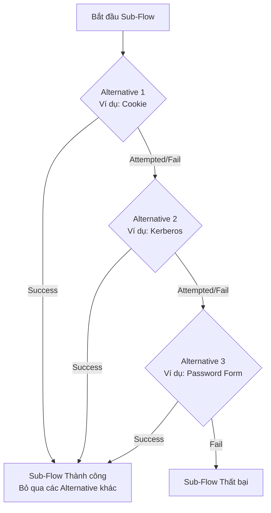

> [!NOTE]
> **Category:** Theory (Lý thuyết)
> **Goal:** Hiểu sâu về các trạng thái Execution Requirement và cách chúng cấu thành cỗ máy trạng thái (State Machine) của quy trình xác thực trong Keycloak.

## 1. Lý thuyết chuyên sâu (Detailed Theory)
Mỗi Execution hoặc Sub-Flow trong Authentication Flow phải được gắn với một **Requirement** (Yêu cầu). Requirement là các quy tắc logic xác định hành vi của Keycloak khi một Authenticator trả về trạng thái Success, Failure, hoặc Attempted.

Các loại Requirement cơ bản:
1. **REQUIRED (Bắt buộc):** Execution/Sub-flow này phải thành công. Nếu thất bại, toàn bộ Authentication Flow bị coi là thất bại và kết thúc lập tức (người dùng bị từ chối truy cập).
2. **ALTERNATIVE (Lựa chọn):** Chỉ cần MỘT trong số các execution/sub-flow mang nhãn ALTERNATIVE nằm trong cùng một nhóm (cùng cấp bậc) thành công, thì cả cụm đó sẽ được coi là thành công. Keycloak sẽ lần lượt thử từng cái theo thứ tự ưu tiên.
3. **DISABLED (Vô hiệu hóa):** Keycloak bỏ qua hoàn toàn execution này, không thực thi nó trong bất kỳ trường hợp nào.
4. **CONDITIONAL (Có điều kiện):** Dựa vào kết quả của một bộ định tuyến logic (Condition Evaluator). Nếu điều kiện là `true`, luồng con sẽ hoạt động như `REQUIRED` hoặc theo thiết lập của nó; nếu `false`, nó sẽ bị bỏ qua như `DISABLED`.

Các Requirement này tạo ra khả năng lập trình logic `AND`, `OR`, `IF-ELSE` ngay trên giao diện quản trị mà không cần sửa code.

## 2. Luồng nội bộ & Cơ chế cấp thấp (Internal Workflow & Low-level Mechanisms)
Cách `AuthenticationProcessor` của Keycloak đánh giá một nhóm các `ALTERNATIVE` Execution.

- Nếu một Execution trả về `Attempted` (nghĩa là nó không thể xác thực ngay, ví dụ không tìm thấy Cookie), engine sẽ tiếp tục sang Alternative tiếp theo.
- Đối với `REQUIRED`, engine đơn giản chỉ kiểm tra nếu `Success` thì đi tiếp, nếu `Fail/Attempted` mà không thể tiếp tục, nó ném lỗi truy cập bị từ chối.

## 3. Thực hành tốt nhất & Bảo mật (Best Practices & Security)

> [!WARNING]
> Tuyệt đối không để một Sub-Flow chỉ chứa toàn các Execution là `ALTERNATIVE` nhưng không có phương án nào tương tác được (ví dụ chỉ có Cookie hoặc Kerberos mà không có Form). Nếu tất cả `ALTERNATIVE` đều thất bại, flow sẽ bị khóa và không ai đăng nhập được. Phải luôn có một Fallback (như Password Form).

> [!IMPORTANT]
> Khi thiết kế hệ thống có nhiều IDP (Identity Providers), việc cấu hình `Identity Provider Redirector` thành `ALTERNATIVE` là tiêu chuẩn. Nó sẽ âm thầm chuyển hướng nếu user chọn IDP, hoặc nhường quyền lại cho Login Form.

- **Hiệu năng:** Luôn đặt các `ALTERNATIVE` nhẹ nhất (Cookie validation, Header inspection) lên đầu danh sách (Order số 1, 2) để giảm tải cho máy chủ.

## 4. Cấu hình minh họa thực tế (Configuration Examples)
Cấu hình chuẩn cho **Browser Flow** mặc định phản ánh rõ nhất logic Requirement:
- `Cookie` (ALTERNATIVE): Kiểm tra xem người dùng đã đăng nhập chưa.
- `Kerberos` (ALTERNATIVE): Xác thực qua mạng nội bộ Windows.
- `Identity Provider Redirector` (ALTERNATIVE): Điều hướng sang Social login (Google/Facebook) nếu có.
- `Browser Forms` (Sub-Flow) (ALTERNATIVE): Nếu 3 phương án trên thất bại, chuyển sang hiển thị Form.
  - Bên trong `Browser Forms`:
    - `Username Password Form` (REQUIRED): Bắt buộc nhập User/Pass.
    - `OTP Form` (OPTIONAL/CONDITIONAL): Tùy chọn MFA.

## 5. Trường hợp ngoại lệ (Edge Cases)
- **Sub-Flow Required bên trong một Flow:** Nếu bạn đánh dấu một Sub-Flow là `REQUIRED`, nhưng toàn bộ các Executions bên trong Sub-Flow đó bị `DISABLED`, Keycloak sẽ đánh giá Sub-Flow đó là thất bại, gây ra lỗi "Invalid Authentication Flow".
- **Cấu hình sai thứ tự Alternative:** Nếu bạn đặt `Username Password Form` TRƯỚC `Cookie` Authenticator và cả hai đều là `ALTERNATIVE`, người dùng sẽ luôn bị hiện form đăng nhập, ngay cả khi họ đã có session hợp lệ.

## 6. Câu hỏi Phỏng vấn (Interview Questions)
- **Câu hỏi 1 (Junior):** Ý nghĩa của trạng thái `DISABLED` trong Requirement là gì?
  - *Đáp án Junior:* Execution hoặc Sub-Flow đó sẽ không bao giờ được Keycloak chạy, dùng để tạm thời tắt một tính năng mà không cần xóa nó.
- **Câu hỏi 2 (Junior):** Nếu tôi có 3 bước `ALTERNATIVE`, tôi cần vượt qua mấy bước để đăng nhập?
  - *Đáp án Junior:* Bạn chỉ cần vượt qua thành công 1 bước đầu tiên trong 3 bước đó.
- **Câu hỏi 3 (Senior):** Giải thích sự khác biệt cốt lõi giữa việc đánh dấu một Execution là `ALTERNATIVE` so với `OPTIONAL` (trong các phiên bản Keycloak cũ)?
  - *Đáp án Senior:* Từ bản Keycloak 10+, `OPTIONAL` được cấu trúc lại và thường được thay thế bằng Sub-flow kết hợp `CONDITIONAL`. `ALTERNATIVE` cung cấp logic OR (hoặc cái này, hoặc cái kia).
- **Câu hỏi 4 (Senior):** Điều gì xảy ra dưới tầng code (AuthenticationProcessor) nếu một Authenticator trả về trạng thái `ATTEMPTED` trong một Execution là `REQUIRED`?
  - *Đáp án Senior:* Keycloak coi đó là một thất bại mềm, nhưng vì Requirement là `REQUIRED` (bắt buộc phải Success), luồng sẽ chuyển sang trạng thái lỗi (Error/Challenge) và yêu cầu người dùng khắc phục, không thể đi tiếp qua execution kế tiếp.
- **Câu hỏi 5 (Senior):** Tại sao Keycloak lại cho phép các Sub-Flow lồng nhau với các Requirement phức tạp?
  - *Đáp án Senior:* Để giải quyết bài toán nhóm logic (Group logic). Ví dụ: (Username + Password) là một nhóm REQUIRED, toàn bộ nhóm đó là ALTERNATIVE với (WebAuthn). Nghĩa là user có thể chọn đi bằng nhánh User/Pass hoặc nhánh WebAuthn.

## 7. Tài liệu tham khảo (References)
- [Keycloak Authentication Flows Documentation](https://www.keycloak.org/docs/latest/server_admin/#_authentication-flows)
