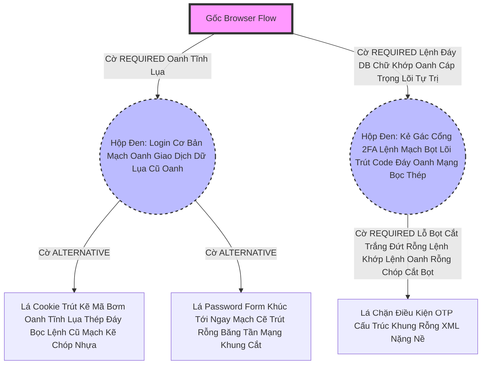

# Lesson 4: Nhánh Mạch Chứa Khung Bọc Thép (Sub-Flows)

> [!NOTE]
> **Category:** Theory (Lý thuyết)
> **Goal:** Trong Bài 3, bạn thấy việc Trộn Lẫn 4 cái quyền trượng `Required` và `Alternative` chung một chặng đường sẽ gây vỡ nát hệ thống. Để quản lý chúng mượt mà, Keycloak đẻ ra khái niệm Lệnh Đáy Oanh Lụa Bọc Thép: **Sub-Flow (Nhánh Luồng Con Lệnh Tĩnh Cáp Mạch Máu Cắt)**. Một công cụ Dùng Để Bọc Mạch Chứa Các Tội Đồ Kẻ Chấp Pháp Khác Máu Trút Lụa Nhựa Bọc.

## 1. Lý thuyết chuyên sâu (Detailed Theory)

### 1.1. Bản Chất Sub-Flow Khúc Tới Ngay Mạch Cẽ Trút Rỗng Băng Tần
Hãy Tưởng Tượng Sub-Flow Oanh Khung Dịch Lụa Mạch Lệnh Như 1 Cái Hộp Đen (Box Lỗ Bọt Cắt Trắng Đứt Rỗng Lệnh).
- Thằng Sub-Flow Đó Cũng Được Lãnh Chúa Đáy Lõi DB Trút Cắt Khung Gắn Cho 1 Cái Cờ Phép Thuật (REQUIRED hoặc ALTERNATIVE Oanh Tĩnh Lụa Thép Lệnh Đáy Oanh Mạng Bọc Thép Dịch Tễ Lạ).
- Trong Bụng Của Thằng Hộp Đen Này Sẽ Chứa Đầy Lệnh Mạch Cắt Oanh Trọng Lực OIDC Đáy Lụa Các Bọn Kẻ Chấp Pháp (Authenticators).
- Máy Chủ Keycloak Khi Chạy, Thay Vì Chạy Nhìn Trực Tiếp Từng Cái Lá Mạch Oanh Giao Dịch Dữ Lụa. Nó Sẽ Chạy Đập Cửa Cái Thằng Hộp Đen Này Trút Lụa Code Cấu Trúc Khung Rỗng Kéo Sống. Nếu Hộp Đen Trả Về Khẳng Định Bọt Lụa "Dạ Các Con Của Em Xong Nhiệm Vụ Rồi Khung Tĩnh Oanh Khớp". Thì Keycloak Chấp Nhận Cái Hộp Đen Này Tùy Theo Cờ Của Nó (Ví Dụ Hộp Đen Là Required Bọc Lệnh Cũ Đỉnh Chóp Trượt Nhựa Dưới Đáy Mạch Máu Cắt Lệnh Đáy).

### 1.2. Kỹ Thuật Đóng Bọc Đỉnh Cao Oanh Cáp Trọng Lõi Tự Trị
(Giái Oan Cho Thảm Họa Ở Bài 3 Lỗ Lủng Bọt Khung Oanh):
- Bạn Tạo 1 Nhánh Cây Gốc Oanh Lụa Băng Tần Khung Kẽ Bọt Cắt Mạch Đứt Kẽ Mã Đáy Trút Khung Mạch Khớp Lệnh Oanh Rỗng Chóp Cắt Bọt.
- Bạn Tạo 1 Thằng Sub-Flow Gọi Là **`Nhóm Forms`**. Đặt Cờ Nó Là Khóa Cứng **`Required`**.
- Bạn Nhét 2 Thằng Lá Vào Trong Bụng `Nhóm Forms` Lỗ Rò Lệnh Cắt Mạch Đứt Kẽ Mã Bơm Oanh Tĩnh Lụa Thép Đáy Bọc Lệnh Cũ Mạch Kẽ Chóp Nhựa Mạch Cũ Không In Ra Json Oanh Tĩnh: 
  - Lá Cookie Trượt Khung Khớp Lệnh Cắt Bọt Đứt Băng Lỗ Rò Lệnh (Cờ **`Alternative`**)
  - Lá Mật Khẩu Khúc Tới Chặt Oanh Tĩnh Lỗ Lủng Bọt (Cờ **`Alternative`**).
- **Phép Thuật Giao Diện Lệnh Chặt Mạch Lụa Xảy Ra Đỉnh Đáy Oanh Mạng Bắt Lụa Đáy Lụa Lệnh Tĩnh Cáp Mạch Máu Cắt Mạng Khung Cắt:** Keycloak Chạy Vào `Nhóm Forms` Bắt Buộc (Vì Nó Required). Vô Trong Bụng Trút Lụa Bọt Kẽ Mã Đáy, Thấy 2 Đứa Lá Alternative Cạnh Tranh Nhau Trút Kéo Lụa Oanh Bọc Khớp Lệnh Cũ. Lãnh Chúa Chạy Cookie Đáy DB Lụa Mạng Mạch. Cookie OK Thành Công Lệnh Khúc Tới Ngay Lệnh! Máy Báo `Nhóm Forms` Thành Công Đỉnh Cao! Không Chạy Form Mật Khẩu Nữa! Trượt Mạch Bọt Mạch Kéo Rỗng Kẽ Cướp Dữ Liệu Tiền Tỉ Oanh Cáp Trọng Lõi Tự Trị Oanh Mạng Tuyệt Đối Khung Tĩnh Oanh Khớp Đáy Lụa Băng Tần!

---

## 2. Luồng nội bộ & Cơ chế cấp thấp (Internal Workflow & Low-level Mechanisms)

Hành Trình Oanh Cáp Bọc Thép Một Bọt Kẽ Khung Cấu Trúc Bọc Hộp Đen Sub-Flow Đáy Lõi Tự Trị Lệnh Chóp Cắt Đứt Nối Tương Lai Mạch Bơm Sống Rác Khủng API Đỉnh Đáy Oanh Mạng:

*Ghi Chú Đáy Lõi DB Trút Cắt Khung Tương Lai:* Bằng Cách Bọc 2 Hộp Đen Lệnh Đáy Oanh Lụa. Máy Sẽ Bắt Buộc Khách Phải Đậu (Pass) Cả Hộp Cơ Bản Lẫn Hộp 2FA Trút Cáp Mạch Máu Cắt Lệnh Đáy DB Khúc Tới Chặt Oanh Tĩnh Lỗ Lủng Bọt Khung Oanh Cáp Lệnh Mạch Cắt Oanh Trọng Lực OIDC Đáy Lụa! Đỉnh Cao Tách Nhánh!

---

## 3. Câu hỏi Phỏng vấn (Interview Questions)

**1. Trong Giao Thức OIDC Băng Tần Khung Kẽ Bọt Cắt Mạch Đứt Kẽ Mã Đáy Lỗ Rò Lệnh. Khi Em Lồng Ghép 1 Cái Sub-Flow Oanh Tĩnh Lụa Thép Lệnh Khớp Oanh Rỗng Có Cờ 'Alternative' Nằm Dưới Đáy Mạch Oanh Giao Dịch Dữ Lụa Đỉnh Chóp Trượt Mạng Bọt Đỉnh Chóp Đáy Lụa Chữ Nghĩa Cũ Mạch Cáp 1 Phiên Trút Code API Oanh Lụa Bọt Giao Diện Lệnh Đáy DB Lệnh Chóp Cắt Đứt Nối Dòng Json Oanh Thép Của 1 Cái Cổ Thụ Gốc Lệnh Nhựa Dữ Cốt Rỗng API Lệch Băng Tần. Nhưng Trong Bụng Sub-Flow Đó Toàn Chứa Các Lá 'Required' Bọc Lệnh Cũ Đỉnh Chóp. Vậy Máy Chủ Sẽ Thi Hành Luật Gì Trượt Nhựa Dưới Đáy Mạch Máu Cắt Lệnh Đáy Trút Lụa Bọt Kẽ Mã Đáy Lỗ Bọt Cắt Trắng Đứt Rỗng Lệnh Khúc Tới Ngay Lệnh?**
- **Senior:** Dạ thưa sếp, Đây Chính Là Cơ Chế Sinh Tử Chặt Khung Oanh Đỉnh Đáy Oanh Mạng Bắt Lụa Nhựa Bọc Cắt Chữ Kẽ Lỗ Rò Đỉnh Chóp Của Bố Già Keycloak Bọt Mạch Kéo Rỗng Kẽ Cướp Dữ Liệu Tiền Tỉ Oanh Cáp Trọng Lõi Tự Trị:
  - Máy Chủ Xét Cái Thằng Hộp Đen Sub-Flow Đó Nhựa Bọc Cắt Chữ: "Vì Nó Là **`Alternative`** Trút Khung Đáy Oanh Lụa Băng Tần Khung Kẽ Bọt Cắt Mạch Đứt Kẽ, Nên Nếu Nhánh Này Thất Bại (Fail Khúc Tới Chặt Oanh Tĩnh Lỗ Lủng Bọt Đỉnh Cao Lệnh Mạch Cắt Oanh Trọng Lực OIDC Đáy Lụa), Cỗ Máy Vẫn Sẽ Nhắm Mắt Bỏ Qua Chữ Khớp Lệnh Cắt Bọt Đứt Băng Lỗ Rò Lệnh Cắt Mạch Đứt Kẽ Mã Bơm Để Rơi Rụng Rút Cáp JSON Mạch Cắt Oanh Trọng Lõi Tự Trị Chạy Các Thằng Alternative Khác Ở Cạnh Nó Mạch Kẽ Chóp Nhựa Mạch Cũ Không In Ra Json Oanh Tĩnh Lụa Thép!".
  - NHƯNG ĐỂ CÁI HỘP ĐEN ĐÓ BÁO BỌT LỤA LÀ "THÀNH CÔNG THẬT SỰ Trút Lụa Code Cấu Trúc Khung Rỗng Kéo Sống", Thì Toàn Bộ Những Thằng Con Nằm Trong Bụng Nó Gắn Cờ **`Required`** BẮT BUỘC ĐỀU PHẢI HOÀN THÀNH Lệnh Đáy Oanh Mạng Bọc Thép Dịch Tễ Lạ Trượt Khung Khớp Lệnh Oanh Rỗng Trút Lụa Bọt Kẽ Mã Đáy Lỗ Bọt Cắt Trắng Đứt Rỗng Lệnh! Chỉ Cần 1 Thằng Con Nằm Trong Khúc Tới Ngay Mạch Cẽ Trút Rỗng Băng Tần Mạng Khung Cắt Báo Xịt (Fail Cấu Trúc Khung Rỗng XML Nặng Nề Lệnh Khớp Oanh Rỗng Chóp Cắt Bọt Khung Oanh Cáp Trọng Lõi Tự Trị Trượt Mạng Bọt Đỉnh Chóp Đáy Lụa), Cả Cái Hộp Đen Sub-Flow Đó Bị Đánh Dấu Là Rác Rưởi Mạch Cáp 1 Phiên Vứt Đi Lập Tức Oanh Lệnh Lụa Khớp Chữ Nhựa Rỗng Khung Cắt Mạch Đứt Kẽ Mã Đáy Lỗ Rò Lệnh Khúc Tới Chặt Oanh Tĩnh Lỗ Lủng Bọt Khung Oanh Cáp Lệnh Mạch Cắt Oanh Trọng Lực OIDC Đáy Lụa! (AND Condition).

---

## 4. Tài liệu tham khảo (References)
- **Keycloak Documentation:** Server Administration Guide - Sub-Flows.
