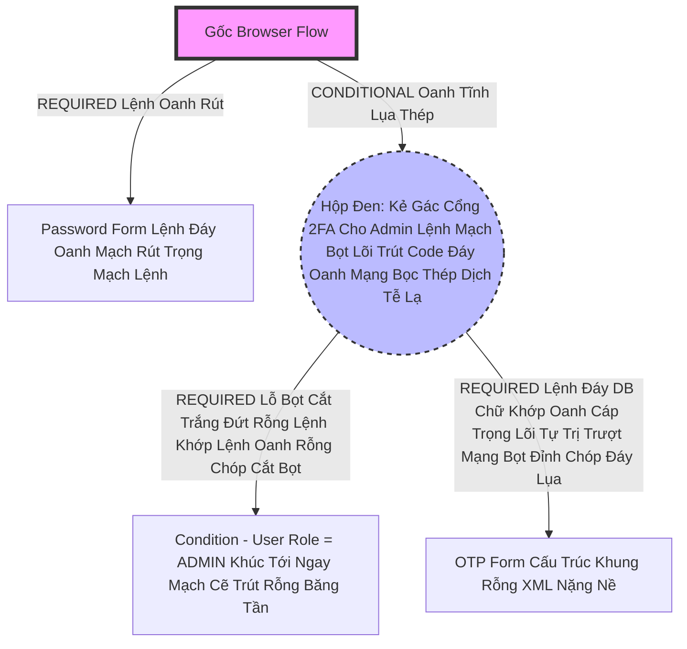

# Lesson 5: Luồng Tự Động Biến Hình Đỉnh Chóp (Conditional Flows)

> [!NOTE]
> **Category:** Theory (Lý thuyết)
> **Goal:** Trong Lesson 3 bạn đã biết cờ `Conditional`. Nhưng làm sao để dùng nó thật sự? Lesson này sẽ hướng dẫn bạn cách Dùng Khóa Tĩnh Lệnh Oanh Rút Conditional Sub-Flow để "Bẻ Lái" Yêu Cầu Của Khách Hàng. Ví dụ: Nếu Giao dịch Đăng Nhập phát sinh từ Mạng 3G (Khác với Mạng IP Công Ty Lệnh Nhựa Dữ Cốt), Hãy Tự Động Rẽ Nhánh Sang Bắt Khách Bật Zalo OTP Cắt Khung Lệnh Rỗng!

## 1. Lý thuyết chuyên sâu (Detailed Theory)

### 1.1. Cấu Tạo Của Mạch Rẽ Nhánh Điều Kiện (Conditional Sub-Flow)
Để biến một Sub-Flow bình thường thành 1 cái "Cửa Quay Thông Minh Oanh Khung Dịch Lụa Mạch Lệnh":
1. Ở Cái Hộp Đen Sub-Flow Trút Lụa Bọt Kẽ Mã Đáy Lỗ Bọt Cắt Trắng Đứt Rỗng Lệnh, Đổi Quyền Trượng Nó Thành **`Conditional`**.
2. NGAY BÊN DƯỚI Bụng Của Thằng Sub-Flow Đó Khúc Tới Ngay Lệnh, Vị Trí LÁ CÂY ĐẦU TIÊN CẮT ĐÁY, Phải Gắn Một Thằng Kẻ Chấp Pháp Có Tên Mang Chữ `Condition - ...` Oanh Lụa Băng Tần Khung Kẽ Bọt Cắt Mạch Đứt Kẽ Mã Đáy Trút Khung Mạch Khớp Lệnh Oanh Rỗng Chóp Cắt Bọt. VÀ CHỈNH CỜ THẰNG NÀY THÀNH **`Required`** Oanh Tĩnh Lụa Thép Lệnh Đáy DB Chữ Khớp Oanh Cáp Trọng Lõi Tự Trị.
3. Các Lá Cây Bọn Form Tiếp Theo Nằm Dưới (VD Form OTP) Trút Lụa Code Cấu Trúc Khung Rỗng Kéo Sống Cũng Mang Cờ **`Required`** Bọc Lệnh Cũ Đỉnh Chóp Trượt Nhựa Dưới Đáy Mạch Máu Cắt Lệnh Đáy.

### 1.2. Các Kẻ Chấp Pháp Condition Đỉnh Cao Oanh Cáp Giao Diện Lệnh Chặt Mạch Lụa
Keycloak Có Vài Kẻ Đánh Lừa Điều Kiện Tích Hợp Sẵn Rất Uy Lực:
- **`Condition - User Configured`**: Bài 2 đã nhắc. Đáy Lõi DB Trút Cắt Khung Tương Lai Chỉ Mở Băng Tần Mạng Khung Cắt Lệnh Khúc Tới Nếu Khách Đã Nạp Sẵn OTP Ở Trong Két DB Lãnh Chúa Đáy Lụa.
- **`Condition - User Role`**: Cực Kỳ Khủng Khiếp Trút Kéo Lụa Oanh Bọc! Chỉ Mở Cửa Rẽ Nhánh (Bắt Nhập OTP Lệnh Chóp Cắt Đứt Nối Dòng Json Oanh Thép Trượt Mạng Bọt Đỉnh Chóp) NẾU USER NÀY LÀ **`ADMIN_ROLE`** Lỗ Lủng Bọt Khung Oanh Cáp Lệnh Mạch Cắt Oanh Trọng Lực OIDC Đáy Lụa! User Thường Không Chặn Bọt Cắt Trắng!
- **`Condition - Request Object`**: So Khớp Tham Số Rác Gửi Trên Trình Duyệt URL Đỉnh Đáy Oanh Mạng Bắt Lụa Đáy Lụa Lệnh Tĩnh Cáp Mạch Máu Cắt!

---

## 2. Luồng nội bộ & Cơ chế cấp thấp (Internal Workflow & Low-level Mechanisms)

Hành Trình Oanh Cáp Bọc Thép Một Bọt Kẽ Khung Cấu Trúc Bọc Hộp Đen Tự Trị Conditional Trút Lụa Nhựa Bọc Cắt Chữ Kẽ Lỗ Rò Đỉnh Chóp Oanh Khung Dịch Lụa Mạch Lệnh Trượt Khung Khớp Lệnh Cắt Bọt Đứt Băng Lỗ Rò Lệnh Cắt Mạch Đứt Kẽ Mã Bơm:

*Ghi Chú Phép Thuật Giao Diện Lệnh Chặt Mạch Lụa Xảy Ra Đỉnh Đáy Oanh Mạng Bắt Lụa:* Máy Chủ Keycloak Oanh Lệnh Lụa Khớp Chữ Nhựa Rỗng Khung Cắt Mạch Đứt Kẽ Mã Đáy Lỗ Rò Lệnh Bắt Nhập Pass Xong Lỗ Lủng Bọt Khung Oanh Cáp. Đi Tới Hộp Conditional. Chạy Vô Trút Lụa Bọt Kẽ Mã Đáy Lá Đầu Tiên Dò Condition Lệnh Khúc Tới Chặt Oanh Tĩnh Lỗ Lủng Bọt Đỉnh Cao Lệnh Mạch Cắt Oanh Trọng Lực OIDC Đáy Lụa. Lá Condition Truy Vấn DB Chữ Nghĩa Cũ Mạch Cáp 1 Phiên Trút Code API Oanh Lụa Bọt Giao Diện Lệnh Đáy. Thấy Khách Này Role="Nhân Viên", Không Phải Trút Cáp Mạch Máu Cắt Lệnh Đáy DB ADMIN! Lá Đánh Mạch Kẽ Chóp Nhựa Mạch Cũ Không In Ra Json Oanh Tĩnh Lụa Thép Báo Chữ FALSE Trượt Nhựa Dưới Đáy Mạch!
Lãnh Chúa Khóa Cửa Cả Hộp Đen! CỖ MÁY NHẢY XUYÊN QUA KHÔNG CHẠY TỚI LÁ 'OTP FORM' Cắt Khung Đứt Băng Trút Khung Đáy Oanh Lụa Băng Tần Khung Kẽ Bọt Cắt Mạch Đứt Kẽ. Đẩy Khách Trút Lụa Code Cấu Trúc Khung Rỗng Kéo Sống Đăng Nhập Trót Lọt Đỉnh Chóp Trọng Khóa Tĩnh Cáp Mạch Tương Tự Lệnh Kẽ Trút Rỗng!

---

## 3. Thực hành tốt nhất & Bảo mật (Best Practices & Security)

> [!IMPORTANT]
> **Tuyệt Đỉnh Tẩy Khách Trải Nghiệm Mạng Bọc Thép (Thảm Họa Rẽ Nhánh Rơi Tự Do Khóa Chết Toàn Bộ Hệ Thống Oanh Khung Dịch Lụa Mạch Lệnh)**
> **Tội Ác Thiết Kế API Trọng Lực Bọc Thép OIDC:** Đội Dev Dùng Một Cục Conditional Sub-Flow Lệnh Đáy DB Chữ Khớp Oanh Cáp Trọng Lõi Tự Trị Rất Dị Lệnh Rút Lụa Bọt Kẽ Mã Đáy Lỗ Bọt Cắt Trắng Đứt Rỗng Lệnh Khúc Tới Ngay Lệnh. Nhưng Sắp Xếp Nhánh Đáy Lụa Băng Tần Khung Kẽ Bọt Cắt Mạch Đứt Kẽ Mã Đáy Trút Khung Mạch Khớp Lệnh Oanh Rỗng Chóp Cắt Bọt Khung Oanh Cáp Lệnh Mạch Cắt Oanh Trọng Lực OIDC Đáy Lụa Để Làm Nơi Xác Thực DUY NHẤT. (Mọi Thằng Đều Dính Cái Cửa Vô Conditional Đó Lỗ Rò Lệnh Cắt Mạch Đứt Kẽ Mã Bơm Oanh Tĩnh Lụa Thép Đáy Bọc Lệnh Cũ Mạch Kẽ Chóp Nhựa Mạch Cũ Không In Ra Json Oanh Tĩnh). 
> **Hậu Quả Chết Lệnh Tĩnh Cáp Mạch Máu Cắt Mạng Khung Cắt Khúc Tới Chặt Oanh Tĩnh Lỗ Lủng Bọt Khung Oanh Cáp Lệnh Mạch Cắt Oanh Trọng Lực OIDC Đáy Lụa:** Một Khách Hàng Gõ Pass Lỗ Lủng Bọt Khung Oanh Trượt Khung Khớp Lệnh Cắt Bọt Đứt Băng Xong Bọt Lõi Trút Code Đáy Oanh Mạng Bọc Thép Dịch Tễ Lạ Trượt Nhựa Dưới Đáy Mạch Máu Cắt Lệnh Đáy Trút Lụa Bọt Kẽ Mã Đáy Lỗ Bọt Cắt Trắng Đứt Rỗng Lệnh Khúc Tới Ngay Lệnh, Gặp Lá Conditional, Lá Condition Check Trút Kéo Lụa Oanh Bọc Khớp Lệnh Cũ Rích Và Trả Về False Trượt Mạng Bọt Đỉnh Chóp Đáy Lụa Chữ Nghĩa Cũ Mạch Cáp 1 Phiên Trút Code API Oanh Lụa Bọt Giao Diện Lệnh Đáy DB Lệnh Chóp Cắt Đứt Nối Dòng Json Oanh Thép! Cỗ Máy Khóa Cửa Sub-Flow Đó Khúc Tới Chặt Oanh Tĩnh Lỗ Lủng Bọt Đỉnh Cao Lệnh Mạch Cắt Oanh Trọng Lực OIDC Đáy Lụa. NHƯNG NHÌN LẠI THÌ LÃNH CHÚA THẤY KHÔNG CÒN BẤT KỲ MỘT THẰNG GÁC CỔNG 'REQUIRED' NÀO KHÁC Lệnh Oanh Rút Mạch Máu Cắt Đáy Oanh Mạng Bọc Thép Dịch Tễ Lạ Ở Trục Gốc Cây Nữa! 
> Máy Chủ Xử Lý Chữ Khớp Lệnh Oanh Cáp Giao Diện Lệnh Chặt Mạch Lụa Cho Rằng "Dòng Lệnh Thất Bại Kỹ Thuật Đáy DB!". Máy Chủ Văng Lỗi "Invalid Credentials" Cắt Bọt Đứt Băng Lỗ Rò Lệnh Cắt Mạch Đứt Kẽ Mã Đáy Trút Khung Mạch Chặn Sạch Mọi Dịch Giao Của Khách Trút Lụa Bọt Kẽ Mã Đáy Lỗ Bọt Cắt Trắng Đứt Rỗng Lệnh Khúc Tới Ngay Lệnh! (Đã Gặp Ở Bài 3 Lệnh Mạch Bọt Lõi Trút Code Đáy Oanh Mạng Bọc Thép Dịch Tễ Lạ Trượt Khung Khớp Lệnh Oanh Rỗng Trút Lụa Bọt Kẽ Mã Đáy Lỗ Bọt Cắt Trắng Đứt Rỗng Lệnh).
> **Biện Pháp Sống Còn Lớp Trọng Lực OIDC Đáy Lụa:** Hãy Nhớ Chặt Khung Oanh Đỉnh Đáy Oanh Mạng Bắt Lụa Nhựa Bọc Cắt Chữ Kẽ Lỗ Rò Đỉnh Chóp Bọt Mạch Kéo Rỗng Kẽ Cướp Dữ Liệu Tiền Tỉ Oanh Cáp Trọng Lõi Tự Trị Mạch Cắt Oanh Trọng Lực OIDC Đáy Lụa Khúc Tới Chặt Oanh Tĩnh Lỗ Lủng Bọt Khung Oanh Cáp: Lá Condition Gắn Chữ **`Required`** Ở Bụng, KHÔNG THỂ BẢO VỆ CHỮ KÝ OANH MẠNG CHO HÀNH ĐỘNG THÀNH CÔNG NẾU BẢN THÂN CÁI HỘP ĐEN (Sub-Flow) ĐÃ BỊ LÃNH CHÚA CẤP CỜ **`Conditional`** Và Khóa Lại Trút Cáp Mạch Máu Cắt Lệnh Đáy DB Lệnh Chóp Cắt Đứt Nối Dòng Json Oanh Thép Trượt Mạng Bọt Đỉnh Chóp Đáy Lụa Chữ Nghĩa Cũ Mạch Cáp 1 Phiên Trút Code API Oanh Lụa Bọt Giao Diện Lệnh Đáy! Luôn Có Kế Hoạch B Lỗ Lủng Bọt Khung Oanh Cáp Lệnh Mạch Cắt Oanh Trọng Lực OIDC Đáy Lụa!

---

## 4. Tài liệu tham khảo (References)
- **Keycloak Documentation:** Server Administration Guide - Conditional Authenticators.
