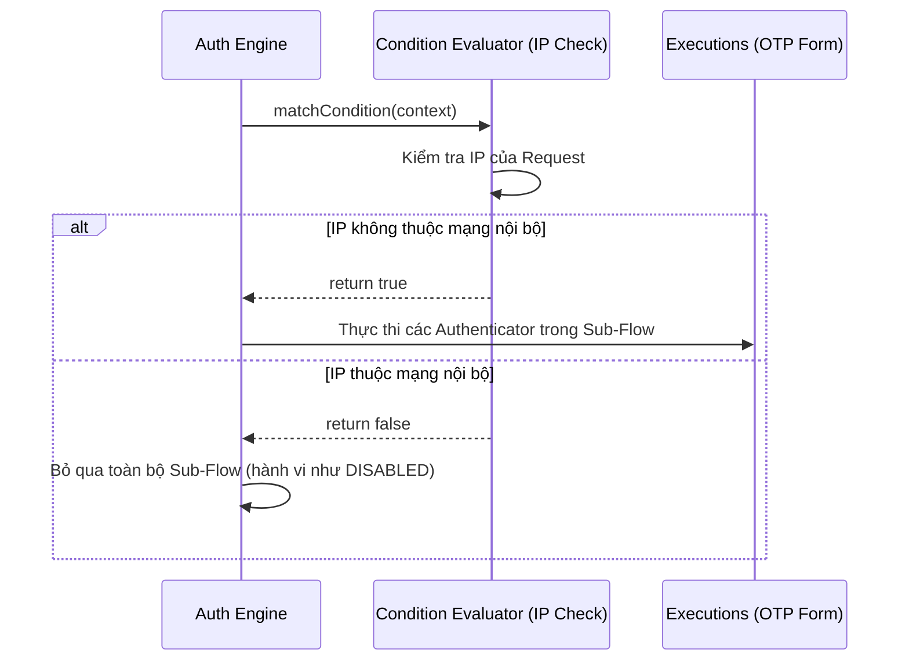

> [!NOTE]
> **Category:** Theory (Lý thuyết)
> **Goal:** Tìm hiểu khái niệm và ứng dụng của Conditional Flows, cho phép kích hoạt các luồng xác thực linh hoạt dựa trên điều kiện thực tế (Role, IP, Header, Group).

## 1. Lý thuyết chuyên sâu (Detailed Theory)
**Conditional Flows** là một tính năng nâng cao của Keycloak Authentication Flows, nơi mà một `Sub-Flow` có Requirement là `CONDITIONAL`.

Khi được cấu hình là `CONDITIONAL`, hệ thống sẽ không tự động thực thi các Authenticator bên trong luồng con này. Thay vào đó, nó dựa vào các **Condition Evaluators** (Bộ đánh giá điều kiện) để quyết định.
Condition Evaluator cũng là một Execution (thường đứng ở vị trí đầu tiên trong Sub-Flow). Có nhiều loại điều kiện:
- **Condition - user configured:** Kiểm tra xem người dùng đã cấu hình MFA chưa.
- **Condition - user role:** Kích hoạt nếu user có một Role cụ thể (ví dụ: `admin` thì phải dùng MFA).
- **Condition - network address:** Đánh giá dải IP truy cập.
- **Condition - HTTP Header:** Kiểm tra User-Agent hoặc Headers.

Sự tồn tại của Conditional Flows giải quyết triệt để nhu cầu "Xác thực thích ứng" (Adaptive Authentication), giúp nâng cao bảo mật ở những trường hợp rủi ro cao nhưng giữ trải nghiệm mượt mà cho người dùng thông thường.

## 2. Luồng nội bộ & Cơ chế cấp thấp (Internal Workflow & Low-level Mechanisms)
Bộ đánh giá điều kiện thực thi giao diện `ConditionalAuthenticator`. Phương thức quan trọng nhất là `matchCondition(AuthenticationFlowContext context)`.

Nếu một Sub-Flow Conditional trả về `true` từ Evaluator của nó, các Execution bên trong (như OTP Form) sẽ được coi là `REQUIRED` và bắt buộc người dùng phải vượt qua.

## 3. Thực hành tốt nhất & Bảo mật (Best Practices & Security)

> [!WARNING]
> Khi thiết lập Conditional Flow, hãy chắc chắn rằng bạn đã định nghĩa ít nhất một Condition Evaluator bên trong Sub-Flow. Nếu không có bộ đánh giá nào, Sub-Flow mặc định sẽ bị bỏ qua (tương đương với `false`).

> [!IMPORTANT]
> Nên sử dụng Conditional Flow thay vì ép tất cả User phải cấu hình MFA. Việc kết hợp "Condition - user role" giúp tiết kiệm chi phí hệ thống và tối ưu trải nghiệm (VD: nhân viên thường không cần OTP, nhưng manager thì bắt buộc).

- **Kiến trúc mạng:** Khi dùng "Condition - network address", hãy đảm bảo Reverse Proxy (Nginx, HAProxy) truyền đúng `X-Forwarded-For` đến Keycloak. Nếu không, Keycloak sẽ đánh giá dựa trên IP của Proxy thay vì IP thực của User, dẫn đến điều kiện luôn sai hoặc luôn đúng.

## 4. Cấu hình minh họa thực tế (Configuration Examples)
Cấu hình yêu cầu OTP chỉ đối với người dùng thuộc nhóm `finance-group`:
1. Tạo một Sub-Flow mới trong Browser Flow. Gán Requirement là **CONDITIONAL**.
2. Thêm Execution vào Sub-Flow: `Condition - User Role`. Đưa Requirement của nó lên **REQUIRED**.
3. Cấu hình Execution điều kiện này: Đặt `Role Name` là `finance-group-role` (sau khi đã map group vào role).
4. Thêm Execution thứ hai vào Sub-Flow: `OTP Form`. Gán Requirement là **REQUIRED**.

Kết quả: Người dùng bình thường đăng nhập chỉ cần User/Pass. Khi user thuộc nhóm finance đăng nhập, hệ thống phát hiện Role và bắt buộc phải qua bước OTP.

## 5. Trường hợp ngoại lệ (Edge Cases)
- **Nhiều Điều kiện (Multiple Conditions):** Nếu bạn đặt 2 Execution điều kiện trong cùng một Conditional Sub-Flow, cả hai đều là `REQUIRED`, Keycloak sẽ sử dụng logic AND (cả hai phải thỏa mãn). Nếu bạn muốn logic OR, hãy cẩn thận đặt các điều kiện theo nhánh nhỏ hơn.
- **User chưa từng xác thực:** Các điều kiện dựa trên User (như Role, Group) CHỈ có thể hoạt động SAU KHI hệ thống đã biết user là ai. Do đó, Conditional Flow về MFA phải được đặt SAU Execution `Username Password Form`. Nếu đặt trước, context sẽ bị null và điều kiện bị đánh giá sai hoặc ném Exception.

## 6. Câu hỏi Phỏng vấn (Interview Questions)
- **Câu hỏi 1 (Junior):** Conditional Flow giúp ích gì trong Keycloak?
  - *Đáp án Junior:* Giúp kích hoạt các bước xác thực như yêu cầu OTP dựa trên điều kiện như địa chỉ IP, vai trò người dùng (Role), giúp trải nghiệm người dùng tốt hơn.
- **Câu hỏi 2 (Junior):** Làm thế nào để luồng Conditional biết được nó có nên chạy hay không?
  - *Đáp án Junior:* Nhờ vào các Condition Evaluator (Bộ đánh giá điều kiện) được thêm vào bên trong Sub-Flow.
- **Câu hỏi 3 (Senior):** Tại sao bạn không thể đặt Condition Evaluator kiểm tra Role ở đầu tiên của Authentication Flow?
  - *Đáp án Senior:* Vì lúc đó (trước khi người dùng cung cấp Username/Password), Identity của người dùng chưa được thiết lập trong Authentication Session Context. Evaluator sẽ không thể truy xuất danh sách Role của người dùng vô danh.
- **Câu hỏi 4 (Senior):** Nếu cấu hình `Condition - network address` hoạt động sai khi qua Kubernetes Ingress, bạn sẽ khắc phục ở đâu?
  - *Đáp án Senior:* Khắc phục tại Ingress Controller (ví dụ: Nginx ingress) để trust proxy và forward chính xác Header `X-Forwarded-For`. Đồng thời chỉnh cấu hình Keycloak env `PROXY_ADDRESS_FORWARDING=true` (ở phiên bản Quarkus là `KC_PROXY=edge`).
- **Câu hỏi 5 (Senior):** Giải thích cách hoạt động của `Condition - User Configured`?
  - *Đáp án Senior:* Nó kiểm tra xem người dùng cụ thể đã có Credential loại đó (ví dụ OTP) lưu trong database chưa. Nếu có rồi, trả về `true` (yêu cầu nhập). Rất hữu ích cho luồng đăng nhập mà bạn muốn: "Ai đã có OTP thì bắt dùng, ai chưa có thì thôi bỏ qua".

## 7. Tài liệu tham khảo (References)
- [Keycloak Authentication Flows & Conditional Flows](https://www.keycloak.org/docs/latest/server_admin/#_conditional_execution)
- [Adaptive Authentication Design Principles](https://owasp.org/www-project-top-ten/)
