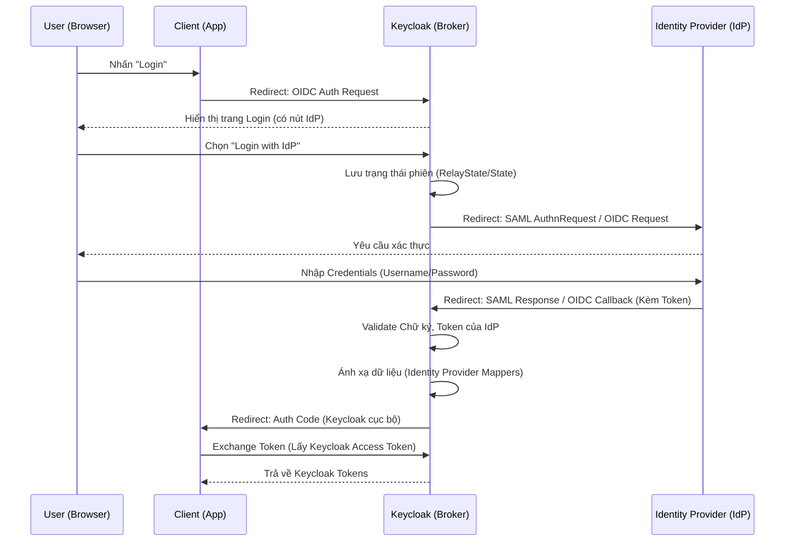

> [!NOTE]
> **Category:** Architecture/Design
> **Goal:** Nắm vững kiến trúc tổng thể của Identity Brokering (Federation) trong Keycloak, hiểu cách Keycloak đóng vai trò là một trung gian uỷ quyền (Broker) giữa các ứng dụng và các nhà cung cấp định danh (Identity Providers).

## 1. Lý thuyết chuyên sâu (Detailed Theory)

**Identity Brokering** (hay còn gọi là Identity Federation) là một kiến trúc trong đó một thực thể trung tâm đóng vai trò làm cầu nối (Broker) giữa các Ứng dụng (Service Providers / Clients) và các Nhà cung cấp định danh (Identity Providers - IdPs).
Trong môi trường doanh nghiệp quy mô lớn, thay vì mỗi ứng dụng (App A, App B) phải tự tích hợp với từng hệ thống xác thực (Google, Facebook, Active Directory, Okta), chúng ta ủy quyền việc này cho Keycloak.

**Các vai trò cốt lõi trong kiến trúc:**
- **Client (Service Provider - SP)**: Ứng dụng web, SPA, hoặc Mobile App cần xác thực người dùng. Nó chỉ biết giao tiếp với Keycloak thông qua giao thức chuẩn (OpenID Connect hoặc SAML 2.0).
- **Broker (Keycloak)**: Đóng vai trò vừa là Identity Provider (đối với Client) vừa là Service Provider (đối với các IdPs ngoại vi). Nó đứng ở giữa để chuẩn hóa giao thức, chuyển đổi token và hợp nhất người dùng.
- **Identity Provider (IdP)**: Hệ thống quản lý thông tin người dùng thực tế (Ví dụ: Google, LDAP, Keycloak Realm khác).

**Lợi ích của Identity Brokering:**
1. **Kiến trúc tập trung (Centralized Architecture)**: Ứng dụng không cần lưu trữ thư viện tích hợp (SDK) của hàng chục IdP khác nhau.
2. **Chuyển đổi giao thức (Protocol Translation)**: Keycloak có thể nhận yêu cầu OIDC từ Client, nhưng lại đi xác thực với hệ thống cũ bằng SAML 2.0, sau đó trả OIDC Token về cho Client.
3. **Mở rộng linh hoạt (Scalability)**: Khi cần thêm một hình thức đăng nhập mới (như Apple ID), bạn chỉ cần cấu hình trên Keycloak mà không cần sửa code ở bất kỳ ứng dụng nào.

## 2. Luồng nội bộ & Cơ chế cấp thấp (Internal Workflow & Low-level Mechanisms)

Quá trình giao tiếp trong Identity Brokering liên quan đến nhiều nhịp Redirect qua lại. Dưới đây là luồng chuẩn khi một người dùng đăng nhập vào ứng dụng thông qua một Identity Provider ngoại vi:



**Cơ chế cấp thấp (Protocol Translation):**
- Khi Keycloak gọi IdP, nó hoạt động như một Client của IdP đó. Nó sử dụng `client_id` và `client_secret` (hoặc SAML SP Metadata) được khai báo.
- Dữ liệu trả về (Claims từ OIDC, Attributes từ SAML) được Keycloak xử lý trong bộ nhớ. Sau đó, nó vứt bỏ Token gốc của IdP (trừ khi tính năng `Store Tokens` được bật) và tự sinh ra cặp Token mới (được ký bằng Private Key của Keycloak) để trả về cho Client.

## 3. Thực hành tốt nhất & Bảo mật (Best Practices & Security)

> [!IMPORTANT]
> **Ẩn nút đăng nhập cục bộ**: Trong mô hình thuần Brokering, bạn không muốn người dùng tạo tài khoản trực tiếp trên Keycloak. Hãy ẩn form đăng nhập cục bộ bằng cách vào `Authentication` -> `Browser Flow`, đặt `Username Password Form` thành `Disabled` hoặc chỉnh sửa Theme để ẩn nó đi.

> [!WARNING]
> **Rủi ro rò rỉ Token (Token Leakage)**: Hạn chế sử dụng tùy chọn `Store Tokens` trừ khi ứng dụng của bạn cần thiết phải gọi API trực tiếp của IdP (ví dụ: gọi Google Drive API). Việc lưu trữ token gốc trong cơ sở dữ liệu của Keycloak làm tăng tiết diện tấn công nếu database bị lộ.

- **Sử dụng PKCE cho mọi Clients**: Dù Broker có an toàn đến đâu, kênh giao tiếp giữa Client và Broker vẫn cần được bảo vệ chặt chẽ bằng Authorization Code Flow with PKCE.

## 4. Cấu hình minh họa thực tế (Configuration Examples)

Ví dụ cấu hình Nginx làm Reverse Proxy để bảo vệ kênh giao tiếp giữa Client, Keycloak, và IdP:
(Lưu ý: Header `X-Forwarded-Proto` cực kỳ quan trọng để Keycloak tạo ra Redirect URI hợp lệ gửi cho IdP).

```nginx
server {
    listen 443 ssl;
    server_name sso.company.com;

    ssl_certificate /etc/nginx/certs/sso.crt;
    ssl_certificate_key /etc/nginx/certs/sso.key;

    location / {
        proxy_pass http://localhost:8080;
        proxy_set_header Host $host;
        proxy_set_header X-Real-IP $remote_addr;
        proxy_set_header X-Forwarded-For $proxy_add_x_forwarded_for;
        proxy_set_header X-Forwarded-Proto https;
    }
}
```

## 5. Trường hợp ngoại lệ (Edge Cases)

- **Mismatch cấu hình Clock (Đồng bộ thời gian)**: Trong môi trường SAML 2.0 Brokering, nếu server của Keycloak và server của IdP có độ lệch thời gian (Clock Skew) chỉ khoảng vài phút, SAML Response sẽ bị từ chối với lỗi `NotBefore` hoặc `NotOnOrAfter`. Cách khắc phục: cấu hình dịch vụ NTP trên tất cả các server tham gia hệ thống và cấu hình `Allowed Clock Skew` trên Keycloak.
- **IdP không hỗ trợ CORS hoặc Iframe**: Nếu Client thử mở trang đăng nhập của Keycloak trong Iframe (ví dụ: để silent refresh), và người dùng được redirect đến IdP, hầu hết các IdP bảo mật cao (như Google) sẽ chặn hiển thị với header `X-Frame-Options: DENY`. Broker không thể can thiệp được việc này, bắt buộc phải dùng Redirect ở cửa sổ chính (Top-level window).

## 6. Câu hỏi Phỏng vấn (Interview Questions)

**Junior Level:**
1. Khái niệm Identity Brokering trong Keycloak là gì?
   - *Đáp án:* Là việc Keycloak đóng vai trò trung gian, uỷ quyền việc xác thực cho các nhà cung cấp bên ngoài (như Google, Facebook) thay vì tự xác thực người dùng.
2. Tại sao lại cần Identity Brokering thay vì Client tích hợp trực tiếp với Google?
   - *Đáp án:* Để tập trung quản lý. Nếu có nhiều ứng dụng, việc mỗi ứng dụng tự tích hợp sẽ gây trùng lặp code và khó bảo trì. Broker giúp chuẩn hoá token trả về cho mọi ứng dụng.

**Senior Level:**
3. Trình bày khái niệm "Protocol Translation" (Chuyển đổi giao thức) trong kiến trúc Broker của Keycloak?
   - *Đáp án:* Keycloak có thể nhận yêu cầu từ Client bằng chuẩn OIDC, nhưng chuyển tiếp yêu cầu xác thực tới IdP bằng chuẩn SAML 2.0. Sau khi IdP trả về SAML Assertion, Keycloak dịch nó ra, đọc thông tin và đóng gói lại thành JWT (OIDC) để trả cho Client. Client hoàn toàn không biết sự tồn tại của SAML.
4. Điều gì xảy ra khi Identity Provider (IdP) bị sập (downtime)? Hệ thống của bạn xử lý sự cố này thế nào trong kiến trúc Brokering?
   - *Đáp án:* Mặc định, nếu IdP sập, người dùng không thể đăng nhập. Giải pháp là sử dụng nhiều IdP để dự phòng, hoặc kết hợp với việc lưu trữ mật khẩu cục bộ (Local Account Backup) cho các tài khoản quan trọng, để họ có thể đăng nhập bằng form chuẩn của Keycloak khi IdP thất bại.
5. Giải thích quá trình thiết lập "Hinting" (kc_idp_hint) để bỏ qua hoàn toàn trang đăng nhập của Keycloak?
   - *Đáp án:* Client gửi thêm tham số `kc_idp_hint=<idp_alias>` trong Authorization URL. Khi Keycloak nhận được, nó sẽ tự động bypass màn hình Login Form và redirect thẳng người dùng sang trang của IdP tương ứng.

## 7. Tài liệu tham khảo (References)

- [Keycloak Official Documentation - Identity Brokering](https://www.keycloak.org/docs/latest/server_admin/#_identity_broker)
- [OASIS SAML V2.0 Technical Overview](https://docs.oasis-open.org/security/saml/Post2.0/sstc-saml-tech-overview-2.0.html)
- [OAuth 2.0 Threat Model and Security Considerations (RFC 6819)](https://datatracker.ietf.org/doc/html/rfc6819)
