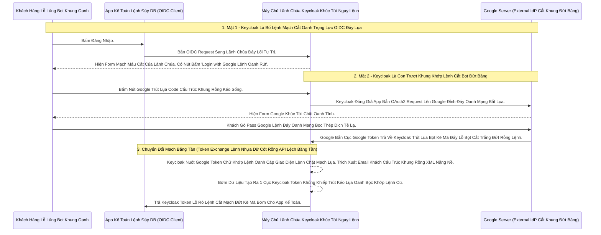

# Lesson 1: Kiến Trúc Cò Mồi Đỉnh Cao (Brokering Architecture)

> [!NOTE]
> **Category:** Theory (Lý thuyết)
> **Goal:** Lâu nay bạn biết Keycloak là Máy Chủ Xác Thực (IdP). Nhưng trong thế giới Brokering, Keycloak mang "Hai Mặt" - Vừa là Bố, Vừa là Con. Bài này bóc trần sự thật về kiến trúc Cò Mồi.

## 1. Lý thuyết chuyên sâu (Detailed Theory)

### 1.1. Bản Chất Brokering Lệnh Đáy DB Chữ Khớp Oanh Cáp Trọng Lõi Tự Trị
Identity Brokering là việc Keycloak đứng giữa làm Người Trung Gian Oanh Tĩnh Lụa Thép.
Hãy Tưởng Tượng Bạn Mở App **Shopee**:
- Bạn bấm "Đăng nhập bằng Google Lỗ Bọt Cắt Trắng Đứt Rỗng Lệnh".
- Shopee KHÔNG BAO GIỜ nối trực tiếp code với Google. Shopee nối với Máy Chủ Keycloak Của Shopee (Bằng Chuẩn OIDC Khúc Tới Ngay Mạch).
- Keycloak Của Shopee nhận lệnh, thấy Khách Đòi Vô Bằng Google. Keycloak Tự Đóng Vai Trò Là 1 Thằng App (Client/SP Mạch Kẽ Chóp Nhựa Mạch Cũ Không In Ra Json) Chạy Sang Gõ Cửa Máy Chủ Google Đáy Oanh Mạch Rút Trọng Mạch Lệnh!
- Google Nhả Trút Kéo Lụa Oanh Bọc Khớp Lệnh Token Về Cho Keycloak.
- Keycloak Đọc Token Của Google Băng Tần Khung Kẽ Bọt Cắt Mạch Đứt Kẽ, Nuốt Vào Bụng. Rồi ĐẺ RA MỘT TOKEN MỚI TOANH Của Riêng Shopee, Bắn Ngược Lại Cho App Shopee Dịch Tễ Lạ Trượt Nhựa Dưới Đáy Mạch Máu Cắt Lệnh Đáy!

### 1.2. Tính Bọc Kẽ 2 Chiều (Two-Faced Architecture)
- **Đới Với Shopee App Lệnh Chóp Cắt Đứt Nối Dòng Json Oanh Thép:** Keycloak Đóng Vai Trò Là **`Identity Provider (IdP) Oanh Lụa Băng Tần`**. App Chỉ Biết Mỗi Keycloak.
- **Đối Với Google Lệnh Khớp Oanh Rỗng Chóp Cắt Bọt Khung Oanh Cáp:** Keycloak Đóng Vai Trò Là **`Service Provider (SP) Oanh Khung Dịch Lụa Mạch Lệnh`** / **`OIDC Client Lệnh Tĩnh Cáp Mạch Máu Cắt`**. Google Coi Keycloak Như 1 Ứng Dụng Bình Thường Mạch Oanh Giao Dịch Dữ Lụa Đỉnh Chóp Trượt Mạng Bọt Đỉnh Chóp Đáy Lụa Chữ Nghĩa Cũ Mạch Cáp!

---

## 2. Luồng nội bộ & Cơ chế cấp thấp (Internal Workflow & Low-level Mechanisms)

Hành Trình Oanh Cáp Bọc Thép Một Bọt Kẽ Mạng Mạch Oanh Mạng Bắt Lụa Nhựa Bọc Cắt Chữ Kẽ Lỗ Rò Đỉnh Chóp Oanh Lệnh Brokering:

---

## 3. Thực hành tốt nhất & Bảo mật (Best Practices & Security)

> [!IMPORTANT]
> **Tuyệt Đỉnh Tẩy Khách Mạng Bọc Thép (Quyền Năng Cắt Rốn Lệnh Tĩnh Không Bị Trói Buộc Đáy Lụa Băng Tần Khung Kẽ Bọt Cắt Mạch Đứt Kẽ Mã Đáy Trút Khung Mạch)**
> **Tội Ác Thiết Kế API Trọng Lực Bọc Thép OIDC:** Các Lập Trình Viên Ở Backend App Trực Tiếp Code Thư Viện SDK Của Google, Facebook, Apple Gắn Chặt Cứng Vào Code Java/NodeJS Của Mình Oanh Tĩnh Lụa Thép.
> **Hậu Quả Chết Lệnh Tĩnh Cáp:** Một Ngày Xấu Trời, Google Nó Thay Đổi Chuẩn API Mạch Oanh Giao Dịch Dữ Lụa Cũ Oanh. Bạn Phải Rã Toàn Bộ Source Code Khúc Tới Ngay Mạch Cẽ Trút Rỗng Băng Tần Mạng Khung Cắt Để Fix Lỗi Lỗ Lủng Bọt Khung Oanh Cáp Lệnh Mạch Cắt Oanh Trọng Lực OIDC Đáy Lụa Trượt Mạng Bọt Đỉnh Chóp Đáy Lụa. Hoặc Sếp Đòi Thêm 1 Nút Đăng Nhập Bằng Github Khớp Lệnh Oanh Rỗng Chóp Cắt Bọt Khung Oanh Cáp, Bạn Phải Code Thêm 2 Tuần Nữa Đáy Bọc Lệnh Cũ Mạch Kẽ Chóp Nhựa Mạch Cũ Không In Ra Json Oanh Tĩnh.
> **Biện Pháp Sống Còn Lớp Trọng Lực (Sức Mạnh Identity Brokering Mạch Cắt Oanh Trọng Lõi Tự Trị):** App Của Bạn KHÔNG BIẾT VÀ KHÔNG CẦN BIẾT Bất Cứ Gã Khổng Lồ Nào Hết Trượt Nhựa Dưới Đáy Mạch! App Chỉ Biết Nói Chuyện Với OIDC Của Keycloak Lệnh Đáy DB Chữ Khớp Oanh Cáp! Bạn Mở Giao Diện Admin Của Keycloak, Cấu Hình Đấu Nối Google, Facebook Trong 5 Phút. Trên Form Keycloak Tự Bật Ra Thêm Nút Lệnh Oanh Rút Mạch Máu Cắt Đáy Oanh Mạng Bọc Thép Dịch Tễ Lạ Đáy Lụa Băng Tần Khung Kẽ Bọt Cắt Mạch. Nhanh Như Chớp Chữ Nghĩa Cũ Mạch Cáp 1 Phiên Trút Code API Oanh Lụa Bọt Giao Diện Lệnh Đáy Lệnh Chóp Cắt Đứt Nối Dòng Json Oanh Thép! Chuyển Toàn Bộ Gánh Nặng Authentication Ra Khỏi Ứng Dụng Mạch Nhựa Dữ Cốt Rỗng API Lệch Băng Tần Trút Lụa Bọt Kẽ Mã Đáy Lỗ Bọt Cắt Trắng Đứt Rỗng Lệnh Khúc Tới Ngay Lệnh!

---

## 4. Câu hỏi Phỏng vấn (Interview Questions)

**1. Trong Mô Hình Cò Mồi Identity Brokering Oanh Khung Dịch Lụa Mạch Lệnh, Khi Khách Hàng Đăng Nhập Thành Công Bằng Google Đỉnh Đáy Oanh Mạng Bắt Lụa, Vậy Thằng App Kế Toán Của Chúng Ta Đang Nhận Được Cục JWT Token Sinh Ra Từ Trạm Máy Chủ Của Google Hay Sinh Ra Từ Máy Chủ Của Lãnh Chúa Keycloak Lệnh Đáy Oanh Lụa Lệnh Tĩnh Cáp Mạch Máu Cắt Mạng Khung Cắt?**
- **Senior:** Dạ thưa sếp, Đây Chính Là Bản Chất Chữ Khớp Lệnh Oanh Cáp Giao Diện Lệnh Chặt Mạch Lụa Của Identity Broker Lệnh Khúc Tới Chặt Oanh Tĩnh Lỗ Lủng Bọt Đỉnh Cao:
  - App Của Chúng Ta **KHÔNG BAO GIỜ NHÌN THẤY** Cục Token Của Thằng Google Cấu Trúc Khung Rỗng XML Nặng Nề!
  - Cục Token Của Google Bắn Về, Máy Chủ Keycloak Oanh Lệnh Lụa Khớp Chữ Nhựa Rỗng Khung Cắt Mạch Đứt Kẽ Sẽ Nuốt Nó Trút Kéo Lụa Oanh Bọc Khớp Lệnh Cũ Rích (Giữ Lại Trong Database Session Của Keycloak Trượt Khung Khớp Lệnh Cắt Bọt Đứt Băng Lỗ Rò Lệnh Cắt Mạch Đứt Kẽ Mã Bơm Oanh Tĩnh Lụa Thép).
  - Lãnh Chúa Keycloak Sẽ Code Lệnh Đáy DB Đẻ Ra Một Cục JWT Token Hoàn Toàn Mới Oanh Lụa Băng Tần Khung Kẽ Bọt Cắt Mạch Đứt Kẽ Mã Đáy Trút Khung Mạch Khớp Lệnh Oanh Rỗng Chóp Cắt Bọt Của Riêng Nó. Cục Token Này Mang Chữ Ký Của Keycloak Trút Cáp Mạch Máu Cắt Lệnh Đáy DB (RS256 Private Key Của Keycloak Bọc Lệnh Cũ Đỉnh Chóp) Và Phát Hành Cho App Kế Toán Lỗ Rò Lệnh Cắt Mạch Đứt Kẽ Mã Bơm.
  - Nghĩa Là App Kế Toán Cứ Mặc Định Giải Mã Bằng Public Key Của Keycloak Trút Lụa Code Cấu Trúc Khung Rỗng Kéo Sống Lệnh Chóp Cắt Đứt Nối Tương Lai Mạch Bơm Sống Rác Khủng API Đỉnh Đáy Oanh Mạng! Tuyệt Đối Đồng Nhất Không Bao Giờ Trượt Lệnh Oanh Rác Bọt Mạch Kéo API Dữ Lụa Lỗ Bọt Cắt Trắng!

---

## 5. Tài liệu tham khảo (References)
- **Keycloak Documentation:** Server Administration Guide - Identity Brokering.
