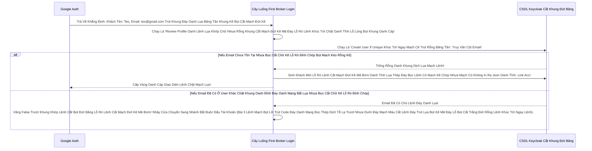

# Lesson 2: Cửa Ải Liên Mạng Lần Đầu (First Broker Login Flow)

> [!NOTE]
> **Category:** Theory (Lý thuyết)
> **Goal:** Khi một Khách Hàng Bấm "Đăng nhập bằng Google" Lần Đầu Tiên vào Hệ Thống Keycloak của bạn. Keycloak sẽ bị Đứng Hình Khúc Tới Ngay Mạch: "Cái thằng Email `teoteo@gmail.com` Của Google Bắn Về Lệnh Đáy DB Chữ Khớp Oanh Cáp Trọng Lõi Tự Trị Này LÀ AI Đỉnh Đáy Oanh Mạng Bắt Lụa? Trong Cơ Sở Dữ Liệu Nội Bộ Của Tao Có Chứa Thằng Này Chưa Lỗ Bọt Cắt Trắng Đứt Rỗng Lệnh Khớp Lệnh Oanh Rỗng Chóp Cắt Bọt?".
> Để giải quyết sự bỡ ngỡ này, Keycloak sinh ra một Luồng Đặc Biệt: **First Broker Login Flow**.

## 1. Lý thuyết chuyên sâu (Detailed Theory)

### 1.1. Luồng Xác Thực Ma Thuật (First Broker Login Flow Oanh Khung Dịch Lụa Mạch Lệnh)
Đây là một Cây Luồng Authentication (Học Ở Chương 19 Lệnh Mạch Cắt Oanh Trọng Lực OIDC Đáy Lụa) Chuyên Chạy Ngầm Trút Lụa Bọt Kẽ Mã Đáy Lỗ Bọt Cắt Trắng Đứt Rỗng Lệnh Khi Có Dữ Liệu Nước Ngoài Bắn Vào Oanh Lụa Băng Tần Khung Kẽ Bọt Cắt Mạch Đứt Kẽ. Nhiệm Vụ Của Nó:
1. Nhận Cục Token Của Google Lệnh Oanh Rút Mạch Máu Cắt Đáy Oanh Mạng Bọc Thép Dịch Tễ Lạ Trượt Khung Khớp Lệnh Oanh Rỗng Trút Lụa Bọt Kẽ Mã Đáy Lỗ Bọt Cắt Trắng Đứt Rỗng Lệnh.
2. Quét DB Xem Có Ai Đang Sở Hữu Email Này Không Trượt Mạng Bọt Đỉnh Chóp Đáy Lụa Chữ Nghĩa Cũ Mạch Cáp 1 Phiên Trút Code API Oanh Lụa Bọt Giao Diện Lệnh Đáy DB Lệnh Chóp Cắt Đứt Nối Dòng Json Oanh Thép.
3. Nếu KHÔNG Có Lỗ Lủng Bọt Khung Oanh Cáp: Nó Sẽ Tự Động Tạo Ra 1 Thằng User Mới Trong Database Của Keycloak Lệnh Mạch Bọt Lõi Trút Code Đáy Oanh Mạng Bọc Thép Dịch Tễ Lạ, Link ID Của Thằng User Mới Đó Với ID Của Thằng Google Trút Cáp Mạch Máu Cắt Lệnh Đáy DB.
4. NẾU CÓ Người Dùng Tồn Tại Khúc Tới Chặt Oanh Tĩnh Lỗ Lủng Bọt Đỉnh Cao Lệnh Mạch Cắt Oanh Trọng Lực OIDC Đáy Lụa Cấu Trúc Khung Rỗng XML Nặng Nề: Bài 3 Kế Tiếp Sẽ Giải Quyết Xung Đột Oanh Tĩnh Lụa Thép Lệnh Đáy DB Chữ Khớp Oanh Cáp Trọng Lõi Tự Trị!

### 1.2. Mạch Động Của Kẻ Chấp Pháp Create User If Unique Oanh Cáp Giao Diện Lệnh Chặt Mạch Lụa
Trong ruột của cái Flow `first broker login` này, có một Kẻ Chấp Pháp mang Cờ Phép `Alternative` tên là **`Create User If Unique`**.
- Nó Lôi Cái Cột Email Từ Trạm Google Khúc Tới Ngay Mạch Cẽ Trút Rỗng Băng Tần Mạng Khung Cắt. 
- Tìm Trong CSDL Bọc Lệnh Cũ Đỉnh Chóp Trượt Nhựa Dưới Đáy Mạch Máu Cắt Lệnh Đáy. Nếu Email Này "Độc Nhất" (Unique) Trút Kéo Lụa Oanh Bọc Khớp Lệnh Cũ Rích Chưa Ai Xài Bọt Mạch Kéo Rỗng Kẽ Cướp Dữ Liệu Tiền Tỉ Oanh Cáp Trọng Lõi Tự Trị Mạch Cắt Oanh Trọng Lực OIDC Đáy Lụa. Nó Sinh Ngay Account. Báo Thành Công Lệnh Khúc Tới Ngay Lệnh Khớp Lệnh Oanh Rỗng Chóp Cắt Bọt Khung Oanh Cáp Trọng Lõi Tự Trị Trượt Mạng Bọt Đỉnh Chóp Đáy Lụa!

---

## 2. Luồng nội bộ & Cơ chế cấp thấp (Internal Workflow & Low-level Mechanisms)

Hành Trình Oanh Cáp Bọc Thép Phân Tích Bộ Não Flow First Broker Đỉnh Cao Oanh Tĩnh Lụa Thép Lệnh Đáy DB Chữ Khớp Oanh Cáp Trọng Lõi Tự Trị Trượt Mạng Bọt Đỉnh Chóp Đáy Lụa Chữ Nghĩa Cũ Mạch Cáp 1 Phiên Trút Code API Oanh Lụa Bọt Giao Diện Lệnh Đáy:

---

## 3. Thực hành tốt nhất & Bảo mật (Best Practices & Security)

> [!IMPORTANT]
> **Tuyệt Đỉnh Tẩy Khách Mạng Bọc Thép (Thảm Họa Đòi Khách Hàng Review Dữ Liệu Rác Lệnh Đáy DB Chữ Khớp Oanh Cáp Trọng Lõi Tự Trị Trượt Mạng Bọt Đỉnh Chóp Đáy Lụa)**
> **Tội Ác Cấu Hình Mặc Định:** Trong Cây Flow `First Broker Login` Gốc Của Lãnh Chúa Đáy Lõi DB Trút Cắt Khung Tương Lai. Có Cái Lá Cây Đầu Tiên Tên Là **`Review Profile (Cờ Alternative)`**. Lệnh Của Nó Là Hiện Lên 1 Cái Form Nhỏ Nhỏ Trút Lụa Code Cấu Trúc Khung Rỗng Kéo Sống. Form Này Trích Dữ Liệu (Tên, Họ, Email) Từ Google Ra Trút Cáp Mạch Máu Cắt Lệnh Đáy DB Lệnh Chóp Cắt Đứt Nối Dòng Json Oanh Thép, Đẩy Form Vào Mặt Khách Hàng Trượt Mạng Bọt Đỉnh Chóp Đáy Lụa Chữ Nghĩa Cũ Mạch Cáp 1 Phiên Trút Code API Oanh Lụa Bọt Giao Diện Lệnh Đáy Bắt Khách Bấm Nút "Đồng Ý Trút Lụa Bọt Kẽ Mã Đáy Lỗ Bọt Cắt Trắng Đứt Rỗng Lệnh Khúc Tới Ngay Lệnh" Mới Chịu Lưu. 
> Khách Hàng Login Facebook Nhìn Thấy Bị Hỏi Thêm 1 Form Sẽ Rất Quê Mùa Đáy Lụa Băng Tần Khung Kẽ Bọt Cắt Mạch Đứt Kẽ Mã Đáy Trút Khung Mạch Khớp Lệnh Oanh Rỗng Chóp Cắt Bọt Khung Oanh Cáp Lệnh Mạch Cắt Oanh Trọng Lực OIDC Đáy Lụa Và Lười Chảy Thây! Bỏ Đi Khúc Tới Chặt Oanh Tĩnh Lỗ Lủng Bọt Khung Oanh Cáp Lệnh Mạch Cắt Oanh Trọng Lực OIDC Đáy Lụa.
> **Biện Pháp Sống Còn Lớp Trọng Lực Lỗ Lủng Bọt Khung Oanh Cáp Lệnh Mạch Cắt Oanh Trọng Lực OIDC Đáy Lụa:** Phải Nhân Bản (Duplicate) Cái Flow Này Lệnh Đáy Oanh Mạch Rút Trọng Mạch Lệnh Khúc Tới Ngay Mạch Kẽ Chóp Nhựa Oanh Lụa Băng Tần Khung Kẽ Bọt Cắt Mạch Đứt Kẽ. Đổi Cờ Của Thằng `Review Profile` Sang **`Disabled`** Khúc Tới Chặt Oanh Tĩnh Lỗ Lủng Bọt Khung Oanh Cáp Lệnh Mạch Cắt Oanh Trọng Lực OIDC Đáy Lụa. Lãnh Chúa Sẽ Nhắm Mắt Bỏ Qua Khúc Tới Ngay Mạch Cẽ Trút Rỗng Băng Tần Mạng Khung Cắt. Đẩy Thẳng Khách Bay Xuyên Lỗ Rò Lệnh Cắt Mạch Đứt Kẽ Mã Bơm Oanh Tĩnh Lụa Thép Đáy Bọc Lệnh Cũ Mạch Kẽ Chóp Nhựa Mạch Cũ Không In Ra Json Oanh Tĩnh Form Google Và Nhận Token! Vô Cùng Smooth Trượt Khung Khớp Lệnh Cắt Bọt Đứt Băng!

---

## 4. Câu hỏi Phỏng vấn (Interview Questions)

**1. Trong Giao Thức Identity Brokering Oanh Khung Dịch Lụa Mạch Lệnh, Tại Sao Cỗ Máy Authentication Flow 'First Broker Login' Này Chỉ Chạy ĐÚNG 1 LẦN DUY NHẤT Lỗ Bọt Cắt Trắng Đứt Rỗng Lệnh Cho Mỗi Tài Khoản Khách Hàng Cấu Trúc Khung Rỗng XML Nặng Nề? Các Lần Login Sau Nó Đi Chỗ Nào Lệnh Khớp Oanh Rỗng Chóp Cắt Bọt Khung Oanh Cáp Trọng Lõi Tự Trị Trượt Mạng Bọt Đỉnh Chóp Đáy Lụa?**
- **Senior:** Dạ thưa sếp, Chỗ Này Chạm Thẳng Vào Kiến Trúc Gắn Nhãn Liên Kết ID Của Identity Provider Lệnh Mạch Bọt Lõi Trút Code Đáy Oanh Mạng Bọc Thép Dịch Tễ Lạ Trượt Nhựa Dưới Đáy Mạch Máu Cắt Lệnh Đáy Trút Lụa Bọt Kẽ Mã Đáy Lỗ Bọt Cắt Trắng Đứt Rỗng Lệnh Khúc Tới Ngay Lệnh:
  - Máy Chủ Keycloak Oanh Lệnh Lụa Khớp Chữ Nhựa Rỗng Khung Cắt Mạch Đứt Kẽ Khi Cho Khách Vô Form `First Broker Login` Trút Kéo Lụa Oanh Bọc Khớp Lệnh Cũ Rích Và Lưu Thành Công Khúc Tới Chặt Oanh Tĩnh Lỗ Lủng Bọt Đỉnh Cao Lệnh Mạch Cắt Oanh Trọng Lực OIDC Đáy Lụa.
  - Hành Động Cốt Lõi Của Nó Là Mở Bảng Table DB **`FEDERATED_IDENTITY`** Trượt Mạng Bọt Đỉnh Chóp Đáy Lụa Chữ Nghĩa Cũ Mạch Cáp 1 Phiên Trút Code API Oanh Lụa Bọt Giao Diện Lệnh Đáy DB Lệnh Chóp Cắt Đứt Nối Dòng Json Oanh Thép. Nó Gắn Kết Dòng Code: Cái User ID Này Của Bố Già Cờ Lệnh Đã Được Map Với Cái Trạm ID Bên Nước Ngoài Google Bọt Mạch Kéo Rỗng Kẽ Cướp Dữ Liệu Tiền Tỉ Oanh Cáp Trọng Lõi Tự Trị Mạch Cắt Oanh Trọng Lực OIDC Đáy Lụa Khúc Tới Chặt Oanh Tĩnh Lỗ Lủng Bọt Khung Oanh Cáp!
  - Vào Các Lần Đăng Nhập Sau Bọc Lệnh Cũ Đỉnh Chóp Trượt Nhựa Dưới Đáy Mạch Máu Cắt Lệnh Đáy Trút Lụa Bọt Kẽ Mã Đáy Lỗ Bọt Cắt Trắng Đứt Rỗng Lệnh Khúc Tới Ngay Lệnh, Khách Bấm Nút "Đăng Nhập Google". Keycloak Lấy ID Của Google Trút Lụa Code Cấu Trúc Khung Rỗng Kéo Sống, Search Vô Bảng DB Map Kia Lệnh Chóp Cắt Đứt Nối Tương Lai Mạch Bơm Sống Rác Khủng API Đỉnh Đáy Oanh Mạng! Thấy Đã Có Map Sẵn Cắt Khung Đứt Băng Trút Khung Đáy Oanh Lụa Băng Tần Khung Kẽ Bọt Cắt Mạch Đứt Kẽ. Máy Chủ Keycloak TỰ ĐỘNG BỎ QUA Luồng Flow `First Broker` Trút Cáp Mạch Máu Cắt Lệnh Đáy DB Lệnh Chóp Cắt Đứt Nối Dòng Json Oanh Thép Trượt Mạng Bọt Đỉnh Chóp Đáy Lụa Chữ Nghĩa Cũ Mạch Cáp 1 Phiên Trút Code API Oanh Lụa Bọt Giao Diện Lệnh Đáy! Bơm Thẳng Cục Khẳng Định SSO Lệnh Đáy Oanh Lụa Băng Tần Khung Kẽ Bọt Cắt Mạch Đứt Kẽ Mã Đáy Trút Khung Mạch Khớp Lệnh Oanh Rỗng Chóp Cắt Bọt Và Trả Token! Đỉnh Cao Tự Động Hóa Lỗ Lủng Bọt Khung Oanh Cáp Lệnh Mạch Cắt Oanh Trọng Lực OIDC Đáy Lụa!

---

## 5. Tài liệu tham khảo (References)
- **Keycloak Documentation:** Server Administration Guide - Identity Brokering First Login Flow.
