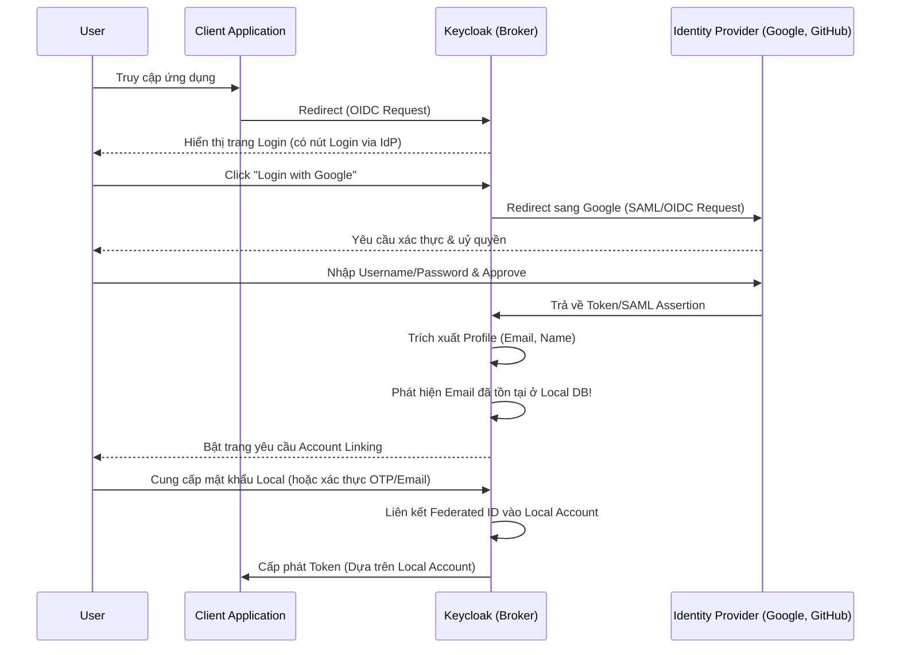

> [!NOTE]
> **Category:** Theory
> **Goal:** Hiểu sâu về cơ chế Account Linking trong Keycloak Identity Brokering, cách Keycloak liên kết danh tính người dùng từ nhiều Identity Providers (IdP) vào một tài khoản cục bộ duy nhất.

## 1. Lý thuyết chuyên sâu (Detailed Theory)

Trong các hệ thống phân tán phức tạp, một người dùng có thể sở hữu nhiều tài khoản tại các Identity Providers (IdP) khác nhau, ví dụ: đăng nhập bằng Google, Facebook, hoặc tài khoản Active Directory nội bộ của công ty. **Account Linking** là khả năng hợp nhất (merge) các định danh phân tán này lại thành một người dùng hợp nhất (unified user) trong hệ thống Identity Access Management (IAM) - ở đây là Keycloak.

**Tại sao cần Account Linking?**
- **Trải nghiệm người dùng (UX)**: Người dùng có thể sử dụng linh hoạt bất kỳ IdP nào để đăng nhập mà vẫn giữ nguyên được Profile, Roles, và lịch sử giao dịch ở ứng dụng đích.
- **Quản lý phân quyền tập trung**: Khi tài khoản được liên kết, administrator chỉ cần phân quyền (assign role/group) cho một Local Account duy nhất trong Keycloak.
- **Tránh trùng lặp dữ liệu**: Thay vì tạo ra nhiều bản ghi user khác biệt (Ví dụ: `john_google`, `john_fb`), hệ thống chỉ lưu một `john_doe` duy nhất và lưu thông tin về các Federated Identities được liên kết với nó.

## 2. Luồng nội bộ & Cơ chế cấp thấp (Internal Workflow & Low-level Mechanisms)

Khi một người dùng lần đầu đăng nhập thông qua một IdP mới (nhưng email hoặc username của họ đã tồn tại trên Keycloak), Keycloak sẽ kích hoạt một Authentication Flow có tên là **First Broker Login**. Dưới đây là kiến trúc luồng dữ liệu của quá trình Account Linking:



**Cơ sở dữ liệu (Low-level):**
Keycloak duy trì Account Linking bằng cách ghi dữ liệu vào bảng `FEDERATED_IDENTITY`. Bảng này có cấu trúc ánh xạ giữa `USER_ID` (Local Account ID) và `IDENTITY_PROVIDER` cùng `BROKER_USER_ID` (ID của user bên phía IdP). Khi người dùng đăng nhập những lần sau qua IdP đó, Keycloak sẽ join bảng này để xác định Local Account một cách tức thời.

## 3. Thực hành tốt nhất & Bảo mật (Best Practices & Security)

> [!IMPORTANT]
> **Yêu cầu xác minh chủ sở hữu tài khoản (Ownership Verification)**: Tuyệt đối KHÔNG cấu hình tự động liên kết tài khoản dựa trên Email mà không yêu cầu user chứng minh họ sở hữu tài khoản Local (Ví dụ: thông qua việc nhập lại Password cũ hoặc qua OTP gửi qua Email). Kẻ tấn công có thể tạo một tài khoản tại một IdP yếu kém với email của nạn nhân (Account Takeover vulnerability).

> [!WARNING]
> **Cẩn trọng với Trust Email**: Nếu IdP được đánh dấu là `Trust Email` (Ví dụ: Google Workspace nội bộ công ty), Keycloak có thể tự động Linking. Hãy chỉ bật tính năng này với các IdP có tính bảo mật cực cao và bạn hoàn toàn tin tưởng về việc xác minh email của họ.

- **Quản lý vòng đời**: Luôn hướng dẫn hoặc cung cấp cổng Self-Service Account Console để người dùng có thể chủ động unlink (huỷ liên kết) một IdP khi họ bị mất quyền kiểm soát tài khoản bên ngoài đó.

## 4. Cấu hình minh họa thực tế (Configuration Examples)

Để cấu hình Account Linking trong Keycloak, bạn cần tinh chỉnh Authentication Flow, cụ thể là luồng **First Broker Login Flow**:

1. Vào **Authentication** -> **Flows** -> Chọn `First Broker Login`.
2. Kiểm tra nhánh `Handle Existing Account`:
   - Execution: **Verify Existing Account by Email** (Hoặc qua Password). Đặt trạng thái là `REQUIRED` hoặc `ALTERNATIVE`.
   - Điều này sẽ buộc người dùng xác minh danh tính trước khi Keycloak tiến hành ghi bản ghi liên kết.

*Sử dụng API nội bộ qua REST Admin API để liên kết tài khoản thủ công:*
```bash
# Link một IdP vào User thông qua Admin API
curl -X POST \
  http://localhost:8080/admin/realms/myrealm/users/<USER_ID>/federated-identity/<IDP_ALIAS> \
  -H "Authorization: Bearer <ADMIN_TOKEN>" \
  -H "Content-Type: application/json" \
  -d '{
    "userId": "<ID_OF_USER_IN_IDP>",
    "userName": "<USERNAME_IN_IDP>"
  }'
```

## 5. Trường hợp ngoại lệ (Edge Cases)

- **Xung đột Username nhưng khác Email (Username Clash)**: Nếu IdP trả về một username đã tồn tại trong Keycloak nhưng lại đi kèm một Email khác, luồng First Broker Login có thể gây nhầm lẫn nếu không được xử lý cẩn thận. Keycloak thường sẽ đổi tên username tự động (sử dụng Mapper `Username Template Importer`) để tạo ra một Local Account mới nhằm tránh liên kết nhầm tài khoản.
- **Tài khoản Local chưa được verify email**: Nếu tài khoản trong Keycloak tồn tại nhưng chưa bao giờ được xác thực email, và một user khác đăng nhập qua IdP lấy chính email đó, nguy cơ chiếm đoạt tài khoản là rất cao. Admin nên cấu hình `Require Email Verification` trên mức độ Realm.

## 6. Câu hỏi Phỏng vấn (Interview Questions)

**Junior Level:**
1. Tính năng Account Linking trong Keycloak giải quyết bài toán gì?
   - *Đáp án:* Cho phép người dùng đăng nhập bằng nhiều Identity Providers (Social, Enterprise) nhưng chỉ sử dụng duy nhất một tài khoản định danh trong hệ thống nội bộ để dễ dàng quản lý phân quyền.
2. Khi hai tài khoản được liên kết, làm thế nào Keycloak biết chúng là một?
   - *Đáp án:* Dựa vào bảng ánh xạ `FEDERATED_IDENTITY` nối giữa ID của Local User và ID do IdP cung cấp.

**Senior Level:**
3. Trình bày rủi ro bảo mật (Account Takeover) nếu bạn kích hoạt tính năng tự động Account Linking dựa trên Email match mà không có bước xác minh?
   - *Đáp án:* Nếu một IdP cho phép người dùng tự do chọn email mà không cần xác thực (hoặc IdP bị hack), kẻ tấn công có thể sử dụng email của quản trị viên hệ thống để đăng nhập và Keycloak sẽ tự động nối vào tài khoản quản trị viên.
4. Làm thế nào để bạn tuỳ biến quá trình Account Linking để thay vì yêu cầu mật khẩu, hệ thống sẽ gửi OTP qua tin nhắn SMS?
   - *Đáp án:* Cần phát triển một Custom Authenticator (Spi) cho Keycloak, cấu hình nó vào trong First Broker Login flow tại nhánh `Handle Existing Account` để thay thế cho bước `Password Form` mặc định.
5. So sánh sự khác nhau giữa việc sử dụng "First Broker Login Flow" tự động và việc dùng REST API để Admin chủ động Link tài khoản?
   - *Đáp án:* Tự động thích hợp cho môi trường B2C nơi user tự phục vụ. REST API thích hợp cho môi trường Enterprise B2B, nơi dữ liệu đồng bộ hoá (Sync) từ các hệ thống nhân sự (HR) đẩy sang Keycloak.

## 7. Tài liệu tham khảo (References)

- [Keycloak Official Documentation - Identity Brokering](https://www.keycloak.org/docs/latest/server_admin/#_identity_broker)
- [Keycloak Official Documentation - Default Provider Flow](https://www.keycloak.org/docs/latest/server_admin/#_default_provider_flow)
- [OWASP Authentication Cheat Sheet](https://cheatsheetseries.owasp.org/cheatsheets/Authentication_Cheat_Sheet.html)
