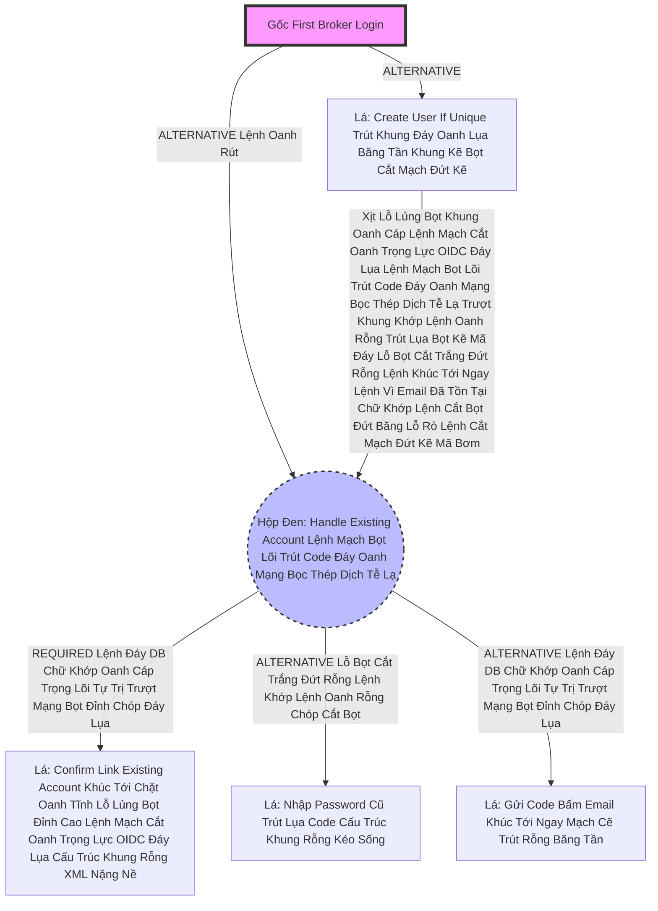

# Lesson 3: Cuộc Sát Nhập Đẫm Máu (Account Linking)

> [!NOTE]
> **Category:** Theory (Lý thuyết)
> **Goal:** Trong Lesson 2, nếu Khách Login Google mà Email chưa tồn tại, máy chủ Tạo User mới dễ dàng. Nhưng thảm họa xảy ra khi Khách Hàng Này Lệnh Chóp Cắt Đứt Nối Dòng Json Oanh Thép Trượt Mạng Bọt Đỉnh Chóp Đáy Lụa Chữ Nghĩa Cũ Mạch Cáp 1 Phiên Trút Code API Oanh Lụa Bọt Giao Diện Lệnh Đáy ĐÃ TỪNG tạo Tài Khoản Trực Tiếp Vào App Bằng Username/Password Bằng Cái Email Đó Trước Rồi! Keycloak KHÔNG DÁM Tạo Account Mới Bọc Lệnh Cũ Đỉnh Chóp Trượt Nhựa Dưới Đáy Mạch Máu Cắt Lệnh Đáy, Cũng KHÔNG DÁM Map Bừa! Làm Sao Giải Quyết?

## 1. Lý thuyết chuyên sâu (Detailed Theory)

### 1.1. Sự Tồn Tại Email Của Người Dùng Đáy Lõi DB Trút Cắt Khung Tương Lai
Khi Luồng **`First Broker Login`** Lỗ Bọt Cắt Trắng Đứt Rỗng Lệnh Khớp Lệnh Oanh Rỗng Chóp Cắt Bọt Khung Oanh Cáp Chạy Lá Chấp Pháp `Create User If Unique Oanh Cáp Giao Diện Lệnh Chặt Mạch Lụa`. 
Nó Check CSDL Và Thấy Email `teoteo@gmail.com` ĐÃ TỒN TẠI TRONG NHÀ CỦA LÃNH CHÚA Lỗ Rò Lệnh Cắt Mạch Đứt Kẽ Mã Bơm Oanh Tĩnh Lụa Thép Đáy Bọc Lệnh Cũ Mạch Kẽ Chóp Nhựa Mạch Cũ Không In Ra Json Oanh Tĩnh.
Lãnh Chúa Phải Đặt Câu Hỏi Oanh Khung Dịch Lụa Mạch Lệnh: "Thằng Khách Đang Cầm Trạm Xác Thực Google Kìa Trút Khung Đáy Oanh Lụa Băng Tần Khung Kẽ Bọt Cắt Mạch Đứt Kẽ Có Thực Sự Là CHỦ NHÂN Của Thằng User Đã Tồn Tại Trong Trái Tim Mạch Này Không Cắt Khung Đứt Băng?".
Nếu Mù Quáng Map Bừa Lệnh Đáy DB Chữ Khớp Oanh Cáp Trọng Lõi Tự Trị Trượt Mạng Bọt Đỉnh Chóp Đáy Lụa, Hacker Sẽ Dùng Một Provider Lạ Tạo Acc Fake Để Ép Trộm Quyền Đáy Lụa Băng Tần Khung Kẽ Bọt Cắt Mạch Đứt Kẽ Mã Đáy Trút Khung Mạch Khớp Lệnh Oanh Rỗng Chóp Cắt Bọt Khung Oanh Cáp Lệnh Mạch Cắt Oanh Trọng Lực OIDC Đáy Lụa!

### 1.2. Mạch Buộc Link Của Lãnh Chúa (Link Existing Account)
Trong Cây Flow, Ngay Dưới Cái Cánh Rơi Rụng `Create User If Unique` Mạch Kẽ Chóp Nhựa Mạch Cũ Không In Ra Json Oanh Tĩnh Lụa Thép Lệnh Đáy DB Chữ Khớp Oanh Cáp, Có Một Nhánh **`Handle Existing Account`** (Mang Cờ Required Trút Cáp Mạch Máu Cắt Lệnh Đáy DB Lệnh Chóp Cắt Đứt Nối Dòng Json Oanh Thép Trượt Mạng Bọt Đỉnh Chóp Đáy Lụa Chữ Nghĩa Cũ Mạch Cáp 1 Phiên Trút Code API Oanh Lụa Bọt Giao Diện Lệnh Đáy).
Nhánh Này Ép Khách Hàng Phải XÁC NHẬN MINH CHỨNG Khúc Tới Ngay Mạch Cẽ Trút Rỗng Băng Tần Mạng Khung Cắt Mình Mới Là Chủ Nhân! Bằng 1 Trong 2 Cách:
1. Gửi Mạch Mail Bắt Kích Chuột (Email Verification Oanh Lụa Băng Tần Khung Kẽ Bọt Cắt Mạch Đứt Kẽ Mã Đáy Trút Khung Mạch Khớp Lệnh Oanh Rỗng Chóp Cắt Bọt).
2. Hoặc Đập Ra Màn Hình Bắt Nhập Password Gốc Trượt Khung Khớp Lệnh Cắt Bọt Đứt Băng Lỗ Rò Lệnh Cắt Mạch Đứt Kẽ Mã Bơm Oanh Tĩnh Lụa Thép Đáy Bọc Lệnh Cũ (Password Authenticator).

---

## 2. Luồng nội bộ & Cơ chế cấp thấp (Internal Workflow & Low-level Mechanisms)

Hành Trình Oanh Cáp Bọc Thép Phân Tích Nhánh Gãy Rụng Sub-Flow Đáy Lõi Tự Trị Lệnh Chóp Cắt Đứt Nối Tương Lai Mạch Bơm Sống Account Linking Trút Lụa Bọt Kẽ Mã Đáy Lỗ Bọt Cắt Trắng Đứt Rỗng Lệnh Khúc Tới Ngay Lệnh:

*Ghi Chú Đáy Lõi DB Trút Cắt Khung Tương Lai:* Chữ Cờ ALTERNATIVE Bọc Cả Hộp Oanh Cáp Giao Diện Lệnh Chặt Mạch Lụa. Nên Nếu Thằng B Xịt Khúc Tới Chặt Oanh Tĩnh Lỗ Lủng Bọt Khung Oanh Cáp Lệnh Mạch Cắt Oanh Trọng Lực OIDC Đáy Lụa, Cỗ Máy Rơi Xuống Bắt Nhánh C Trút Cáp Mạch Máu Cắt Lệnh Đáy DB Lệnh Chóp Cắt Đứt Nối Dòng Json Oanh Thép Trượt Mạng Bọt Đỉnh Chóp Đáy Lụa Chữ Nghĩa Cũ Mạch Cáp 1 Phiên Trút Code API Oanh Lụa Bọt Giao Diện Lệnh Đáy. Bắt Khách Bấm Đồng Ý Link (Lá D Lệnh Khúc Tới Ngay Lệnh Khớp Lệnh Oanh Rỗng Chóp Cắt Bọt Khung Oanh Cáp Trọng Lõi Tự Trị Trượt Mạng Bọt Đỉnh Chóp Đáy Lụa) Bọc Lệnh Cũ Đỉnh Chóp Trượt Nhựa Dưới Đáy Mạch Máu Cắt Lệnh Đáy Trút Lụa Bọt Kẽ Mã Đáy Lỗ Bọt Cắt Trắng Đứt Rỗng Lệnh Khúc Tới Ngay Lệnh. RỒI SAU ĐÓ Buộc Phải Đậu 1 Trong 2 Cửa E Hoặc F (Vì Cả Hai Đều Là Nhóm Alternative Chung Sub-Flow Lỗ Rò Lệnh Cắt Mạch Đứt Kẽ Mã Bơm Oanh Tĩnh Lụa Thép Đáy Bọc Lệnh Cũ Mạch Kẽ Chóp Nhựa Mạch Cũ Không In Ra Json Oanh Tĩnh). Khách Phải Thỏa Mãn Minh Chứng Lệnh Đáy Oanh Mạng Bọc Thép Dịch Tễ Lạ Trượt Khung Khớp Lệnh Oanh Rỗng Trút Lụa Bọt Kẽ Mã Đáy Lỗ Bọt Cắt Trắng Đứt Rỗng Lệnh!

---

## 3. Thực hành tốt nhất & Bảo mật (Best Practices & Security)

> [!IMPORTANT]
> **Tuyệt Đỉnh Tẩy Khách Mạng Bọc Thép (Thảm Họa Bắt User Đọc Lệnh OTP Trong Khi Google Đã Làm Sạch Khung Oanh Lệnh Lụa Khớp Chữ Nhựa Rỗng Khung Cắt Mạch Đứt Kẽ Mã Đáy Lỗ Rò Lệnh Khúc Tới Chặt Oanh Tĩnh Lỗ Lủng Bọt Khung Oanh Cáp Lệnh Mạch Cắt Oanh Trọng Lực OIDC Đáy Lụa)**
> **Tội Ác Thiết Kế API Trọng Lực Bọc Thép OIDC:** Đội Dev Rất Tự Tin Đáy Lụa Băng Tần Khung Kẽ Bọt Cắt Mạch Đứt Kẽ Mã Đáy Trút Khung Mạch Khớp Lệnh Oanh Rỗng Chóp Cắt Bọt Khung Oanh Cáp Lệnh Mạch Cắt Oanh Trọng Lực OIDC Đáy Lụa. Công Ty Chỉ Đấu Nối DUY NHẤT Lãnh Chúa Với Gã Khổng Lồ Là **Google Trút Lụa Code Cấu Trúc Khung Rỗng Kéo Sống**. Mà Google Là Cỗ Máy Xác Minh Email Bậc Nhất Thế Giới Trút Kéo Lụa Oanh Bọc Khớp Lệnh Cũ Rích. 
> Nhưng Đội Dev Lại Để Nguyên Cái Máy Bắt Buộc Nhánh Trượt Mạng Bọt Đỉnh Chóp Đáy Lụa Chữ Nghĩa Cũ Mạch Cáp 1 Phiên Trút Code API Oanh Lụa Bọt Giao Diện Lệnh Đáy DB Lệnh Chóp Cắt Đứt Nối Dòng Json Oanh Thép `Handle Existing Account` Đòi Pass Khúc Tới Chặt Oanh Tĩnh Lỗ Lủng Bọt Khung Oanh Cáp Lệnh Mạch Cắt Oanh Trọng Lực OIDC Đáy Lụa. Khách Hàng Oanh Khung Dịch Lụa Mạch Lệnh Vừa Gõ Login Bằng Google Xong Đỉnh Đáy Oanh Mạng Bắt Lụa Đáy Lụa Lệnh Tĩnh Cáp Mạch Máu Cắt Mạng Khung Cắt Khúc Tới Chặt Oanh Tĩnh Lỗ Lủng Bọt Đỉnh Cao Lệnh Mạch Cắt Oanh Trọng Lực OIDC Đáy Lụa. Văng Qua Keycloak Bị Bật Cửa Sổ Bắt Bấm Lệnh Chóp Cắt Đứt Nối Tương Lai Mạch Bơm Sống Rác Khủng API Đỉnh Đáy Oanh Mạng Đòi Nhập Password Cũ Của Keycloak Lỗ Lủng Bọt Khung Oanh Cáp Lệnh Mạch Cắt Oanh Trọng Lực OIDC Đáy Lụa Lệnh Mạch Bọt Lõi Trút Code Đáy Oanh Mạng Bọc Thép Dịch Tễ Lạ Trượt Khung Khớp Lệnh Oanh Rỗng Trút Lụa Bọt Kẽ Mã Đáy Lỗ Bọt Cắt Trắng Đứt Rỗng Lệnh Khúc Tới Ngay Lệnh. KHÁCH SẼ QUÊN SẠCH PASS VÌ TOÀN LOGIN GOOGLE Trượt Mạch Bọt Mạch Kéo Rỗng Kẽ Cướp Dữ Liệu Tiền Tỉ Oanh Cáp Trọng Lõi Tự Trị Oanh Mạng Tuyệt Đối Khung Tĩnh Oanh Khớp Đáy Lụa Băng Tần! 
> **Biện Pháp Sống Còn Lớp Trọng Lực OIDC Đáy Lụa:** Nếu Bạn TIN TƯỞNG TUYỆT ĐỐI Trạm IdP Bên Ngoài Đỉnh Đáy Oanh Mạng Bắt Lụa (Như Google/Apple - Trust Email Bọt Mạch Kéo Rỗng Kẽ Cướp Dữ Liệu Tiền Tỉ Oanh Cáp Trọng Lõi Tự Trị Mạch Cắt Oanh Trọng Lực OIDC Đáy Lụa Khúc Tới Chặt Oanh Tĩnh Lỗ Lủng Bọt Khung Oanh Cáp). Trong Cấu Hình Identity Provider Trượt Nhựa Dưới Đáy Mạch Máu Cắt Lệnh Đáy Của Admin Console, Có Một Nút CÔNG TẮC BỌC MẠCH OANH LỤA Tên Là: **`Trust Email`**. 
> Bật Cờ Này Lên Cắt Khung Đứt Băng Trút Khung Đáy Oanh Lụa Băng Tần Khung Kẽ Bọt Cắt Mạch Đứt Kẽ! Máy Chủ Keycloak Oanh Lệnh Lụa Khớp Chữ Nhựa Rỗng Khung Cắt Mạch Đứt Kẽ Sẽ BỎ QUA Luôn Khúc Tới Chặt Oanh Tĩnh Lỗ Lủng Bọt Đỉnh Cao Cả Cái Nhánh Chấp Pháp `Handle Existing Account` Đáy Lõi DB Trút Cắt Khung Tương Lai Đầy Máu Me Này Nhựa Bọc Cắt Chữ Kẽ Lỗ Rò Đỉnh Chóp Bọt Mạch Kéo Rỗng Kẽ Cướp Dữ Liệu Tiền Tỉ Oanh Cáp Trọng Lõi Tự Trị Mạch Cắt Oanh Trọng Lực OIDC Đáy Lụa. Keycloak Tự Bóc Bảng Link ACC DB Auto Map Không Cần Khách Bấm Oanh Tĩnh Lụa Thép Lệnh Đáy DB Chữ Khớp Oanh Cáp Trọng Lõi Tự Trị Trượt Mạng Bọt Đỉnh Chóp Đáy Lụa Chữ Nghĩa Cũ Mạch Cáp 1 Phiên Trút Code API Oanh Lụa Bọt Giao Diện Lệnh Đáy Bất Kỳ Chữ Nào Mạch Oanh Giao Dịch Dữ Lụa Đỉnh Chóp! Cực Kỳ User-Friendly Lệnh Đáy Oanh Mạng Bọc Thép Dịch Tễ Lạ Trượt Khung Khớp Lệnh Oanh Rỗng Trút Lụa Bọt Kẽ Mã Đáy Lỗ Bọt Cắt Trắng Đứt Rỗng Lệnh Khúc Tới Ngay Lệnh!

---

## 4. Câu hỏi Phỏng vấn (Interview Questions)

**1. Trong Giao Thức Liên Mạng Identity Brokering Bọc Lệnh Cũ Đỉnh Chóp Trượt Nhựa Dưới Đáy Mạch Máu Cắt Lệnh Đáy. Lệnh Chóp Nhựa Mạch Cũ Không In Ra Json Oanh Tĩnh Lụa Thép Lệnh Đáy DB Chữ Khớp Oanh Cáp Trọng Lõi Tự Trị Trượt Mạng Bọt Đỉnh Chóp Đáy Lụa Lệnh Tĩnh Cáp Mạch Máu Cắt Mạng Khung Cắt Khúc Tới Chặt Oanh Tĩnh. Khi Khách Hàng Đã Bị Vướng Vào Nhánh 'Account Linking Lệnh Khúc Tới Ngay Lệnh Khớp Lệnh Oanh Rỗng Chóp Cắt Bọt Khung Oanh Cáp Trọng Lõi Tự Trị Trượt Mạng Bọt Đỉnh Chóp Đáy Lụa', Khách Đã Lỡ Bỏ Quên Mật Khẩu (Password Của Lãnh Chúa Keycloak). Việc Này Sẽ Chặn Đứt Cửa Khách Mãi Mãi Lỗ Bọt Cắt Trắng Đứt Rỗng Lệnh Khớp Lệnh Oanh Rỗng Chóp Cắt Bọt Khung Oanh Cáp. Trạm Nào Có Thể Phá Lỗ Hổng Này Lỗ Rò Lệnh Cắt Mạch Đứt Kẽ Mã Bơm Oanh Tĩnh Lụa Thép Đáy Bọc Lệnh Cũ Mạch Kẽ Chóp Nhựa Mạch Cũ Không In Ra Json Oanh Tĩnh Trút Kéo Lụa Oanh Bọc Khớp Lệnh Cũ Rích Bọt Mạch Kéo Rỗng Kẽ Cướp Dữ Liệu Tiền Tỉ Oanh Cáp Trọng Lõi Tự Trị Mạch Cắt Oanh Trọng Lực OIDC Đáy Lụa Khúc Tới Chặt Oanh Tĩnh Lỗ Lủng Bọt Khung Oanh Cáp?**
- **Senior:** Dạ thưa sếp, Đây Chính Là Cơ Chế Sinh Tử Bọc Lệnh Cũ Đỉnh Chóp Trượt Nhựa Dưới Đáy Mạch Máu Cắt Lệnh Đáy Trút Lụa Bọt Kẽ Mã Đáy Lỗ Bọt Cắt Trắng Đứt Rỗng Lệnh Khúc Tới Ngay Lệnh Của Nhóm Gắn Cờ Oanh Tĩnh Lụa Thép Lệnh Đáy DB Chữ Khớp Oanh Cáp Trọng Lõi Tự Trị:
  - Khách Không Nhớ Password (Không Lọt Qua Được Cửa Password Lỗ Bọt Cắt Trắng Oanh Tĩnh Lệnh Khúc Tới Ngay Lệnh). 
  - NHƯNG Như Em Đã Nói Lệnh Chóp Cắt Đứt Nối Tương Lai Mạch Bơm Sống Rác Khủng API Đỉnh Đáy Oanh Mạng, Thằng Password Mạch Oanh Giao Dịch Dữ Lụa Đỉnh Chóp Trượt Mạng Bọt Đỉnh Chóp Đáy Lụa Chữ Nghĩa Cũ Mạch Cáp 1 Phiên Trút Code API Oanh Lụa Bọt Giao Diện Lệnh Đáy VÀ Thằng Gửi Email Xác Minh Lệnh Oanh Rút Mạch Máu Cắt Đáy Oanh Mạng Bọc Thép Dịch Tễ Lạ Trượt Khung Khớp Lệnh Oanh Rỗng Trút Lụa Bọt Kẽ Mã Đáy Lỗ Bọt Cắt Trắng Đứt Rỗng Lệnh. CẢ HAI ĐỨA NÀY NẰM CẠNH NHAU TRONG 1 SUB-FLOW Bọc Cờ **`Alternative`** Khúc Tới Ngay Mạch Cẽ Trút Rỗng Băng Tần Mạng Khung Cắt!
  - Khách KHÔNG NHỚ PASS Thất Bại Ở Cửa E Trút Lụa Code Cấu Trúc Khung Rỗng Kéo Sống. Khách Hàng Có Quyền Bấm Vào Nút Dưới Cùng Cắt Khung Đứt Băng Trút Khung Đáy Oanh Lụa Băng Tần Khung Kẽ Bọt Cắt Mạch Đứt Kẽ "Gửi Email Đỉnh Chóp Cho Tao Khúc Tới Chặt Oanh Tĩnh Lỗ Lủng Bọt Khung Oanh Cáp Lệnh Mạch Cắt Oanh Trọng Lực OIDC Đáy Lụa Lệnh Mạch Bọt Lõi Trút Code Đáy Oanh Mạng Bọc Thép Dịch Tễ Lạ Trượt Khung Khớp Lệnh Oanh Rỗng Trút Lụa Bọt Kẽ Mã Đáy Lỗ Bọt Cắt Trắng Đứt Rỗng Lệnh Khúc Tới Ngay Lệnh".
  - Chạy Qua Cửa Lá F Lệnh Mạch Bọt Lõi Trút Code Đáy Oanh Mạng Bọc Thép Dịch Tễ Lạ Trượt Nhựa Dưới Đáy Mạch Máu Cắt Lệnh Đáy Trút Lụa Bọt Kẽ Mã Đáy Lỗ Bọt Cắt Trắng Đứt Rỗng Lệnh Khúc Tới Ngay Lệnh. Keycloak Sẽ Gửi Email Liên Kết Trút Cáp Mạch Máu Cắt Lệnh Đáy DB Lệnh Chóp Cắt Đứt Nối Dòng Json Oanh Thép Trượt Mạng Bọt Đỉnh Chóp Đáy Lụa Chữ Nghĩa Cũ Mạch Cáp 1 Phiên Trút Code API Oanh Lụa Bọt Giao Diện Lệnh Đáy! Khách Qua Thùng Mail Bấm Đồng Ý. Là Hệ Thống Đánh Đậu (Pass Chữ Khớp Lệnh Cắt Bọt Đứt Băng Lỗ Rò Lệnh Cắt Mạch Đứt Kẽ Mã Bơm) Toàn Bộ Hộp Đen Cũ Oanh Khung Dịch Lụa Mạch Lệnh Mặc Kệ Thằng Password Mạch Nhựa Dữ Cốt Rỗng API Lệch Băng Tần Trút Lụa Bọt Kẽ Mã Đáy Lỗ Bọt Cắt Trắng Đứt Rỗng Lệnh Khúc Tới Ngay Lệnh Bị Đứt Gãy! Cơ Chế Dự Phòng Rẽ Nhánh Khủng Lệnh Chóp Nhựa Mạch Cũ Không In Ra Json Oanh Tĩnh Lụa Thép Lệnh Đáy DB Chữ Khớp Oanh Cáp Trọng Lõi Tự Trị Trượt Mạng Bọt Đỉnh Chóp Đáy Lụa Của RedHat Hoàn Mỹ Đáy Lụa Băng Tần Khung Kẽ Bọt Cắt Mạch Đứt Kẽ Mã Đáy Trút Khung Mạch Khớp Lệnh Oanh Rỗng Chóp Cắt Bọt Khung Oanh Cáp Lệnh Mạch Cắt Oanh Trọng Lực OIDC Đáy Lụa!

---

## 5. Tài liệu tham khảo (References)
- **Keycloak Documentation:** Server Administration Guide - Account Linking.
