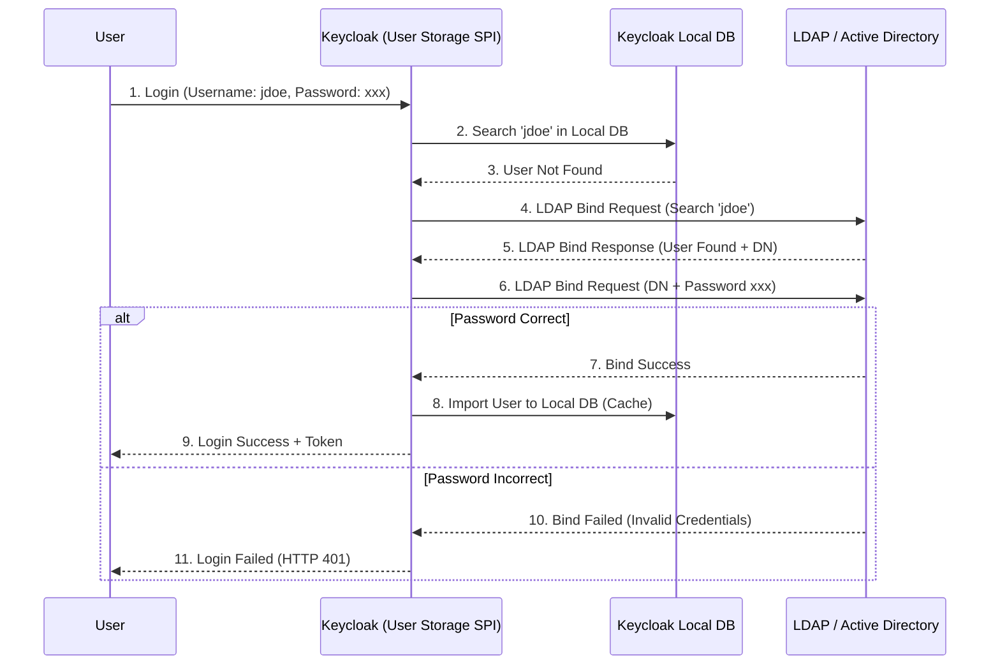

> [!NOTE]
> **Category:** Theory (Lý thuyết)
> **Goal:** Hiểu sâu về kiến trúc User Federation trong Keycloak, cách thức Keycloak tích hợp với LDAP/Active Directory thông qua kiến trúc Storage Provider.

## 1. Lý thuyết chuyên sâu (Detailed Theory)
User Federation là một cơ chế cốt lõi trong Keycloak, cho phép Keycloak kết nối đến một kho dữ liệu người dùng bên ngoài (như LDAP, Microsoft Active Directory) thay vì bắt buộc phải lưu toàn bộ tài khoản bên trong database cục bộ của Keycloak.

**Kiến trúc User Storage Provider (SPI):**
Keycloak không thực sự kết nối trực tiếp "hard-code" vào LDAP. Thay vào đó, nó sử dụng kiến trúc Service Provider Interfaces (SPI). 
Cụ thể là `UserStorageProvider` SPI. Nhờ cơ chế này, khi một Request đăng nhập diễn ra, Keycloak sẽ truy vấn cơ sở dữ liệu nội bộ trước, sau đó nó sẽ gọi tuần tự các User Storage Providers đã được cấu hình để tìm kiếm và xác thực người dùng.

**Lợi ích:**
- Doanh nghiệp không cần phải migrate (di chuyển) hàng ngàn người dùng từ hệ thống AD cũ sang Keycloak.
- Cho phép Single Sign-On (SSO) mượt mà với tài khoản mạng nội bộ (Domain Account).
- Đồng bộ thông tin nhóm (Groups) và vai trò (Roles) tự động.

## 2. Luồng nội bộ & Cơ chế cấp thấp (Internal Workflow & Low-level Mechanisms)



**Giải thích step-by-step:**
1. Người dùng nhập thông tin đăng nhập qua giao diện Keycloak.
2. Keycloak ưu tiên kiểm tra trong cơ sở dữ liệu cục bộ (Local DB).
3. Nếu không tìm thấy, nó sẽ kích hoạt `UserStorageProvider` để chuyển hướng truy vấn đến LDAP.
4. Keycloak sử dụng tài khoản Service Account (Bind DN) để thực hiện kết nối và tìm kiếm thuộc tính chứa username (ví dụ: `sAMAccountName` trong AD).
5. LDAP trả về Distinguished Name (DN) của User (ví dụ: `cn=jdoe,ou=users,dc=example,dc=com`).
6. Cực kỳ quan trọng: Keycloak KHÔNG băm mật khẩu để so sánh. Nó sử dụng chính mật khẩu người dùng cung cấp để thực hiện một LDAP Bind operation bằng DN vừa tìm được.
7. Nếu Bind thành công, LDAP xác nhận mật khẩu đúng.
8. Keycloak sẽ copy (Import) các thông tin cơ bản của user vào Local DB dựa trên chính sách đồng bộ.
9. Keycloak phát hành Access Token và hoàn tất luồng đăng nhập.

## 3. Thực hành tốt nhất & Bảo mật (Best Practices & Security)

> [!WARNING]
> Không bao giờ sử dụng giao thức LDAP không mã hóa (Port 389) qua môi trường mạng không an toàn. Mật khẩu Bind sẽ bị lộ dạng Plain-text.

> [!IMPORTANT]
> Luôn luôn sử dụng LDAPS (LDAP over SSL - Port 636) hoặc STARTTLS để mã hóa đường truyền giữa Keycloak và LDAP Server.

- **Connection Pooling:** Đảm bảo cấu hình Connection Pooling trong giao diện Keycloak để tránh quá tải máy chủ LDAP do Keycloak liên tục mở và đóng kết nối TCP.
- **Read-Only Mode:** Nếu hệ thống Active Directory là "Nguồn chân lý" (Source of Truth), hãy cấu hình Federation ở chế độ `READ_ONLY`. Keycloak sẽ không được phép ghi, đổi mật khẩu hay xóa người dùng trên LDAP, ngăn chặn rủi ro vô tình làm hỏng cấu trúc nhân sự gốc.
- **Failover:** Cấu hình nhiều URL máy chủ LDAP theo dạng cluster (VD: `ldaps://ldap1.example.com ldaps://ldap2.example.com`) để đảm bảo High Availability (HA).

## 4. Cấu hình minh họa thực tế (Configuration Examples)

Ví dụ về cấu hình LDAP Provider cơ bản trên giao diện CLI (kcadm.sh) của Keycloak:

```bash
# Đăng nhập vào kcadm
./kcadm.sh config credentials --server http://localhost:8080 --realm master --user admin --password admin

# Tạo một LDAP User Storage Provider mới
./kcadm.sh create components -r myrealm -s name=my-ldap -s providerId=ldap \
  -s providerType=org.keycloak.storage.UserStorageProvider \
  -s 'config.connectionUrl=["ldaps://ad.example.com:636"]' \
  -s 'config.usersDn=["ou=users,dc=example,dc=com"]' \
  -s 'config.bindDn=["cn=admin,dc=example,dc=com"]' \
  -s 'config.bindCredential=["secret_password"]' \
  -s 'config.vendor=["ad"]' \
  -s 'config.uuidLDAPAttribute=["objectGUID"]' \
  -s 'config.userObjectClasses=["person, organizationalPerson, user"]' \
  -s 'config.editMode=["READ_ONLY"]' \
  -s 'config.syncRegistrations=["false"]'
```

## 5. Trường hợp ngoại lệ (Edge Cases)

- **LDAP Server Timeout / Offline:** Nếu LDAP bị sập, Keycloak sẽ mất kết nối và văng lỗi khi User cố gắng đăng nhập. Nếu tính năng `Import Users` được bật, User đã đăng nhập một lần rồi có thể vẫn đăng nhập được nếu Keycloak giữ mật khẩu cache (Password Hash Synchronization) - tùy thuộc vào cấu hình chính sách Cache.
- **Tài khoản bị khóa trên AD:** Khi User nhập sai mật khẩu quá số lần quy định trên LDAP, AD sẽ khóa tài khoản (`Lockout`). Keycloak sẽ nhận mã lỗi đặc thù từ LDAP (ví dụ: `LDAP error code 49 - data 775`) và hiển thị thông báo "Tài khoản của bạn đã bị vô hiệu hóa".

## 6. Câu hỏi Phỏng vấn (Interview Questions)

**1. (Junior) Tại sao cấu hình `Edit Mode` lại quan trọng khi kết nối LDAP?**
*Đáp án:* Vì nó xác định quyền của Keycloak đối với LDAP. `READ_ONLY` bảo vệ LDAP khỏi mọi sự thay đổi từ Keycloak. `WRITABLE` cho phép Keycloak thêm/sửa/xóa User trực tiếp vào LDAP.

**2. (Junior) LDAPS khác với LDAP như thế nào? Tại sao bắt buộc dùng LDAPS?**
*Đáp án:* LDAP gửi dữ liệu không mã hóa, dễ bị bắt gói tin (Sniffing). LDAPS sử dụng mã hóa TLS/SSL để bảo vệ toàn bộ payload, bao gồm mật khẩu.

**3. (Senior) Cơ chế Keycloak xác thực mật khẩu qua LDAP là gì? Nó có tải mật khẩu về so sánh không?**
*Đáp án:* Keycloak KHÔNG tải mật khẩu băm từ LDAP về để so sánh. Nó sử dụng cơ chế `LDAP Bind`. Keycloak lấy username và password người dùng cung cấp, gửi lệnh `BindRequest` lên LDAP. Nếu LDAP báo `BindResponse Success`, mật khẩu là đúng.

**4. (Senior) Tính năng `Import Users` có lợi ích và tác hại gì?**
*Đáp án:* Lợi ích: Tăng tốc độ truy vấn, hỗ trợ kết nối với các provider khác, giảm tải LDAP. Tác hại: Phải quản lý việc đồng bộ hóa dữ liệu (Sync) giữa Local DB và LDAP, dễ dẫn đến tình trạng sai lệch dữ liệu (Data Inconsistency).

**5. (Senior) Giải thích cấu hình `uuidLDAPAttribute`?**
*Đáp án:* Đó là thuộc tính duy nhất trên LDAP đại diện cho ID người dùng. Trong Active Directory, thuộc tính này là `objectGUID`. Nó giúp Keycloak liên kết chính xác người dùng ngay cả khi họ thay đổi Username hoặc đổi tên (`sAMAccountName` thay đổi).

## 7. Tài liệu tham khảo (References)
- [Keycloak Server Administration Guide - User Storage Federation](https://www.keycloak.org/docs/latest/server_admin/#_user-storage-federation)
- [RFC 4511 - Lightweight Directory Access Protocol (LDAP): The Protocol](https://datatracker.ietf.org/doc/html/rfc4511)
