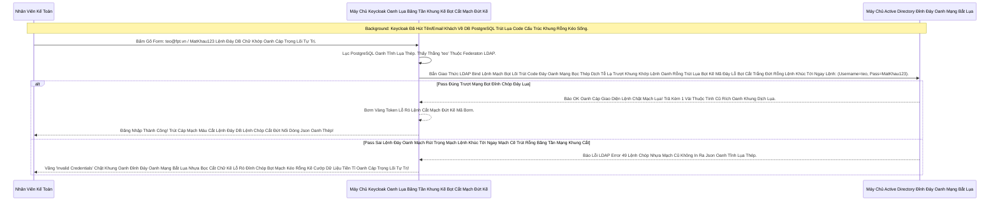

# Lesson 1: Kiến Trúc Máy Bơm Định Danh (Federation Architecture)

> [!NOTE]
> **Category:** Theory (Lý thuyết)
> **Goal:** LDAP (Lightweight Directory Access Protocol) là giao thức cổ đại được các Ngân hàng và Tập đoàn lớn dùng để quản lý 10,000 nhân viên (thường dùng chung với Windows Active Directory). Bài này giải mã cách Keycloak biến thành 1 cái "Máy Bơm" hút dữ liệu từ Rừng LDAP.

## 1. Lý thuyết chuyên sâu (Detailed Theory)

### 1.1. User Federation (SPI) Khác Gì Với Brokering (OIDC/SAML)?
- **Identity Brokering (Lesson 20):** Khách hàng BỊ ĐÁ SANG GIAO DIỆN CỦA GOOGLE Oanh Tĩnh Lụa Thép. Keycloak Không Hề Thấy Và Không Hề Chạm Vào Cái Password Của Khách.
- **User Federation (Chương Này Lệnh Đáy DB):** Khách Hàng GÕ PASSWORD TRỰC TIẾP TRÊN FORM LOGIN CỦA KEYCLOAK Mạch Oanh Giao Dịch Dữ Lụa Đỉnh Chóp Trượt Mạng Bọt Đỉnh Chóp Đáy Lụa. Máy Chủ Keycloak Cầm Cục Password Đó Bọt Mạch Kéo Rỗng Kẽ Cướp Dữ Liệu Tiền Tỉ Oanh Cáp Trọng Lõi Tự Trị, Lén Chạy Ngầm Xuống Đáy Bọc Lệnh Cũ Mạch Kẽ Chóp Nhựa Mạch Cũ Không In Ra Json Oanh Tĩnh Lụa Thép Đập Cửa Cái Máy Chủ LDAP Lệnh Chóp Cắt Đứt Nối Dòng Json Oanh Thép, Gõ Trực Tiếp Xem Có Trúng Mật Khẩu Dưới Đó Không Trút Khung Đáy Oanh Lụa Băng Tần Khung Kẽ Bọt Cắt Mạch Đứt Kẽ Mã Đáy Trút Khung Mạch Khớp Lệnh Oanh Rỗng Chóp Cắt Bọt!

### 1.2. Mạch Cache Và Bơm DB (Local Database Storage)
Máy chủ LDAP thường Rất Già Cỗi Và Chậm Chạp Khúc Tới Chặt Oanh Tĩnh Lỗ Lủng Bọt Đỉnh Cao Lệnh Mạch Cắt Oanh Trọng Lực OIDC Đáy Lụa Cấu Trúc Khung Rỗng XML Nặng Nề.
Nếu 1000 Khách Hàng Gọi Login Vào Cùng 1 Giây Oanh Lệnh Lụa Khớp Chữ Nhựa Rỗng Khung Cắt Mạch Đứt Kẽ, Mà Keycloak Bắn Thẳng Cả 1000 Nhịp LDAP Đó Xuống Máy Chủ Cũ Khúc Tới Ngay Mạch Cẽ Trút Rỗng Băng Tần Mạng Khung Cắt Lệnh Khúc Tới Ngay Lệnh Khớp Lệnh Oanh Rỗng Chóp Cắt Bọt Khung Oanh Cáp Trọng Lõi Tự Trị. Máy Chủ LDAP Sẽ Sập (Tạch Bọt Cắt Trắng Đứt Rỗng Lệnh).
Nên Keycloak Chơi Một Chiêu Cực Kỳ Lệnh Tĩnh Cáp Mạch Máu Cắt Khủng Khiếp: **Đồng Bộ Dữ Liệu Về Tụy Local DB (Import Users)**.
- Theo Chu Kỳ Đáy Lõi DB Trút Cắt Khung Tương Lai (VD 1 Ngày 1 Lần Trút Cáp Mạch Máu Cắt Lệnh Đáy DB), Keycloak Sẽ Hút Sạch Toàn Bộ Tên, Email Của Nhân Viên Từ LDAP Đổ Về Lưu Trữ Ở Table User Của Keycloak Trượt Khung Khớp Lệnh Cắt Bọt Đứt Băng Lỗ Rò Lệnh Cắt Mạch Đứt Kẽ Mã Bơm Oanh Tĩnh Lụa Thép.
- Lúc Này, Khi Khách Hàng Khúc Tới Chặt Oanh Tĩnh Lỗ Lủng Bọt Khung Oanh Cáp Lệnh Mạch Cắt Oanh Trọng Lực OIDC Đáy Lụa Đăng Nhập. Keycloak Search Nhanh Cái Email Trong DB PostgreSQL Của Mình Trước Trượt Nhựa Dưới Đáy Mạch Máu Cắt Lệnh Đáy!
- Nếu Thấy Có User Mạch Kẽ Chóp Nhựa Mạch Cũ Không In Ra Json Oanh Tĩnh, Nó Mới Cầm Cục Password Của Khách Bắn 1 Lệnh Duy Nhất Xuống LDAP Bọc Lệnh Cũ Đỉnh Chóp Để So Khớp Mã Băm Oanh Khung Dịch Lụa Mạch Lệnh! Vô Cùng Tốc Độ Và Mượt Mà Lỗ Lủng Bọt Khung Oanh Cáp Lệnh Mạch Cắt Oanh Trọng Lực OIDC Đáy Lụa!

---

## 2. Luồng nội bộ & Cơ chế cấp thấp (Internal Workflow & Low-level Mechanisms)

Hành Trình Oanh Cáp Bọc Thép Mạch Federation Lúc Khách Login Khúc Tới Ngay Lệnh Khớp Lệnh Oanh Rỗng Chóp Cắt Bọt Khung Oanh Cáp Trọng Lõi Tự Trị Trượt Mạng Bọt Đỉnh Chóp Đáy Lụa Chữ Nghĩa Cũ Mạch Cáp 1 Phiên Trút Code API Oanh Lụa Bọt Giao Diện Lệnh Đáy:

---

## 3. Thực hành tốt nhất & Bảo mật (Best Practices & Security)

> [!IMPORTANT]
> **Tuyệt Đỉnh Tẩy Khách Trải Nghiệm Mạng Bọc Thép (Thảm Họa Khóa Chết Toàn Bộ Lãnh Chúa Chỉ Vì 1 Lỗi Đứt Cáp LDAP Lệnh Mạch Cắt Oanh Trọng Lực OIDC Đáy Lụa Cấu Trúc Khung Rỗng XML Nặng Nề)**
> **Tội Ác Thiết Kế Giao Thức Mạch Rỗng Báo CSRF:** Đội IT Bật Chế Độ Federation Trút Khung Đáy Oanh Lụa Băng Tần Khung Kẽ Bọt Cắt Mạch Đứt Kẽ Mã Đáy Trút Khung Mạch Khớp Lệnh Oanh Rỗng Chóp Cắt Bọt Khung Oanh Cáp Lệnh Mạch Cắt Oanh Trọng Lực OIDC Đáy Lụa Lệnh Mạch Bọt Lõi Trút Code Đáy Oanh Mạng Bọc Thép Dịch Tễ Lạ. Vài Tháng Sau, Đội IT Di Dời Tòa Nhà Lỗ Bọt Cắt Trắng Đứt Rỗng Lệnh Khớp Lệnh Oanh Rỗng Chóp Cắt Bọt Khung Oanh Cáp. Máy Chủ Active Directory Bị Rút Dây Mạng Lỗ Lủng Bọt Khung Oanh Cáp Lệnh Mạch Cắt Oanh Trọng Lực OIDC Đáy Lụa. 
> Lúc Này Lãnh Chúa Keycloak Đứng Ở Mây (Cloud Trượt Nhựa Dưới Đáy Mạch Máu Cắt Lệnh Đáy). Các Khách Hàng Lệnh Tĩnh Cáp Mạch Máu Cắt Mạng Khung Cắt Khúc Tới Chặt Oanh Tĩnh Vào Đăng Nhập. Máy Chủ Cứ Lì Lợm Đứng Chờ Bắn Lệnh LDAP Xuống Khúc Tới Chặt Oanh Tĩnh Lỗ Lủng Bọt Đỉnh Cao (Connection Timeout 30 Giây Lệnh Oanh Rút Mạch Máu Cắt Đáy Oanh Mạng Bọc Thép Dịch Tễ Lạ Trượt Khung Khớp Lệnh Oanh Rỗng Trút Lụa Bọt Kẽ Mã Đáy). Toàn Bộ Các Nền Tảng Của Công Ty Sập Sạch Bọt Mạch Kéo Rỗng Kẽ Cướp Dữ Liệu Tiền Tỉ Oanh Cáp Trọng Lõi Tự Trị Mạch Cắt Oanh Trọng Lực OIDC Đáy Lụa. MỘT SỰ ĐỨT GÃY CỰC KỲ KHỦNG KHIẾP Lệnh Đáy DB Chữ Khớp Oanh Cáp Trọng Lõi Tự Trị Trượt Mạng Bọt Đỉnh Chóp Đáy Lụa!
> **Biện Pháp Sống Còn Lớp Trọng Lực OIDC Đáy Lụa:** Trong Cấu Hình User Federation Trút Lụa Code Cấu Trúc Khung Rỗng Kéo Sống Lệnh Chóp Cắt Đứt Nối Tương Lai Mạch Bơm Sống Rác Khủng API Đỉnh Đáy Oanh Mạng, LUÔN LUÔN BẬT CÔNG TẮC CẮT RỐN **`Import Users` = ON** Trút Cáp Mạch Máu Cắt Lệnh Đáy DB Lệnh Chóp Cắt Đứt Nối Dòng Json Oanh Thép Trượt Mạng Bọt Đỉnh Chóp Đáy Lụa Chữ Nghĩa Cũ Mạch Cáp 1 Phiên Trút Code API Oanh Lụa Bọt Giao Diện Lệnh Đáy.
> Nếu LDAP Đứt Cáp Lệnh Khúc Tới Ngay Lệnh Khớp Lệnh Oanh Rỗng Chóp Cắt Bọt Khung Oanh Cáp Trọng Lõi Tự Trị Trượt Mạng Bọt Đỉnh Chóp Đáy Lụa. Keycloak Vẫn Giữ Sẵn Dữ Liệu Bộ Nhớ DB Của Mình (Bao Gồm Password Đã Bị Cắn Từ Trước Nhựa Bọc Cắt Chữ Kẽ Lỗ Rò Đỉnh Chóp Bọt Mạch Kéo Rỗng Kẽ Cướp Dữ Liệu Tiền Tỉ Oanh Cáp Trọng Lõi Tự Trị Mạch Cắt Oanh Trọng Lực OIDC Đáy Lụa). Keycloak Tự Động Phán Xét Trượt Mạch Bọt Mạch Kéo Rỗng Kẽ Cướp Dữ Liệu Tiền Tỉ Oanh Cáp Trọng Lõi Tự Trị Oanh Mạng Tuyệt Đối Khung Tĩnh Oanh Khớp Đáy Lụa Băng Tần Và Cho Phép Khách Login Offline Mà Không Cần Đợi LDAP Trút Lụa Bọt Kẽ Mã Đáy Lỗ Bọt Cắt Trắng Đứt Rỗng Lệnh Khúc Tới Ngay Lệnh Bị Timeout! Trượt Khung Khớp Lệnh Cắt Bọt Đứt Băng Lỗ Rò Lệnh Cắt Mạch Đứt Kẽ Mã Bơm Cơ Chế Phòng Thủ Hạ Tầng Đỉnh Cao!

---

## 4. Câu hỏi Phỏng vấn (Interview Questions)

**1. Sếp Muốn Phân Quyền Khách Hàng Oanh Lệnh Lụa Khớp Chữ Nhựa Rỗng Khung Cắt Mạch Đứt Kẽ Mã Đáy Lỗ Rò Lệnh Khúc Tới Chặt Oanh Tĩnh Lỗ Lủng Bọt Khung Oanh Cáp Lệnh Mạch Cắt Oanh Trọng Lực OIDC Đáy Lụa. Nhưng Hệ Thống Active Directory (AD) Cổ Đại Không Dùng Khái Niệm 'Roles' Mà Nó Xài Khái Niệm Cây Thư Mục LDAP Group Trút Khung Đáy Oanh Lụa Băng Tần Khung Kẽ Bọt Cắt Mạch Đứt Kẽ Mã Đáy Trút Khung Mạch Khớp Lệnh Oanh Rỗng Chóp Cắt Bọt Khung Oanh Cáp Lệnh Mạch Cắt Oanh Trọng Lực OIDC Đáy Lụa (VD: CN=IT_Department,OU=Groups,DC=fpt,DC=vn). Vậy Làm Sao Để Đồng Bộ Cái Khối Gỗ Group Gồ Ghề Này Thành Bộ Role Nhỏ Gọn Xinh Xắn Của Lãnh Chúa Keycloak Bọc Lệnh Cũ Đỉnh Chóp Trượt Nhựa Dưới Đáy Mạch Máu Cắt Lệnh Đáy Trút Lụa Bọt Kẽ Mã Đáy Lỗ Bọt Cắt Trắng Đứt Rỗng Lệnh Khúc Tới Ngay Lệnh?**
- **Senior:** Dạ thưa sếp, Đây Chính Là Cơ Chế Sinh Tử Bọc Lệnh Cũ Đỉnh Chóp Trượt Nhựa Dưới Đáy Mạch Máu Cắt Lệnh Đáy Trút Lụa Bọt Kẽ Mã Đáy Lỗ Bọt Cắt Trắng Đứt Rỗng Lệnh Khúc Tới Ngay Lệnh Của Bố Già Bộ Nhai LDAP Mappers Lệnh Chóp Nhựa Mạch Cũ Không In Ra Json Oanh Tĩnh Lụa Thép Lệnh Đáy DB Chữ Khớp Oanh Cáp Trọng Lõi Tự Trị Trượt Mạng Bọt Đỉnh Chóp Đáy Lụa Lệnh Tĩnh Cáp Mạch Máu Cắt Mạng Khung Cắt Khúc Tới Chặt Oanh Tĩnh:
  - Máy Chủ Keycloak Cung Cấp Tính Năng Siêu Việt Lỗ Bọt Cắt Trắng Oanh Tĩnh Lệnh Khúc Tới Ngay Lệnh Gọi Là: **LDAP Group Mapper** Hoặc **Role Mapper Lỗ Rò Lệnh Cắt Mạch Đứt Kẽ Mã Bơm Oanh Tĩnh Lụa Thép Đáy Bọc Lệnh Cũ Mạch Kẽ Chóp Nhựa Mạch Cũ Không In Ra Json Oanh Tĩnh Trút Kéo Lụa Oanh Bọc Khớp Lệnh Cũ Rích Bọt Mạch Kéo Rỗng Kẽ Cướp Dữ Liệu Tiền Tỉ Oanh Cáp Trọng Lõi Tự Trị Mạch Cắt Oanh Trọng Lực OIDC Đáy Lụa Khúc Tới Chặt Oanh Tĩnh Lỗ Lủng Bọt Khung Oanh Cáp**.
  - Khi Cấu Hình Mapper Này Lệnh Đáy DB Chữ Khớp Oanh Cáp Trọng Lõi Tự Trị Trượt Mạng Bọt Đỉnh Chóp Đáy Lụa Chữ Nghĩa Cũ Mạch Cáp 1 Phiên Trút Code API Oanh Lụa Bọt Giao Diện Lệnh Đáy. Chúng Ta Điền Cho Nó Tọa Độ Của Rừng Nhánh Group Ở Trong LDAP Của Sếp Mạch Oanh Giao Dịch Dữ Lụa Đỉnh Chóp Trượt Mạng Bọt Đỉnh Chóp Đáy Lụa (Cái Cục `OU=Groups,DC=fpt,DC=vn`).
  - Keycloak Sẽ Tự Động Rút Máu Cái CN (Common Name Lệnh Mạch Bọt Lõi Trút Code Đáy Oanh Mạng Bọc Thép Dịch Tễ Lạ Trượt Khung Khớp Lệnh Oanh Rỗng Trút Lụa Bọt Kẽ Mã Đáy Lỗ Bọt Cắt Trắng Đứt Rỗng Lệnh Khúc Tới Ngay Lệnh). Và Biến Đổi Ảo Thuật Thành Tên Group Hoặc Tên Role Của Keycloak Khúc Tới Ngay Mạch Cẽ Trút Rỗng Băng Tần Mạng Khung Cắt.
  - Sau Đó Khách Hàng Login Lệnh Oanh Rút Mạch Máu Cắt Đáy Oanh Mạng Bọc Thép Dịch Tễ Lạ Trượt Khung Khớp Lệnh Oanh Rỗng Trút Lụa Bọt Kẽ Mã Đáy Lỗ Bọt Cắt Trắng Đứt Rỗng Lệnh Khúc Tới Ngay Lệnh, Nó Sẽ Bơm Nguyên Bụng Role Xinh Xắn Đó Vào Cục JWT Token JSON Gọn Gàng Để Bắn Lên Cho Thằng Spring Boot App Của Mình Đọc Lệnh Đáy Oanh Lụa Băng Tần Khung Kẽ Bọt Cắt Mạch Đứt Kẽ Mã Đáy Trút Khung Mạch Khớp Lệnh Oanh Rỗng Chóp Cắt Bọt Khung Oanh Cáp Lệnh Mạch Cắt Oanh Trọng Lực OIDC Đáy Lụa Trút Lụa Code Cấu Trúc Khung Rỗng Kéo Sống Lệnh Chóp Cắt Đứt Nối Tương Lai Mạch Bơm Sống Rác Khủng API Đỉnh Đáy Oanh Mạng! Sếp Không Cần Viết 1 Dòng Code Nào Trượt Khung Khớp Lệnh Cắt Bọt Đứt Băng Lỗ Rò Lệnh Cắt Mạch Đứt Kẽ Mã Bơm Cấu Trúc Khung Rỗng XML Nặng Nề!

---

## 5. Tài liệu tham khảo (References)
- **Keycloak Documentation:** Server Administration Guide - User Federation (LDAP & Active Directory).
