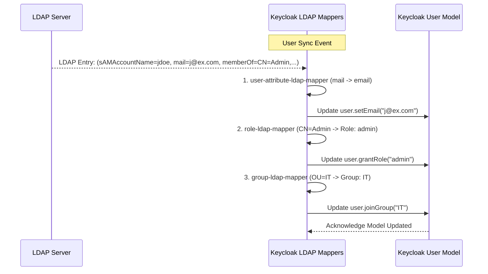

> [!NOTE]
> **Category:** Theory (Lý thuyết)
> **Goal:** Tìm hiểu chi tiết về LDAP Mappers trong Keycloak, cách thức ánh xạ dữ liệu phức tạp từ LDAP Attribute sang Keycloak User Model.

## 1. Lý thuyết chuyên sâu (Detailed Theory)
Khi Keycloak kết nối với LDAP, dữ liệu thô từ LDAP (ví dụ: `givenName`, `sn`, `mail`, `memberOf`) cần được chuyển đổi thành cấu trúc chuẩn mà Keycloak hiểu được (như User Attributes, Roles, Groups). Cơ chế thực hiện việc chuyển đổi này gọi là **LDAP Mappers**.

LDAP Mappers không chỉ là một công cụ copy dữ liệu tĩnh. Nó là một hệ thống Mapper hai chiều (Bi-directional) mạnh mẽ:
- **Từ LDAP sang Keycloak (Import):** Đồng bộ dữ liệu khi user login hoặc khi chạy Background Sync.
- **Từ Keycloak sang LDAP (Export/Update):** Khi `Edit Mode` là Writable, nếu Admin sửa User trên Keycloak, Mapper sẽ cập nhật ngược lại LDAP.

Các loại Mappers phổ biến:
- `user-attribute-ldap-mapper`: Ánh xạ thuộc tính 1-1 (Ví dụ: `mail` -> `email`).
- `role-ldap-mapper`: Ánh xạ LDAP Groups thành Keycloak Roles.
- `group-ldap-mapper`: Ánh xạ cấu trúc cây LDAP (`ou`, `cn`) thành cấu trúc Nhóm phân cấp (Group Hierarchy) trong Keycloak.

## 2. Luồng nội bộ & Cơ chế cấp thấp (Internal Workflow & Low-level Mechanisms)



**Cơ chế cấp thấp:**
1. Keycloak lấy một Entry của người dùng từ LDAP. Entry này chứa một Map các Key-Value.
2. Các Mappers sẽ được thực thi tuần tự theo chuỗi (Chain).
3. `user-attribute-ldap-mapper` quét thuộc tính `mail` và gán nó vào trường `email` nội bộ của Java Object `UserModel`.
4. `role-ldap-mapper` sẽ phân tích thuộc tính `memberOf` (ví dụ trên Active Directory), duyệt qua danh sách các DN của Group và ánh xạ chúng thành các Realm Roles hoặc Client Roles.
5. Sự thay đổi sẽ được Commit vào Local Database của Keycloak (nếu tính năng Import User đang bật).

## 3. Thực hành tốt nhất & Bảo mật (Best Practices & Security)

> [!WARNING]
> Việc cấu hình sai `group-ldap-mapper` trên một thư mục LDAP rất lớn có thể gây cạn kiệt bộ nhớ (OOM) của máy chủ Keycloak do nó cố gắng tải toàn bộ cây thư mục vào RAM.

> [!IMPORTANT]
> Chỉ ánh xạ (Map) những thuộc tính thực sự cần thiết cho nghiệp vụ hoặc Access Token. Đừng map toàn bộ LDAP Entry.

- **Bảo mật Role Mapping:** Tránh tự động ánh xạ vai trò Admin (như `realm-admin`) từ LDAP sang Keycloak. Hãy tạo một nhóm LDAP cụ thể (Ví dụ: `KC_Admins`) và sử dụng Mapper để cấp quyền, đảm bảo kiểm soát truy cập nghiêm ngặt.
- **Sử dụng Hardcoded Role Mapper:** Dùng Mapper này để tự động gán một vai trò mặc định (ví dụ `ldap-user`) cho tất cả người dùng được import từ LDAP, giúp dễ dàng nhận diện nguồn gốc tài khoản trong quản trị.
- **Read-Only Mappers:** Nếu bạn chỉ muốn lấy dữ liệu từ LDAP mà không bao giờ muốn Keycloak ghi đè ngược lại, hãy đảm bảo đặt thuộc tính `Read Only = ON` trong cấu hình của từng Mapper.

## 4. Cấu hình minh họa thực tế (Configuration Examples)

Tạo một `user-attribute-ldap-mapper` ánh xạ chức danh (Title) từ AD vào thuộc tính `job_title` trong Keycloak:

```bash
# Tạo Mapper bằng kcadm.sh
./kcadm.sh create components -r myrealm \
  -s name=title-mapper \
  -s providerId=user-attribute-ldap-mapper \
  -s providerType=org.keycloak.storage.ldap.mappers.LDAPStorageMapper \
  -s parentId=<ID_CỦA_LDAP_PROVIDER> \
  -s 'config.ldap-attribute=["title"]' \
  -s 'config.user-model-attribute=["job_title"]' \
  -s 'config.read-only=["true"]' \
  -s 'config.always-read-value-from-ldap=["true"]'
```

## 5. Trường hợp ngoại lệ (Edge Cases)

- **Thuộc tính đa trị (Multi-valued Attributes):** Trong LDAP, một thuộc tính có thể chứa nhiều giá trị (ví dụ: `telephoneNumber`). Nếu cấu hình `user-model-attribute` của Keycloak không được chuẩn bị để nhận chuỗi (Array/List), nó có thể chỉ lấy giá trị đầu tiên hoặc quăng Exception.
- **Vòng lặp Group (Group Loops):** Nếu cấu trúc LDAP chứa các nhóm lồng nhau chéo (Group A là con của Group B, Group B lại là con của Group A), `group-ldap-mapper` có thể rơi vào vòng lặp vô tận (Infinite Loop) trong các phiên bản Keycloak cũ, làm crash server. Cần cẩn trọng cấu hình chiều sâu tối đa.

## 6. Câu hỏi Phỏng vấn (Interview Questions)

**1. (Junior) Kể tên 3 loại LDAP Mapper phổ biến nhất trong Keycloak?**
*Đáp án:* `user-attribute-ldap-mapper` (thuộc tính), `group-ldap-mapper` (nhóm), và `role-ldap-mapper` (vai trò).

**2. (Junior) Tại sao nên bật `Read Only` trên các Mapper?**
*Đáp án:* Để ngăn Keycloak thay đổi dữ liệu trên LDAP nếu vô tình Admin có quyền sửa user trên giao diện Keycloak, bảo vệ tính nguyên vẹn của nguồn dữ liệu gốc (LDAP).

**3. (Senior) Giải thích tùy chọn `Always Read Value From LDAP`?**
*Đáp án:* Tùy chọn này ép Keycloak phải luôn tra cứu giá trị mới nhất của thuộc tính trực tiếp từ LDAP mỗi khi truy cập `UserModel`, bỏ qua giá trị được lưu trữ cache trong Local DB của Keycloak. Điều này đảm bảo dữ liệu luôn real-time nhưng sẽ làm tăng tải cho LDAP.

**4. (Senior) Làm thế nào để ánh xạ `memberOf` trên AD thành Keycloak Roles một cách hiệu quả?**
*Đáp án:* Sử dụng `role-ldap-mapper`, cấu hình `Mode` là `READ_ONLY`, `User Roles Retrieve Strategy` là `GET_ROLES_FROM_USER_MEMBEROF_ATTRIBUTE`. Cách này hiệu năng tốt nhất trên Active Directory vì nó không phải gửi các truy vấn quét toàn bộ LDAP.

**5. (Senior) Khác biệt giữa `group-ldap-mapper` và `role-ldap-mapper` là gì?**
*Đáp án:* Group Mapper phản ánh cấu trúc phân cấp (Hierarchical Tree) của tổ chức. Role Mapper ánh xạ theo định dạng phẳng (Flat) cấp quyền hành động. Phụ thuộc vào kiến trúc phân quyền của ứng dụng (RBAC dùng Role, Hierarchical Access dùng Group).

## 7. Tài liệu tham khảo (References)
- [Keycloak Server Administration - LDAP Mappers](https://www.keycloak.org/docs/latest/server_admin/#_ldap_mappers)
