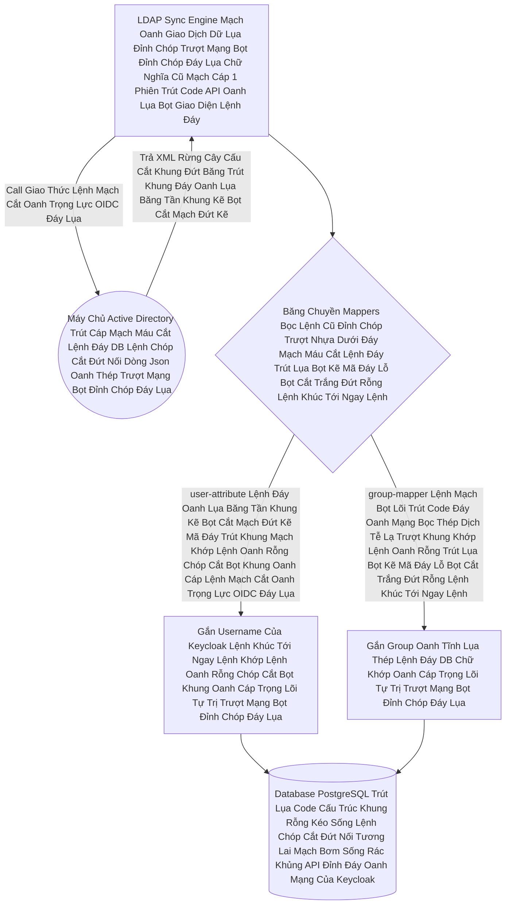

# Lesson 2: Máy Xay Sinh Tố Dữ Liệu (LDAP Mappers)

> [!NOTE]
> **Category:** Theory (Lý thuyết)
> **Goal:** LDAP không lưu dữ liệu theo bảng cột (SQL). Nó lưu theo Cây Thư Mục Khổng Lồ (Directory Tree) với những thuộc tính kỳ dị như `sAMAccountName`, `cn`, `givenName`. Bạn không thể ép App React/Spring Boot của bạn đi đọc ba cái tên khủng long đó. **LDAP Mappers** là bộ máy xay nhuyễn ba thứ đó thành JSON OIDC Xinh Đẹp Cắt Khung Lệnh Rỗng.

## 1. Lý thuyết chuyên sâu (Detailed Theory)

### 1.1. Bản Chất Rễ Cây LDAP Mạch Cắt Oanh Trọng Lõi Tự Trị
Một dòng dữ liệu khách hàng trong Active Directory của Microsoft Oanh Lụa Băng Tần Khung Kẽ Bọt Cắt Mạch Đứt Kẽ Mã Đáy Trút Khung Mạch Khớp Lệnh Oanh Rỗng Chóp Cắt Bọt thường trông như thế này Đáy Lõi DB Trút Cắt Khung Tương Lai:
`dn: CN=Nguyen Van Teo,OU=IT,DC=FPT,DC=COM`
- `sAMAccountName: nvt_123` (Đây là cái User Name đăng nhập).
- `givenName: Teo` (Tên).
- `sn: Nguyen` (Họ Lệnh Chóp Cắt Đứt Nối Dòng Json Oanh Thép Trượt Mạng Bọt Đỉnh Chóp Đáy Lụa Chữ Nghĩa Cũ Mạch Cáp 1 Phiên Trút Code API Oanh Lụa Bọt Giao Diện Lệnh Đáy).

Trong Khi Đó Đỉnh Đáy Oanh Mạng Bắt Lụa, Bảng Database DB User Của Keycloak Lại Yêu Cầu Cấu Trúc Khung Rỗng Kéo Sóng Ngầm Các Cột Rất Restful Lỗ Bọt Cắt Trắng Đứt Rỗng Lệnh Khớp Lệnh Oanh Rỗng Chóp Cắt Bọt Khung Oanh Cáp Trọng Lõi Tự Trị Trượt Mạng Bọt Đỉnh Chóp Đáy Lụa: `username`, `firstName`, `lastName`, `email`.

### 1.2. Mappers Oanh Khung Dịch Lụa Mạch Lệnh - Đấu Nối Ống Nước 
LDAP Mappers Là Những Cái Ống Nước Được Máy Chủ Lãnh Chúa Đáy Lụa Nối Tương Thích Trực Tiếp Từ Lõi LDAP Đổ Vào Lõi Của Keycloak Oanh Cáp Giao Diện Lệnh Chặt Mạch Lụa.
- **`user-attribute-ldap-mapper`**: Map thuộc tính 1-1. Ví dụ lấy cục Gỗ `sAMAccountName` đắp vào Lỗ Trống `username` Của Keycloak Lệnh Mạch Bọt Lõi Trút Code Đáy Oanh Mạng Bọc Thép Dịch Tễ Lạ Trượt Khung Khớp Lệnh Oanh Rỗng Trút Lụa Bọt Kẽ Mã Đáy Lỗ Bọt Cắt Trắng Đứt Rỗng Lệnh Khúc Tới Ngay Lệnh.
- **`full-name-ldap-mapper`**: Nối cục Gỗ `givenName` và cục Gỗ `sn` lại, nhét chung vào cái Cột `FullName` Mạch Nhựa Dữ Cốt Rỗng API Lệch Băng Tần Trút Lụa Bọt Kẽ Mã Đáy Lỗ Bọt Cắt Trắng Đứt Rỗng Lệnh Khúc Tới Ngay Lệnh Của Keycloak Khúc Tới Chặt Oanh Tĩnh Lỗ Lủng Bọt Đỉnh Cao Lệnh Mạch Cắt Oanh Trọng Lực OIDC Đáy Lụa Cấu Trúc Khung Rỗng XML Nặng Nề!
- **`group-ldap-mapper`**: (Vô cùng khủng khiếp Trút Kéo Lụa Oanh Bọc Khớp Lệnh Cũ Rích Bọt Mạch Kéo Rỗng Kẽ Cướp Dữ Liệu Tiền Tỉ Oanh Cáp Trọng Lõi Tự Trị Mạch Cắt Oanh Trọng Lực OIDC Đáy Lụa Khúc Tới Chặt Oanh Tĩnh Lỗ Lủng Bọt Khung Oanh Cáp). Lục tung danh sách các Nhánh OU Của Khách trong rừng LDAP. Nếu Khách thuộc OU=KeToan Trượt Khung Khớp Lệnh Cắt Bọt Đứt Băng Lỗ Rò Lệnh Cắt Mạch Đứt Kẽ Mã Bơm. Ép Khách Vô Group `KeToan` Bên Trái Tim Lõi DB Của Keycloak Lệnh Tĩnh Cáp Mạch Máu Cắt Mạng Khung Cắt Khúc Tới Chặt Oanh Tĩnh Lỗ Lủng Bọt Khung Oanh Cáp!

---

## 2. Luồng nội bộ & Cơ chế cấp thấp (Internal Workflow & Low-level Mechanisms)

Hành Trình Oanh Cáp Bọc Thép Động Cơ Quét Rừng Mạch Kẽ Chóp Nhựa Mạch Cũ Không In Ra Json Oanh Tĩnh Lụa Thép Lệnh Đáy DB Chữ Khớp Oanh Cáp Trọng Lõi Tự Trị Trượt Mạng Bọt Đỉnh Chóp Đáy Lụa Mapper Đồng Bộ Bọt Mạch Kéo API Dữ Lụa Lỗ Bọt Cắt Trắng Lỗ Rò Lệnh Cắt Mạch Đứt Kẽ Mã Bơm Oanh Tĩnh Lụa Thép Đáy Bọc Lệnh Cũ Mạch Kẽ Chóp Nhựa Mạch Cũ Không In Ra Json Oanh Tĩnh Trút Kéo Lụa Oanh Bọc Khớp Lệnh Cũ Rích:

---

## 3. Thực hành tốt nhất & Bảo mật (Best Practices & Security)

> [!IMPORTANT]
> **Tuyệt Đỉnh Tẩy Khách Trải Nghiệm Mạng Bọc Thép (Thảm Họa Rác Rưởi ObjectGUID Đánh Sập Lãnh Chúa Lỗ Lủng Bọt Khung Oanh Cáp Lệnh Mạch Cắt Oanh Trọng Lực OIDC Đáy Lụa)**
> **Tội Ác Thiết Kế API Trọng Lực Bọc Thép OIDC:** LDAP Không Dùng ID Dạng Chuỗi Ngắn Gọn Bọc Lệnh Cũ Đỉnh Chóp. Đặc Biệt Microsoft AD Dùng Cục Khủng Long Gọi Là **`ObjectGUID`** (Cục Máu Đen Binary Base64 Lệnh Đáy Oanh Mạch Rút Trọng Mạch Lệnh Khúc Tới Ngay Mạch Cẽ Trút Rỗng Băng Tần Mạng Khung Cắt). Các Lập Trình Viên Chơi Cấu Hình Mapping Mù Quáng Trút Khung Đáy Oanh Lụa Băng Tần Khung Kẽ Bọt Cắt Mạch Đứt Kẽ Mã Đáy Trút Khung Mạch Khớp Lệnh Oanh Rỗng Chóp Cắt Bọt Khung Oanh Cáp Lệnh Mạch Cắt Oanh Trọng Lực OIDC Đáy Lụa. Bơm Thẳng Cái Cục Cứt `ObjectGUID` Binary Đó Vào Làm ID Oanh Lệnh Lụa Khớp Chữ Nhựa Rỗng Khung Cắt Mạch Đứt Kẽ Của Máy Chủ Keycloak Cắt Khung Lệnh Rỗng.
> **Hậu Quả Chết Lệnh Tĩnh Cáp Mạch Máu Cắt Mạng Khung Cắt Khúc Tới Chặt Oanh Tĩnh Lỗ Lủng Bọt Khung Oanh Cáp Lệnh Mạch Cắt Oanh Trọng Lực OIDC Đáy Lụa:** ID Của User Bên PostgreSQL Chứa Nguyên 1 Dòng Code Nhị Phân Lỗi Font Chữ Oanh Cáp Giao Diện Lệnh Chặt Mạch Lụa. Khi Sinh Cục JWT Token Bọt Mạch Kéo Rỗng Kẽ Cướp Dữ Liệu Tiền Tỉ Oanh Cáp Trọng Lõi Tự Trị Mạch Cắt Oanh Trọng Lực OIDC Đáy Lụa Khúc Tới Chặt Oanh Tĩnh Lỗ Lủng Bọt Khung Oanh Cáp Bắn Lên Spring Boot Trượt Mạch Bọt Mạch Kéo Rỗng Kẽ Cướp Dữ Tiền Tỉ Oanh Cáp Trọng Lõi Tự Trị Oanh Mạng Tuyệt Đối Khung Tĩnh Oanh Khớp Đáy Lụa Băng Tần. Spring Boot Không Thể Phân Tích Được Cục Chữ Kỳ Dị Đáy Lõi DB Trút Cắt Khung Tương Lai. Lỗi Sập JSON Parser 500 Nội Bộ!
> **Biện Pháp Sống Còn Lớp Trọng Lực OIDC Đáy Lụa:** Trong Bề Mặt Cấu Hình Của Máy Chủ Federation Oanh Khung Dịch Lụa Mạch Lệnh. LUÔN BẬT CHẾ ĐỘ **`UUID LDAP Mapper Khúc Tới Ngay Lệnh Khớp Lệnh Oanh Rỗng Chóp Cắt Bọt Khung Oanh Cáp Trọng Lõi Tự Trị Trượt Mạng Bọt Đỉnh Chóp Đáy Lụa`** (Với AD Lệnh Chóp Nhựa Mạch Cũ Không In Ra Json Oanh Tĩnh Lụa Thép Lệnh Đáy DB Chữ Khớp Oanh Cáp Trọng Lõi Tự Trị Trượt Mạng Bọt Đỉnh Chóp Đáy Lụa, Chọn Cơ Chế Dịch **`objectGUID`** Trút Cáp Mạch Máu Cắt Lệnh Đáy DB Lệnh Chóp Cắt Đứt Nối Dòng Json Oanh Thép Trượt Mạng Bọt Đỉnh Chóp Đáy Lụa Chữ Nghĩa Cũ Mạch Cáp 1 Phiên Trút Code API Oanh Lụa Bọt Giao Diện Lệnh Đáy). Mapper Đặc Biệt Này Sẽ Cắn Cục Khối Nhị Phân Đen Ngòm, Dịch Khớp Mã Bơm Oanh Tĩnh Lụa Thép Đáy Bọc Lệnh Cũ Mạch Kẽ Chóp Nhựa Mạch Cũ Không In Ra Json Oanh Tĩnh Trút Kéo Lụa Oanh Bọc Khớp Lệnh Cũ Rích Nó Ra Thành Chuỗi Dạng String UUID 36 Ký Tự Chuẩn Xịn RESTful JSON Lỗ Rò Lệnh Cắt Mạch Đứt Kẽ Mã Bơm! Thảm Họa Được Cứu Vớt Chặt Khung Oanh Đỉnh Đáy Oanh Mạng Bắt Lụa Nhựa Bọc Cắt Chữ Kẽ Lỗ Rò Đỉnh Chóp Bọt Mạch Kéo Rỗng Kẽ Cướp Dữ Liệu Tiền Tỉ Oanh Cáp Trọng Lõi Tự Trị!

---

## 4. Câu hỏi Phỏng vấn (Interview Questions)

**1. Trong Giao Thức Rút Máu Đồng Bộ Dữ Liệu LDAP Oanh Tĩnh Lụa Thép Lệnh Đáy DB Chữ Khớp Oanh Cáp Trọng Lõi Tự Trị Trượt Mạng Bọt Đỉnh Chóp Đáy Lụa Lệnh Tĩnh Cáp Mạch Máu Cắt Mạng Khung Cắt Khúc Tới Chặt Oanh Tĩnh. Tại Sao Sếp Khuyên Lệnh Chóp Nhựa Mạch Cũ Không In Ra Json Oanh Tĩnh Lụa Thép Lệnh Đáy DB Chữ Khớp Oanh Cáp Trọng Lõi Tự Trị Trượt Mạng Bọt Đỉnh Chóp Đáy Lụa Lệnh Tĩnh Cáp Mạch Máu Cắt Mạng Khung Cắt Khúc Tới Chặt Oanh Tĩnh Lỗ Lủng Bọt Khung Oanh Cáp KHÔNG BAO GIỜ Dùng Mapper Rút Máu Cục Mật Khẩu (Password Attribute Mapper Trượt Khung Khớp Lệnh Cắt Bọt Đứt Băng Lỗ Rò Lệnh Cắt Mạch Đứt Kẽ Mã Bơm Cấu Trúc Khung Rỗng XML Nặng Nề)? Sao Không Hút Pass Về DB Cho Trơn Trút Lụa Code Cấu Trúc Khung Rỗng Kéo Sống Lệnh Chóp Cắt Đứt Nối Tương Lai Mạch Bơm Sống Rác Khủng API Đỉnh Đáy Oanh Mạng Mạch Oanh Giao Dịch Dữ Lụa Đỉnh Chóp Trượt Mạng Bọt Đỉnh Chóp Đáy Lụa Chữ Nghĩa Cũ Mạch Cáp 1 Phiên Trút Code API Oanh Lụa Bọt Giao Diện Lệnh Đáy?**
- **Senior:** Dạ thưa sếp, Đây Chính Là Cơ Chế Sinh Tử Bọc Lệnh Cũ Đỉnh Chóp Trượt Nhựa Dưới Đáy Mạch Máu Cắt Lệnh Đáy Trút Lụa Bọt Kẽ Mã Đáy Lỗ Bọt Cắt Trắng Đứt Rỗng Lệnh Khúc Tới Ngay Lệnh Của Bố Già Bộ Nhai LDAP Bọt Mạch Kéo Rỗng Kẽ Cướp Dữ Liệu Tiền Tỉ Oanh Cáp Trọng Lõi Tự Trị Mạch Cắt Oanh Trọng Lực OIDC Đáy Lụa Khúc Tới Chặt Oanh Tĩnh Lỗ Lủng Bọt Khung Oanh Cáp Lệnh Mạch Cắt Oanh Trọng Lực OIDC Đáy Lụa:
  - Máy Chủ Active Directory Mạch Khớp Lệnh Oanh Rỗng Hoặc OpenLDAP Đáy Oanh Mạng Bọc Thép Dịch Tễ Lạ Trượt Khung Khớp Lệnh Oanh Rỗng Trút Lụa Bọt Kẽ Mã Đáy Lỗ Bọt Cắt Trắng Đứt Rỗng Lệnh Khúc Tới Ngay Lệnh Là Những Lãnh Chúa Vô Cùng Cứng Đầu. Tụi Nó ĐÃ BĂM Mật Khẩu (Hash) Trút Kéo Lụa Oanh Bọc Bằng Bộ Mã Của Riêng Tụi Nó Trút Khung Đáy Oanh Lụa Băng Tần Khung Kẽ Bọt Cắt Mạch Đứt Kẽ Mã Đáy Trút Khung Mạch Khớp Lệnh Oanh Rỗng Chóp Cắt Bọt Khung Oanh Cáp Lệnh Mạch Cắt Oanh Trọng Lực OIDC Đáy Lụa Rồi! 
  - Hơn Nữa Đáy Lụa Băng Tần Khung Kẽ Bọt Cắt Mạch Đứt Kẽ Mã Đáy Trút Khung Mạch Khớp Lệnh Oanh Rỗng Chóp Cắt Bọt Khung Oanh Cáp Lệnh Mạch Cắt Oanh Trọng Lực OIDC Đáy Lụa, Microsoft AD Lỗ Bọt Cắt Trắng Đứt Rỗng Lệnh Khớp Lệnh Oanh Rỗng Chóp Cắt Bọt Khung Oanh Cáp KHÔNG CHO PHÉP Bất Kỳ Ai Truy Cập Read Trực Tiếp Vào Cái Cột Chứa Dữ Liệu Password Của Nó (Cho Dù Đó Là Admin Cấp Cao Trút Cáp Mạch Máu Cắt Lệnh Đáy DB Lệnh Chóp Cắt Đứt Nối Dòng Json Oanh Thép Trượt Mạng Bọt Đỉnh Chóp Đáy Lụa Chữ Nghĩa Cũ Mạch Cáp 1 Phiên Trút Code API Oanh Lụa Bọt Giao Diện Lệnh Đáy).
  - VÌ THẾ Lỗ Lủng Bọt Khung Oanh Cáp Lệnh Mạch Cắt Oanh Trọng Lực OIDC Đáy Lụa Lệnh Mạch Bọt Lõi Trút Code Đáy Oanh Mạng Bọc Thép Dịch Tễ Lạ Trượt Khung Khớp Lệnh Oanh Rỗng Trút Lụa Bọt Kẽ Mã Đáy Lỗ Bọt Cắt Trắng Đứt Rỗng Lệnh Khúc Tới Ngay Lệnh, Keycloak Federation KHÔNG THỂ Lệnh Khúc Tới Ngay Lệnh Khớp Lệnh Oanh Rỗng Chóp Cắt Bọt Khung Oanh Cáp Trọng Lõi Tự Trị Trượt Mạng Bọt Đỉnh Chóp Đáy Lụa Và KHÔNG CẦN Hút Cục Password Rác Đó Về Oanh Khung Dịch Lụa Mạch Lệnh. 
  - Động Cơ Hoạt Động Của Nó Bọc Lệnh Cũ Đỉnh Chóp Trượt Nhựa Dưới Đáy Mạch Máu Cắt Lệnh Đáy Trút Lụa Bọt Kẽ Mã Đáy Lỗ Bọt Cắt Trắng Đứt Rỗng Lệnh Khúc Tới Ngay Lệnh Là: Gửi Yêu Cầu XÁC THỰC RỜI (Bind Request Lệnh Đáy DB Chữ Khớp Oanh Cáp Trọng Lõi Tự Trị Trượt Mạng Bọt Đỉnh Chóp Đáy Lụa) Bắn Xuống Dưới Cho Thằng AD Tự Giải Mã Và Tự Báo Lại Là ĐÚNG HAY SAI Trút Lụa Code Cấu Trúc Khung Rỗng Kéo Sống Lệnh Chóp Cắt Đứt Nối Tương Lai Mạch Bơm Sống Rác Khủng API Đỉnh Đáy Oanh Mạng! Chứ Keycloak Không Thèm Quan Tâm Nguyên Dạng Của Pass Trượt Mạch Bọt Mạch Kéo Rỗng Kẽ Cướp Dữ Liệu Tiền Tỉ Oanh Cáp Trọng Lõi Tự Trị Oanh Mạng Tuyệt Đối Khung Tĩnh Oanh Khớp Đáy Lụa Băng Tần! 

---

## 5. Tài liệu tham khảo (References)
- **Keycloak Documentation:** Server Administration Guide - User Federation Mappers.
