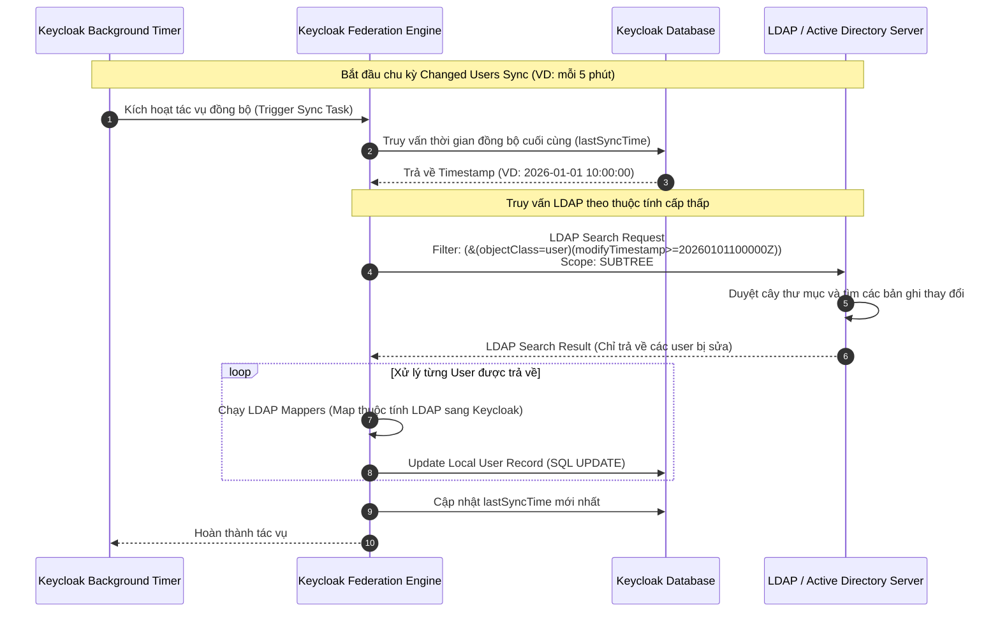

> [!NOTE]
> **Category:** Theory (Lý thuyết)
> **Goal:** Hiểu rõ các chế độ kết nối (Edit Modes) và chiến lược đồng bộ hóa (Sync Strategies) giữa Keycloak (Relational Database) và máy chủ LDAP/Active Directory (Hierarchical Database) để thiết kế luồng dữ liệu an toàn và tối ưu hiệu suất.

## 1. Lý thuyết chuyên sâu (Detailed Theory)

Khi cấu hình User Federation (Liên kết người dùng) với LDAP hoặc Microsoft Active Directory (AD), Keycloak đóng vai trò như một bộ đệm (cache) trung gian. Do kiến trúc dữ liệu của Keycloak là cơ sở dữ liệu quan hệ (PostgreSQL, MySQL), trong khi LDAP là cơ sở dữ liệu phân cấp dạng cây (Hierarchical Database), cần phải có các cơ chế (Strategies) để đảm bảo tính nhất quán dữ liệu giữa hai hệ thống này.

**Chế độ Chỉnh sửa (Edit Modes):**
Xác định luồng đi của dữ liệu khi có thay đổi (tạo, cập nhật, xóa user) xuất phát từ phía Keycloak.
- **READ_ONLY:** Keycloak có quyền đọc dữ liệu từ LDAP, nhưng mọi nỗ lực thay đổi thông tin người dùng (như đổi mật khẩu, sửa tên) từ giao diện Keycloak sẽ bị chặn (từ chối). Dữ liệu LDAP là nguồn chân lý duy nhất (Single Source of Truth).
- **WRITABLE:** Đồng bộ hai chiều (Two-way). Mọi thay đổi thực hiện trên người dùng của Keycloak sẽ được chuyển hóa thành lệnh gập (LDAP modify/add) và ghi đè trực tiếp xuống LDAP server trong thời gian thực.
- **UNSYNCED:** Người dùng được import vào cơ sở dữ liệu Keycloak, nhưng các thay đổi sau đó trên Keycloak sẽ không được cập nhật ngược lại LDAP.

**Chiến lược Đồng bộ (Sync Strategies):**
Xác định cách thức Keycloak tải dữ liệu từ LDAP vào database cục bộ của nó.
- **Full Sync (Đồng bộ toàn phần):** Quét toàn bộ cây LDAP (hoặc trong phạm vi User DN) và cập nhật thông tin cho hàng chục ngàn người dùng vào database Keycloak. Cực kỳ tốn kém về I/O và CPU.
- **Changed Users Sync (Đồng bộ người dùng thay đổi):** Chỉ truy vấn những bản ghi LDAP nào có phát sinh thay đổi (tạo mới, sửa đổi) kể từ lần đồng bộ cuối cùng. Cách này siêu nhẹ và tiết kiệm băng thông.

## 2. Luồng nội bộ & Cơ chế cấp thấp (Internal Workflow & Low-level Mechanisms)

Dưới đây là cơ chế cấp thấp trình bày luồng thực thi của **Changed Users Sync** định kỳ (Periodic Sync) hoạt động trong nền (Background Task).

**Giải thích chi tiết các bước cấp thấp:**
1. **Trigger:** Một Scheduled Task trong hệ thống JBoss/Quarkus (Keycloak) sẽ chạy định kỳ theo thời gian đã cấu hình.
2. **Filter Query:** Keycloak xây dựng một chuỗi truy vấn LDAP (LDAP Filter). Nó dựa vào chuẩn LDAP RFC 4511, sử dụng thuộc tính hệ thống `modifyTimestamp` (trên OpenLDAP) hoặc `uSNChanged` (trên Active Directory) để chỉ lọc ra các tài khoản bị chỉnh sửa sau mốc `lastSyncTime`.
3. **Mappers:** Khi nhận dữ liệu JSON/Binary từ LDAP, Keycloak không đưa thẳng vào DB. Nó chạy qua hệ thống Mappers (ví dụ: chuyển `sAMAccountName` của AD thành `username` của Keycloak, chuyển `mail` thành `email`).
4. **Cập nhật Database:** Keycloak sử dụng JPA (Hibernate) để thực thi các câu lệnh `UPDATE` hoặc `INSERT` vào bảng `USER_ENTITY` trong database nội bộ.

## 3. Thực hành tốt nhất & Bảo mật (Best Practices & Security)

> [!CAUTION]
> Tuyệt đối KHÔNG cấu hình **Periodic Full Sync** chạy với tần suất cao (ví dụ: mỗi 5 hoặc 15 phút). Nếu tổ chức của bạn có trên 10,000 nhân viên, một lần Full Sync sẽ tạo ra tải (Load) khủng khiếp lên CPU của máy chủ AD/LDAP và gây ra tình trạng khóa hàng loạt (Lock/Deadlock) trong Database Keycloak, dẫn đến tê liệt toàn bộ hệ thống đăng nhập (SSO Outage).

> [!IMPORTANT]
> - **Sử dụng Pagination (Phân trang):** Hầu hết các máy chủ Active Directory mặc định có chính sách `MaxPageSize` (thường là 1000 bản ghi). Nếu thư mục của bạn có hơn 1000 người dùng mà Keycloak không bật Pagination, tiến trình Sync sẽ bị lỗi (Error Code 4: Size Limit Exceeded) và không thể đồng bộ đầy đủ. Hãy luôn BẬT tính năng **Pagination** trong cấu hình LDAP của Keycloak.
> - **Đồng bộ hóa thay đổi liên tục:** Sử dụng **Periodic Changed Users Sync** chạy mỗi 5-10 phút để hệ thống cập nhật nhanh chóng các trạng thái khóa tài khoản hoặc vô hiệu hóa từ AD (Disabled accounts).
> - **Chế độ READ_ONLY:** Khuyến nghị dùng READ_ONLY trừ khi tổ chức của bạn đặc biệt muốn dùng Keycloak làm công cụ quản lý nhân sự (HR). Việc sửa đổi dữ liệu ngược xuống AD tiềm ẩn rủi ro hỏng cấu trúc cây LDAP nếu không cấu hình Mapper chính xác.

## 4. Cấu hình minh họa thực tế (Configuration Examples)

Cấu hình mẫu tối ưu hóa cho hệ thống Enterprise sử dụng Microsoft Active Directory:

1. **Truy cập:** Keycloak Admin Console > User Federation > Add Ldap.
2. **Edit Mode:** Chọn `READ_ONLY`.
3. **Sync Settings:**
   - **Import Users:** `ON` (Để Keycloak lưu cache dữ liệu user).
   - **Sync Registrations:** `OFF` (Không cho phép user tự đăng ký tài khoản đẩy thẳng xuống AD).
   - **Batch Size for Sync:** `1000` (Quản lý RAM tốt hơn trong tiến trình quét).
   - **Periodic Full Sync:** `ON` (Kích hoạt).
   - **Full Sync Periods:** `604800` (Đồng bộ toàn phần 1 tuần / 1 lần, vào lúc nửa đêm cuối tuần).
   - **Periodic Changed Users Sync:** `ON` (Kích hoạt).
   - **Changed Users Sync Periods:** `300` (Chạy đồng bộ các thay đổi mỗi 5 phút).
4. **LDAP Searching:**
   - **Pagination:** `ON`.

## 5. Trường hợp ngoại lệ (Edge Cases)

- **Độ lệch đồng hồ (Clock Skew):** Nếu máy chủ Keycloak và máy chủ LDAP có lệch múi giờ hoặc lệch giây (ví dụ: server AD nhanh hơn server Keycloak 5 giây), tính năng "Changed Users Sync" dựa trên Timestamp sẽ bỏ sót (miss) các tài khoản vừa được sửa đổi trong khoảng thời gian chênh lệch đó. *Khắc phục:* Bắt buộc thiết lập đồng bộ thời gian NTP (Network Time Protocol) khắt khe giữa tất cả các Node.
- **Xóa người dùng trên AD (Hard Delete):** LDAP thường không lưu trữ bản ghi trạng thái xóa (tombstone records) cho thuộc tính `modifyTimestamp`. Do đó, "Changed Users Sync" SẼ KHÔNG phát hiện ra người dùng đã bị xóa hoàn toàn khỏi AD. *Khắc phục:* Keycloak có cơ chế `Sync deleted users` (nếu LDAP có hỗ trợ tombstone) hoặc user đó sẽ bị chặn ngay ở lần đăng nhập tiếp theo do liên kết thông tin gốc thất bại. Khi chạy Full Sync hàng tuần, Keycloak sẽ rà soát và xóa/vô hiệu hóa các tài khoản không còn tồn tại trên LDAP.
- **Network Partition (Đứt mạng giữa chừng):** Trong quá trình Full Sync kéo dài 10 phút, nếu mạng đứt ở phút thứ 5, Keycloak sẽ rollback giao dịch đối với lô (batch) hiện tại hoặc cảnh báo lỗi. Cấu hình hệ thống có thể bị tình trạng "inconsistent" (người đồng bộ rồi, người chưa).

## 6. Câu hỏi Phỏng vấn (Interview Questions)

1. **(Junior)** Chế độ Edit Mode `WRITABLE` trong LDAP Federation có nghĩa là gì?
   - *Đáp án:* Có nghĩa là Keycloak được phép ghi đè/chỉnh sửa dữ liệu trực tiếp (ví dụ đổi mật khẩu, đổi tên) xuống máy chủ LDAP thay vì chỉ đọc. Yêu cầu tài khoản Bind (Service Account) của Keycloak phải có quyền Modify trên LDAP.
2. **(Junior)** Tại sao cần đồng bộ người dùng từ LDAP vào Keycloak (Import Users = ON) thay vì để Keycloak gọi LDAP mỗi lần có request?
   - *Đáp án:* Việc Import giúp Keycloak cache dữ liệu cục bộ vào database tĩnh. Nó giúp tăng tốc độ đáng kể trong các luồng cấp phát token (không phải gọi I/O mạng liên tục), và cho phép Keycloak bổ sung thêm các thuộc tính mở rộng (Roles, Groups nội bộ Keycloak) gắn liền với User ID đó.
3. **(Senior)** Nếu bạn bật "Changed Users Sync" định kỳ 5 phút, nhưng một Admin sửa thông tin user trên AD, và sau 1 phút user đó đăng nhập vào Keycloak. Keycloak sẽ lấy thông tin cũ hay mới?
   - *Đáp án:* Keycloak lấy thông tin **mới**. Mặc dù chu kỳ Sync chưa tới (cần 4 phút nữa), nhưng khi user chủ động thực hiện hành vi đăng nhập (Authentication event), Keycloak luôn móc trực tiếp sang LDAP để xác thực credential và tiện thể cập nhật (On-demand Sync) bản ghi của user đó ngay thời điểm đăng nhập.
4. **(Senior)** Tại sao tính năng Pagination lại bắt buộc trong hệ thống Active Directory lớn?
   - *Đáp án:* Cấu hình mặc định của AD (MaxPageSize) chặn các truy vấn trả về nhiều hơn 1000 bản ghi nhằm chống tấn công DoS. Nếu không bật Pagination từ client (Keycloak), Keycloak sẽ bị ngắt kết nối và báo lỗi "Size Limit Exceeded" khi cố quét toàn bộ cây AD.
5. **(Senior)** Cơ chế nào ở cấp thấp mà Keycloak dùng để biết bản ghi nào bị thay đổi để thực hiện "Changed Users Sync"?
   - *Đáp án:* Keycloak sử dụng các thuộc tính meta-data do LDAP server sinh ra tự động. Với OpenLDAP, đó là `modifyTimestamp`. Với Active Directory, hệ thống ưu tiên sử dụng `uSNChanged` (Update Sequence Number) – một chỉ số tịnh tiến cực kỳ chính xác.

## 7. Tài liệu tham khảo (References)
- [Keycloak Server Administration Guide: LDAP and Active Directory](https://www.keycloak.org/docs/latest/server_admin/#_ldap)
- [RFC 4511: Lightweight Directory Access Protocol (LDAP) - Search Operation](https://datatracker.ietf.org/doc/html/rfc4511#section-4.5)
- [Microsoft Active Directory - MaxPageSize Configuration](https://docs.microsoft.com/en-us/troubleshoot/windows-server/identity/how-to-configure-active-directory-diagnostic-event-logging)
