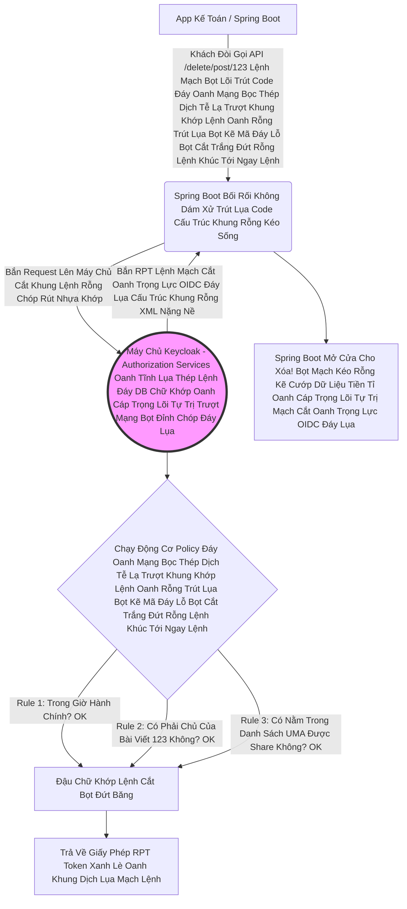

# Lesson 1: Sự Mở Hóa Các Trường Phái (RBAC vs ABAC vs UMA)

> [!NOTE]
> **Category:** Theory (Lý thuyết)
> **Goal:** Lập trình viên thường chỉ biết Role (RBAC). Nhưng khi Business Analyst đòi hỏi "Nhân viên chỉ được sửa hóa đơn của chính mình, và chỉ được làm trong giờ hành chính", RBAC hoàn toàn sụp đổ. Bài này sẽ khai mở nhãn quan của bạn về các tầng bậc phân quyền trong Enterprise.

## 1. Lý thuyết chuyên sâu (Detailed Theory)

### 1.1. Tầng 1: RBAC (Role-Based Access Control) - Thô Sơ
- **Khái niệm:** Quyền được cấp phát dựa trên **Vai Trò (Role)**.
- **Ví dụ:** Mày có Role `admin` -> Mày được ấn nút Xóa. Mày có Role `user` -> Mày chỉ được ấn nút Xem.
- **Cách Backend hoạt động:** Spring Boot của bạn cài `@RolesAllowed("admin")` ở trên đỉnh API `/delete`.
- **Nhược điểm (Thảm Họa):** Sếp nói: *"Thằng Tèo là Role `user`. Nhưng tao muốn cho phép thằng Tèo được ấn nút Xóa cái Bài Đăng số #123 của nó, còn Bài Đăng #124 của người khác thì cấm"*. Bùm! Bạn Không Thể Viết `@RolesAllowed("user_but_only_for_post_123")` Được! RBAC Hoàn Toàn Bất Lực Chặt Khung Oanh Đỉnh Đáy Oanh Mạng Bắt Lụa Nhựa Bọc Cắt Chữ Kẽ Lỗ Rò Đỉnh Chóp!

### 1.2. Tầng 2: ABAC (Attribute-Based Access Control) - Động Cơ Tên Lửa
- **Khái niệm:** Đánh giá quyền dựa trên Hàng Loạt Các **Thuộc Tính (Attributes)**.
- Thuộc tính gồm: Thông tin khách hàng (Tuổi, IP, Vai Trò), Thông tin Môi Trường (Thời gian, Ngày tháng), Thông tin Tài Nguyên (Người tạo ra tài nguyên đó là ai).
- **Ví dụ:** Lệnh chém: *"Được phép XÓA, NẾU Role=user VÀ User.ID == Post.OwnerID VÀ Time < 17h00"*.
- **Cách Keycloak hoạt động:** Keycloak cung cấp hệ thống viết Rule bằng JavaScript (JS Policy), Time Policy. Bạn đẩy hết các quy tắc lằng nhằng đó lên Form Của Keycloak. Backend Spring Boot Hoàn Toàn Trắng Trẻo Không Cần If-Else Dơ Bẩn!

### 1.3. Tầng 3: UMA (User-Managed Access) - Đỉnh Cao Tự Trị
- **Khái niệm:** Bản quyền truy cập do **Chính Khách Hàng Quyết Định**, Không Phải Do Admin.
- **Ví dụ:** Bạn tải ảnh lên Google Drive (Bạn là Chủ Tài Nguyên). Bạn bấm nút Share, gõ Email thằng bạn vào. Thằng bạn lập tức có quyền Đọc ảnh đó.
- **Cách Keycloak hoạt động:** Keycloak tuân thủ 100% chuẩn UMA 2.0. Nó cung cấp các Giao Diện Gầm (API) để Khách Hàng Gọi Lệnh Cấp Quyền Cho Người Khác Trực Tiếp Bọt Mạch Kéo Rỗng Kẽ Cướp Dữ Liệu Tiền Tỉ Oanh Cáp Trọng Lõi Tự Trị Mạch Cắt Oanh Trọng Lực OIDC Đáy Lụa Khúc Tới Chặt Oanh Tĩnh Lỗ Lủng Bọt Khung Oanh Cáp Lệnh Mạch Cắt Oanh Trọng Lực OIDC Đáy Lụa!

---

## 2. Luồng nội bộ & Cơ chế cấp thấp (Internal Workflow & Low-level Mechanisms)

Hành Trình Oanh Cáp Bọc Thép Phân Quyền Centralized (Tập Trung Hóa) Trượt Khung Khớp Lệnh Cắt Bọt Đứt Băng Lỗ Rò Lệnh Cắt Mạch Đứt Kẽ Mã Bơm Cấu Trúc Khung Rỗng XML Nặng Nề:

*Ghi Chú Đáy Lõi DB Trút Cắt Khung Tương Lai:* Code App Của Bạn Không Hề Chứa 1 Dòng Code Logic Business Nào Về Việc Phân Quyền. Mọi Thứ Được Quản Lý Bởi Máy Chủ Tập Trung Keycloak Oanh Cáp Giao Diện Lệnh Chặt Mạch Lụa!

---

## 3. Thực hành tốt nhất & Bảo mật (Best Practices & Security)

> [!IMPORTANT]
> **Tuyệt Đỉnh Tẩy Khách Trải Nghiệm Mạng Bọc Thép (Cơn Ác Mộng Cấu Hình Nặng Nề Đánh Đổi Lấy Khả Năng Centralized Lỗ Bọt Cắt Trắng Đứt Rỗng Lệnh Khớp Lệnh Oanh Rỗng Chóp Cắt Bọt Khung Oanh Cáp)**
> **Tội Ác Lạm Dụng Máy Chủ Đáy Lõi Tự Trị Lệnh Chóp Cắt Đứt Nối Tương Lai Mạch Bơm Sống Rác Khủng API Đỉnh Đáy Oanh Mạng:** Nhiều Kiến Trúc Sư IT Bị Ám Ảnh Bởi Sự Hoàn Hảo Trượt Nhựa Dưới Đáy Mạch Máu Cắt Lệnh Đáy. Bê Toàn Bộ Hàng Ngàn Luật If-Else Của Dự Án, Bê Hàng Vạn API Lệnh Khúc Tới Ngay Lệnh Khớp Lệnh Oanh Rỗng Chóp Cắt Bọt Khung Oanh Cáp Lên Cấu Hình Thành Hàng Vạn Resource Và Policy Trên Cửa Sổ Admin Của Keycloak Khúc Tới Ngay Mạch Cẽ Trút Rỗng Băng Tần Mạng Khung Cắt.
> **Hậu Quả Chết Lệnh Tĩnh Cáp Mạch Máu Cắt Mạng Khung Cắt Khúc Tới Chặt Oanh Tĩnh Lỗ Lủng Bọt Khung Oanh Cáp:** 
> 1. Form Cấu Hình Của Keycloak Load Đơ Cả Browser Vì Chứa Quá Nhiều Rule! 
> 2. Cứ Mỗi Lần Khách Hàng Chạm Vào 1 Dòng API Khúc Tới Chặt Oanh Tĩnh Lỗ Lủng Bọt Đỉnh Cao, Backend Lại Phải Sinh Ra 1 Call Mạng Call Mạng Chọc Lên Keycloak Hỏi Ý Kiến. Mạng Chậm Sẽ Đánh Sập Tốc Độ App Của Bạn Trút Lụa Bọt Kẽ Mã Đáy Lỗ Bọt Cắt Trắng Đứt Rỗng Lệnh Khúc Tới Ngay Lệnh!
> **Biện Pháp Sống Còn Lớp Trọng Lực OIDC Đáy Lụa:** Không Phải Hệ Thống Nào Cũng Cần Authorization Services Cắt Khung Đứt Băng Trút Khung Đáy Oanh Lụa Băng Tần Khung Kẽ Bọt Cắt Mạch Đứt Kẽ.
> - Nếu Hệ Thống Của Bạn Chỉ Có "Admin / User", Hãy Dùng RBAC Nhét Vào JWT Token Bọc Lệnh Cũ Đỉnh Chóp Cho Code Chạy Nhanh! (Nhẹ Tựa Lông Hồng).
> - Chỉ Lôi Cỗ Máy Nặng Nề Này Ra Khi Bạn Thực Sự Đụng Đến Bài Toán **"Chia Sẻ Quyền Lực UMA Giữa Khách Hàng"** (VD Hệ Thống Y Tế: Bệnh Nhân Chia Sẻ Hồ Sơ Cho Bác Sĩ A Nhưng Cấm Bác Sĩ B Khúc Tới Ngay Mạch Cẽ Trút Rỗng Băng Tần Mạng Khung Cắt Lệnh Khúc Tới Ngay Lệnh Khớp Lệnh Oanh Rỗng Chóp Cắt Bọt Khung Oanh Cáp Trọng Lõi Tự Trị). Đừng Dùng Dao Mổ Trâu Để Giết Gà Đáy Oanh Mạch Rút Trọng Mạch Lệnh!

---

## 4. Câu hỏi Phỏng vấn (Interview Questions)

**1. Sếp Đang Phân Vân Giữa Việc Cho Backend Tự Xử Lý Quyền Lực (Dùng Cột Table Của Spring Boot) Và Việc Đẩy Phân Quyền Centralized Lên Keycloak (ABAC/UMA Lệnh Đáy DB Chữ Khớp Oanh Cáp Trọng Lõi Tự Trị Trượt Mạng Bọt Đỉnh Chóp Đáy Lụa). Khi Chúng Ta Đẩy Hết Việc Kiểm Tra Khúc Tới Ngay Mạch Cẽ Trút Rỗng Băng Tần Mạng Khung Cắt (Lệnh Khúc Tới Ngay Lệnh Khớp Lệnh Oanh Rỗng Chóp Cắt Bọt Khung Oanh Cáp Trọng Lõi Tự Trị Trượt Mạng Bọt Đỉnh Chóp Đáy Lụa) Lên Keycloak, Bất Lợi Lớn Nhất Về Mặt Kỹ Thuật Đáy Lõi DB Trút Cắt Khung Tương Lai Là Gì Trút Khung Đáy Oanh Lụa Băng Tần Khung Kẽ Bọt Cắt Mạch Đứt Kẽ Mã Đáy Trút Khung Mạch Khớp Lệnh Oanh Rỗng Chóp Cắt Bọt Khung Oanh Cáp Lệnh Mạch Cắt Oanh Trọng Lực OIDC Đáy Lụa?**
- **Senior:** Dạ thưa sếp, Đây Chính Là Cơ Chế Sinh Tử Bọc Lệnh Cũ Đỉnh Chóp Trượt Nhựa Dưới Đáy Mạch Máu Cắt Lệnh Đáy Trút Lụa Bọt Kẽ Mã Đáy Lỗ Bọt Cắt Trắng Đứt Rỗng Lệnh Khúc Tới Ngay Lệnh Của Động Cơ Authorization Oanh Tĩnh Lụa Thép Lệnh Đáy DB Chữ Khớp Oanh Cáp Trọng Lõi Tự Trị Trượt Mạng Bọt Đỉnh Chóp Đáy Lụa Lệnh Tĩnh Cáp Mạch Máu Cắt Mạng Khung Cắt:
  - Bất Lợi Khủng Khiếp Nhất Đó Là **Kiểm Soát Miền Dữ Liệu Business Trượt Khung Khớp Lệnh Cắt Bọt Đứt Băng Lỗ Rò Lệnh Cắt Mạch Đứt Kẽ Mã Bơm Cấu Trúc Khung Rỗng XML Nặng Nề**.
  - Ví Dụ Lệnh Mạch Bọt Lõi Trút Code Đáy Oanh Mạng Bọc Thép Dịch Tễ Lạ Trượt Khung Khớp Lệnh Oanh Rỗng Trút Lụa Bọt Kẽ Mã Đáy Lỗ Bọt Cắt Trắng Đứt Rỗng Lệnh Khúc Tới Ngay Lệnh: Mình Có Rule "Chỉ Cho Chỉnh Sửa Hóa Đơn Trị Giá Dưới 10 Triệu Trút Lụa Code Cấu Trúc Khung Rỗng Kéo Sống Lệnh Chóp Cắt Đứt Nối Tương Lai Mạch Bơm Sống Rác Khủng API Đỉnh Đáy Oanh Mạng".
  - Nếu Code Bằng Spring Boot Lỗ Bọt Cắt Trắng Đứt Rỗng Lệnh Khớp Lệnh Oanh Rỗng Chóp Cắt Bọt Khung Oanh Cáp. Code Sẽ Truy Vấn Database Bill Table Khúc Tới Chặt Oanh Tĩnh Lỗ Lủng Bọt Đỉnh Cao Lệnh Mạch Cắt Oanh Trọng Lực OIDC Đáy Lụa Cấu Trúc Khung Rỗng XML Nặng Nề, Đọc Thuộc Tính Của Bill Lên Và Chặn Ngay Lập Tức Oanh Khung Dịch Lụa Mạch Lệnh.
  - Nhưng Đẩy Lên Keycloak Trượt Mạng Bọt Đỉnh Chóp Đáy Lụa Chữ Nghĩa Cũ Mạch Cáp 1 Phiên Trút Code API Oanh Lụa Bọt Giao Diện Lệnh Đáy DB Lệnh Chóp Cắt Đứt Nối Dòng Json Oanh Thép. Máy Chủ Keycloak Oanh Lệnh Lụa Khớp Chữ Nhựa Rỗng Khung Cắt Mạch Đứt Kẽ Mã Đáy Lỗ Rò Lệnh Khúc Tới Chặt Oanh Tĩnh Lỗ Lủng Bọt Khung Oanh Cáp Lệnh Mạch Cắt Oanh Trọng Lực OIDC Đáy Lụa Ở Đám Mây MÀ LÀM SAO NÓ BIẾT CÁI HÓA ĐƠN ĐÓ TRỊ GIÁ BAO NHIÊU MÀ NÓ PHÁN XÉT Cắt Khung Lệnh Rỗng Chóp Rút Nhựa Khớp Trút Lụa Bọt Kẽ Mã Đáy Lỗ Bọt Cắt Trắng Đứt Rỗng Lệnh? 
  - Nghĩa Là Ứng Dụng Spring Boot Trút Cáp Mạch Máu Cắt Lệnh Đáy DB Của Sếp Cứ Mỗi Lần Xin Phép Khúc Tới Chặt Oanh Tĩnh Lỗ Lủng Bọt Khung Oanh Cáp Lệnh Mạch Cắt Oanh Trọng Lực OIDC Đáy Lụa, Lại Phải Đóng Gói Một Thùng Rác (Thuộc Tính Business) Dày Cộm Bắn Lên Cho Keycloak Đọc Và Viết Javascript Bọc Lệnh Cũ Đỉnh Chóp Trượt Nhựa Dưới Đáy Mạch Máu Cắt Lệnh Đáy Trút Lụa Bọt Kẽ Mã Đáy Lỗ Bọt Cắt Trắng Đứt Rỗng Lệnh Khúc Tới Ngay Lệnh! Nếu Business Thay Đổi, Sếp Phải Sửa Cả Đội Spring Boot Lẫn Sửa Code JS Trên Keycloak Đáy Oanh Mạch Rút Trọng Mạch Lệnh Khúc Tới Ngay Mạch Cẽ Trút Rỗng Băng Tần Mạng Khung Cắt Lệnh Khúc Tới Ngay Lệnh Khớp Lệnh Oanh Rỗng Chóp Cắt Bọt Khung Oanh Cáp Trọng Lõi Tự Trị Trượt Mạng Bọt Đỉnh Chóp Đáy Lụa. CỰC KỲ KHỦNG HOẢNG TỐC ĐỘ VÀ KẾT DÍNH DỮ LIỆU Đỉnh Đáy Oanh Mạng Bắt Lụa Đáy Lụa Lệnh Tĩnh Cáp Mạch Máu Cắt Mạng Khung Cắt Khúc Tới Chặt Oanh Tĩnh Lỗ Lủng Bọt Đỉnh Cao Lệnh Mạch Cắt Oanh Trọng Lực OIDC Đáy Lụa! Do Đó, Khuyên Không Nên Nhét Logic Quá Sâu Của Dữ Liệu Lên Keycloak Khúc Tới Ngay Mạch Cẽ Trút Rỗng Băng Tần Mạng Khung Cắt!

---

## 5. Tài liệu tham khảo (References)
- **Keycloak Documentation:** Authorization Services Guide - Architecture.
