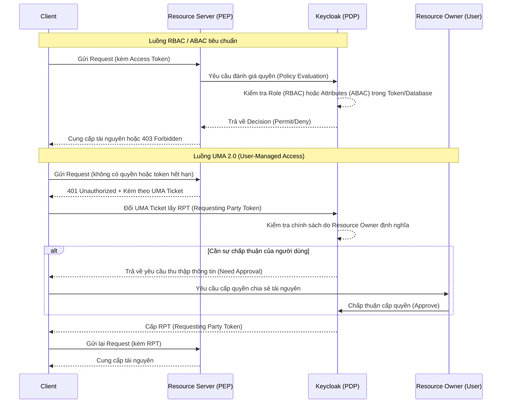

> [!NOTE]
> **Category:** Theory
> **Goal:** Hiểu rõ sự khác biệt giữa RBAC, ABAC và UMA, cũng như cách thức áp dụng các mô hình kiểm soát truy cập này trong kiến trúc Authorization Services của Keycloak.

## 1. Lý thuyết chuyên sâu (Detailed Theory)

Trong các hệ thống phân tán và bảo mật hiện đại, việc quyết định "ai được phép làm gì" là cốt lõi của bài toán Authorization (Ủy quyền). Keycloak hỗ trợ ba mô hình kiểm soát truy cập chính:

*   **RBAC (Role-Based Access Control):** Kiểm soát truy cập dựa trên vai trò. Quyền được gán cho các `Role` (như `admin`, `manager`, `user`), và người dùng được cấp các `Role` này.
    *   *Ưu điểm:* Dễ hiểu, dễ triển khai ban đầu.
    *   *Nhược điểm:* Dẫn đến hiện tượng "Role Explosion" (bùng nổ vai trò) khi hệ thống phức tạp dần lên, thiếu tính linh hoạt và ngữ cảnh.
*   **ABAC (Attribute-Based Access Control):** Kiểm soát truy cập dựa trên thuộc tính. Quyết định cấp quyền dựa trên tập hợp các thuộc tính của người dùng (User Attributes), thuộc tính của tài nguyên (Resource Attributes), hoặc ngữ cảnh môi trường (Environment Attributes như IP, thời gian).
    *   *Ưu điểm:* Vô cùng linh hoạt, có thể định nghĩa các chính sách phức tạp (ví dụ: chỉ cho phép rút tiền nếu `user.location == 'VN'` và `time < 18:00`).
    *   *Nhược điểm:* Phức tạp trong việc thiết kế và quản lý các chính sách. Hiệu năng có thể bị ảnh hưởng nếu chính sách quá phức tạp.
*   **UMA (User-Managed Access):** Là một chuẩn giao thức được xây dựng trên nền tảng OAuth 2.0. UMA cho phép người dùng (Resource Owner) tự quản lý và ủy quyền quyền truy cập vào tài nguyên của họ cho các thực thể khác (Requesting Party).
    *   *Ưu điểm:* Trao quyền cho người dùng cuối kiểm soát dữ liệu cá nhân của mình, rất phù hợp với các mô hình chia sẻ tài nguyên (như Google Drive, chia sẻ hồ sơ y tế).
    *   *Nhược điểm:* Kiến trúc phức tạp, đòi hỏi các thành phần Authorization Server, Resource Server và Client phải tích hợp chặt chẽ theo chuẩn UMA 2.0.

## 2. Luồng nội bộ & Cơ chế cấp thấp (Internal Workflow & Low-level Mechanisms)

Dưới đây là luồng hoạt động cơ bản mô tả sự khác biệt trong cơ chế đưa ra quyết định (Policy Decision) giữa RBAC/ABAC (thường được quản lý bởi Quản trị viên) và UMA (được quản lý bởi Người dùng).



*Trong đó:*
*   **RBAC/ABAC** là quá trình đánh giá tĩnh hoặc dựa trên ngữ cảnh được cấu hình sẵn.
*   **UMA** là một luồng tương tác linh hoạt, yêu cầu Client phản hồi với các sự kiện từ chối truy cập bằng cách xin cấp các "Ticket" và tương tác với quy trình xin cấp phép.

## 3. Thực hành tốt nhất & Bảo mật (Best Practices & Security)

*   **Bắt đầu với RBAC, mở rộng sang ABAC:** Đối với các dự án mới, hãy dùng RBAC cho các quyền cơ bản (Admin vs User). Khi các yêu cầu kinh doanh trở nên phức tạp (ví dụ: phân quyền dựa trên Department, Region), hãy chuyển đổi các thành phần đó sang ABAC để tránh bùng nổ `Role`.
*   **Sử dụng UMA đúng mục đích:** Chỉ sử dụng UMA khi có yêu cầu *người dùng cuối* (không phải quản trị viên) chia sẻ tài nguyên với nhau. Nếu ứng dụng của bạn không có tính năng chia sẻ dữ liệu ngang hàng (Peer-to-peer sharing) giữa các user, việc dùng UMA là quá mức cần thiết (overkill).
> [!WARNING]
> Cẩn thận với hiệu năng khi thiết kế hệ thống ABAC. Các chính sách dựa trên thuộc tính yêu cầu truy xuất dữ liệu động (như gọi API ngoài, tính toán JavaScript), điều này có thể gây thắt cổ chai (bottleneck) cho hệ thống nếu lượng Request quá lớn.

## 4. Cấu hình minh họa thực tế (Configuration Examples)

Ví dụ cấu hình chính sách ABAC trong Keycloak bằng JavaScript Policy (đánh giá thuộc tính `ip_address`):

```javascript
// ABAC Policy in Keycloak (JavaScript)
var context = $evaluation.getContext();
var identity = context.getIdentity();
var attributes = identity.getAttributes();

// Lấy thuộc tính department từ User
var department = attributes.getValue('department');

if (department && department.asString(0) === 'Finance') {
    $evaluation.grant(); // Cấp quyền
} else {
    $evaluation.deny();  // Từ chối
}
```

## 5. Trường hợp ngoại lệ (Edge Cases)

*   **Role không được đồng bộ:** Khi Client lấy Access Token, Keycloak nhúng `Roles` vào Token. Tuy nhiên, nếu Admin tước `Role` của người dùng ngay sau đó, Token cũ vẫn còn hiệu lực cho đến khi hết hạn. *Cách khắc phục:* Chuyển giao trách nhiệm đánh giá quyền cho Resource Server thông qua Authorization Services, hoặc sử dụng cơ chế Token Revocation.
*   **Thiếu dữ liệu thuộc tính (Missing Attributes) trong ABAC:** Nếu một chính sách ABAC phụ thuộc vào một thuộc tính bị null (do người dùng chưa cập nhật thông tin), kết quả có thể là một lỗi ngoại lệ (exception) hoặc đánh giá sai (`false`). *Cách khắc phục:* Luôn luôn kiểm tra `null` hoặc cung cấp giá trị mặc định (fallback value) trong các chính sách phân quyền.

## 6. Câu hỏi Phỏng vấn (Interview Questions)

1.  **Junior:** Sự khác biệt lớn nhất giữa RBAC và ABAC là gì?
    *   *Đáp án:* RBAC cấp quyền dựa trên danh hiệu/vai trò tĩnh, còn ABAC cấp quyền dựa trên các thuộc tính động của người dùng, tài nguyên hoặc ngữ cảnh.
2.  **Junior:** Trong Keycloak, làm sao để khắc phục tình trạng "Role Explosion"?
    *   *Đáp án:* Bằng cách kết hợp ABAC (sử dụng thuộc tính) hoặc Group-based access control thay vì tạo hàng ngàn Role khác nhau cho từng tổ hợp quyền.
3.  **Senior:** UMA 2.0 giải quyết bài toán gì mà OAuth 2.0 truyền thống không làm được?
    *   *Đáp án:* OAuth 2.0 tập trung vào việc Resource Owner ủy quyền cho một Client app để truy cập tài nguyên của chính họ. UMA 2.0 mở rộng điều này bằng cách cho phép Resource Owner chia sẻ tài nguyên với một người dùng khác (Requesting Party) một cách linh hoạt, đồng thời định nghĩa tập trung các chính sách chia sẻ tại Authorization Server.
4.  **Senior:** Khi triển khai ABAC Policy bằng JavaScript trong Keycloak, hệ thống gặp vấn đề hiệu năng cao. Nguyên nhân và giải pháp là gì?
    *   *Đáp án:* JS Policies chạy trên Nashorn/GraalVM engine của Java, có overhead mỗi lần execute. Giải pháp: Hạn chế dùng JS Policy, thay bằng Drools Policy hoặc Rule-based engine nếu có thể, hoặc áp dụng cơ chế Caching (Authorization Decision Cache) tại Resource Server.
5.  **Senior:** Luồng trao đổi UMA Ticket hoạt động ra sao nếu Client không hỗ trợ giao thức UMA?
    *   *Đáp án:* Client sẽ bị Resource Server trả về HTTP 401 kèm WWW-Authenticate Header chứa `ticket`. Nếu Client không hiểu UMA, nó không thể xử lý ticket này để lấy RPT, dẫn đến việc tích hợp thất bại. Bắt buộc Client phải được lập trình để hỗ trợ giao thức UMA.

## 7. Tài liệu tham khảo (References)

*   [Keycloak Authorization Services Guide](https://www.keycloak.org/docs/latest/authorization_services/)
*   [User-Managed Access (UMA) 2.0 Grant for OAuth 2.0 Authorization](https://docs.kantarainitiative.org/uma/wg/rec-oauth-uma-grant-2.0.html)
*   [NIST: Role-Based Access Control](https://csrc.nist.gov/projects/role-based-access-control)
