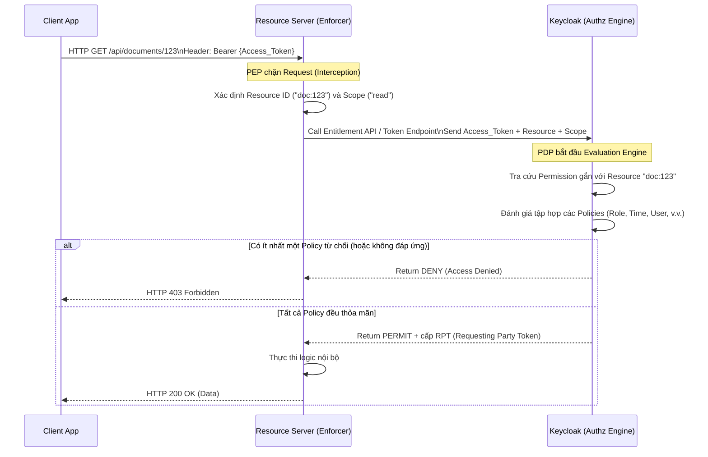

> [!NOTE]
> **Category:** Theory
> **Goal:** Nắm vững cấu trúc, các thành phần kiến trúc của Resource Server trong Keycloak và hiểu rõ cách PEP, PDP, PAP, PIP tương tác để đảm bảo an ninh cho API.

## 1. Lý thuyết chuyên sâu (Detailed Theory)

Trong hệ sinh thái Authorization Services của Keycloak, một **Resource Server** (Máy chủ Tài nguyên) không chỉ đơn thuần là một backend API cung cấp dữ liệu, mà là một thực thể được bảo vệ bởi các chính sách kiểm soát truy cập (Access Control Policies). Kiến trúc này được thiết kế theo tiêu chuẩn XACML (eXtensible Access Control Markup Language) và UMA (User-Managed Access), bao gồm các thành phần cốt lõi sau:

*   **Resource (Tài nguyên):** Một thực thể (ví dụ: bài viết, hồ sơ bệnh án, API endpoint) mà người dùng muốn bảo vệ.
*   **Scope (Phạm vi):** Các hành động có thể thực hiện trên Resource (ví dụ: `read`, `write`, `delete`).
*   **Policy (Chính sách):** Điều kiện để quyền được cấp. Policy không gắn trực tiếp với tài nguyên mà định nghĩa "luật" (ví dụ: "chỉ Admin mới được phép", hoặc "phải trong giờ hành chính").
*   **Permission (Quyền):** Sợi dây liên kết (binding) giữa một `Resource` (và `Scope`) với một hoặc nhiều `Policy`.
*   **Authorization Engine:** Cỗ máy đánh giá nằm trong Keycloak, đóng vai trò xử lý toàn bộ các Policy để ra quyết định.

Kiến trúc chuẩn bao gồm các node lô-gic:
*   **PEP (Policy Enforcement Point):** Nằm tại Resource Server (ví dụ: Spring Boot App, API Gateway). Nó chặn các Request, trích xuất Token và yêu cầu PDP quyết định.
*   **PDP (Policy Decision Point):** Nằm tại Keycloak. Nhận yêu cầu từ PEP, lấy các cấu hình chính sách, đánh giá và trả về quyết định (Permit/Deny).
*   **PAP (Policy Administration Point):** Chính là giao diện Keycloak Admin Console, nơi quản trị viên tạo, sửa, xóa các Resource, Policy, và Permission.
*   **PIP (Policy Information Point):** Bất cứ nguồn dữ liệu nào (Database, User Attributes) mà PDP dùng để lấy thêm thông tin phục vụ quá trình đánh giá.

## 2. Luồng nội bộ & Cơ chế cấp thấp (Internal Workflow & Low-level Mechanisms)

Khi một Client cố gắng truy cập Resource Server, quy trình tương tác giữa PEP và PDP diễn ra như sau:



**Cơ chế bảo vệ (Enforcement Modes):**
Trong cấu hình Keycloak Enforcer tại Resource Server, bạn có thể thiết lập `Policy Enforcement Mode`:
*   `ENFORCING`: (Mặc định) Tất cả các Request tới Resource Server đều bị từ chối trừ khi có một Permission tường minh cấp quyền.
*   `PERMISSIVE`: Sẽ cho phép Request đi qua ngay cả khi chưa cấu hình Permission (thường dùng để test/debug).
*   `DISABLED`: Vô hiệu hóa hoàn toàn PEP, Resource Server trở thành Public.

## 3. Thực hành tốt nhất & Bảo mật (Best Practices & Security)

*   **Tách biệt PEP và PDP:** Resource Server (như Spring Boot) chỉ nên đóng vai trò là PEP (thực thi quyết định, dùng Keycloak Spring Boot Adapter hoặc Spring Security OAuth2 Resource Server). Đừng tự code lại logic PDP (viết các câu lệnh `if/else` kiểm tra permission phức tạp) vào trong source code của Backend. Hãy đẩy mọi logic điều kiện về Keycloak (PAP) để quản lý tập trung.
*   **Sử dụng Local Cache cho PEP:** Quá trình PEP gọi lên Keycloak PDP qua HTTP sẽ gây ra độ trễ (latency). Để tối ưu, các Policy Enforcer cung cấp cấu hình lưu cache (Caffeine/Ehcache) các quyết định phân quyền tại bộ nhớ của PEP trong một khoảng thời gian ngắn (ví dụ 1-2 phút).
> [!IMPORTANT]
> Không bao giờ để `Policy Enforcement Mode` là `PERMISSIVE` trên môi trường Production. Việc này có thể dẫn đến việc rò rỉ dữ liệu (Data Leakage) nghiêm trọng nếu bạn quên cấu hình các quyền hạn.

## 4. Cấu hình minh họa thực tế (Configuration Examples)

Cấu hình cho một Resource Server (Spring Boot / Java) sử dụng tệp `keycloak.json` để kích hoạt Policy Enforcer:

```json
{
  "realm": "my-realm",
  "auth-server-url": "https://auth.example.com/",
  "ssl-required": "external",
  "resource": "my-resource-server",
  "credentials": {
    "secret": "your-client-secret"
  },
  "policy-enforcer": {
    "enforcement-mode": "ENFORCING",
    "paths": [
      {
        "path": "/api/documents/*",
        "methods": [
          {
            "method": "GET",
            "scopes": ["read"]
          },
          {
            "method": "POST",
            "scopes": ["write"]
          }
        ]
      }
    ]
  }
}
```

## 5. Trường hợp ngoại lệ (Edge Cases)

*   **PDP bị gián đoạn kết nối:** Nếu Keycloak bị sập mạng (network partition), PEP sẽ không thể gọi Entitlement API. Request sẽ fail (thường là trả về 500 hoặc 403). *Cách khắc phục:* Resource Server cần cấu hình timeout rõ ràng và chiến lược Fallback/Circuit Breaker thích hợp.
*   **Token chứa Role nhưng không được cấu hình Permission:** Dù Access Token chứa `Role: admin`, nhưng nếu trong Keycloak PAP bạn không map `Role Policy (admin)` vào `Permission` của Resource đó, PDP vẫn sẽ trả về `DENY`. Cần phân biệt rõ việc sở hữu Role và việc Role đó được liên kết (bind) vào một Resource cụ thể.

## 6. Câu hỏi Phỏng vấn (Interview Questions)

1.  **Junior:** Phân biệt Resource và Scope trong Keycloak Authorization Services?
    *   *Đáp án:* Resource là đối tượng (ví dụ: "Máy chủ DB", "Báo cáo tài chính"). Scope là hành động cụ thể trên đối tượng đó (ví dụ: "Khởi động", "Tắt", "Xem", "Sửa").
2.  **Junior:** PEP và PDP có nhiệm vụ gì? Chúng nằm ở đâu?
    *   *Đáp án:* PEP (Policy Enforcement Point) nằm ở Resource Server (App/Gateway), chặn Request và hỏi quyền. PDP (Policy Decision Point) nằm ở Keycloak, thực hiện tính toán luật và đưa ra quyết định có cho phép hay không.
3.  **Senior:** Nếu một API có rất nhiều lưu lượng truy cập (High throughput), việc cấu hình Policy Enforcer sẽ gây ra vấn đề gì và cách giải quyết?
    *   *Đáp án:* PEP liên tục gọi HTTP đến Keycloak để xác thực (Entitlement check) sẽ làm quá tải Keycloak và tăng Latency. Giải pháp là cấu hình Enforcer Cache để PEP tự lưu trữ kết quả phân quyền (RPT - Requesting Party Token) trong một thời gian ngắn.
4.  **Senior:** Policy Enforcement Mode `PERMISSIVE` hoạt động thế nào?
    *   *Đáp án:* Nó đánh giá các quyền (Permissions), nhưng nếu không có cấu hình phân quyền nào tồn tại cho Resource đó, nó vẫn mặc định cho phép truy cập. Nó chỉ trả về 403 khi tường minh có Policy từ chối.
5.  **Senior:** Làm thế nào để động hóa việc tạo Resource? Ví dụ, mỗi khi User tạo 1 bài viết, tôi muốn Keycloak quản lý bài viết đó như 1 Resource.
    *   *Đáp án:* Sử dụng Protection API do Keycloak cung cấp. Khi backend app xử lý API tạo bài viết, nó sẽ gọi Protection API (với tư cách là Resource Server) lên Keycloak để register động một `Resource` mới kèm owner là User đó.

## 7. Tài liệu tham khảo (References)

*   [Keycloak Docs: Resource Server](https://www.keycloak.org/docs/latest/authorization_services/#_resource_server_overview)
*   [OAuth 2.0 Threat Model and Security Considerations (RFC 6819)](https://datatracker.ietf.org/doc/html/rfc6819)
*   [XACML Reference Architecture](https://www.oasis-open.org/committees/xacml/)
