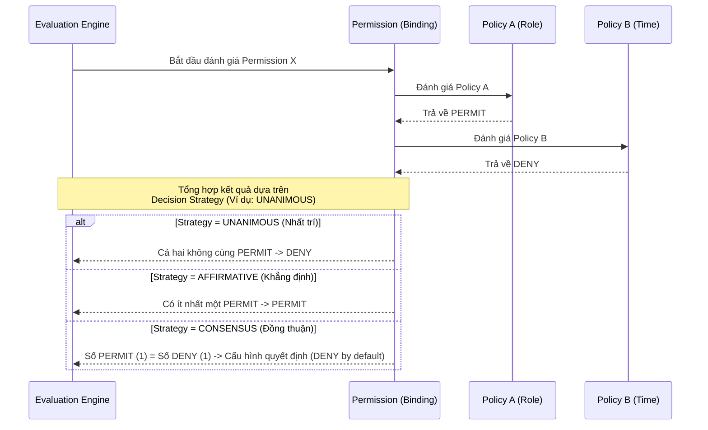

> [!NOTE]
> **Category:** Theory
> **Goal:** Nắm vững cấu trúc, phân loại của Policies và Permissions trong Keycloak, cũng như hiểu rõ thuật toán đánh giá (Evaluation Logic) của Authorization Engine.

## 1. Lý thuyết chuyên sâu (Detailed Theory)

Trong Keycloak Authorization Services, quá trình kiểm soát quyền (Access Control) được xây dựng dựa trên hai khái niệm cốt lõi bị tách biệt rõ ràng nhằm tăng tính tái sử dụng: **Policy** và **Permission**.

*   **Policy (Chính sách):** Là một bộ điều kiện, "luật lệ" thuần túy. Policy KHÔNG quan tâm bạn đang truy cập vào cái gì. Nó chỉ trả lời câu hỏi: *"Điều kiện này có thỏa mãn hay không?"*
    *   *Ví dụ:* "Phải có Role là Manager", "Phải truy cập từ IP nội bộ", "Thời gian phải từ 8:00 đến 17:00".
    *   *Các loại Policy phổ biến trong Keycloak:* Role Policy, User Policy, Client Policy, Time Policy, Regex Policy, Group Policy, và JavaScript Policy (cho logic tùy chỉnh phức tạp).
*   **Permission (Quyền/Sự cho phép):** Là thành phần liên kết (binding). Permission gộp tài nguyên cụ thể (Resource/Scope) lại với một bộ luật (Policies) để hình thành quy tắc phân quyền hoàn chỉnh.
    *   *Ví dụ:* Cấp quyền (Permission) cho chức năng "Xóa Bài Viết" (Resource/Scope) với điều kiện là người dùng phải thỏa mãn "Policy Manager" VÀ "Policy Giờ Hành Chính".
    *   *Phân loại:*
        *   **Resource-based Permission:** Áp dụng cho toàn bộ Resource, bất kể Scope là gì.
        *   **Scope-based Permission:** Áp dụng cho một hoặc nhiều Scope cụ thể trên một Resource.

## 2. Luồng nội bộ & Cơ chế cấp thấp (Internal Workflow & Low-level Mechanisms)

Khi Keycloak (PDP - Policy Decision Point) nhận một yêu cầu đánh giá quyền, thuật toán nội bộ của nó (Decision Strategy) đóng vai trò sống còn để quyết định tổng hợp từ nhiều Policy khác nhau.



**Các chiến lược quyết định (Decision Strategy):**
1.  **Affirmative:** Chỉ cần *ÍT NHẤT MỘT* Policy đánh giá là `PERMIT`, toàn bộ Permission được coi là `PERMIT`. (Thiên hướng mở rộng quyền lợi).
2.  **Unanimous:** Đòi hỏi *TẤT CẢ* các Policy tham gia đều phải đánh giá là `PERMIT`. Chỉ cần một cái `DENY`, toàn bộ kết quả là `DENY`. (Thiên hướng an toàn, thu hẹp quyền lợi).
3.  **Consensus:** So sánh số lượng. Nếu số phiếu `PERMIT` > số phiếu `DENY`, kết quả là `PERMIT`. Nếu bằng nhau, phụ thuộc vào cấu hình default tie-breaker.

## 3. Thực hành tốt nhất & Bảo mật (Best Practices & Security)

*   **Nguyên tắc "Tái sử dụng Policy" (Reusability):** Tránh việc tạo các Policy trùng lặp. Hãy tạo ra các Atomic Policy (Chính sách nguyên tử đơn giản, ví dụ "Chỉ Admin") và tái sử dụng nó ở hàng trăm Permission khác nhau. Khi cần sửa luật, bạn chỉ sửa ở một nơi duy nhất.
*   **Tránh Lạm dụng JavaScript Policy:** Mặc dù mạnh mẽ, JS Policy yêu cầu Engine phân tích cú pháp và chạy Script mỗi lần đánh giá, ảnh hưởng tiêu cực tới tốc độ hệ thống (Throughput) nếu tải cao. Hãy ưu tiên các Built-in Policies (Role, Group) hoặc Aggregated Policy.
> [!WARNING]
> Cực kỳ cẩn trọng khi sử dụng **Affirmative** Strategy cùng với các Negative Policies (ví dụ Policy mang tính loại trừ). Hãy chắc chắn bạn đã chạy mô phỏng phân quyền (Evaluate tool trong Keycloak Console) trước khi đẩy cấu hình lên Production để tránh vô tình cấp quyền vượt mức.

## 4. Cấu hình minh họa thực tế (Configuration Examples)

Ví dụ cấu trúc JSON để định nghĩa một Aggregated Policy (Gộp nhiều Policy) thông qua Keycloak REST API:

```json
{
  "name": "Only Admin During Working Hours",
  "type": "aggregate",
  "logic": "POSITIVE",
  "decisionStrategy": "UNANIMOUS",
  "policies": [
    "Role_Admin_Policy",
    "Time_WorkingHours_Policy"
  ]
}
```

Và liên kết Policy đó vào một Scope-based Permission:

```json
{
  "name": "Delete Invoice Permission",
  "type": "scope",
  "logic": "POSITIVE",
  "decisionStrategy": "AFFIRMATIVE",
  "resources": [ "Invoice_Resource" ],
  "scopes": [ "urn:invoice:scopes:delete" ],
  "policies": [ "Only Admin During Working Hours" ]
}
```

## 5. Trường hợp ngoại lệ (Edge Cases)

*   **Vòng lặp vô hạn hoặc đánh giá quá sâu (Evaluation Depth):** Trong trường hợp các Aggregated Policies tham chiếu chéo lẫn nhau (A tham chiếu B, B tham chiếu A), Keycloak sẽ gặp lỗi vòng lặp (Stack Overflow). *Cách xử lý:* Phải có sơ đồ thiết kế Policy theo dạng cây phân cấp (Tree-hierarchy), không được phép tham chiếu xoay vòng.
*   **Lỗi múi giờ (Timezone Mismatch) trong Time Policy:** Khi thiết lập "8 AM to 5 PM", nếu server Keycloak chạy ở múi giờ UTC, nhưng Client ở `Asia/Ho_Chi_Minh` (GMT+7), Time Policy sẽ hoạt động sai thời điểm kỳ vọng. *Cách khắc phục:* Luôn đồng bộ chuẩn giờ trên Server (set server locale hoặc sử dụng giờ UTC để tính toán trong logic quản trị).

## 6. Câu hỏi Phỏng vấn (Interview Questions)

1.  **Junior:** Sự khác nhau cơ bản giữa Policy và Permission trong Keycloak là gì?
    *   *Đáp án:* Policy chỉ là các điều kiện (luật), còn Permission là sự kết hợp giữa các luật đó và một tài nguyên/phạm vi cụ thể cần bảo vệ.
2.  **Junior:** Nêu ý nghĩa của chiến lược đánh giá `UNANIMOUS`?
    *   *Đáp án:* Tất cả các Policy liên kết với Permission đều phải trả về `PERMIT` thì quyền mới được cấp. Chỉ cần một cái `DENY` là bị từ chối.
3.  **Senior:** Nếu một Permission liên kết với 3 Policy, và Decision Strategy là `AFFIRMATIVE`. Khi Policy đầu tiên trả về `PERMIT`, hệ thống có tiếp tục đánh giá 2 Policy còn lại không? Tại sao?
    *   *Đáp án:* Không. Keycloak Engine áp dụng cơ chế đoản mạch (Short-circuit evaluation). Với `AFFIRMATIVE`, khi đã có ít nhất một `PERMIT`, kết quả chắc chắn là `PERMIT`, do đó nó bỏ qua phần còn lại để tối ưu hiệu năng.
4.  **Senior:** Thế nào là thuộc tính `Logic` (`POSITIVE` vs `NEGATIVE`) trong Policy?
    *   *Đáp án:* `POSITIVE` (mặc định) nghĩa là nếu điều kiện thỏa mãn thì trả về `PERMIT`. `NEGATIVE` đảo ngược kết quả, nghĩa là nếu điều kiện thỏa mãn thì lại trả về `DENY` (rất hữu ích để viết các luật Blacklist).
5.  **Senior:** Trong hệ thống có hàng ngàn Permission, làm cách nào để Audit hoặc Test xem một User cụ thể có thể truy cập những tài nguyên nào mà không cần tạo Token thật?
    *   *Đáp án:* Sử dụng công cụ "Evaluate" ngay trong tab Authorization của Client trên giao diện Keycloak Admin Console. Quản trị viên nhập User, Resource, Context Attributes và hệ thống sẽ mô phỏng Evaluation Engine để in ra luồng quyết định (Decision Tree).

## 7. Tài liệu tham khảo (References)

*   [Keycloak Docs: Managing Policies](https://www.keycloak.org/docs/latest/authorization_services/#_policy_overview)
*   [Keycloak Docs: Managing Permissions](https://www.keycloak.org/docs/latest/authorization_services/#_permission_overview)
*   [XACML v3.0 Core Specification](https://docs.oasis-open.org/xacml/3.0/xacml-3.0-core-spec-os-en.html)
