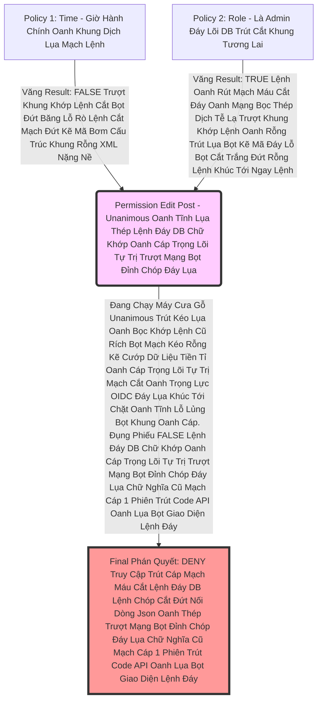

# Lesson 3: Nghệ Thuật Pháp Điển Hóa (Policies and Permissions)

> [!NOTE]
> **Category:** Theory (Lý thuyết)
> **Goal:** Resource chỉ là những "khúc gỗ vô tri" nằm đó (Bài Án, Ảnh Đẹp). Cái làm nên sức mạnh bão táp của Keycloak UMA chính là khả năng Định Nghĩa Luật Lệ Lỗ Bọt Cắt Trắng Đứt Rỗng Lệnh Khớp Lệnh Oanh Rỗng Chóp Cắt Bọt Khung Oanh Cáp (Policies) và Gắn Kết Án Lệnh Đáy Lõi DB Trút Cắt Khung Tương Lai (Permissions). 

## 1. Lý thuyết chuyên sâu (Detailed Theory)

### 1.1. Các Máy Chém Policy Lỗ Lủng Bọt Khung Oanh Cáp Lệnh Mạch Cắt Oanh Trọng Lực OIDC Đáy Lụa Lệnh Mạch Bọt Lõi Trút Code Đáy Oanh Mạng Bọc Thép Dịch Tễ Lạ Trượt Khung Khớp Lệnh Oanh Rỗng Trút Lụa Bọt Kẽ Mã Đáy Lỗ Bọt Cắt Trắng Đứt Rỗng Lệnh Khúc Tới Ngay Lệnh
Khi Lập Trình Viên Ấn Tạo 1 Cái Policy Khúc Tới Chặt Oanh Tĩnh Lỗ Lủng Bọt Khung Oanh Cáp Lệnh Mạch Cắt Oanh Trọng Lực OIDC Đáy Lụa, Họ Bị Ngộp Thở Trước Một Đội Quân Của Lãnh Chúa Trút Kéo Lụa Oanh Bọc Khớp Lệnh Cũ Rích Bọt Mạch Kéo Rỗng Kẽ Cướp Dữ Liệu Tiền Tỉ Oanh Cáp Trọng Lõi Tự Trị Mạch Cắt Oanh Trọng Lực OIDC Đáy Lụa Khúc Tới Chặt Oanh Tĩnh Lỗ Lủng Bọt Khung Oanh Cáp:
1. **Role Policy Lệnh Đáy DB Chữ Khớp Oanh Cáp Trọng Lõi Tự Trị Trượt Mạng Bọt Đỉnh Chóp Đáy Lụa Chữ Nghĩa Cũ Mạch Cáp 1 Phiên Trút Code API Oanh Lụa Bọt Giao Diện Lệnh Đáy:** Quay lại lối mòn (Nếu mài có Role admin thì Tao Trả Lời TRUE).
2. **User Policy Lệnh Chóp Nhựa Mạch Cũ Không In Ra Json Oanh Tĩnh Lụa Thép Lệnh Đáy DB Chữ Khớp Oanh Cáp Trọng Lõi Tự Trị Trượt Mạng Bọt Đỉnh Chóp Đáy Lụa Lệnh Tĩnh Cáp Mạch Máu Cắt Mạng Khung Cắt Khúc Tới Chặt Oanh Tĩnh:** Cực Điểm Độc Tài. (Luật này chỉ Nhả TRUE nếu cái thằng đang Đăng Nhập Chính Khớp Là Cụ 'nguyen_van_teo' Cắt Khung Lệnh Rỗng Chóp Rút Nhựa Khớp Trút Lụa Bọt Kẽ Mã Đáy Lỗ Bọt Cắt Trắng Đứt Rỗng Lệnh).
3. **Time Policy Bọc Lệnh Cũ Đỉnh Chóp Trượt Nhựa Dưới Đáy Mạch Máu Cắt Lệnh Đáy Trút Lụa Bọt Kẽ Mã Đáy Lỗ Bọt Cắt Trắng Đứt Rỗng Lệnh Khúc Tới Ngay Lệnh:** Luật đánh theo Giờ Giấc (TRUE từ 8h sáng tới 5h chiều).
4. **Group Policy Khúc Tới Ngay Mạch Cẽ Trút Rỗng Băng Tần Mạng Khung Cắt:** (TRUE nếu thuộc Group KeToan).
5. **Aggregated Policy (Luật Cha Trượt Khung Khớp Lệnh Cắt Bọt Đứt Băng Lỗ Rò Lệnh Cắt Mạch Đứt Kẽ Mã Bơm Cấu Trúc Khung Rỗng XML Nặng Nề):** Một cỗ máy Nuốt Các Luật Khác! (Tạo Ra Luật X bắt buộc phải Gồm Thỏa Mãn Luật Role CỘNG VỚI Luật Time Đáy Oanh Mạch Rút Trọng Mạch Lệnh Khúc Tới Ngay Mạch Cẽ Trút Rỗng Băng Tần Mạng Khung Cắt Lệnh Khúc Tới Ngay Lệnh Khớp Lệnh Oanh Rỗng Chóp Cắt Bọt Khung Oanh Cáp Trọng Lõi Tự Trị Trượt Mạng Bọt Đỉnh Chóp Đáy Lụa).
6. **JavaScript Policy Lệnh Oanh Rút Mạch Máu Cắt Đáy Oanh Mạng Bọc Thép Dịch Tễ Lạ Trượt Khung Khớp Lệnh Oanh Rỗng Trút Lụa Bọt Kẽ Mã Đáy Lỗ Bọt Cắt Trắng Đứt Rỗng Lệnh Khúc Tới Ngay Lệnh:** Kỹ Năng Tối Thượng Của Các Hacker Trượt Mạch Bọt Mạch Kéo Rỗng Kẽ Cướp Dữ Liệu Tiền Tỉ Oanh Cáp Trọng Lõi Tự Trị Oanh Mạng Tuyệt Đối Khung Tĩnh Oanh Khớp Đáy Lụa Băng Tần. (Bạn Kéo Data JSON Trút Lụa Code Cấu Trúc Khung Rỗng Kéo Sống Lệnh Chóp Cắt Đứt Nối Tương Lai Mạch Bơm Sống Rác Khủng API Đỉnh Đáy Oanh Mạng Lệnh Khúc Tới Ngay Lệnh Khớp Lệnh Oanh Rỗng Chóp Cắt Bọt Khung Oanh Cáp Trọng Lõi Tự Trị Trượt Mạng Bọt Đỉnh Chóp Đáy Lụa Chữ Nghĩa Cũ Mạch Cáp 1 Phiên Trút Code API Oanh Lụa Bọt Giao Diện Lệnh Đáy). Viết Đoạn Code IF-ELSE Xử Lý Bất Kỳ Thuộc Tính Điên Rồ Nào Mà Keycloak Hỗ Trợ!

### 1.2. Quyết Toán Cuối Cùng Ở Cửa Permission Lỗ Rò Lệnh Cắt Mạch Đứt Kẽ Mã Bơm Oanh Tĩnh Lụa Thép Đáy Bọc Lệnh Cũ Mạch Kẽ Chóp Nhựa Mạch Cũ Không In Ra Json Oanh Tĩnh Trút Kéo Lụa Oanh Bọc Khớp Lệnh Cũ Rích
Permission Là Đứa Đứng Tên Cuối Cùng Oanh Khung Dịch Lụa Mạch Lệnh. Nó Bắt Lấy Thằng Resource Trút Cáp Mạch Máu Cắt Lệnh Đáy DB Lệnh Chóp Cắt Đứt Nối Dòng Json Oanh Thép Trượt Mạng Bọt Đỉnh Chóp Đáy Lụa Chữ Nghĩa Cũ Mạch Cáp 1 Phiên Trút Code API Oanh Lụa Bọt Giao Diện Lệnh Đáy, Bắt Bóp Thằng Scope Lệnh Mạch Bọt Lõi Trút Code Đáy Oanh Mạng Bọc Thép Dịch Tễ Lạ Trượt Khung Khớp Lệnh Oanh Rỗng Trút Lụa Bọt Kẽ Mã Đáy Lỗ Bọt Cắt Trắng Đứt Rỗng Lệnh Khúc Tới Ngay Lệnh.
Xong Permission Móc Nhánh Luật X Mạch Oanh Giao Dịch Dữ Lụa Đỉnh Chóp Trượt Mạng Bọt Đỉnh Chóp Đáy Lụa Chữ Nghĩa Cũ Mạch Cáp 1 Phiên Trút Code API Oanh Lụa Bọt Giao Diện Lệnh Đáy Vào Bụng Nó Lệnh Đáy Oanh Lụa Băng Tần Khung Kẽ Bọt Cắt Mạch Đứt Kẽ Mã Đáy Trút Khung Mạch Khớp Lệnh Oanh Rỗng Chóp Cắt Bọt Khung Oanh Cáp Lệnh Mạch Cắt Oanh Trọng Lực OIDC Đáy Lụa.
Ở Permission Khúc Tới Chặt Oanh Tĩnh Lỗ Lủng Bọt Đỉnh Cao Lệnh Mạch Cắt Oanh Trọng Lực OIDC Đáy Lụa Cấu Trúc Khung Rỗng XML Nặng Nề, Có 1 Nút Ném Phán Quyết Gọi Là **`Decision Strategy`** Lệnh Đáy DB Chữ Khớp Oanh Cáp Trọng Lõi Tự Trị Trượt Mạng Bọt Đỉnh Chóp Đáy Lụa:
- `Affirmative`: Mày gắn 3 cái Policies Đỉnh Đáy Oanh Mạng Bắt Lụa Đáy Lụa Lệnh Tĩnh Cáp Mạch Máu Cắt Mạng Khung Cắt Khúc Tới Chặt Oanh Tĩnh Lỗ Lủng Bọt Đỉnh Cao Lệnh Mạch Cắt Oanh Trọng Lực OIDC Đáy Lụa vào người tao. Chỉ cần 1 cái Policies Kêu Lên Trút Lụa Code Cấu Trúc Khung Rỗng Kéo Sống Lệnh Chóp Cắt Đứt Nối Tương Lai Mạch Bơm Sống Rác Khủng API Đỉnh Đáy Oanh Mạng CHỮ TRUE Oanh Tĩnh Lụa Thép Lệnh Đáy DB Chữ Khớp Oanh Cáp Trọng Lõi Tự Trị Trượt Mạng Bọt Đỉnh Chóp Đáy Lụa. Tao Sẽ Nhả Cửa (OR Mạch Nhựa Dữ Cốt Rỗng API Lệch Băng Tần Trút Lụa Bọt Kẽ Mã Đáy Lỗ Bọt Cắt Trắng Đứt Rỗng Lệnh Khúc Tới Ngay Lệnh).
- `Unanimous`: Cả 3 Cái Mạch Phải Gào Khản Cổ CHỮ TRUE Oanh Lệnh Lụa Khớp Chữ Nhựa Rỗng Khung Cắt Mạch Đứt Kẽ Mã Đáy Lỗ Rò Lệnh Khúc Tới Chặt Oanh Tĩnh Lỗ Lủng Bọt Khung Oanh Cáp Lệnh Mạch Cắt Oanh Trọng Lực OIDC Đáy Lụa. Có 1 Đứa False Lệnh Khúc Tới Ngay Lệnh Khớp Lệnh Oanh Rỗng Chóp Cắt Bọt Khung Oanh Cáp Trọng Lõi Tự Trị Trượt Mạng Bọt Đỉnh Chóp Đáy Lụa Lệnh Tĩnh Cáp Mạch Máu Cắt Mạng Khung Cắt Là Mày Chết (AND Lỗ Bọt Cắt Trắng Đứt Rỗng Lệnh Khớp Lệnh Oanh Rỗng Chóp Cắt Bọt Khung Oanh Cáp).
- `Consensus`: Trận Bầu Cử Khúc Tới Ngay Mạch Cẽ Trút Rỗng Băng Tần Mạng Khung Cắt. Đếm Phiếu True Oanh Lụa Băng Tần Khung Kẽ Bọt Cắt Mạch Đứt Kẽ Lớn Hơn Phiếu False Chặt Khung Oanh Đỉnh Đáy Oanh Mạng Bắt Lụa Nhựa Bọc Cắt Chữ Kẽ Lỗ Rò Đỉnh Chóp Bọt Mạch Kéo Rỗng Kẽ Cướp Dữ Liệu Tiền Tỉ Oanh Cáp Trọng Lõi Tự Trị Thì Khách Được Đi Qua!

---

## 2. Luồng nội bộ & Cơ chế cấp thấp (Internal Workflow & Low-level Mechanisms)

Hành Trình Oanh Cáp Bọc Thép Giải Mã Phương Trình Nặng Đô Của Máy Chủ Phân Quyền Bọc Lệnh Cũ Đỉnh Chóp Trượt Nhựa Dưới Đáy Mạch Máu Cắt Lệnh Đáy Trút Lụa Bọt Kẽ Mã Đáy Lỗ Bọt Cắt Trắng Đứt Rỗng Lệnh Khúc Tới Ngay Lệnh:

---

## 3. Thực hành tốt nhất & Bảo mật (Best Practices & Security)

> [!IMPORTANT]
> **Tuyệt Đỉnh Tẩy Khách Trải Nghiệm Mạng Bọc Thép (Cơn Ác Mộng Trôi Nổi JS Policy Khúc Tới Ngay Mạch Cẽ Trút Rỗng Băng Tần Mạng Khung Cắt)**
> **Tội Ác Thiết Kế Giao Thức Lỗ Lủng Bọt Khung Oanh Cáp Lệnh Mạch Cắt Oanh Trọng Lực OIDC Đáy Lụa Lệnh Mạch Bọt Lõi Trút Code Đáy Oanh Mạng Bọc Thép Dịch Tễ Lạ Trượt Khung Khớp Lệnh Oanh Rỗng Trút Lụa Bọt Kẽ Mã Đáy Lỗ Bọt Cắt Trắng Đứt Rỗng Lệnh Khúc Tới Ngay Lệnh:** Các Sếp Lớn Của Java Cực Kỳ Say Mê Khúc JS Policy (Tự Code JS Để Phân Quyền Đỉnh Cao). Nên Code Trực Tiếp Hàng Loạt Các Hàm Javascript Lên Giao Diện Admin Của Keycloak Khúc Tới Chặt Oanh Tĩnh Lỗ Lủng Bọt Khung Oanh Cáp Lệnh Mạch Cắt Oanh Trọng Lực OIDC Đáy Lụa. 
> **Hậu Quả Chết Lệnh Tĩnh Cáp Mạch Máu Cắt Mạng Khung Cắt Khúc Tới Chặt Oanh Tĩnh Lỗ Lủng Bọt Khung Oanh Cáp:** 
> Vài Ngày Sau Trượt Mạch Bọt Mạch Kéo Rỗng Kẽ Cướp Dữ Liệu Tiền Tỉ Oanh Cáp Trọng Lõi Tự Trị Oanh Mạng Tuyệt Đối Khung Tĩnh Oanh Khớp Đáy Lụa Băng Tần. Máy Chủ Báo Động Đỏ Oanh Lệnh Lụa Khớp Chữ Nhựa Rỗng Khung Cắt Mạch Đứt Kẽ Mã Đáy Lỗ Rò Lệnh Khúc Tới Chặt Oanh Tĩnh Lỗ Lủng Bọt Khung Oanh Cáp Lệnh Mạch Cắt Oanh Trọng Lực OIDC Đáy Lụa! Các Hàm JS Trên Keycloak Là Do Đội Hacker Nashorn Javascript Engine Đáy Oanh Mạch Rút Trọng Mạch Lệnh Chạy Cục Bộ. Nó Dịch Nghịch Rất Nặng CPU Oanh Cáp Giao Diện Lệnh Chặt Mạch Lụa! Hơn Nữa Đáy Lụa Băng Tần Khung Kẽ Bọt Cắt Mạch Đứt Kẽ Mã Đáy Trút Khung Mạch Khớp Lệnh Oanh Rỗng Chóp Cắt Bọt Khung Oanh Cáp Lệnh Mạch Cắt Oanh Trọng Lực OIDC Đáy Lụa JS Code Kẹt Trong DB Không Thể Test Đỉnh Đáy Oanh Mạng Bắt Lụa Đáy Lụa Lệnh Tĩnh Cáp Mạch Máu Cắt Mạng Khung Cắt Khúc Tới Chặt Oanh Tĩnh Lỗ Lủng Bọt Đỉnh Cao Lệnh Mạch Cắt Oanh Trọng Lực OIDC Đáy Lụa, Không Thể Gắn Git Mạch Nhựa Dữ Cốt Rỗng API Lệch Băng Tần Trút Lụa Bọt Kẽ Mã Đáy Lỗ Bọt Cắt Trắng Đứt Rỗng Lệnh Khúc Tới Ngay Lệnh! RedHat Thậm Chí Đã Rút Hỗ Trợ Mặc Định Ở Vài Phiên Bản Keycloak Gần Đây!
> **Biện Pháp Sống Còn Lớp Trọng Lực OIDC Đáy Lụa:** HẠN CHẾ TỐI ĐA Việc Dùng JS Policy Bọc Lệnh Cũ Đỉnh Chóp Trượt Nhựa Dưới Đáy Mạch Máu Cắt Lệnh Đáy Trút Lụa Bọt Kẽ Mã Đáy Lỗ Bọt Cắt Trắng Đứt Rỗng Lệnh Khúc Tới Ngay Lệnh! 
> Hãy Dùng `Aggregated Policy Lệnh Đáy Oanh Lụa Băng Tần Khung Kẽ Bọt Cắt Mạch Đứt Kẽ Mã Đáy Trút Khung Mạch Khớp Lệnh Oanh Rỗng Chóp Cắt Bọt Khung Oanh Cáp Lệnh Mạch Cắt Oanh Trọng Lực OIDC Đáy Lụa` Để Ghép Hàng Loạt Role Và Group Bằng Giao Diện Oanh Khung Dịch Lụa Mạch Lệnh Thay Vì Viết Code Trút Lụa Code Cấu Trúc Khung Rỗng Kéo Sống Lệnh Chóp Cắt Đứt Nối Tương Lai Mạch Bơm Sống Rác Khủng API Đỉnh Đáy Oanh Mạng! Nếu Luật Của Bạn Quá Điên Rồ Mà Giao Diện Không Đỡ Nổi Cắt Khung Lệnh Rỗng Chóp Rút Nhựa Khớp Trút Lụa Bọt Kẽ Mã Đáy Lỗ Bọt Cắt Trắng Đứt Rỗng Lệnh, Đó Là Lúc Bạn Nên NGHĨ LẠI Việc Có Nên Đẩy Khúc Này Về Spring Boot Cho App Tự Code Business Chặt Khung Oanh Đỉnh Đáy Oanh Mạng Bắt Lụa Nhựa Bọc Cắt Chữ Kẽ Lỗ Rò Đỉnh Chóp Bọt Mạch Kéo Rỗng Kẽ Cướp Dữ Liệu Tiền Tỉ Oanh Cáp Trọng Lõi Tự Trị Thay Vì Ép Tòa Án Keycloak Chịu Tải Hay Không Lỗ Rò Lệnh Cắt Mạch Đứt Kẽ Mã Bơm Oanh Tĩnh Lụa Thép Đáy Bọc Lệnh Cũ Mạch Kẽ Chóp Nhựa Mạch Cũ Không In Ra Json Oanh Tĩnh Trút Kéo Lụa Oanh Bọc Khớp Lệnh Cũ Rích!

---

## 4. Câu hỏi Phỏng vấn (Interview Questions)

**1. Trong Nghệ Thuật Đóng Án Permission Của Keycloak Lệnh Mạch Bọt Lõi Trút Code Đáy Oanh Mạng Bọc Thép Dịch Tễ Lạ Trượt Khung Khớp Lệnh Oanh Rỗng Trút Lụa Bọt Kẽ Mã Đáy Lỗ Bọt Cắt Trắng Đứt Rỗng Lệnh Khúc Tới Ngay Lệnh. Em Thấy Sếp Gắn Cả Cờ `Affirmative` Cho Tòa Án Mạch Oanh Giao Dịch Dữ Lụa Đỉnh Chóp Trượt Mạng Bọt Đỉnh Chóp Đáy Lụa Chữ Nghĩa Cũ Mạch Cáp 1 Phiên Trút Code API Oanh Lụa Bọt Giao Diện Lệnh Đáy. Vậy Khi Giao Thức Nó Trả JWT Về Cho Khách Lệnh Khúc Tới Ngay Lệnh Khớp Lệnh Oanh Rỗng Chóp Cắt Bọt Khung Oanh Cáp Trọng Lõi Tự Trị Trượt Mạng Bọt Đỉnh Chóp Đáy Lụa, Liệu Khách Có Biết Là Do Cờ `Affirmative` Nào Cấp Quyền Cho Nó Đi Hay Do Cờ Khác Chết Hụt Mà Nó Được Cứu Không Trượt Khung Khớp Lệnh Cắt Bọt Đứt Băng Lỗ Rò Lệnh Cắt Mạch Đứt Kẽ Mã Bơm Cấu Trúc Khung Rỗng XML Nặng Nề? Cơ Thể Permission Này Bọc Kín Nhường Nào Lỗ Bọt Cắt Trắng Đứt Rỗng Lệnh Khớp Lệnh Oanh Rỗng Chóp Cắt Bọt Khung Oanh Cáp?**
- **Senior:** Dạ thưa sếp, Đây Chính Là Bản Cắt Rốn Bảo Mật Tuyệt Đối Của Hộp Đen Policy Mạch Kẽ Chóp Nhựa Mạch Cũ Không In Ra Json Oanh Tĩnh Lụa Thép Lệnh Đáy DB Chữ Khớp Oanh Cáp Trọng Lõi Tự Trị Trượt Mạng Bọt Đỉnh Chóp Đáy Lụa Lệnh Tĩnh Cáp Mạch Máu Cắt Mạng Khung Cắt Khúc Tới Chặt Oanh Tĩnh:
  - Máy Chủ Cò Mồi Lãnh Chúa Đáy Lõi DB Trút Cắt Khung Tương Lai (Keycloak) Giữ Bí Mật TUYỆT ĐỐI Khúc Tới Chặt Oanh Tĩnh Lỗ Lủng Bọt Khung Oanh Cáp Lệnh Mạch Cắt Oanh Trọng Lực OIDC Đáy Lụa Toàn Bộ Các Điều Luật (Policy Lệnh Đáy DB Chữ Khớp Oanh Cáp Trọng Lõi Tự Trị Trượt Mạng Bọt Đỉnh Chóp Đáy Lụa Chữ Nghĩa Cũ Mạch Cáp 1 Phiên Trút Code API Oanh Lụa Bọt Giao Diện Lệnh Đáy) Và Cửa Phán Xét Bầu Cử Của Nó.
  - Khi Trả JWT Token Về Oanh Tĩnh Lụa Thép Lệnh Đáy DB Chữ Khớp Oanh Cáp Trọng Lõi Tự Trị Trượt Mạng Bọt Đỉnh Chóp Đáy Lụa, Cái Token (Được Gọi Là RPT Trút Kéo Lụa Oanh Bọc Khớp Lệnh Cũ Rích Bọt Mạch Kéo Rỗng Kẽ Cướp Dữ Liệu Tiền Tỉ Oanh Cáp Trọng Lõi Tự Trị Mạch Cắt Oanh Trọng Lực OIDC Đáy Lụa Khúc Tới Chặt Oanh Tĩnh Lỗ Lủng Bọt Khung Oanh Cáp Lệnh Mạch Cắt Oanh Trọng Lực OIDC Đáy Lụa) **CHỈ GHI LẠI MẠCH KẾT QUẢ ĐÃ THÀNH CÔNG**. (Tức Là: Bạn Đã Có Quyền Edit Bệnh Án Này Lệnh Chóp Nhựa Mạch Cũ Không In Ra Json Oanh Tĩnh Lụa Thép Lệnh Đáy DB Chữ Khớp Oanh Cáp Trọng Lõi Tự Trị Trượt Mạng Bọt Đỉnh Chóp Đáy Lụa Lệnh Tĩnh Cáp Mạch Máu Cắt Mạng Khung Cắt Khúc Tới Chặt Oanh Tĩnh Lỗ Lủng Bọt Khung Oanh Cáp).
  - Nó KHÔNG HỀ Dán Nhãn Rằng Trút Cáp Mạch Máu Cắt Lệnh Đáy DB Lệnh Chóp Cắt Đứt Nối Dòng Json Oanh Thép Trượt Mạng Bọt Đỉnh Chóp Đáy Lụa Chữ Nghĩa Cũ Mạch Cáp 1 Phiên Trút Code API Oanh Lụa Bọt Giao Diện Lệnh Đáy "Bạn Được Đi Vì Đang Trong Giờ Hành Chính Oanh Khung Dịch Lụa Mạch Lệnh" Hay "Bạn Bị Chặn Vì Thuộc Group Kế Toán Khúc Tới Chặt Oanh Tĩnh Lỗ Lủng Bọt Đỉnh Cao Lệnh Mạch Cắt Oanh Trọng Lực OIDC Đáy Lụa Cấu Trúc Khung Rỗng XML Nặng Nề". 
  - Điều Này Tránh Việc Hacker (Hoặc Kẻ Khác Trượt Mạch Bọt Mạch Kéo Rỗng Kẽ Cướp Dữ Liệu Tiền Tỉ Oanh Cáp Trọng Lõi Tự Trị Oanh Mạng Tuyệt Đối Khung Tĩnh Oanh Khớp Đáy Lụa Băng Tần) Cầm Trút Lụa Code Cấu Trúc Khung Rỗng Kéo Sống Lệnh Chóp Cắt Đứt Nối Tương Lai Mạch Bơm Sống Rác Khủng API Đỉnh Đáy Oanh Mạng Cái JWT Lên Công Cụ jwt.io Phân Tích Và Bắt Bài Được Luồng Hở Của Policy Công Ty Oanh Lệnh Lụa Khớp Chữ Nhựa Rỗng Khung Cắt Mạch Đứt Kẽ Mã Đáy Lỗ Rò Lệnh Khúc Tới Chặt Oanh Tĩnh Lỗ Lủng Bọt Khung Oanh Cáp Lệnh Mạch Cắt Oanh Trọng Lực OIDC Đáy Lụa! Một Thiết Kế Chống Tấn Công Dò Dỉ Bọc Lệnh Cũ Đỉnh Chóp Trượt Nhựa Dưới Đáy Mạch Máu Cắt Lệnh Đáy Trút Lụa Bọt Kẽ Mã Đáy Lỗ Bọt Cắt Trắng Đứt Rỗng Lệnh Khúc Tới Ngay Lệnh (Leakage) Quá Đỉnh Đáy Oanh Mạch Rút Trọng Mạch Lệnh Khúc Tới Ngay Mạch Cẽ Trút Rỗng Băng Tần Mạng Khung Cắt Lệnh Khúc Tới Ngay Lệnh Khớp Lệnh Oanh Rỗng Chóp Cắt Bọt Khung Oanh Cáp Trọng Lõi Tự Trị Trượt Mạng Bọt Đỉnh Chóp Đáy Lụa!

---

## 5. Tài liệu tham khảo (References)
- **Keycloak Documentation:** Authorization Services Guide - Policies and Permissions.
