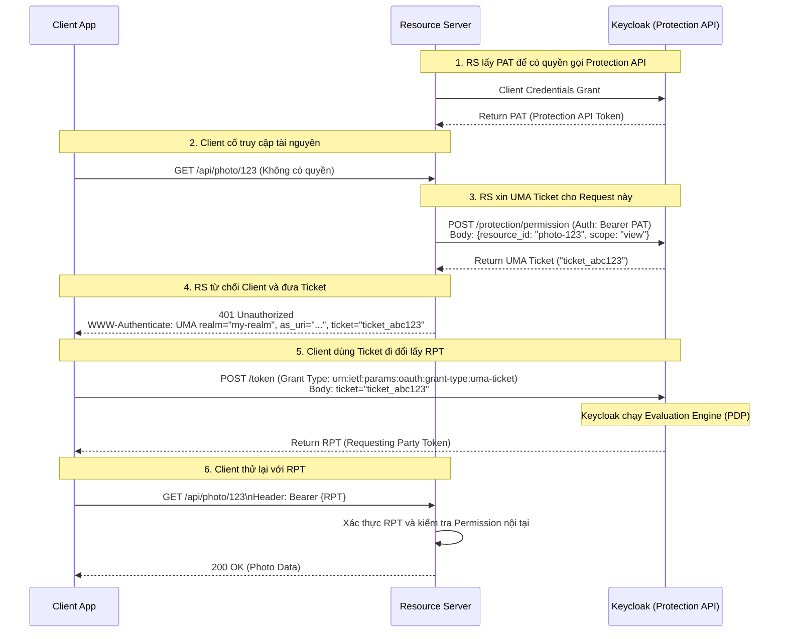

> [!NOTE]
> **Category:** Theory
> **Goal:** Hiểu sâu về cách Keycloak phơi bày Protection API, phân biệt và nắm rõ vòng đời của các loại Tokens đặc thù trong quy trình UMA: PAT, RPT và UMA Ticket.

## 1. Lý thuyết chuyên sâu (Detailed Theory)

Trong luồng UMA (User-Managed Access) của Keycloak, ngoài Access Token (dùng trong OAuth2/OIDC), chúng ta cần tương tác với các loại Token chuyên biệt và một API quản trị từ xa gọi là **Protection API**.

**Protection API là gì?**
Đây là một tập hợp các RESTful endpoints do Keycloak (đóng vai trò là Authorization Server) cung cấp, cho phép Resource Server (API Backend) thực hiện các tác vụ quản lý theo chuẩn UMA: đăng ký Resource mới, quản lý Scope, và đặc biệt là sinh ra các *Permission Tickets*.

Để gọi được Protection API và thực hiện luồng cấp quyền, chúng ta có 3 khái niệm cốt lõi về "Token/Ticket":
*   **PAT (Protection API Token):** Đây thực chất là một Access Token đặc biệt, cấp riêng cho Resource Server (Client). Resource Server dùng PAT để xác thực chính nó với Keycloak khi nó cần gọi Protection API (ví dụ: "Tôi là API Backend, tôi muốn đăng ký một Resource mới tên là 'Ảnh của Bob'").
*   **UMA Ticket (Permission Ticket):** Là một chuỗi mã mờ (opaque string) do Keycloak cấp cho Resource Server. Ticket này đại diện cho *một yêu cầu truy cập cụ thể* (bao gồm việc xin phép truy cập Resource ID nào, với Scope gì) mà một người dùng (Requesting Party) đang cố gắng thực hiện nhưng chưa có quyền.
*   **RPT (Requesting Party Token):** Đây là phần thưởng cuối cùng. Sau khi Client cầm UMA Ticket đi xin quyền từ Keycloak và được phê duyệt (đánh giá Policy thành công), Keycloak sẽ cấp RPT. RPT về bản chất là một JSON Web Token (JWT) hoặc token mờ, bên trong chứa toàn bộ các Permissions (quyền) mà hệ thống vừa cấp. Client sẽ dùng RPT này để gọi lại Resource Server và lấy dữ liệu.

## 2. Luồng nội bộ & Cơ chế cấp thấp (Internal Workflow & Low-level Mechanisms)

Luồng chi tiết trao đổi giữa Client, Resource Server và Keycloak để lấy RPT thông qua UMA Ticket:



## 3. Thực hành tốt nhất & Bảo mật (Best Practices & Security)

*   **Bảo mật PAT tuyệt đối:** PAT cho phép truy cập vào Protection API để tạo/xóa các Resource của hệ thống. Client App (trên trình duyệt/mobile) KHÔNG BAO GIỜ được phép biết đến PAT. Chỉ Resource Server (chạy ở Backend an toàn) mới được lưu giữ và sử dụng PAT.
*   **Xác thực nội dung RPT (RPT Introspection):** Dù RPT ở định dạng JWT (có thể xác thực offline bằng Public Key), nhưng vì UMA cho phép người dùng (Resource Owner) thu hồi quyền bất kỳ lúc nào, tốt nhất Resource Server nên thực hiện xác thực trực tuyến (Token Introspection) hoặc để thời gian sống (TTL) của RPT thật ngắn (ví dụ: 1-5 phút).
> [!WARNING]
> UMA Ticket có vòng đời cực ngắn (thường mặc định vài phút) và chỉ được sử dụng một lần. Nếu Client App nhận được Ticket nhưng không mang đi đổi RPT ngay, Ticket sẽ báo lỗi hết hạn.

## 4. Cấu hình minh họa thực tế (Configuration Examples)

Ví dụ đoạn mã Client gửi Request lên Keycloak để đổi UMA Ticket lấy RPT (Sử dụng grant type chuẩn của UMA 2.0):

```bash
# Lệnh cURL từ Client App đổi Ticket lấy RPT
curl -X POST https://{keycloak-server}/realms/{realm}/protocol/openid-connect/token \
  -H "Authorization: Bearer {client_access_token}" \
  -H "Content-Type: application/x-www-form-urlencoded" \
  -d "grant_type=urn:ietf:params:oauth:grant-type:uma-ticket" \
  -d "ticket={TICKET_NHAN_DUOC_TU_RESOURCE_SERVER}"
```

Nội dung Payload (JWT claims) bên trong một RPT sau khi giải mã (chú ý claim `authorization`):

```json
{
  "exp": 1612345678,
  "iss": "https://{keycloak-server}/realms/{realm}",
  "aud": "my-resource-server",
  "sub": "user_id_of_requesting_party",
  "authorization": {
    "permissions": [
      {
        "rsid": "resource_photo_123_id",
        "rsname": "Photo 123",
        "scopes": ["view"]
      }
    ]
  }
}
```

## 5. Trường hợp ngoại lệ (Edge Cases)

*   **Resource Owner chưa cấp quyền (Need Info/Approval):** Khi đổi Ticket lấy RPT, nếu Policy yêu cầu Resource Owner phải vào Approve, Keycloak sẽ không trả về RPT ngay mà trả về lỗi `need_info` kèm theo một URL để Client điều hướng User tới trang chờ phê duyệt. Client phải xử lý mã lỗi này chuẩn xác.
*   **Cấp quyền một phần (Partial Authorization):** Nếu Client xin quyền trên 3 Resource, nhưng Policy chỉ cho phép 2 Resource. RPT trả về sẽ chỉ chứa 2 Permission. Resource Server cần kiểm tra chặt chẽ xem quyền trả về trong RPT có đủ để thực hiện hành vi hay không, chứ không chỉ đơn thuần là xem Token có hợp lệ không.

## 6. Câu hỏi Phỏng vấn (Interview Questions)

1.  **Junior:** PAT là gì và ai sử dụng nó?
    *   *Đáp án:* PAT là Protection API Token. Nó được sử dụng bởi Resource Server (API Backend) để giao tiếp an toàn với Keycloak nhằm quản lý tài nguyên và lấy Permission Tickets.
2.  **Junior:** Sự khác biệt giữa Access Token thông thường và RPT?
    *   *Đáp án:* Access Token thông thường chủ yếu mang thông tin danh tính (Identity, Roles) do OIDC cấp. RPT là một Access Token đặc biệt, có thêm claim `authorization` chứa danh sách tường minh các quyền (Permissions) mà hệ thống cấp cho phiên làm việc đó.
3.  **Senior:** Tại sao lại cần UMA Ticket làm trung gian thay vì báo trực tiếp cho Client biết là nó bị chặn vì thiếu quyền X trên tài nguyên Y?
    *   *Đáp án:* UMA Ticket tăng tính bảo mật và trừu tượng hóa. Client không cần biết cấu trúc tài nguyên, scope nội bộ hay các luật nằm trên Resource Server. Client chỉ nhận một chuỗi mờ (opaque string) từ Resource Server, mang nó sang Keycloak, Keycloak sẽ tự giải mã vé đó để biết Client đang xin cái gì.
4.  **Senior:** Nếu một API Server không có tính năng tạo Resource tự động, mọi Resource đều tạo bằng tay trên Admin Console. Vậy hệ thống có cần gọi Protection API không?
    *   *Đáp án:* Không nhất thiết phải gọi API tạo Resource. Tuy nhiên, nó vẫn cần Protection API để sinh UMA Ticket khi từ chối quyền truy cập của Client (để Client có Ticket chạy luồng xin RPT).
5.  **Senior:** Giải thích mã lỗi HTTP `401 Unauthorized` trả về kèm header `WWW-Authenticate: UMA ticket="..."` trong ngữ cảnh UMA?
    *   *Đáp án:* Theo chuẩn RFC của UMA, thay vì trả 403 Forbidden, Resource Server đóng vai trò PEP sẽ chặn Request và trả 401 kèm theo HTTP Header `WWW-Authenticate`. Header này chứa thông tin Authorization Server URL và cái `ticket` vừa sinh ra. Client framework phải biết đọc Header này để tiếp tục luồng.

## 7. Tài liệu tham khảo (References)

*   [Keycloak Docs: Protection API](https://www.keycloak.org/docs/latest/authorization_services/#_service_protection_api)
*   [Keycloak Docs: Requesting Party Token](https://www.keycloak.org/docs/latest/authorization_services/#_service_rpt_overview)
*   [UMA 2.0 Grant for OAuth 2.0 Authorization (RFC)](https://docs.kantarainitiative.org/uma/wg/rec-oauth-uma-grant-2.0.html)
