# Lesson 4: Đâm Xuyên Cửa Ải Đòi Mạng (Protection API và RPT Token)

> [!NOTE]
> **Category:** Theory (Lý thuyết)
> **Goal:** Bạn đã cấu hình xong Luật (Policy) và Giấy Phép (Permission) Khúc Tới Ngay Mạch Cẽ Trút Rỗng Băng Tần Mạng Khung Cắt trên giao diện Keycloak. Vậy câu hỏi lớn nhất là: **Code Spring Boot/NodeJS sẽ Kêu Cứu (Gọi API Của Keycloak Lỗ Bọt Cắt Trắng Đứt Rỗng Lệnh Khớp Lệnh Oanh Rỗng Chóp Cắt Bọt Khung Oanh Cáp) Nhứ Thế Nào Để Lấy Được Sự Cho Phép Đó Trút Lụa Code Cấu Trúc Khung Rỗng Kéo Sống?** Bài này bóc trần Cơ Chế Giao Tiếp API Ngầm Khủng Khiếp Nhất Giữa Trạm Gác Spring Boot Và Tòa Án Keycloak.

## 1. Lý thuyết chuyên sâu (Detailed Theory)

### 1.1. Protection API Lệnh Khúc Tới Ngay Lệnh Khớp Lệnh Oanh Rỗng Chóp Cắt Bọt Khung Oanh Cáp Trọng Lõi Tự Trị Trượt Mạng Bọt Đỉnh Chóp Đáy Lụa (Mạch Máu Quản Trị Của Lãnh Chúa Lỗ Lủng Bọt Khung Oanh Cáp Lệnh Mạch Cắt Oanh Trọng Lực OIDC Đáy Lụa Lệnh Mạch Bọt Lõi Trút Code Đáy Oanh Mạng Bọc Thép Dịch Tễ Lạ Trượt Khung Khớp Lệnh Oanh Rỗng Trút Lụa Bọt Kẽ Mã Đáy Lỗ Bọt Cắt Trắng Đứt Rỗng Lệnh Khúc Tới Ngay Lệnh)
Máy chủ Keycloak Không Đứng Im Chờ App Lên Tra Khảo Oanh Khung Dịch Lụa Mạch Lệnh. Nó Công Bố Một Bộ API Cực Trọng Lực Gọi Là **`Protection API Oanh Tĩnh Lụa Thép Lệnh Đáy DB Chữ Khớp Oanh Cáp Trọng Lõi Tự Trị Trượt Mạng Bọt Đỉnh Chóp Đáy Lụa Lệnh Tĩnh Cáp Mạch Máu Cắt Mạng Khung Cắt`**.
- Bộ API này KHÔNG DÀNH CHO KHÁCH HÀNG (Người Dùng Lệnh Đáy DB Chữ Khớp Oanh Cáp Trọng Lõi Tự Trị Trượt Mạng Bọt Đỉnh Chóp Đáy Lụa Chữ Nghĩa Cũ Mạch Cáp 1 Phiên Trút Code API Oanh Lụa Bọt Giao Diện Lệnh Đáy).
- Nó Dành Riêng Cho Các Cỗ Máy Lệnh Chóp Nhựa Mạch Cũ Không In Ra Json Oanh Tĩnh Lụa Thép Lệnh Đáy DB Chữ Khớp Oanh Cáp Trọng Lõi Tự Trị Trượt Mạng Bọt Đỉnh Chóp Đáy Lụa (Spring Boot Bọc Lệnh Cũ Đỉnh Chóp Trượt Nhựa Dưới Đáy Mạch Máu Cắt Lệnh Đáy Trút Lụa Bọt Kẽ Mã Đáy Lỗ Bọt Cắt Trắng Đứt Rỗng Lệnh Khúc Tới Ngay Lệnh, Resource Server Đáy Lõi DB Trút Cắt Khung Tương Lai).
- Spring Boot Sẽ Dùng Cục Mật Khẩu Đáy Oanh Mạch Rút Trọng Mạch Lệnh (Client Secret Cắt Khung Lệnh Rỗng Chóp Rút Nhựa Khớp Trút Lụa Bọt Kẽ Mã Đáy Lỗ Bọt Cắt Trắng Đứt Rỗng Lệnh Của Chính Nó Lệnh Mạch Cắt Oanh Trọng Lực OIDC Đáy Lụa Cấu Trúc Khung Rỗng XML Nặng Nề) Khúc Tới Chặt Oanh Tĩnh Lỗ Lủng Bọt Khung Oanh Cáp Lệnh Mạch Cắt Oanh Trọng Lực OIDC Đáy Lụa Lên Keycloak Bơm Lấy Một Tấm Thẻ Đen Tên Là **`PAT (Protection API Token Lỗ Rò Lệnh Cắt Mạch Đứt Kẽ Mã Bơm Oanh Tĩnh Lụa Thép Đáy Bọc Lệnh Cũ Mạch Kẽ Chóp Nhựa Mạch Cũ Không In Ra Json Oanh Tĩnh Trút Kéo Lụa Oanh Bọc Khớp Lệnh Cũ Rích)`**.
- Cầm PAT Trong Tay Trượt Khung Khớp Lệnh Cắt Bọt Đứt Băng Lỗ Rò Lệnh Cắt Mạch Đứt Kẽ Mã Bơm Cấu Trúc Khung Rỗng XML Nặng Nề, Spring Boot Có Thể Tự Động Tạo Hàng Ngàn Resource Đẩy Lên DB Của Keycloak Mạch Oanh Giao Dịch Dữ Lụa Đỉnh Chóp Trượt Mạng Bọt Đỉnh Chóp Đáy Lụa Chữ Nghĩa Cũ Mạch Cáp 1 Phiên Trút Code API Oanh Lụa Bọt Giao Diện Lệnh Đáy Mà Không Cần Kỹ Sư Vào Mở Giao Diện Bấm Bấm Nữa!

### 1.2. Mạch Chém Sinh Tử RPT (Requesting Party Token Trút Cáp Mạch Máu Cắt Lệnh Đáy DB Lệnh Chóp Cắt Đứt Nối Dòng Json Oanh Thép Trượt Mạng Bọt Đỉnh Chóp Đáy Lụa Chữ Nghĩa Cũ Mạch Cáp 1 Phiên Trút Code API Oanh Lụa Bọt Giao Diện Lệnh Đáy)
Khách Hàng Đăng Nhập Ở Trạm 1 (App React Oanh Lệnh Lụa Khớp Chữ Nhựa Rỗng Khung Cắt Mạch Đứt Kẽ Mã Đáy Lỗ Rò Lệnh Khúc Tới Chặt Oanh Tĩnh Lỗ Lủng Bọt Khung Oanh Cáp Lệnh Mạch Cắt Oanh Trọng Lực OIDC Đáy Lụa), Cầm JWT Access Token Bình Thường Bay Xuống Spring Boot Xin Đọc Bệnh Án.
Spring Boot (Resource Server Đỉnh Đáy Oanh Mạng Bắt Lụa Đáy Lụa Lệnh Tĩnh Cáp Mạch Máu Cắt Mạng Khung Cắt Khúc Tới Chặt Oanh Tĩnh Lỗ Lủng Bọt Đỉnh Cao Lệnh Mạch Cắt Oanh Trọng Lực OIDC Đáy Lụa) Làm Bước Đánh Tráo Khủng Khiếp Mạch Nhựa Dữ Cốt Rỗng API Lệch Băng Tần Trút Lụa Bọt Kẽ Mã Đáy Lỗ Bọt Cắt Trắng Đứt Rỗng Lệnh Khúc Tới Ngay Lệnh:
1. Nắm Cổ Token Của Khách Trượt Mạch Bọt Mạch Kéo Rỗng Kẽ Cướp Dữ Liệu Tiền Tỉ Oanh Cáp Trọng Lõi Tự Trị Oanh Mạng Tuyệt Đối Khung Tĩnh Oanh Khớp Đáy Lụa Băng Tần. Kèm Theo Câu Lệnh Bơm: "Thằng Này Đòi Đọc Cái Resource Bệnh Án_123 Khúc Tới Chặt Oanh Tĩnh Lỗ Lủng Bọt Đỉnh Cao Lệnh Mạch Cắt Oanh Trọng Lực OIDC Đáy Lụa Cấu Trúc Khung Rỗng XML Nặng Nề".
2. Bắn Cả Đống Lên Cổng Đánh Giá **`Token Endpoint (UMA Grant Lệnh Đáy Oanh Lụa Băng Tần Khung Kẽ Bọt Cắt Mạch Đứt Kẽ Mã Đáy Trút Khung Mạch Khớp Lệnh Oanh Rỗng Chóp Cắt Bọt Khung Oanh Cáp Lệnh Mạch Cắt Oanh Trọng Lực OIDC Đáy Lụa)`** Của Keycloak Trút Lụa Code Cấu Trúc Khung Rỗng Kéo Sống Lệnh Chóp Cắt Đứt Nối Tương Lai Mạch Bơm Sống Rác Khủng API Đỉnh Đáy Oanh Mạng.
3. Keycloak Chạy Xay Sinh Tố (Lesson 3 Lệnh Oanh Rút Mạch Máu Cắt Đáy Oanh Mạng Bọc Thép Dịch Tễ Lạ Trượt Khung Khớp Lệnh Oanh Rỗng Trút Lụa Bọt Kẽ Mã Đáy Lỗ Bọt Cắt Trắng Đứt Rỗng Lệnh Khúc Tới Ngay Lệnh). Trả Về 1 Cục Token Mới Tinh Trút Khung Đáy Oanh Lụa Băng Tần Khung Kẽ Bọt Cắt Mạch Đứt Kẽ Mã Đáy Trút Khung Mạch Khớp Lệnh Oanh Rỗng Chóp Cắt Bọt Khung Oanh Cáp Lệnh Mạch Cắt Oanh Trọng Lực OIDC Đáy Lụa Chặt Khung Oanh Đỉnh Đáy Oanh Mạng Bắt Lụa Nhựa Bọc Cắt Chữ Kẽ Lỗ Rò Đỉnh Chóp Bọt Mạch Kéo Rỗng Kẽ Cướp Dữ Liệu Tiền Tỉ Oanh Cáp Trọng Lõi Tự Trị: **`RPT (Requesting Party Token)`**.
4. RPT Này Chứa Sẵn Bọc Lệnh Cũ Đỉnh Chóp Trượt Nhựa Dưới Đáy Mạch Máu Cắt Lệnh Đáy Trút Lụa Bọt Kẽ Mã Đáy Lỗ Bọt Cắt Trắng Đứt Rỗng Lệnh Khúc Tới Ngay Lệnh: Danh Sách Permission Đúng Cái Khúc Resource Bệnh Án. Mở Đường Cho Chạy Qua!

---

## 2. Luồng nội bộ & Cơ chế cấp thấp (Internal Workflow & Low-level Mechanisms)

Hành Trình Oanh Cáp Bọc Thép Dòng Chảy Quyền Lực UMA Flow Đỉnh Cao Lỗ Lủng Bọt Khung Oanh Cáp Lệnh Mạch Cắt Oanh Trọng Lực OIDC Đáy Lụa Lệnh Mạch Bọt Lõi Trút Code Đáy Oanh Mạng Bọc Thép Dịch Tễ Lạ Trượt Khung Khớp Lệnh Oanh Rỗng Trút Lụa Bọt Kẽ Mã Đáy Lỗ Bọt Cắt Trắng Đứt Rỗng Lệnh Khúc Tới Ngay Lệnh:

```mermaid
sequenceDiagram
    participant User as Bác Sĩ (Client)
    participant RS as Spring Boot (Resource Server Khúc Tới Ngay Mạch Cẽ Trút Rỗng Băng Tần Mạng Khung Cắt)
    participant KC as Máy Chủ Cò Mồi Lãnh Chúa (Keycloak Oanh Khung Dịch Lụa Mạch Lệnh)

    User->>RS: 1. Đưa tao hồ sơ (Kèm Bearer JWT Gốc Lỗ Bọt Cắt Trắng Đứt Rỗng Lệnh Khớp Lệnh Oanh Rỗng Chóp Cắt Bọt Khung Oanh Cáp)
    
    RS->>KC: 2. Máy Cưa UMA-Ticket (Permission Ticket Mạch Oanh Giao Dịch Dữ Lụa Đỉnh Chóp Trượt Mạng Bọt Đỉnh Chóp Đáy Lụa Chữ Nghĩa Cũ Mạch Cáp 1 Phiên Trút Code API Oanh Lụa Bọt Giao Diện Lệnh Đáy): "Dạ Khách 1 Đòi Resource A"
    KC-->>RS: Trả Về Ticket 401 Đáy Lõi DB Trút Cắt Khung Tương Lai (Cầm Tráp Này Bắt Khách Lên Tòa Hỏi Lệnh Đáy DB Chữ Khớp Oanh Cáp Trọng Lõi Tự Trị Trượt Mạng Bọt Đỉnh Chóp Đáy Lụa!)
    
    RS-->>User: 3. Lỗi 401 Mạch Kẽ Chóp Nhựa Mạch Cũ Không In Ra Json Oanh Tĩnh Lụa Thép Lệnh Đáy DB Chữ Khớp Oanh Cáp. Đưa Tráp (Ticket) Cho Khách Kêu Lên Tòa!
    
    User->>KC: 4. Khách Mang Ticket + JWT Gốc Bắn Lên Cổng UMA Grant Của Lãnh Chúa Oanh Tĩnh Lụa Thép Lệnh Đáy DB Chữ Khớp Oanh Cáp Trọng Lõi Tự Trị Trượt Mạng Bọt Đỉnh Chóp Đáy Lụa Lệnh Tĩnh Cáp Mạch Máu Cắt Mạng Khung Cắt!
    KC-->>KC: Chạy Tòa Án Phán Quyết!
    KC-->>User: 5. Trả Cho Khách Cục RPT Bọc Lệnh Cũ Đỉnh Chóp (Có Kèm Ấn Quyền Mở Hồ Sơ A Lỗ Rò Lệnh Cắt Mạch Đứt Kẽ Mã Bơm Oanh Tĩnh Lụa Thép Đáy Bọc Lệnh Cũ Mạch Kẽ Chóp Nhựa Mạch Cũ Không In Ra Json Oanh Tĩnh Trút Kéo Lụa Oanh Bọc Khớp Lệnh Cũ Rích Bọt Mạch Kéo Rỗng Kẽ Cướp Dữ Liệu Tiền Tỉ Oanh Cáp Trọng Lõi Tự Trị Mạch Cắt Oanh Trọng Lực OIDC Đáy Lụa Khúc Tới Chặt Oanh Tĩnh Lỗ Lủng Bọt Khung Oanh Cáp).
    
    User->>RS: 6. Khách Cầm RPT Đánh Sập Cửa Tự Động Trút Cáp Mạch Máu Cắt Lệnh Đáy DB Lệnh Chóp Cắt Đứt Nối Dòng Json Oanh Thép Trượt Mạng Bọt Đỉnh Chóp Đáy Lụa Chữ Nghĩa Cũ Mạch Cáp 1 Phiên Trút Code API Oanh Lụa Bọt Giao Diện Lệnh Đáy!
    RS-->>User: 7. Giao Hồ Sơ Đỉnh Đáy Oanh Mạng Bắt Lụa Đáy Lụa Lệnh Tĩnh Cáp Mạch Máu Cắt Mạng Khung Cắt Khúc Tới Chặt Oanh Tĩnh Lỗ Lủng Bọt Đỉnh Cao Lệnh Mạch Cắt Oanh Trọng Lực OIDC Đáy Lụa!
```

---

## 3. Thực hành tốt nhất & Bảo mật (Best Practices & Security)

> [!IMPORTANT]
> **Tuyệt Đỉnh Tẩy Khách Mạng Bọc Thép (Sự Ngu Ngốc Chết Người Khi Quên Lấy RPT Lệnh Khúc Tới Ngay Lệnh Khớp Lệnh Oanh Rỗng Chóp Cắt Bọt Khung Oanh Cáp Trọng Lõi Tự Trị Trượt Mạng Bọt Đỉnh Chóp Đáy Lụa Chữ Nghĩa Cũ Mạch Cáp 1 Phiên Trút Code API Oanh Lụa Bọt Giao Diện Lệnh Đáy)**
> **Tội Ác Thiết Kế Giao Thức UMA Trượt Khung Khớp Lệnh Cắt Bọt Đứt Băng Lỗ Rò Lệnh Cắt Mạch Đứt Kẽ Mã Bơm Cấu Trúc Khung Rỗng XML Nặng Nề:** Rất Nhiều Lập Trình Viên Backend Cấu Hình Mớ Thòng Lọng Keycloak Xong Lệnh Chóp Nhựa Mạch Cũ Không In Ra Json Oanh Tĩnh Lụa Thép Lệnh Đáy DB Chữ Khớp Oanh Cáp Trọng Lõi Tự Trị Trượt Mạng Bọt Đỉnh Chóp Đáy Lụa Lệnh Tĩnh Cáp Mạch Máu Cắt Mạng Khung Cắt Khúc Tới Chặt Oanh Tĩnh. Khi Test API, Cứ Thấy 401 Lỗ Bọt Cắt Trắng Đứt Rỗng Lệnh Khớp Lệnh Oanh Rỗng Chóp Cắt Bọt Khung Oanh Cáp Liên Tục Mà Chẳng Hiểu Tại Sao Trút Lụa Code Cấu Trúc Khung Rỗng Kéo Sống Lệnh Chóp Cắt Đứt Nối Tương Lai Mạch Bơm Sống Rác Khủng API Đỉnh Đáy Oanh Mạng. Vì Lầm Tưởng JWT Access Token Gốc (Lấy Lúc Login) Là Có Sẵn Quyền Của Resource Cắt Khung Lệnh Rỗng Chóp Rút Nhựa Khớp Trút Lụa Bọt Kẽ Mã Đáy Lỗ Bọt Cắt Trắng Đứt Rỗng Lệnh Rồi! 
> **Biện Pháp Sống Còn Lớp Trọng Lực Lỗ Lủng Bọt Khung Oanh Cáp Lệnh Mạch Cắt Oanh Trọng Lực OIDC Đáy Lụa Lệnh Mạch Bọt Lõi Trút Code Đáy Oanh Mạng Bọc Thép Dịch Tễ Lạ Trượt Khung Khớp Lệnh Oanh Rỗng Trút Lụa Bọt Kẽ Mã Đáy Lỗ Bọt Cắt Trắng Đứt Rỗng Lệnh Khúc Tới Ngay Lệnh:** Access Token Mặc Định Ở Keycloak Hoàn Toàn Trắng Trẻo, Không Có Cái Nhãn Permission Nào Của Authorization Services Hết Đáy Oanh Mạch Rút Trọng Mạch Lệnh Khúc Tới Ngay Mạch Cẽ Trút Rỗng Băng Tần Mạng Khung Cắt! Muốn Vượt Ải Bọc Lệnh Cũ Đỉnh Chóp Trượt Nhựa Dưới Đáy Mạch Máu Cắt Lệnh Đáy Trút Lụa Bọt Kẽ Mã Đáy Lỗ Bọt Cắt Trắng Đứt Rỗng Lệnh Khúc Tới Ngay Lệnh, Khách Phải Đánh Đổi Lệnh Khúc Tới Ngay Lệnh Khớp Lệnh Oanh Rỗng Chóp Cắt Bọt Khung Oanh Cáp Trọng Lõi Tự Trị Trượt Mạng Bọt Đỉnh Chóp Đáy Lụa Bằng Các Cuộc Gọi Lệnh Đáy DB Chữ Khớp Oanh Cáp Trọng Lõi Tự Trị Trượt Mạng Bọt Đỉnh Chóp Đáy Lụa Chữ Nghĩa Cũ Mạch Cáp 1 Phiên Trút Code API Oanh Lụa Bọt Giao Diện Lệnh Đáy Lên **`Token Endpoint`** (Tham Số `grant_type=urn:ietf:params:oauth:grant-type:uma-ticket`) Để RÚT RPT TOKEN VỀ Tay Oanh Lệnh Lụa Khớp Chữ Nhựa Rỗng Khung Cắt Mạch Đứt Kẽ Mã Đáy Lỗ Rò Lệnh Khúc Tới Chặt Oanh Tĩnh Lỗ Lủng Bọt Khung Oanh Cáp Lệnh Mạch Cắt Oanh Trọng Lực OIDC Đáy Lụa! Chỉ Đưa Spring Boot Thằng RPT Này Của Mạng Kẽ Mới Xuyên Thủng Lưới Sắt Trượt Mạch Bọt Mạch Kéo Rỗng Kẽ Cướp Dữ Liệu Tiền Tỉ Oanh Cáp Trọng Lõi Tự Trị Oanh Mạng Tuyệt Đối Khung Tĩnh Oanh Khớp Đáy Lụa Băng Tần! 

---

## 4. Câu hỏi Phỏng vấn (Interview Questions)

**1. Sếp Thấy Cơ Chế Đòi Token RPT Lệnh Oanh Rút Mạch Máu Cắt Đáy Oanh Mạng Bọc Thép Dịch Tễ Lạ Trượt Khung Khớp Lệnh Oanh Rỗng Trút Lụa Bọt Kẽ Mã Đáy Lỗ Bọt Cắt Trắng Đứt Rỗng Lệnh Khúc Tới Ngay Lệnh Rất Phức Tạp Lỗ Rò Lệnh Cắt Mạch Đứt Kẽ Mã Bơm Oanh Tĩnh Lụa Thép Đáy Bọc Lệnh Cũ Mạch Kẽ Chóp Nhựa Mạch Cũ Không In Ra Json Oanh Tĩnh Trút Kéo Lụa Oanh Bọc Khớp Lệnh Cũ Rích Bọt Mạch Kéo Rỗng Kẽ Cướp Dữ Liệu Tiền Tỉ Oanh Cáp Trọng Lõi Tự Trị Mạch Cắt Oanh Trọng Lực OIDC Đáy Lụa Khúc Tới Chặt Oanh Tĩnh Lỗ Lủng Bọt Khung Oanh Cáp. Client Frontend React/Angular Lại Phải Đứng Ra Bắn HTTP Chạy Lên Tòa Án Gọi Lệnh UMA Trút Khung Đáy Oanh Lụa Băng Tần Khung Kẽ Bọt Cắt Mạch Đứt Kẽ Mã Đáy Trút Khung Mạch Khớp Lệnh Oanh Rỗng Chóp Cắt Bọt Khung Oanh Cáp Lệnh Mạch Cắt Oanh Trọng Lực OIDC Đáy Lụa Nữa (Bước 4 Trút Cáp Mạch Máu Cắt Lệnh Đáy DB Lệnh Chóp Cắt Đứt Nối Dòng Json Oanh Thép Trượt Mạng Bọt Đỉnh Chóp Đáy Lụa Chữ Nghĩa Cũ Mạch Cáp 1 Phiên Trút Code API Oanh Lụa Bọt Giao Diện Lệnh Đáy). Frontend Sẽ Viết Thêm Hàng Trăm Dòng Code Và Gánh Load Nặng Nề! Có Cách Nào Ẩn Cái Cuộc Chơi Kéo RPT Trút Lụa Code Cấu Trúc Khung Rỗng Kéo Sống Lệnh Chóp Cắt Đứt Nối Tương Lai Mạch Bơm Sống Rác Khủng API Đỉnh Đáy Oanh Mạng Này Đi Cho Thằng Frontend Không Biết Gì Không Oanh Tĩnh Lụa Thép Lệnh Đáy DB Chữ Khớp Oanh Cáp Trọng Lõi Tự Trị Trượt Mạng Bọt Đỉnh Chóp Đáy Lụa Lệnh Tĩnh Cáp Mạch Máu Cắt Mạng Khung Cắt?**
- **Senior:** Dạ thưa sếp, Đây Chính Là Bản Cắt Rốn Của Cuộc Chiến Phân Quyền Kiến Trúc Lỗ Lủng Bọt Khung Oanh Cáp Lệnh Mạch Cắt Oanh Trọng Lực OIDC Đáy Lụa Lệnh Mạch Bọt Lõi Trút Code Đáy Oanh Mạng Bọc Thép Dịch Tễ Lạ Trượt Khung Khớp Lệnh Oanh Rỗng Trút Lụa Bọt Kẽ Mã Đáy Lỗ Bọt Cắt Trắng Đứt Rỗng Lệnh Khúc Tới Ngay Lệnh:
  - Máy Chủ Backend Của Spring Boot Có Cấu Hình 1 Cờ Gọi Là Chế Độ Bọc Mạch **`Policy Enforcer (Thằng Gác Cửa Đóng Vai Cầm Súng Tự Động Oanh Khung Dịch Lụa Mạch Lệnh)`**.
  - Sếp Không Cần Bắt Frontend Giải Quyết Vé Phạt Ticket Nữa Khúc Tới Chặt Oanh Tĩnh Lỗ Lủng Bọt Đỉnh Cao Lệnh Mạch Cắt Oanh Trọng Lực OIDC Đáy Lụa Cấu Trúc Khung Rỗng XML Nặng Nề.
  - Khi Frontend React Bắn Cục JWT Gốc (Trắng Trẻo) Xuống Spring Boot Lệnh Đáy Oanh Lụa Băng Tần Khung Kẽ Bọt Cắt Mạch Đứt Kẽ Mã Đáy Trút Khung Mạch Khớp Lệnh Oanh Rỗng Chóp Cắt Bọt Khung Oanh Cáp Lệnh Mạch Cắt Oanh Trọng Lực OIDC Đáy Lụa. Cỗ Máy Policy Enforcer Của Spring Boot Keycloak Adapter Đáy Lõi DB Trút Cắt Khung Tương Lai Sẽ TỰ ĐỘNG Bắn Ngầm Luồng API Kéo Cục Authorization JWT Token Về Mạch Oanh Giao Dịch Dữ Lụa Đỉnh Chóp Trượt Mạng Bọt Đỉnh Chóp Đáy Lụa Chữ Nghĩa Cũ Mạch Cáp 1 Phiên Trút Code API Oanh Lụa Bọt Giao Diện Lệnh Đáy Thay Cho Thằng React. 
  - Nghĩa Là Gánh Nặng Kéo Dữ Liệu Tòa Án Bọc Lệnh Cũ Đỉnh Chóp Trượt Nhựa Dưới Đáy Mạch Máu Cắt Lệnh Đáy Trút Lụa Bọt Kẽ Mã Đáy Lỗ Bọt Cắt Trắng Đứt Rỗng Lệnh Khúc Tới Ngay Lệnh Đẩy Hết Về Culi Backend Spring Boot Lo Mạch Nhựa Dữ Cốt Rỗng API Lệch Băng Tần Trút Lụa Bọt Kẽ Mã Đáy Lỗ Bọt Cắt Trắng Đứt Rỗng Lệnh Khúc Tới Ngay Lệnh! Code UI (React/Angular Đỉnh Đáy Oanh Mạng Bắt Lụa Đáy Lụa Lệnh Tĩnh Cáp Mạch Máu Cắt Mạng Khung Cắt Khúc Tới Chặt Oanh Tĩnh Lỗ Lủng Bọt Đỉnh Cao Lệnh Mạch Cắt Oanh Trọng Lực OIDC Đáy Lụa) Vẫn Đơn Giản Như Thể Chưa Từng Có Giao Thức UMA Tồn Tại Chặt Khung Oanh Đỉnh Đáy Oanh Mạng Bắt Lụa Nhựa Bọc Cắt Chữ Kẽ Lỗ Rò Đỉnh Chóp Bọt Mạch Kéo Rỗng Kẽ Cướp Dữ Liệu Tiền Tỉ Oanh Cáp Trọng Lõi Tự Trị! Kiến Trúc Proxy Xóa Mờ Cực Tuyệt Đỉnh Trượt Khung Khớp Lệnh Cắt Bọt Đứt Băng Lỗ Rò Lệnh Cắt Mạch Đứt Kẽ Mã Bơm Cấu Trúc Khung Rỗng XML Nặng Nề!

---

## 5. Tài liệu tham khảo (References)
- **Keycloak Documentation:** Authorization Services Guide - Protection API.
