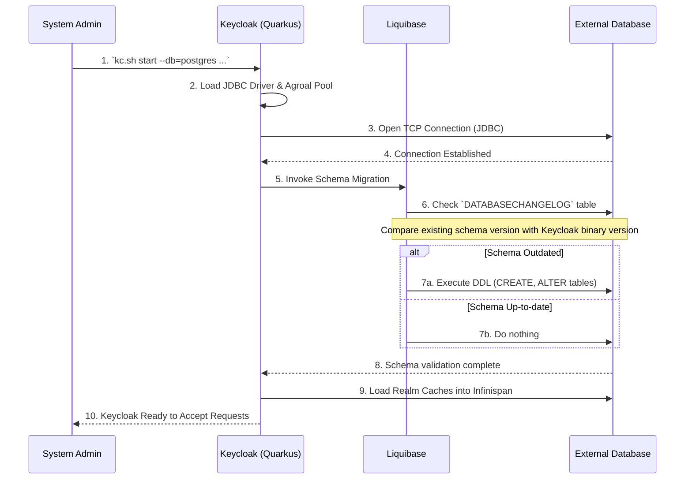

> [!NOTE]
> **Category:** Theory
> **Goal:** Hiểu sâu về cấu trúc lưu trữ của Keycloak, tầm quan trọng của việc chuyển từ cơ sở dữ liệu nhúng (H2) sang cơ sở dữ liệu phân tán (External Database) và quy trình giao tiếp nội bộ.

## 1. Lý thuyết chuyên sâu (Detailed Theory)
Mặc định, Keycloak đi kèm với một cơ sở dữ liệu nội trú (in-memory hoặc file-based) là **H2**. H2 rất tuyệt vời cho việc phát triển (Development) và thử nghiệm, nhưng **tuyệt đối không được sử dụng trong Production**. Tại sao? Vì H2 không hỗ trợ khả năng mở rộng ngang (Horizontal Scaling), gặp vấn đề về khóa bảng (Table Locking) khi có đồng thời nhiều kết nối, và dữ liệu có thể bị hỏng (corrupted) khi quá trình tắt dịch vụ (shutdown) xảy ra đột ngột.

Để triển khai Production, Keycloak phải được cấu hình kết nối tới một **External Database** (Cơ sở dữ liệu bên ngoài) như PostgreSQL, MySQL, MariaDB, Oracle, hoặc Microsoft SQL Server. Cơ sở dữ liệu này đóng vai trò là "Nguồn chân lý" (Source of Truth) cho toàn bộ hệ thống, lưu trữ:
- **Realm & Client Configuration:** Thông tin các ứng dụng, cấu hình OIDC/SAML.
- **User Data:** Tài khoản, thông tin cá nhân (Attributes), thông tin xác thực (Passwords dạng hash, OTP seeds).
- **Role & Group Bindings:** Quyền hạn và phân cấp nhóm của người dùng.
- **Persistent Sessions (Offline Sessions):** Các phiên làm việc ngoại tuyến cần tồn tại khi hệ thống khởi động lại.

## 2. Luồng nội bộ & Cơ chế cấp thấp (Internal Workflow & Low-level Mechanisms)
Khi Keycloak (dựa trên nền tảng Quarkus) khởi động, nó không đơn giản chỉ kết nối vào cơ sở dữ liệu. Nó sử dụng công cụ quản lý thay đổi schema là **Liquibase** để tự động cập nhật và duy trì cấu trúc bảng.



**Step-by-step Giải thích:**
1. Lệnh khởi chạy được gọi, yêu cầu sử dụng Database loại PostgreSQL.
2. Keycloak load driver tương ứng và khởi tạo Connection Pool.
3. Kết nối JDBC được thiết lập tới External Database.
4. Quá trình kiểm tra phiên bản cấu trúc dữ liệu bắt đầu. Keycloak sử dụng Liquibase.
5. Liquibase đọc bảng `DATABASECHANGELOG` trong DB.
6. Nếu Keycloak vừa được nâng cấp (Upgrade), Liquibase tự động chạy các lệnh DDL (Data Definition Language) để thêm cột, tạo bảng mới, hoặc cập nhật Index.
7. Khi DB đã đồng bộ, Keycloak thực hiện một loạt lệnh `SELECT` để tải cấu hình (Realms, Clients) vào bộ nhớ đệm phân tán (Infinispan Cache) nhằm tối ưu tốc độ đọc.
8. Hệ thống khởi động thành công và sẵn sàng phục vụ.

## 3. Thực hành tốt nhất & Bảo mật (Best Practices & Security)

> [!IMPORTANT]
> **Schema Auto-Update trong môi trường High Availability (HA):** Khi nâng cấp cụm Keycloak (nhiều nodes), nhiều node có thể cùng cố gắng chạy Liquibase để cập nhật Schema. Liquibase có cơ chế khóa (`DATABASECHANGELOGLOCK`), tuy nhiên tốt nhất là nên dừng toàn bộ cụm, cập nhật 1 node trước để nó làm nhiệm vụ Migration, sau đó mới khởi động các node còn lại.

> [!WARNING]
> **Database Credentials Security:** Không bao giờ lưu trữ mật khẩu cơ sở dữ liệu dưới dạng plain-text trong file `keycloak.conf`. Hãy sử dụng biến môi trường (Environment Variables) hoặc công cụ quản lý Secret (như HashiCorp Vault, Kubernetes Secrets).

- **Tách biệt Network:** Database không bao giờ được phép mở port ra Internet (Public IP). Chỉ cho phép kết nối từ dải IP của các node Keycloak.
- **TLS for Database Connection:** Đảm bảo kết nối JDBC giữa Keycloak và Database được mã hóa (bằng cách dùng tham số `sslmode=require` đối với PostgreSQL), nhằm chống lại các cuộc tấn công bắt gói tin (Sniffing) trên mạng nội bộ.

## 4. Cấu hình minh họa thực tế (Configuration Examples)

**Cấu hình trong `keycloak.conf` sử dụng Biến môi trường:**
```properties
# Chỉ định loại Database
db=postgres

# Chuỗi kết nối sử dụng biến môi trường (Khuyến nghị cho Docker/K8s)
db-url=jdbc:postgresql://${DB_HOST:localhost}:${DB_PORT:5432}/${DB_NAME:keycloak}?sslmode=require

# Thông tin xác thực (Lấy từ biến môi trường)
db-username=${DB_USER:keycloak}
db-password=${DB_PASSWORD:secret}
```

**Lệnh build tối ưu (Optimized Build):**
Trong Quarkus, việc chọn loại DB phải được thực hiện ở pha Build.
```bash
# Bắt buộc chạy build trước khi start
kc.sh build --db=postgres

# Chạy server
kc.sh start --optimized
```

## 5. Trường hợp ngoại lệ (Edge Cases)
- **Lỗi Lock do Liquibase bị treo:** Nếu quá trình migration bị gián đoạn (do mất điện, crash), Liquibase có thể để lại cờ khóa `LOCKED=1` trong bảng `DATABASECHANGELOGLOCK`. Các node khởi động sau sẽ bị treo vô thời hạn (Waiting for changelog lock). Cách khắc phục: Truy cập DB và chạy thủ công `UPDATE DATABASECHANGELOGLOCK SET LOCKED=0`.
- **Incompatible JDBC Driver:** Sử dụng phiên bản driver không tương thích với phiên bản DB Server (ví dụ: dùng driver quá cũ để kết nối PostgreSQL 15+) sẽ gây ra lỗi `MethodNotSupportedException` ở các lệnh SQL nâng cao. Keycloak mặc định đóng gói sẵn các driver ổn định, chỉ tự ghi đè driver khi thực sự cần thiết.

## 6. Câu hỏi Phỏng vấn (Interview Questions)
1. **Junior:** Tại sao H2 Database không phù hợp cho môi trường Production của Keycloak?
   - *Đáp án:* H2 lưu dữ liệu trên file nội bộ hoặc RAM, không có khả năng nhân bản (replication), gặp lỗi khóa bảng khi truy cập đồng thời cao (High Concurrency) và không cho phép nhiều instance Keycloak cùng kết nối vào một nguồn dữ liệu (không hỗ trợ Cluster).
2. **Junior:** Mục đích của lệnh `kc.sh build --db=<type>` trong kiến trúc Quarkus là gì?
   - *Đáp án:* Quarkus biên dịch (Ahead-of-Time compilation) và chỉ đóng gói các thư viện/driver cần thiết (như driver Postgres). Điều này giúp giảm dung lượng bộ nhớ, tăng tốc độ khởi động, thay vì tải toàn bộ driver của tất cả các loại DB vào RAM.
3. **Senior:** Liquibase hoạt động như thế nào trong Keycloak và làm sao để ngăn chặn lỗi "Race Condition" khi nhiều node khởi động cùng lúc?
   - *Đáp án:* Liquibase quản lý schema qua 2 bảng `DATABASECHANGELOG` và `DATABASECHANGELOGLOCK`. Để tránh race condition, node đầu tiên sẽ thiết lập `LOCKED=1`. Các node khác sẽ phải đợi (poll) cho đến khi `LOCKED=0`.
4. **Senior:** Hãy mô tả cách bạn bảo mật chuỗi kết nối Database trong môi trường Kubernetes.
   - *Đáp án:* Sử dụng Kubernetes Secret để lưu trữ user/password. Gắn Secret đó vào Keycloak Pod dưới dạng Environment Variables (`DB_USER`, `DB_PASSWORD`). Cấu hình `keycloak.conf` để trỏ tới các biến môi trường này. Kích hoạt `sslmode=require` trên chuỗi JDBC.
5. **Senior:** Khi cấu hình External DB, dữ liệu Sessions có được lưu mặc định vào DB không?
   - *Đáp án:* Mặc định, User Sessions (phiên đang hoạt động) được lưu trong bộ nhớ phân tán (Infinispan) để tăng tốc độ truy xuất, KHÔNG lưu vào DB. Chỉ các Offline Sessions (phiên dài hạn) và thông tin User/Realm mới được ghi vào DB.

## 7. Tài liệu tham khảo (References)
- [Keycloak Official Documentation: Configuring the database](https://www.keycloak.org/server/db)
- [Liquibase Official Documentation](https://www.liquibase.org/documentation)
- [PostgreSQL JDBC Driver Documentation](https://jdbc.postgresql.org/documentation/)
