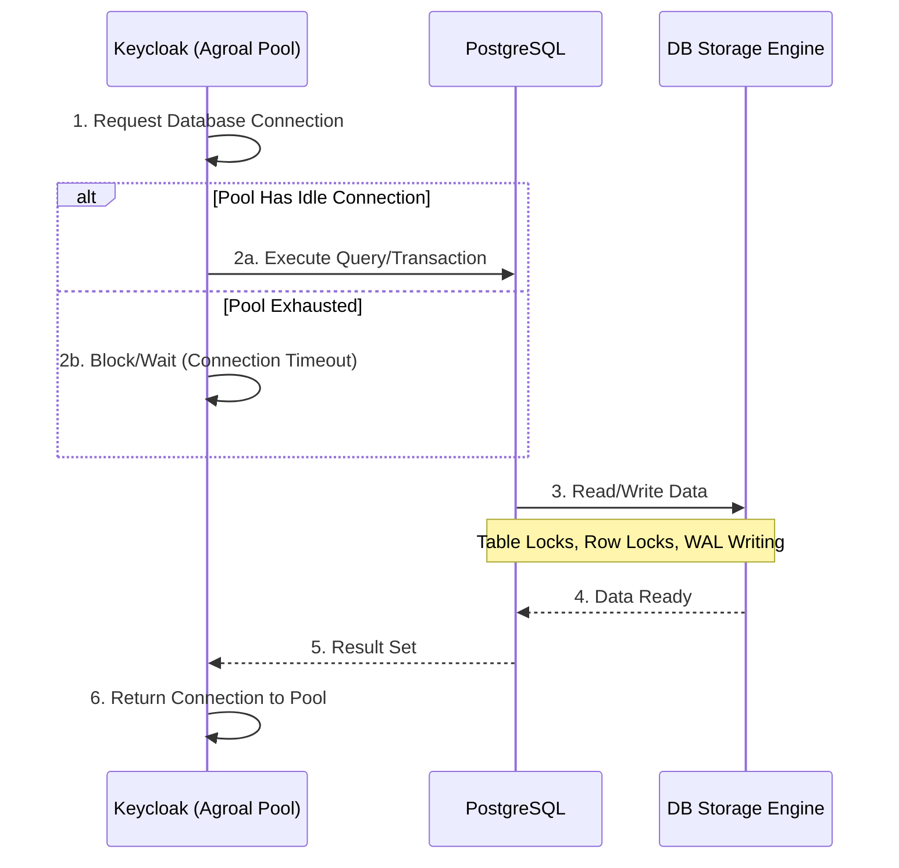

> [!NOTE]
> **Category:** Theory
> **Goal:** Cung cấp kiến thức chuyên sâu về việc tinh chỉnh cơ sở dữ liệu (Database Tuning) để tối ưu hóa hiệu suất và độ tin cậy cho Keycloak trong môi trường Production.

## 1. Lý thuyết chuyên sâu (Detailed Theory)
Keycloak là một hệ thống thiên về đọc (read-heavy) trong các luồng Authentication/Authorization, nhưng đồng thời có các thao tác ghi (write-heavy) cường độ cao khi xử lý User Sessions, Offline Sessions, và Event Logging. Việc tối ưu hóa (Tuning) cơ sở dữ liệu quan hệ (RDBMS) như PostgreSQL không chỉ đơn thuần là tăng RAM hay CPU, mà là tinh chỉnh Connection Pooling, cấu hình bộ nhớ của Database, và quản lý các chỉ mục (Indexes) để phù hợp với đặc thù truy vấn của Keycloak.

Cốt lõi của việc tinh chỉnh cơ sở dữ liệu cho Keycloak là cân bằng giữa số lượng kết nối tối đa (Max Connections) và tài nguyên phần cứng. Quá nhiều kết nối sẽ làm cạn kiệt bộ nhớ và CPU của DB do chi phí chuyển đổi ngữ cảnh (Context Switching), trong khi quá ít kết nối sẽ gây ra hiện tượng thắt cổ chai (Bottleneck) tại lớp ứng dụng (Keycloak).

## 2. Luồng nội bộ & Cơ chế cấp thấp (Internal Workflow & Low-level Mechanisms)
Quá trình Keycloak tương tác với cơ sở dữ liệu thông qua Hibernate / JDBC (được quản lý bởi Agroal Connection Pool trong Quarkus).



**Step-by-step Giải thích:**
1. Khi Keycloak cần xác thực người dùng hoặc lưu session, nó yêu cầu một kết nối từ Agroal Connection Pool.
2. Nếu có kết nối rảnh rỗi (idle), Keycloak tái sử dụng ngay lập tức. Nếu pool đầy, luồng (thread) sẽ bị chặn (block) cho đến khi `acquisition-timeout` xảy ra.
3. Database thực hiện truy vấn. Đối với các thao tác cập nhật (như User Login Failure, Offline Sessions), DB sẽ sinh ra các cơ chế khóa (Row-level Locks) và ghi vào Write-Ahead Log (WAL).
4. Phản hồi được trả về cho Keycloak.
5. Keycloak trả lại kết nối vào Pool, giữ nó ở trạng thái idle (không đóng TCP connection ngay lập tức).

## 3. Thực hành tốt nhất & Bảo mật (Best Practices & Security)

> [!IMPORTANT]
> **Connection Sizing:** Công thức cơ bản để tính toán `max-connections` cho DB Server: `(Số lượng Keycloak Nodes * db-pool-max-size) + Số connection dự phòng`. Ví dụ: 3 Node x 100 max = 300 connections. Đảm bảo DB Server (như PostgreSQL) được cấu hình `max_connections` lớn hơn 300.

> [!TIP]
> **Sử dụng PgBouncer (Connection Multiplexer):** Đối với PostgreSQL, việc duy trì hàng nghìn kết nối đồng thời rất tốn kém bộ nhớ. Hãy đặt PgBouncer ở chế độ `transaction pooling` giữa Keycloak và PostgreSQL để giảm thiểu overhead TCP.

- **Disable DB Connection Validation (Tối ưu hóa Ping):** Trong cấu hình mặc định, đôi khi pool sẽ gửi câu lệnh `SELECT 1` để kiểm tra kết nối có sống không trước khi dùng. Nếu mạng nội bộ rất ổn định, việc cấu hình Validation linh hoạt hoặc sử dụng background-validation sẽ giảm số lượng truy vấn không cần thiết.
- **Index Tuning:** Mặc dù Keycloak tạo index tự động, trong hệ thống lớn, bảng `USER_ENTITY`, `OFFLINE_USER_SESSION` và `EVENT_ENTITY` cần được DBA theo dõi và đánh thêm Index hoặc Partition nếu phát sinh Slow Queries.
- **Dọn dẹp định kỳ (Database Housekeeping):** Các bảng log (`EVENT_ENTITY`) sẽ phình to rất nhanh. Hãy sử dụng tính năng "Clear Events" trong giao diện Keycloak, hoặc lập lịch (Cron Job) xóa dữ liệu cũ.

## 4. Cấu hình minh họa thực tế (Configuration Examples)

**Cấu hình Agroal Connection Pool trong Keycloak (`keycloak.conf`):**
```properties
# Số kết nối khởi tạo ban đầu
db-pool-initial-size=10
# Số kết nối tối thiểu được giữ trong pool
db-pool-min-size=10
# Số kết nối tối đa. Không nên đặt quá lớn nếu DB không chịu được.
db-pool-max-size=100

# Thời gian tối đa (giây) một thread sẽ chờ để lấy connection từ pool
db-pool-acquisition-timeout=30

# Chuỗi kết nối JDBC tối ưu cho PostgreSQL
db-url=jdbc:postgresql://db.example.com:5432/keycloak?ApplicationName=keycloak-node-1&reWriteBatchedInserts=true
```

**Cấu hình PostgreSQL (postgresql.conf):**
```ini
max_connections = 500
shared_buffers = 4GB  # Khoảng 25% tổng RAM
work_mem = 16MB       # Tối ưu cho các truy vấn SORT và JOIN
maintenance_work_mem = 512MB
effective_cache_size = 12GB # Khoảng 75% tổng RAM
```

## 5. Trường hợp ngoại lệ (Edge Cases)
- **Deadlocks trong quá trình Import/Sync User:** Khi Federation (LDAP/AD) hoặc quá trình nhập dữ liệu (Import) xảy ra đồng thời với luồng Login cường độ cao, cơ sở dữ liệu có thể sinh ra Deadlock trên bảng `USER_ENTITY`. Giải pháp là cấu hình batch size hợp lý trong LDAP Sync và chia nhỏ tải.
- **Connection Leak:** Nếu có lỗi trong một custom Extension (SPI) viết không đóng giao dịch, số lượng connection trong Pool sẽ cạn kiệt, dẫn đến lỗi `Agroal connection pool exhausted`. Cần giám sát metric của Agroal (thông qua `/metrics`) để phát hiện sớm.
- **Replication Lag:** Trong mô hình Master-Replica, nếu Keycloak đọc (Read) từ Replica có độ trễ (Lag) cao, nó có thể không thấy dữ liệu session vừa được ghi vào Master. Keycloak mặc định không hỗ trợ Read-Write splitting ở tầng DB cho Core Data, nên cẩn thận khi sử dụng cơ chế này.

## 6. Câu hỏi Phỏng vấn (Interview Questions)
1. **Junior:** Connection Pool là gì và tại sao Keycloak lại cần nó thay vì mở kết nối mới cho mỗi Request?
   - *Đáp án:* Connection Pool là tập hợp các kết nối cơ sở dữ liệu đã được thiết lập sẵn. Mở một kết nối TCP/DB mới mất rất nhiều thời gian (handshake, authentication). Dùng Pool giúp tái sử dụng kết nối, giảm độ trễ cho Request và bảo vệ DB khỏi quá tải kết nối.
2. **Junior:** Tham số `db-pool-max-size` là gì và nếu đặt nó quá thấp thì hệ quả là gì?
   - *Đáp án:* Là số lượng tối đa kết nối DB mà một Keycloak instance có thể mở. Đặt quá thấp sẽ gây nghẽn cổ chai: các Request đến sau sẽ phải chờ, gây Timeout và lỗi HTTP 500.
3. **Senior:** Tại sao `reWriteBatchedInserts=true` lại được khuyến nghị trong chuỗi kết nối JDBC của PostgreSQL khi sử dụng Keycloak?
   - *Đáp án:* Tham số này cho phép driver gộp (batch) nhiều câu lệnh `INSERT` riêng lẻ thành một câu lệnh `INSERT ... VALUES (...), (...), (...)` duy nhất, giúp tăng tốc độ ghi dữ liệu đáng kể, đặc biệt khi Keycloak ghi nhiều Event hoặc tạo nhiều User Sessions.
4. **Senior:** Bạn sẽ giải quyết bài toán bảng `EVENT_ENTITY` phình to lên hàng trăm triệu dòng gây chậm DB như thế nào trong môi trường Production?
   - *Đáp án:* 1. Tắt việc lưu Log vào DB nếu không cần thiết, chuyển sang xuất Log ra file (để ELK Stack đọc). 2. Bật tính năng Event Expiration (xóa tự động sau X ngày). 3. Sử dụng Table Partitioning của PostgreSQL trên cột `EVENT_TIME`.
5. **Senior:** PgBouncer đóng vai trò gì trong kiến trúc Keycloak + PostgreSQL quy mô lớn?
   - *Đáp án:* Khi có nhiều Keycloak nodes, mỗi node mở hàng trăm connections sẽ làm cạn kiệt cấu hình `max_connections` của PostgreSQL và lãng phí RAM (do mô hình process-per-connection của PG). PgBouncer sử dụng Transaction Pooling, cho phép hàng nghìn connections từ Keycloak chia sẻ chung một số lượng rất nhỏ các connection thực tế xuống DB, giúp hệ thống chịu tải đột biến (Spike) cực tốt.

## 7. Tài liệu tham khảo (References)
- [Keycloak Official Documentation: Database Optimization](https://www.keycloak.org/server/database)
- [Agroal Connection Pool Documentation](https://agroal.github.io/)
- [PostgreSQL Tuning Guide](https://wiki.postgresql.org/wiki/Tuning_Your_PostgreSQL_Server)
