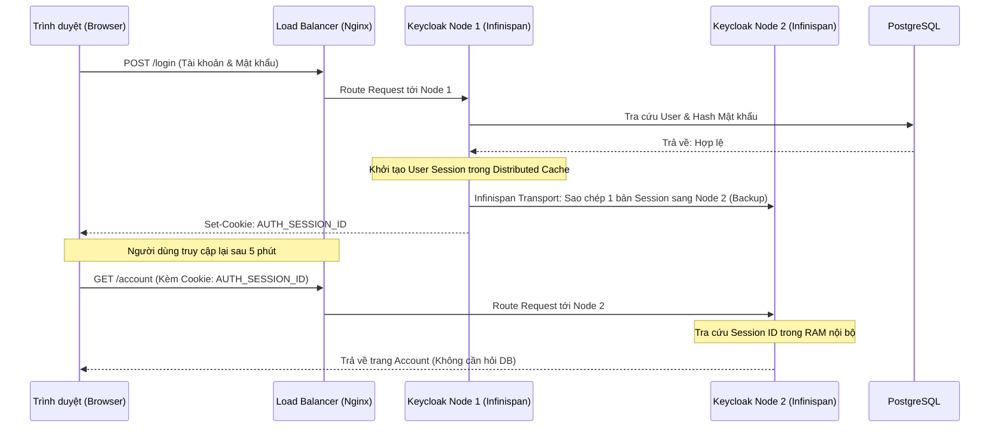

> [!NOTE]
> **Category:** Theory (Lý thuyết)
> **Goal:** Hiểu nguyên lý hoạt động của kiến trúc Stateful trong Keycloak. Giải mã cỗ máy cache phân tán Infinispan, cách nó đồng bộ Session (Phiên đăng nhập) giữa nhiều máy chủ khác nhau để đảm bảo trải nghiệm Single Sign-On (SSO) không bị gián đoạn khi có sự điều hướng từ Load Balancer.

# Bài 1: Infinispan và Kiến trúc Bộ nhớ đệm Phân tán

## 1. Lý thuyết chuyên sâu (Detailed Theory)

### 1.1. Bản chất Stateful của Identity Provider (IdP)
Các ứng dụng microservices thông thường (như Spring Boot, NodeJS) thường được thiết kế theo kiến trúc **Stateless** (Phi trạng thái). Chúng không lưu trữ thông tin gì trong RAM, mọi Request đều gửi kèm JWT (JSON Web Token) để chứng thực, giúp chúng dễ dàng mở rộng (scale up) lên hàng trăm Pods.

Ngược lại, Keycloak đóng vai trò là Lõi Quản lý Danh tính trung tâm, nên nó bắt buộc phải hoạt động theo kiến trúc **Stateful** (Có trạng thái). Keycloak cần phải "nhớ":
- Ai đang đăng nhập? Họ đăng nhập qua Client (ứng dụng) nào?
- Khi người dùng bấm "Đăng xuất" ở một ứng dụng, Keycloak phải nhớ để thu hồi phiên của họ ở toàn bộ các ứng dụng khác (Single Logout).
- Lưu trữ các mã OTP, mã xác thực tạm thời, và số lần đăng nhập sai (Brute-force protection).

Nếu lưu trữ tất cả thông tin Session có tần suất cập nhật cao này xuống Database quan hệ (PostgreSQL/MySQL), Disk IOPS của Database sẽ nhanh chóng đạt đỉnh và sụp đổ. Do đó, Session phải được lưu trên RAM. Nhưng làm sao để RAM của Máy 1 có thể đồng bộ với RAM của Máy 2?

### 1.2. Giải pháp: Lưới dữ liệu bộ nhớ Infinispan (In-Memory Data Grid)
Keycloak tích hợp sâu **Infinispan** — một động cơ lưu trữ bộ nhớ đệm phân tán cấp doanh nghiệp.
Khi bạn chạy Keycloak trên 3 máy chủ khác nhau (Node A, Node B, Node C), Infinispan sẽ kết nối RAM của 3 máy này lại tạo thành một "Mạng lưới RAM" (Grid) thống nhất.
Khi người dùng đăng nhập tại Node A, Session của họ được lưu vào RAM của Node A, sau đó Infinispan sẽ ngầm định sao chép (replicate) bản ghi Session này sang RAM của Node B qua mạng nội bộ. Nhờ vậy, nếu Load Balancer chuyển hướng người dùng sang Node B ở lần truy cập tiếp theo, Node B vẫn nhận diện được người dùng này đang trong trạng thái đã đăng nhập.

### 1.3. Phân loại cấu trúc Cache trong Keycloak
Infinispan trong Keycloak chia bộ nhớ RAM thành 3 loại mô hình lưu trữ khác nhau để tối ưu băng thông:
1. **Local Cache (Bộ nhớ cục bộ):** Dữ liệu không bao giờ rời khỏi máy chủ tạo ra nó. Dùng cho việc lưu trữ Authorization (phân quyền) hoặc Realm cấu hình. Khi thay đổi cấu hình, Keycloak dùng thông điệp "Cache Invalidation" để bắt các node tự xóa Local Cache của chúng thay vì đẩy toàn bộ cục dữ liệu mới qua mạng.
2. **Distributed Cache (Bộ nhớ phân tán - Chủ lực):** Dùng để lưu trữ Session (User Session, Client Session). Thay vì copy 1 Session cho cả 100 node (gây nghẽn mạng), nó chỉ lưu bản sao trên `owners=2` (1 node chính và 1 node dự phòng). Nếu Request rớt vào node thứ 3 không chứa Session, node thứ 3 sẽ tự động hỏi trong Cluster xem ai giữ Session này và lấy về.
3. **Replicated Cache (Bộ nhớ nhân bản 100%):** Dữ liệu được copy đến tất cả mọi node trong cụm. Dùng cho các dữ liệu nhỏ, ít thay đổi nhưng cần đọc cực nhanh (Ví dụ: Trạng thái Brute-force Login Failures, Work Keys).

## 2. Luồng nội bộ & Cơ chế cấp thấp (Internal Workflow & Low-level Mechanisms)



## 3. Thực hành tốt nhất & Bảo mật (Best Practices & Security)

> [!WARNING]
> **Hiểm họa sửa trực tiếp Database (Stale Cache)**
> Keycloak có cơ chế "Cache cấu hình" (Realm Cache, User Cache) dưới dạng Local Cache. Khi bạn dùng Admin Console để đổi tên Realm hoặc thay đổi thuộc tính User, Admin Console không chỉ lưu xuống Database mà còn "Hét lên" một thông điệp Invalidation qua mạng để tất cả các node khác xóa Cache cũ trong RAM. 
> Nếu bạn sử dụng câu lệnh `UPDATE` trực tiếp dưới SQL (PostgreSQL), Keycloak sẽ không hề hay biết! Các node vẫn tiếp tục phục vụ dữ liệu cũ đang nằm trong RAM Infinispan, gây ra lỗi hiển thị sai lệch cho đến khi Keycloak bị restart.

> [!TIP]
> **Chỉ số `owners` trong Distributed Cache**
> Mặc định cấu hình `owners=2`. Có nghĩa là dù bạn có 10 node, một phiên đăng nhập chỉ nằm trên 2 node. Nếu 2 node này chết CÙNG LÚC, Session đó sẽ mất và người dùng bị văng ra ngoài. Với hệ thống cực kỳ quan trọng, hãy tăng `owners=3` trong file cấu hình để tăng độ chịu lỗi.

## 4. Cấu hình minh họa thực tế (Configuration Examples)

Bạn có thể chỉnh sửa mô hình bộ đệm bằng cách ghi đè file `cache-ispn.xml` của Keycloak. Ví dụ cấu hình thay đổi số lượng bản sao (owners) của Session:

```xml
<infinispan>
    <cache-container name="keycloak">
        <!-- Local Caches -->
        <local-cache name="realms">
            <encoding>
                <key media-type="application/x-java-object"/>
                <value media-type="application/x-java-object"/>
            </encoding>
            <memory max-count="10000"/>
        </local-cache>

        <!-- Distributed Caches cho Session -->
        <!-- Nâng owners lên 3 để an toàn hơn khi down-scale -->
        <distributed-cache name="sessions" owners="3">
            <expiration lifespan="36000000"/> <!-- Thời gian sống tối đa -->
        </distributed-cache>

        <distributed-cache name="authenticationSessions" owners="2">
            <expiration lifespan="3600000"/>
        </distributed-cache>
        
        <!-- Replicated Caches -->
        <replicated-cache name="work">
            <expiration lifespan="36000000"/>
        </replicated-cache>
    </cache-container>
</infinispan>
```

## 5. Trường hợp ngoại lệ (Edge Cases)
- **Vấn đề RAM trào bọt (OOM - Out of Memory):** Nếu hệ thống hứng chịu một đợt tấn công DDoS tạo hàng triệu phiên đăng nhập giả (Authentication Sessions), dung lượng RAM của Infinispan sẽ phình to. Nếu không giới hạn bộ nhớ (Eviction policy), Pod Keycloak sẽ bị Kubernetes OOMKilled. Giải pháp là thiết lập cấu hình `<memory max-count="..."/>` cho Distributed Cache để tự động đẩy Session cũ ra ngoài khi RAM đầy.
- **Split-Brain và Network Partition:** Mạng giữa 2 Data Center bị đứt. Cluster 10 node bị chẻ làm hai (5 node bên này, 5 node bên kia). Hai bên đều hoạt động độc lập và nhận Request. Khi mạng nối lại, Infinispan phải thực hiện tiến trình "State Transfer" và "Merge" để hợp nhất Session. Quá trình này tiêu tốn CPU khủng khiếp và có thể làm nghẽn toàn bộ hệ thống.

## 6. Câu hỏi Phỏng vấn (Interview Questions)

**Câu 1 (Junior): Tại sao chúng ta không nên cấu hình Load Balancer với thuật toán Round Robin thông thường mà thường dùng Sticky Session (IP Hash) khi chạy Keycloak Cluster?**
- **Đáp án:** Mặc dù Infinispan có thể đồng bộ Session sang các node khác, nhưng việc đồng bộ cần vài mili-giây qua mạng. Nếu Request thứ nhất và thứ hai của cùng một người dùng vào hệ thống quá sát nhau (VD: Chuyển hướng OIDC) và rơi vào 2 node khác nhau, node thứ 2 có thể chưa kịp nhận bản sao Session từ node thứ 1, dẫn đến lỗi "Invalid State". Sticky Session đảm bảo user được dán chặt vào 1 node, khắc phục hoàn toàn rủi ro độ trễ đồng bộ.

**Câu 2 (Junior): Local Cache và Distributed Cache khác nhau cơ bản ở điểm nào trong Infinispan của Keycloak?**
- **Đáp án:** Local Cache không chia sẻ dữ liệu qua mạng cho các máy khác, nó lưu những dữ liệu từ Database (như Realm config) để đọc nhanh hơn. Distributed Cache phân tán dữ liệu qua mạng, đảm bảo tính liên tục của hệ thống (Session) mà không làm sập Database.

**Câu 3 (Mid-level): Giả sử Admin thay đổi thời gian hết hạn (Token Lifespan) của một Client trong Realm bằng giao diện Web. Bằng cách nào node 2 và node 3 biết được sự thay đổi này khi nó đang được lưu trong Local Cache của chúng?**
- **Đáp án:** Khi Admin sửa qua Web, node tiếp nhận Request (VD: node 1) sẽ ghi dữ liệu mới xuống Database. Ngay sau đó, node 1 sử dụng JGroups để gửi một gói tin multicast/broadcast có tên là "Cache Invalidation Message" tới node 2 và node 3. Khi nhận được tin nhắn này, node 2 và 3 sẽ lập tức xóa bản ghi cũ trong Local Cache của nó. Lần tiếp theo có Request cần đến dữ liệu đó, chúng sẽ buộc phải query lại từ Database.

**Câu 4 (Senior): Việc lưu trữ Session của Keycloak khác với kiến trúc của Spring Session sử dụng Redis ở điểm nào? Tại sao Keycloak không dùng Redis làm Session Storage mặc định?**
- **Đáp án:** Spring Session là "External Cache" (Dữ liệu nằm ngoài App, nằm ở máy chủ Redis riêng biệt). Nghĩa là App sẽ phải gọi mạng (Network I/O) đến Redis để lấy Session. Keycloak dùng Infinispan ở chế độ "Embedded Cache" (In-memory Data Grid). Infinispan chạy chung một JVM Process (Cùng vùng nhớ RAM) với Keycloak. Do đó, nếu Request rớt đúng vào node đang giữ Session (Data Locality), thời gian lấy Session là gần như bằng 0 (0 mạng I/O). Kiến trúc này tối ưu hiệu suất cực hạn cho Single Sign-On.

**Câu 5 (Senior): Nêu hậu quả của việc cấu hình `owners=1` đối với `sessions` cache trong Infinispan.**
- **Đáp án:** Nếu `owners=1`, mỗi Session đăng nhập chỉ tồn tại đúng 1 bản copy duy nhất trong toàn bộ Cluster. Nếu node chứa Session đó bị khởi động lại hoặc crash, Session sẽ bị xóa vĩnh viễn khỏi RAM. Người dùng đang liên kết với Session đó sẽ bị mất trạng thái SSO và buộc phải nhập lại User/Pass ở màn hình đăng nhập. `owners=2` là bắt buộc tối thiểu cho tính sẵn sàng cao (HA).

## 7. Tài liệu tham khảo (References)
- [Keycloak Official Docs: Configuring Infinispan Distributed Caches](https://www.keycloak.org/server/caching)
- [Infinispan User Guide: Cache topologies (Local, Distributed, Replicated)](https://infinispan.org/docs/stable/titles/configuring/configuring.html)
- [OWASP Session Management Cheat Sheet](https://cheatsheetseries.owasp.org/cheatsheets/Session_Management_Cheat_Sheet.html)
