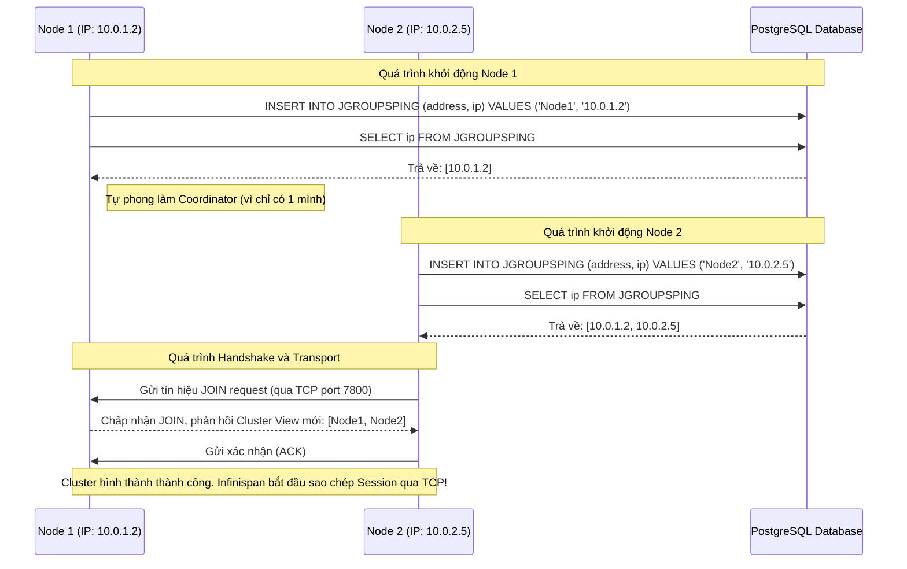

> [!NOTE]
> **Category:** Theory (Lý thuyết)
> **Goal:** Hiểu sâu về giao thức mạng JGroups và các cơ chế Discovery (tìm kiếm và phát hiện các node) trong cụm Keycloak. Bài học giải thích cách các phiên bản Keycloak phân tán tìm thấy nhau trên môi trường On-Premise, Docker, Cloud và Kubernetes để hình thành một Cluster đồng nhất.

# Bài 2: Giao thức JGroups và Cơ chế Discovery trong Clustering

## 1. Lý thuyết chuyên sâu (Detailed Theory)
Để Keycloak có thể sao chép và phân tán dữ liệu Session (thông qua bộ nhớ đệm Infinispan), các node trong hệ thống phải có khả năng giao tiếp mạng với nhau. Nhiệm vụ truyền tải thông điệp ở cấp độ thấp (low-level network communication) này được đảm nhiệm bởi **JGroups**.

JGroups là một thư viện Java mã nguồn mở cung cấp tính năng truyền tin tin cậy đa điểm (reliable multicast communication). Trong kiến trúc Keycloak, JGroups giải quyết hai bài toán cốt lõi:
1. **Discovery (Tìm kiếm & Phát hiện):** Các node mới khởi động làm thế nào để biết hệ thống hiện có bao nhiêu node khác đang chạy, và IP của chúng là gì?
2. **Transport (Truyền tải dữ liệu):** Làm thế nào để gửi dữ liệu từ một node đến tất cả các node khác (broadcasting) mà không bị mất gói tin?

Nếu không có quá trình Discovery thành công, từng node Keycloak sẽ hoạt động cô lập (Cluster Size = 1). Đây gọi là hiện tượng **Split-Brain**, dẫn đến việc người dùng bị mất Session (văng khỏi hệ thống) khi Load Balancer điều hướng Request sang một node khác.

**Các cơ chế Discovery (PING) phổ biến trong JGroups:**
- **UDP_PING (Mặc định):** Sử dụng IP Multicast. Một node gửi gói tin "Xin chào" đến một địa chỉ Multicast chung. Tất cả các node khác đang lắng nghe trên địa chỉ này sẽ phản hồi lại. Rất nhanh và tự động, nhưng thường bị chặn (blocked) trong các mạng Docker, AWS, Azure do rủi ro bão mạng (broadcast storm).
- **TCPPING:** Cấu hình cứng danh sách địa chỉ IP của tất cả các node trong cụm. Phù hợp cho môi trường máy chủ vật lý cố định, nhưng không khả thi với môi trường Cloud/Container nơi IP thay đổi liên tục.
- **JDBC_PING:** Các node ghi địa chỉ IP của chính nó vào chung một bảng trong Database (ví dụ: PostgreSQL). Các node khác sẽ đọc bảng này để lấy danh sách IP và thiết lập kết nối TCP. Đây là giải pháp hoàn hảo cho Docker/Cloud khi Multicast bị cấm.
- **DNS_PING:** Sử dụng hệ thống phân giải tên miền. Cực kỳ phổ biến và là tiêu chuẩn khi chạy Keycloak trên **Kubernetes**. JGroups sẽ truy vấn DNS nội bộ của K8s để lấy danh sách các Pod IP đang chạy Keycloak.

## 2. Luồng nội bộ & Cơ chế cấp thấp (Internal Workflow & Low-level Mechanisms)
Dưới đây là luồng hoạt động cấp thấp của cơ chế **JDBC_PING** khi hai node Keycloak khởi động và hình thành Cluster thông qua Database:



**Phân tích các bước:**
1. Khi Node 2 khởi động, nó ghi IP tĩnh của mình (được cấp phát bởi Docker/Cloud) vào bảng `JGROUPSPING`.
2. Nó ngay lập tức `SELECT` bảng này và nhận ra sự tồn tại của Node 1.
3. JGroups trên Node 2 sẽ khởi tạo một liên kết TCP trực tiếp (Unicast) đến port 7800 của Node 1.
4. Node 1 đồng ý kết nối, cập nhật lại "Cluster View" (danh sách các thành viên hiện hành) và gửi cho toàn cụm.

## 3. Thực hành tốt nhất & Bảo mật (Best Practices & Security)

> [!WARNING]
> **Thảm họa Multicast trong Docker/Cloud**
> Tuyệt đối KHÔNG sử dụng `UDP_PING` mặc định khi triển khai Keycloak bằng Docker Compose trên nhiều máy chủ vật lý, hoặc trên các nền tảng đám mây như AWS EC2. Các môi trường này mặc định drop (vứt bỏ) mọi gói tin Multicast ở tầng Network. Nếu bạn để mặc định, các node sẽ khởi động thành công nhưng không bao giờ nhìn thấy nhau, gây ra lỗi mất Session liên tục.

> [!IMPORTANT]
> **Bảo mật kênh truyền JGroups (Transport Security)**
> Dữ liệu truyền qua port 7800 của JGroups chứa thông tin nhạy cảm (Session, Token nội bộ). Mặc dù port này chỉ mở trong mạng LAN/VPC nội bộ, theo tiêu chuẩn Enterprise Zero-Trust, bạn phải cấu hình mã hóa kênh truyền (JGroups SYM_ENCRYPT hoặc ASYM_ENCRYPT) hoặc sử dụng mTLS để ngăn chặn các node giả mạo (rogue nodes) join vào Cluster và đánh cắp Session.

## 4. Cấu hình minh họa thực tế (Configuration Examples)

Để cấu hình Keycloak (phiên bản Quarkus) sử dụng JDBC_PING thông qua file XML cấu hình JGroups. 
Đầu tiên, khi khởi chạy, cần khai báo biến môi trường để trỏ tới file cấu hình tùy chỉnh:

```bash
# Biến môi trường chạy Keycloak (Docker hoặc Script)
KC_CACHE_STACK=tcp
JGROUPS_DISCOVERY_PROTOCOL=JDBC_PING
```

Cấu hình mẫu trong tệp `cache-ispn.xml` (hoặc cấu hình thông qua CLI) để định nghĩa JDBC_PING kết nối trực tiếp vào Datasource của Keycloak:

```xml
<infinispan>
    <!-- Ghi đè stack mặc định -->
    <jgroups>
        <stack name="jdbc-ping-tcp" extends="tcp">
            <!-- Xóa MPING (Multicast Ping) -->
            <MPING xmlns="urn:org:jgroups" combine.position="REMOVE"/>
            <!-- Thêm JDBC_PING -->
            <JDBC_PING xmlns="urn:org:jgroups" combine.position="INSERT_AFTER" combine.sibling="TCP"
                       connection_driver="org.postgresql.Driver"
                       connection_url="${kc.db.url}"
                       connection_username="${kc.db.username}"
                       connection_password="${kc.db.password}"
                       initialize_sql="CREATE TABLE IF NOT EXISTS JGROUPSPING (own_addr varchar(200) NOT NULL, cluster_name varchar(200) NOT NULL, ping_data bytea, constraint PK_JGROUPSPING PRIMARY KEY (own_addr, cluster_name))"
                       insert_single_sql="INSERT INTO JGROUPSPING (own_addr, cluster_name, ping_data) values (?, ?, ?)"
                       delete_single_sql="DELETE FROM JGROUPSPING WHERE own_addr=? AND cluster_name=?"
                       select_all_pingdata_sql="SELECT ping_data FROM JGROUPSPING WHERE cluster_name=?"
                       clear_sql="DELETE FROM JGROUPSPING WHERE cluster_name=?"
            />
        </stack>
    </jgroups>
    <cache-container name="keycloak">
        <transport lock-timeout="60000" stack="jdbc-ping-tcp"/>
        <!-- ... Các cấu hình cache của Infinispan ... -->
    </cache-container>
</infinispan>
```

## 5. Trường hợp ngoại lệ (Edge Cases)

- **Crash Node mà không kịp xóa Record trong JDBC_PING:** Nếu Node 2 bị sập nguồn (Power failure) đột ngột, nó không kịp chạy lệnh `delete_single_sql` để xóa IP của nó khỏi bảng `JGROUPSPING`. Khi đó, bảng này chứa dữ liệu "rác" (Stale records). Cách JGroups xử lý: Các Node đang sống sẽ định kỳ gửi Ping kiểm tra tim (Heartbeat). Khi nhận ra Node 2 không phản hồi TCP, nó sẽ loại Node 2 khỏi Cluster View hiện tại, dù record vẫn nằm trong Database. Tuy nhiên, nếu rác quá nhiều, có thể gây chậm chạp khi khởi động node mới. Cần định kỳ dọn dẹp bảng này nếu phát hiện lỗi.
- **Firewall chặn Port 7800:** Các Dev cấu hình JDBC_PING thành công, kiểm tra Database thấy cả 2 IP, nhưng log Keycloak báo không thể Join Cluster. Nguyên nhân 99% là do Firewall (iptables, AWS Security Group) của hệ điều hành đang chặn cổng TCP 7800. Discovery thành công qua cổng 5432 (Postgres), nhưng Transport thất bại do port 7800 bị chặn. Phải mở luồng mạng Inbound TCP port 7800 giữa các node.

## 6. Câu hỏi Phỏng vấn (Interview Questions)

**Câu 1 (Junior): Tại sao chúng ta không nên sử dụng cấu hình mặc định (UDP_PING) khi chạy cụm Keycloak trên AWS EC2?**
- **Đáp án:** AWS (và hầu hết các nhà cung cấp Cloud công cộng) chặn lưu lượng Multicast và Broadcast ở cấp độ Virtual Private Cloud (VPC) để tránh bão mạng. Do UDP_PING dựa trên Multicast, các node Keycloak sẽ không thể tìm thấy nhau, dẫn đến hiện tượng Split-Brain.

**Câu 2 (Junior): Khi triển khai Keycloak trên Kubernetes, phương pháp PING nào được khuyến nghị sử dụng nhất?**
- **Đáp án:** `DNS_PING`. Kubernetes cung cấp sẵn hệ thống CoreDNS nội bộ rất mạnh mẽ. JGroups chỉ cần truy vấn một Headless Service của Kubernetes để lấy danh sách động các Pod IP đang chạy Keycloak mà không cần phải ghi xuống Database.

**Câu 3 (Mid-level): JGroups có phân biệt rõ ràng giữa Discovery và Transport không? Giải thích sự khác biệt.**
- **Đáp án:** Có. JGroups tách biệt rõ hai giai đoạn. Discovery (PING) dùng để tìm kiếm danh sách IP của các node khác trong cụm (có thể qua UDP, Database, hoặc DNS). Sau khi có danh sách IP, Transport là giao thức truyền tải dữ liệu thực sự (thường dùng TCP qua port 7800) để gửi các thông điệp đồng bộ Session giữa các IP đó.

**Câu 4 (Senior): Một node khởi động, đọc được IP của node khác từ bảng `JGROUPSPING` nhưng lại báo lỗi "Connection Refused" khi cố gắng JOIN cluster. Hãy chẩn đoán nguyên nhân.**
- **Đáp án:** Nguyên nhân là quá trình Discovery (đọc Database) thành công nhưng quá trình Transport bị chặn. Điều này xảy ra do tường lửa (Firewall) giữa các node đang chặn cổng TCP mặc định của JGroups (7800). Giải pháp là mở rules cho phép kết nối Inbound/Outbound trên port 7800 giữa các dải IP của các node Keycloak.

**Câu 5 (Senior): Trong hệ thống sử dụng JDBC_PING, điều gì xảy ra với hiệu suất của Database khi số lượng message đồng bộ Session giữa các Node quá lớn?**
- **Đáp án:** Không ảnh hưởng. JDBC_PING chỉ dùng Database cho bước Discovery (chớp nhoáng lúc khởi động hoặc khi có node chết/tham gia mới) để đọc/ghi cấu hình thành viên. Nó KHÔNG dùng Database để gửi lưu lượng Session (Transport). Sau khi biết IP nhau, dữ liệu Session lớn được đồng bộ trực tiếp giữa các node thông qua kết nối TCP riêng biệt của JGroups (Infinispan over TCP).

## 7. Tài liệu tham khảo (References)
- [Keycloak Server Administration Guide - Clustering](https://www.keycloak.org/docs/latest/server_installation/#clustering)
- [JGroups Official Documentation - Discovery Protocols](http://jgroups.org/manual/index.html#Discovery)
- [Infinispan JGroups Configuration](https://infinispan.org/docs/stable/titles/configuring/configuring.html#jgroups_configuration)
