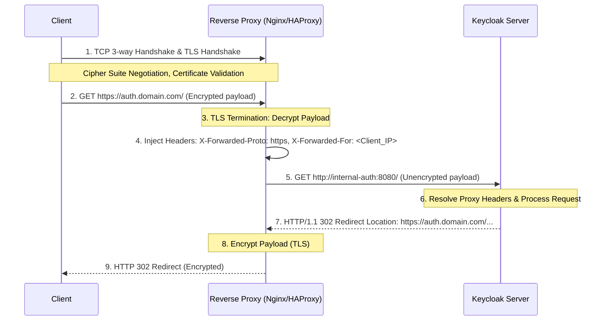

> [!NOTE]
> **Category:** Theory
> **Goal:** Hiểu sâu về cơ chế TLS Termination tại Reverse Proxy, cách Keycloak nhận diện Forwarded Headers và phương pháp bảo mật kết nối nội bộ trong kiến trúc Production.

## 1. Lý thuyết chuyên sâu (Detailed Theory)
**TLS Termination** là quá trình mà một hệ thống trung gian (như Reverse Proxy, Load Balancer, hoặc Ingress Controller) tiếp nhận kết nối TLS/HTTPS từ Client, thực hiện giải mã (decrypt), và sau đó chuyển tiếp Request dưới dạng bản rõ (HTTP) tới Backend Server (Keycloak). 

Trong môi trường phân tán, việc áp dụng TLS Termination giải quyết ba bài toán cốt lõi:
- **Tối ưu hóa hiệu năng (Performance Optimization):** Giảm tải việc mã hóa/giải mã CPU-intensive khỏi Keycloak, cho phép Keycloak tập trung hoàn toàn vào các nghiệp vụ Authentication và Authorization.
- **Quản lý chứng chỉ tập trung (Centralized Certificate Management):** Chứng chỉ số (X.509 Certificates) chỉ cần được cài đặt, quản lý và gia hạn tại Reverse Proxy (hoặc Edge Server) thay vì cấu hình trên nhiều instance của Keycloak.
- **Kiểm tra luồng dữ liệu (Traffic Inspection):** Reverse Proxy có khả năng đọc và sửa đổi HTTP Headers (ví dụ: gán thêm X-Forwarded-For) hoặc áp dụng các Rule WAF (Web Application Firewall) trước khi Request chạm đến Keycloak.

Tuy nhiên, khi Keycloak nhận Request dưới dạng HTTP do Reverse Proxy gửi đến, nó sẽ nghĩ rằng Client đang truy cập qua HTTP. Do đó, các Redirect URI, Cookie (như thuộc tính `Secure`), và các Token được sinh ra có thể trỏ sai về giao thức HTTP thay vì HTTPS. Để khắc phục, Reverse Proxy phải chèn thêm các **Forwarded Headers** (`X-Forwarded-Proto`, `X-Forwarded-Host`) và Keycloak phải được cấu hình để tin tưởng và phân tích các header này (`proxy-headers="xforwarded"`).

## 2. Luồng nội bộ & Cơ chế cấp thấp (Internal Workflow & Low-level Mechanisms)
Dưới đây là sơ đồ mô tả cách một Request HTTP đi từ Client đến Keycloak với quá trình TLS Termination.



**Step-by-step Giải thích:**
1. **Client** thực hiện TLS Handshake với **Reverse Proxy**. Cả hai thỏa thuận thuật toán mã hóa (Cipher Suite).
2. Client gửi Request HTTPS đã mã hóa đến Proxy.
3. Proxy giải mã Request để lấy được nội dung bản rõ HTTP.
4. Proxy phân tích thông tin của Client và chèn thêm các tiêu đề chuẩn công nghiệp: `X-Forwarded-For`, `X-Forwarded-Proto: https`, `X-Forwarded-Host`.
5. Proxy chuyển tiếp Request HTTP bản rõ đến Keycloak ở mạng nội bộ.
6. Keycloak (nếu được cấu hình đúng chế độ `proxy-headers`) sẽ đọc `X-Forwarded-Proto` và biết rằng Client ban đầu truy cập bằng HTTPS.
7. Khi phản hồi hoặc tạo Redirect URI, Keycloak dùng Host và Protocol từ Forwarded Headers, thay vì IP nội bộ của chính nó.

## 3. Thực hành tốt nhất & Bảo mật (Best Practices & Security)

> [!IMPORTANT]
> **Strict Internal Network:** Chỉ cho phép kết nối HTTP bản rõ giữa Proxy và Keycloak trong mạng VPC (Virtual Private Cloud) bảo mật cao, cô lập hoàn toàn với bên ngoài.

> [!WARNING]
> **Header Spoofing Attack:** Kẻ tấn công có thể chèn các header như `X-Forwarded-For` từ phía trình duyệt để giả mạo IP. Do đó, Reverse Proxy **PHẢI** được cấu hình để ghi đè (overwrite) và xóa bỏ mọi Forwarded header giả mạo từ bên ngoài gửi vào, chỉ chèn thông tin tin cậy do chính Proxy tạo ra.

- **Enable Proxy Headers:** Trong Keycloak 17+ (Quarkus), cấu hình `--proxy-headers=xforwarded` là bắt buộc để Keycloak không sinh sai cấu hình bảo mật Cookie.
- **TLS Re-encryption (End-to-End TLS):** Trong các môi trường yêu cầu Zero Trust, Reverse Proxy không chuyển tiếp HTTP bản rõ, mà tiếp tục tạo một kết nối TLS khác đến Backend Keycloak. Tuy nhiên, quá trình TLS Termination ở Proxy vẫn xảy ra nhằm mục đích phân tích gói tin.

## 4. Cấu hình minh họa thực tế (Configuration Examples)

**Cấu hình Nginx (Reverse Proxy):**
```nginx
server {
    listen 443 ssl;
    server_name auth.example.com;

    ssl_certificate /etc/nginx/certs/fullchain.pem;
    ssl_certificate_key /etc/nginx/certs/privkey.pem;

    location / {
        proxy_pass http://keycloak-backend:8080;
        proxy_set_header Host $host;
        proxy_set_header X-Real-IP $remote_addr;
        proxy_set_header X-Forwarded-For $proxy_add_x_forwarded_for;
        proxy_set_header X-Forwarded-Proto $scheme;
        proxy_set_header X-Forwarded-Host $host;
    }
}
```

**Lệnh khởi chạy Keycloak trong Production:**
```bash
kc.sh start --hostname=auth.example.com \
            --proxy-headers=xforwarded \
            --http-enabled=true
```

## 5. Trường hợp ngoại lệ (Edge Cases)
- **Mixed Content Warning hoặc Infinite Redirect Loop:** Nếu Keycloak không được truyền `X-Forwarded-Proto: https`, nó sẽ tự động gửi mã HTTP 302 yêu cầu Client chuyển hướng từ HTTP sang HTTPS (nếu `ssl-required=external`). Nhưng Proxy lại gọi Keycloak bằng HTTP, gây ra vòng lặp vô hạn (Infinite Redirect) hoặc các tài nguyên CSS/JS bị trình duyệt chặn do tải qua HTTP (Mixed Content). Sửa lỗi bằng cách đảm bảo Proxy truyền đúng `X-Forwarded-Proto: https` và bật `--proxy-headers=xforwarded`.
- **IP Client luôn hiển thị là IP của Proxy:** Trong log kiểm toán (Audit Logs) của Keycloak, mọi đăng nhập đều ghi nhận IP là `192.168.x.x` (IP của Proxy) thay vì IP thực. Nguyên nhân do Keycloak không parse header `X-Forwarded-For`.

## 6. Câu hỏi Phỏng vấn (Interview Questions)
1. **Junior:** TLS Termination là gì và tại sao chúng ta thường đặt nó ở Nginx thay vì trực tiếp trên Keycloak?
   - *Đáp án:* Là việc giải mã SSL/TLS ở proxy, giúp giảm tải CPU cho backend server và tập trung việc quản lý chứng chỉ ở một lớp duy nhất, đồng thời Nginx tối ưu cho việc xử lý kết nối đồng thời cao.
2. **Junior:** Điều gì xảy ra nếu bạn cấu hình TLS Termination nhưng quên truyền header `X-Forwarded-Proto: https` cho Keycloak?
   - *Đáp án:* Keycloak sẽ tạo các Redirect URI mang tiền tố `http://` thay vì `https://`, dẫn đến lỗi kết nối, bị trình duyệt chặn do lỗi bảo mật (Mixed Content) hoặc lỗi `invalid_redirect_uri`.
3. **Senior:** Phân biệt `--proxy-headers=forwarded` và `--proxy-headers=xforwarded` trong Keycloak Quarkus?
   - *Đáp án:* `forwarded` tuân theo chuẩn RFC 7239 dùng header `Forwarded: for=192.0.2.60;proto=http;by=203.0.113.43`. Còn `xforwarded` là de-facto chuẩn cũ, dùng các header riêng lẻ như `X-Forwarded-For`, `X-Forwarded-Proto`. Tùy thuộc vào việc Reverse Proxy gửi chuẩn nào.
4. **Senior:** Trong kiến trúc Zero-Trust, khi yêu cầu mã hóa kết nối giữa Proxy và Keycloak (End-to-End TLS), cấu hình `--proxy-headers` còn cần thiết không?
   - *Đáp án:* Vẫn cần thiết, vì nếu Reverse Proxy vẫn đóng vai trò là điểm cuối giao tiếp với Client (xử lý domain `auth.example.com`), nó vẫn cần gửi header `X-Forwarded-For` để Keycloak lấy đúng IP của Client phục vụ Brute-force protection và Audit.
5. **Senior:** Header Spoofing nguy hiểm như thế nào và cách phòng tránh tại cấp độ Reverse Proxy?
   - *Đáp án:* Kẻ tấn công có thể giả mạo IP bằng cách đính kèm header `X-Forwarded-For` tự chế. Reverse Proxy cần xóa header này từ chiều vào trước khi ghi đè lại bằng địa chỉ `$remote_addr` chuẩn tại TCP socket.

## 7. Tài liệu tham khảo (References)
- [Keycloak Official Documentation: Configuring a reverse proxy](https://www.keycloak.org/server/reverseproxy)
- [RFC 7239: Forwarded HTTP Extension](https://datatracker.ietf.org/doc/html/rfc7239)
- [OWASP: TLS Security Cheat Sheet](https://cheatsheetseries.owasp.org/cheatsheets/Transport_Layer_Protection_Cheat_Sheet.html)
