> [!NOTE]
> **Category:** Theory (Lý thuyết)
> **Goal:** Hiểu sâu về cách luân chuyển các HTTP Header qua Reverse Proxy. Phân tích nguyên nhân Keycloak bị "mù" thông tin mạng (mất IP thật của Client, lỗi Mixed Content) khi đứng sau Nginx/HAProxy và cách cấu hình `X-Forwarded` headers để khôi phục định tuyến chính xác.

# Bài 2: Chuyển tiếp HTTP Headers (Header Forwarding) qua Reverse Proxy

## 1. Lý thuyết chuyên sâu (Detailed Theory)

### 1.1. Hiện tượng "Quáng gà" của Keycloak khi đứng sau Proxy
Trong môi trường Production, người ta không bao giờ phơi bày port 8080 của Keycloak trực tiếp ra Internet. Thay vào đó, một Reverse Proxy (như Nginx, HAProxy, AWS ALB) sẽ đứng trước đóng vai trò như một "Tấm khiên" chặn mọi request.
Quy trình mạng diễn ra như sau:
1. Client (trình duyệt) ở IP `14.22.33.44` gửi request HTTPS tới `https://sso.bank.com`.
2. Nginx (IP mạng LAN nội bộ: `10.0.0.5`) nhận request này, giải mã chứng chỉ SSL (SSL Termination).
3. Nginx đóng vai trò là một client mới, tạo một request HTTP dạng thô (clear text) gửi đến port 8080 của Keycloak (IP: `10.0.0.10`).

**Hậu quả:** Từ góc nhìn của hệ điều hành và dịch vụ Keycloak ở port 8080:
- Nó thấy IP gọi tới là `10.0.0.5` (Của Nginx) chứ không phải IP thật của Client.
- Nó thấy giao thức kết nối là `http`, không phải `https`.
- Nó thấy tên miền được gọi là `10.0.0.10` chứ không phải `sso.bank.com`.

Điều này làm sụp đổ hoàn toàn các cơ chế bảo mật dựa trên IP (như Brute-Force Protection) và làm sai lệch toàn bộ các đường link (URL) mà Keycloak sinh ra (Keycloak sẽ sinh ra link có dạng `http://10.0.0.10/...` khiến trình duyệt Client không thể truy cập).

### 1.2. Tiêu chuẩn `X-Forwarded-*`
Để giải quyết bài toán trên, kỹ thuật mạng tiêu chuẩn quy định rằng Reverse Proxy trước khi chuyển tiếp request phải "nhét" thêm thông tin của Client vào HTTP Header. Bộ Header tiêu chuẩn bao gồm:
- `X-Forwarded-For`: Chứa địa chỉ IP thật của Client (Ví dụ: `14.22.33.44`).
- `X-Forwarded-Proto`: Chứa giao thức ban đầu Client đã sử dụng (Ví dụ: `https`).
- `X-Forwarded-Host`: Chứa tên miền gốc Client đã gõ (Ví dụ: `sso.bank.com`).
- `X-Forwarded-Port`: Cổng gốc (Ví dụ: `443`).

### 1.3. Cơ chế phòng vệ của Keycloak
Mặc dù Nginx đã đẩy các Header trên vào, nhưng mặc định Keycloak (phiên bản Quarkus) sẽ **từ chối đọc chúng**. Tại sao? Vì bất kỳ một hacker nào gửi request trực tiếp vào hệ thống cũng có thể tự tạo ra header `X-Forwarded-For: 1.1.1.1` giả mạo để lừa hệ thống log sai IP.
Do đó, Keycloak yêu cầu quản trị viên phải cấu hình tường minh bằng biến môi trường `KC_PROXY_HEADERS=xforwarded` (hoặc `KC_PROXY=edge`). Khi bật cờ này, Keycloak mới tin tưởng và trích xuất IP, Protocol từ các header `X-Forwarded-*` để sử dụng thay cho thông tin kết nối TCP thực tế.

## 2. Luồng nội bộ & Cơ chế cấp thấp (Internal Workflow & Low-level Mechanisms)

```mermaid
sequenceDiagram
    participant Client as Client (IP: 8.8.8.8)
    participant Nginx as Nginx Proxy (IP: 10.0.0.1)
    participant KC as Keycloak (IP: 10.0.0.2)

    Client->>Nginx: GET /realms/master/protocol/openid-connect/auth<br/>Host: sso.company.com<br/>(Over HTTPS)
    Note over Nginx: SSL Termination
    Nginx->>KC: GET /realms/master/protocol/openid-connect/auth<br/>Host: 10.0.0.2:8080<br/>X-Forwarded-For: 8.8.8.8<br/>X-Forwarded-Proto: https<br/>X-Forwarded-Host: sso.company.com<br/>(Over HTTP)
    
    Note over KC: Kiểm tra cờ KC_PROXY=edge
    KC->>KC: Phân tích X-Forwarded-Proto = https<br/>Phân tích X-Forwarded-Host = sso.company.com
    
    Note over KC: Sinh ra HTML chứa link
    KC-->>Nginx: Trả về trang Login<br/>`<form action="https://sso.company.com/...">`
    Nginx-->>Client: Trả về trang Login (Over HTTPS)
```



Luồng trên cho thấy nếu Keycloak nhận biết được `X-Forwarded-Proto` là `https` và `X-Forwarded-Host` là `sso.company.com`, nó sẽ tự động dùng thông tin đó để xây dựng URL cho thẻ `<form action="...">`. Nhờ vậy, khi người dùng bấm nút Login, Request sẽ tiếp tục đi đúng vào đường dẫn bảo mật `https://sso.company.com/`.

## 3. Thực hành tốt nhất & Bảo mật (Best Practices & Security)

> [!WARNING]
> **Thảm họa "Mixed Content" (Nội dung hỗn hợp)**
> Nếu Dev cấu hình Nginx quên dòng `proxy_set_header X-Forwarded-Proto $scheme;`, Nginx sẽ không truyền giao thức `https` xuống Keycloak. 
> Keycloak nhận request bằng `http` và sẽ sinh ra các link dạng `http://sso.company.com/...`. Khi Client load trang bằng trình duyệt ở chế độ HTTPS, việc trình duyệt phát hiện mã HTML chứa các form submit dạng HTTP sẽ ngay lập tức bị block lại vì lý do bảo mật. Màn hình console trình duyệt đỏ rực lỗi **Mixed Content**, toàn bộ UI tê liệt, người dùng không thể nhấn nút đăng nhập.

> [!IMPORTANT]
> **Chỉ tin tưởng Proxy nội bộ (Trusted Proxies)**
> Không bao giờ mở public trực tiếp mạng chứa Keycloak nếu đã bật `KC_PROXY_HEADERS=xforwarded`. Hãy dùng tường lửa (VPC Security Group, Iptables) để đảm bảo Keycloak port 8080 **chỉ chấp nhận kết nối từ IP của Nginx**. Nếu hacker chọc thẳng được vào port 8080 của Keycloak từ mạng ngoài và tự gửi header `X-Forwarded-For`, hacker có thể dễ dàng qua mặt các bộ lọc IP blacklist của hệ thống.

## 4. Cấu hình minh họa thực tế (Configuration Examples)

### Cấu hình phía Nginx (`nginx.conf`)
Đoạn cấu hình block `location` tiêu chuẩn để làm Proxy cho Keycloak:

```nginx
server {
    listen 443 ssl;
    server_name sso.company.com;

    ssl_certificate /etc/nginx/certs/fullchain.pem;
    ssl_certificate_key /etc/nginx/certs/privkey.pem;

    location / {
        proxy_pass http://10.0.0.10:8080;
        
        # Bộ tứ Header chuyển tiếp bắt buộc
        proxy_set_header Host $host;
        proxy_set_header X-Real-IP $remote_addr;
        proxy_set_header X-Forwarded-For $proxy_add_x_forwarded_for;
        proxy_set_header X-Forwarded-Proto $scheme;
        proxy_set_header X-Forwarded-Host $host;
        proxy_set_header X-Forwarded-Port $server_port;
        
        # Hỗ trợ Websocket (nếu cần thiết cho các tính năng khác)
        proxy_set_header Upgrade $http_upgrade;
        proxy_set_header Connection "upgrade";
    }
}
```

### Cấu hình khởi động phía Keycloak
Chạy Keycloak với các biến môi trường để nó lắng nghe các Header chuyển tiếp:
```bash
KC_PROXY=edge
# Hoặc khai báo cụ thể:
# KC_PROXY_HEADERS=xforwarded
# KC_HOSTNAME_STRICT=false
```

## 5. Trường hợp ngoại lệ (Edge Cases)

- **Chuỗi IP dài trong `X-Forwarded-For`:** Khi Request đi qua 2 Proxy (Ví dụ: Cloudflare -> Nginx -> Keycloak), Header `X-Forwarded-For` sẽ chứa một mảng IP phân cách bằng dấu phẩy: `IP_Client, IP_Cloudflare`. Nginx cấu hình `$proxy_add_x_forwarded_for` sẽ nối thêm IP vào đuôi. Keycloak đủ thông minh để bóc tách IP đầu tiên cùng bên trái nhất để làm IP Client thực tế. Tuy nhiên, nếu cấu hình không đúng, Keycloak có thể log sai IP của Cloudflare thay vì IP khách hàng.
- **Vòng lặp Redirect (Redirect Loop):** Nếu SSL Termination thực hiện ở mức Load Balancer (AWS ALB) nhưng luồng đi vào Nginx lại là HTTP, rồi Nginx tiếp tục proxy bằng HTTP vào Keycloak. Khi quên truyền `X-Forwarded-Proto` dọc tuyến, Keycloak sinh link HTTP. Load Balancer bắt được link HTTP lại tự động redirect thành HTTPS (301 Moved Permanently), dẫn đến trình duyệt bị mắc kẹt trong vòng lặp vô tận (ERR_TOO_MANY_REDIRECTS).

## 6. Câu hỏi Phỏng vấn (Interview Questions)

**Câu 1 (Junior): Header `X-Forwarded-Proto` sinh ra để giải quyết vấn đề gì khi triển khai Keycloak qua Nginx?**
- **Đáp án:** Giải quyết vấn đề "mất ngữ cảnh giao thức" sau khi SSL Termination. Nó báo cho Keycloak biết giao thức gốc mà Client đang gọi là `https`, từ đó Keycloak sẽ dùng chữ `https` để tạo ra các liên kết (link) trả về mã HTML cho giao diện đăng nhập (Form Action URL) thay vì dùng `http` chập cheng.

**Câu 2 (Junior): Khi triển khai Keycloak behind Proxy, nếu bạn không bật biến môi trường `KC_PROXY=edge`, điều gì sẽ xảy ra với các URL tạo ra trong Keycloak?**
- **Đáp án:** Keycloak sẽ sinh các URL sử dụng IP cục bộ của chính nó (ví dụ: `http://192.168.1.10:8080/...`) thay vì tên miền public của doanh nghiệp. Trình duyệt người dùng sẽ không thể điều hướng tiếp và báo lỗi không tìm thấy máy chủ.

**Câu 3 (Mid-level): Sếp nhận thấy tính năng Brute Force Protection của Keycloak đột nhiên khóa toàn bộ nhân viên công ty chỉ vì một người nhập sai mật khẩu 5 lần. Hệ thống đang chạy qua một Nginx Proxy. Hãy chẩn đoán nguyên nhân và đưa ra giải pháp.**
- **Đáp án:** Nguyên nhân là do Keycloak đang log IP của Nginx (ví dụ 10.0.0.5) cho TẤT CẢ các request của mọi người dùng. Khi có 1 người nhập sai, Keycloak khóa IP `10.0.0.5`. Hậu quả là khóa luôn cổng vào của toàn bộ khách hàng. Giải pháp: Cấu hình Nginx gửi header `X-Forwarded-For`, và bật biến `KC_PROXY=edge` trên Keycloak để nó parse được đúng IP thật của từng người dùng, từ đó chỉ khóa IP của người vi phạm.

**Câu 4 (Senior): Có rủi ro bảo mật nào khi bật tính năng đọc `X-Forwarded-For` trên Keycloak không? Cách phòng chống là gì?**
- **Đáp án:** Có. Kẻ tấn công (Hacker) có thể tự chèn header `X-Forwarded-For: 127.0.0.1` hoặc IP giả vào request của chúng. Nếu Keycloak tin tưởng đọc header này, hacker có thể lách qua các luật Firewall cấm IP hoặc lừa hệ thống Audit log. Phòng chống: Bắt buộc cấu hình Firewall VPC sao cho Keycloak port 8080 CHỈ nhận traffic từ IP cố định của Reverse Proxy, nghiêm cấm nhận traffic trực tiếp từ mạng khác.

**Câu 5 (Senior): Tại sao khi dùng Nginx Ingress Controller trong Kubernetes, lỗi Mixed Content rất hay xuất hiện nếu không tinh chỉnh annotation?**
- **Đáp án:** Mặc định Nginx Ingress không tự động truyền `X-Forwarded-Proto` và `X-Forwarded-Host` cho các backend. Kubernetes Admin cần bổ sung annotation như `nginx.ingress.kubernetes.io/proxy-set-headers` (hoặc cấu hình ConfigMap) để ép Nginx đẩy các tiêu chuẩn proxy header này xuống Service Keycloak, nếu không Keycloak sẽ rớt về giao thức HTTP mặc định.

## 7. Tài liệu tham khảo (References)
- [Keycloak Server Guide - Reverse Proxy](https://www.keycloak.org/server/reverseproxy)
- [NGINX Reverse Proxy Headers](https://docs.nginx.com/nginx/admin-guide/web-server/reverse-proxy/)
- [RFC 7239: Forwarded HTTP Extension](https://datatracker.ietf.org/doc/html/rfc7239)
