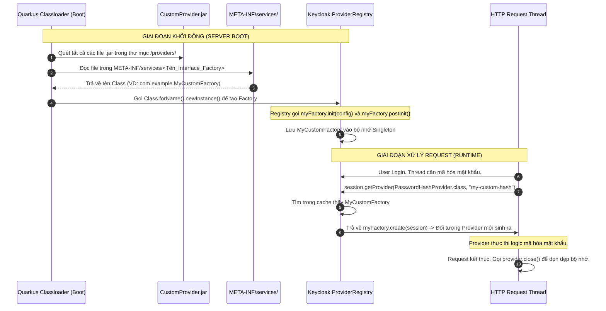

> [!NOTE]
> **Category:** Theory (Lý thuyết)
> **Goal:** Hiểu rõ kiến trúc tổng thể của Service Provider Interface (SPI) trong Keycloak. Nắm được cách Keycloak sử dụng mẫu thiết kế Factory và cơ chế nạp lớp động (Dynamic Classloading) để cho phép mở rộng mọi thành phần hệ thống mà không cần sửa đổi mã nguồn gốc (Core Source Code).

## 1. Lý thuyết chuyên sâu (Detailed Theory)

Một trong những sức mạnh lớn nhất của Keycloak so với các giải pháp Identity Management độc quyền (như Okta, Auth0) là khả năng tùy biến (Customization) gần như vô hạn. Sức mạnh này đến từ kiến trúc **SPI (Service Provider Interface)**.

**SPI là gì?**
SPI không phải là một khái niệm do Keycloak tự sáng chế, mà là một mẫu thiết kế tiêu chuẩn của Java (Java Service Provider Interface) có từ Java 6. Tuy nhiên, Keycloak đã nâng tầm nó lên thành cốt lõi của toàn bộ hệ thống. 
Mọi tính năng trong Keycloak — từ kết nối Database (JPA), đăng nhập bằng mạng xã hội (Social Login), băm mật khẩu (Password Hashing), gửi Email, cho đến các giao thức (SAML, OIDC) — **TẤT CẢ** đều được triển khai dưới dạng các SPI nội bộ.

Thay vì viết code trực tiếp vào Core, Keycloak định nghĩa các Interface (Hợp đồng). Bất kỳ nhà phát triển nào cũng có thể viết một Class implements cái Interface đó, đóng gói thành file `.jar`, ném vào thư mục `providers` của Keycloak, và hệ thống sẽ tự động nhận diện tính năng mới.

Các khái niệm cốt lõi trong một SPI của Keycloak:
- **`Provider`**: Là đối tượng thực hiện logic nghiệp vụ thực tế (Ví dụ: logic gửi Email, logic kiểm tra mã OTP). Được tạo ra lúc *Runtime* và chỉ sống trong phạm vi một Request/Transaction (Request-scoped).
- **`ProviderFactory`**: Là một Factory (nhà máy) chuyên dùng để sản xuất ra các thể hiện của `Provider`. Factory này là Singleton, sống từ khi Keycloak khởi động (Server Boot) cho đến khi tắt (Application-scoped), chứa các cấu hình kết nối tĩnh.
- **`KeycloakSession`**: Là đối tượng trung tâm quản lý toàn bộ vòng đời của một Request, chứa quyền truy cập vào Database, Cache, và có thể dùng để gọi các Provider khác.

## 2. Luồng nội bộ & Cơ chế cấp thấp (Internal Workflow & Low-level Mechanisms)

Làm sao Keycloak biết bạn vừa thả một file `.jar` chứa Custom SPI vào thư mục của nó và tự động nạp đoạn mã đó? Dưới đây là luồng khởi động và nạp SPI ở mức cấp thấp (Sử dụng hệ thống nạp module của Quarkus trong các phiên bản Keycloak mới).



**Cơ chế cấp thấp (Java ServiceLoader):**
Khi bạn viết một SPI, bạn bắt buộc phải tạo một thư mục `META-INF/services/` trong project. Bên trong, tạo một file text có tên chính là đường dẫn đầy đủ (Fully Qualified Name) của Interface gốc (Ví dụ: `org.keycloak.events.EventListenerProviderFactory`). Nội dung file chứa đường dẫn tới Class Factory của bạn. Khi Keycloak khởi động, hàm `ServiceLoader.load()` của Java sẽ rà soát classpath, đọc các file text này và tự động Reflection ra các Class Factory tương ứng.

## 3. Thực hành tốt nhất & Bảo mật (Best Practices & Security)

> [!WARNING]
> **Memory Leak (Rò rỉ bộ nhớ):** Vòng đời của `Provider` bị gắn chặt với HTTP Request. Bạn tuyệt đối KHÔNG ĐƯỢC lưu trữ (cache) các đối tượng có trạng thái (Stateful) như cấu hình, kết nối Database, hoặc Socket bên trong một biến `instance` của lớp `Provider`. Nếu không, bộ nhớ sẽ phình to ra sau mỗi request. Bất kỳ thông tin dùng chung nào phải được lưu trữ ở lớp `ProviderFactory`.

> [!IMPORTANT]
> **Thread-Safety trong Factory:** Vì `ProviderFactory` là một Singleton tồn tại suốt vòng đời Server, nhiều luồng (Thread) HTTP requests có thể gọi phương thức `create()` của nó cùng một lúc. Mã nguồn trong `Factory` phải là Thread-safe (an toàn đa luồng). Không được dùng biến toàn cục thay đổi liên tục trong Factory.

- **Dọn dẹp tài nguyên:** Luôn ghi đè phương thức `close()` trong lớp `Provider`. Nếu Provider của bạn mở một kết nối mạng, đọc file, phương thức `close()` là nơi duy nhất được Keycloak đảm bảo sẽ gọi khi Transaction kết thúc để bạn đóng kết nối, phòng ngừa cạn kiệt File Descriptor (FD).
- **Hạn chế can thiệp quá sâu (Overriding Core):** Mặc dù SPI cho phép bạn ghi đè các tính năng lõi (như AuthenticationFlow), nhưng lạm dụng nó sẽ gây khó khăn khi nâng cấp phiên bản Keycloak mới, vì cấu trúc Internal API có thể thay đổi.
- **Tận dụng `KeycloakSession`:** Thay vì tạo kết nối JDBC riêng lẻ để ghi log vào DB, hãy sử dụng `KeycloakSession` truyền vào Provider để lấy các provider có sẵn (Ví dụ: `session.getProvider(JpaConnectionProvider.class)`). Điều này đảm bảo dữ liệu custom của bạn tham gia vào chung một JTA Transaction. Nếu lỗi, mọi thứ sẽ rollback cùng nhau.

## 4. Cấu hình minh họa thực tế (Configuration Examples)

Ví dụ cấu trúc dự án Java Maven để tạo một SPI Lắng nghe sự kiện (EventListener).

**1. Class Provider (`MyEventListenerProvider.java`):**
```java
public class MyEventListenerProvider implements EventListenerProvider {
    private final KeycloakSession session;

    public MyEventListenerProvider(KeycloakSession session) {
        this.session = session;
    }

    @Override
    public void onEvent(Event event) {
        if (event.getType() == EventType.LOGIN) {
            System.out.println("User " + event.getUserId() + " vừa đăng nhập thành công!");
        }
    }

    @Override
    public void close() {
        // Dọn dẹp nếu cần thiết (không bắt buộc nếu không giữ tài nguyên I/O)
    }
}
```

**2. Class Factory (`MyEventListenerProviderFactory.java`):**
```java
public class MyEventListenerProviderFactory implements EventListenerProviderFactory {
    @Override
    public EventListenerProvider create(KeycloakSession session) {
        // Tạo một instance mới của Provider cho mỗi request
        return new MyEventListenerProvider(session);
    }

    @Override
    public void init(Config.Scope config) {
        // Khởi tạo một lần khi Keycloak Boot (VD: Đọc cấu hình từ file keycloak.conf)
    }

    @Override
    public String getId() {
        // Tên định danh của SPI hiển thị trên giao diện Admin Console
        return "my-custom-logger";
    }
}
```

**3. Khai báo META-INF:**
File: `src/main/resources/META-INF/services/org.keycloak.events.EventListenerProviderFactory`
Nội dung file:
```text
com.example.MyEventListenerProviderFactory
```

## 5. Trường hợp ngoại lệ (Edge Cases)

- **Lỗi ClassNotFoundException khi Deploy:** Bạn compile ra file `.jar` và bỏ vào Keycloak nhưng bị báo lỗi thiếu thư viện khi chạy. Nguyên nhân do Keycloak Quarkus (từ bản 17 trở đi) không tự động nạp kèm các file `.jar` phụ thuộc bên trong jar của bạn. **Khắc phục:** Sử dụng plugin `maven-shade-plugin` (Tạo Fat-jar/Uber-jar) để gộp tất cả các dependencies vào chung một file `.jar` duy nhất.
- **SPI không hoạt động sau khi cập nhật mã:** Trong môi trường Quarkus, Keycloak dùng cơ chế Build Time Optimization. Bạn thả jar mới vào mục `providers/` nhưng tính năng cũ vẫn chạy. **Khắc phục:** Cần phải chạy lệnh `kc.sh build` (để Quarkus re-index lại classpath) trước khi chạy `kc.sh start`.

## 6. Câu hỏi Phỏng vấn (Interview Questions)

1. **Junior:** SPI là viết tắt của từ gì và tại sao Keycloak lại phụ thuộc nặng nề vào kiến trúc này?
   *Đáp án:* SPI là Service Provider Interface. Keycloak dùng nó để cho phép nhà phát triển mở rộng, tùy biến hầu hết các thành phần (như Event Listener, Federation, Authenticator) mà không cần can thiệp trực tiếp vào mã nguồn của Keycloak, đảm bảo tính đóng gói và dễ dàng nâng cấp.
2. **Junior:** Mục đích của thư mục `META-INF/services/` trong project SPI là gì?
   *Đáp án:* Nó được sử dụng bởi hệ thống Java ServiceLoader. File bên trong chứa cấu hình chỉ định cho JVM biết cần tải các Class Provider Factory nào lúc khởi động, nếu không có file này, Keycloak sẽ coi file .jar chỉ là thư viện vô hại.
3. **Senior:** Tại sao Keycloak tách riêng thiết kế thành `Provider` và `ProviderFactory` thay vì tạo trực tiếp Provider?
   *Đáp án:* Phân chia ranh giới vòng đời (Lifecycle separation). `Factory` sống xuyên suốt vòng đời của Server, thích hợp để giữ các kết nối tài nguyên tĩnh nặng nề (như Connection Pool, Redis Client). `Provider` sinh ra theo từng HTTP Request. Việc khởi tạo một object rất nhanh, nhưng khởi tạo một connection là quá chậm, Factory giúp giải quyết bài toán tái sử dụng kết nối.
4. **Senior:** Giao diện `KeycloakSession` đóng vai trò gì khi viết SPI, và làm sao để lấy cấu hình từ Realm hiện tại?
   *Đáp án:* `KeycloakSession` đại diện cho phiên làm việc (transaction/request) hiện tại. Qua nó có thể tương tác với DB (qua EntityManager) và các provider khác. Để lấy Realm hiện tại đang xử lý request, ta gọi `session.getContext().getRealm()`.
5. **Senior:** Nếu bạn viết một SPI gọi API bên thứ 3 và API đó bị treo mất 30 giây. Điều này ảnh hưởng đến Keycloak như thế nào và cách giải quyết?
   *Đáp án:* Do Provider chạy đồng bộ (Synchronous) trên Request Thread của Keycloak, việc API treo sẽ chặn luồng (Thread-blocking), dẫn đến cạn kiệt Thread Pool của máy chủ Web (Undertow/Vert.x), hệ thống sẽ từ chối phục vụ các user khác. Khắc phục: Phải luôn cấu hình Timeout (Connect/Read timeout) cho các HTTP Client dùng trong SPI, hoặc chuyển xử lý sang các Message Queue bất đồng bộ.

## 7. Tài liệu tham khảo (References)

- [Keycloak Server Developer Guide - Service Provider Interfaces (SPI)](https://www.keycloak.org/docs/latest/server_development/#_providers)
- [Java Platform ServiceLoader Documentation](https://docs.oracle.com/javase/8/docs/api/java/util/ServiceLoader.html)
- [Quarkus Dependency Injection and Classloading](https://quarkus.io/guides/cdi-reference)
