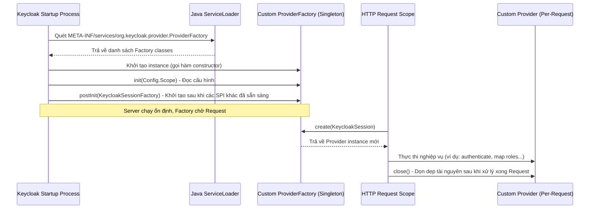

> [!NOTE]
> **Category:** Theory
> **Goal:** Hiểu sâu về cấu trúc Provider SPI trong Keycloak, bao gồm kiến trúc `Provider`, `ProviderFactory`, và cơ chế khởi tạo, quản lý vòng đời của các thành phần mở rộng trong hệ thống.

## 1. Lý thuyết chuyên sâu (Detailed Theory)

Trong hệ sinh thái Keycloak, **SPI (Service Provider Interface)** là cơ chế cốt lõi để mở rộng và tùy biến hành vi của máy chủ. Mỗi SPI định nghĩa một hợp đồng (contract) mà các nhà phát triển có thể triển khai để thay thế hoặc bổ sung các tính năng mặc định.

Hai khái niệm quan trọng nhất trong SPI Development là `Provider` và `ProviderFactory`.

- **Provider**: Đây là interface thực thi logic nghiệp vụ cụ thể. Mỗi request của người dùng (HTTP request) thường sẽ tạo ra một instance mới của `Provider` (hoặc tái sử dụng trong phạm vi request đó). `Provider` không nên lưu trạng thái (state) toàn cục vì nó phục vụ riêng rẽ cho từng request, đảm bảo an toàn đa luồng (thread-safe) ở mức độ request.
- **ProviderFactory**: Đây là lớp thiết kế theo mẫu *Factory Pattern*. Nhiệm vụ của nó là khởi tạo các instance của `Provider`. `ProviderFactory` là **singleton** trên toàn bộ scope của Keycloak server (thường là một instance duy nhất cho mỗi JVM). Nó được khởi tạo một lần khi Keycloak khởi động (startup), và bị hủy khi Keycloak tắt (shutdown). Do đó, `ProviderFactory` thường chịu trách nhiệm nạp các cấu hình nặng, tạo connection pool (nếu cần thiết), hoặc cache dùng chung.

Sự phân tách giữa Factory và Provider cho phép Keycloak tối ưu hóa tài nguyên: tải cấu hình nặng một lần thông qua Factory, nhưng đảm bảo luồng nghiệp vụ độc lập an toàn qua từng Provider instance mỗi khi có request tới.

## 2. Luồng nội bộ & Cơ chế cấp thấp (Internal Workflow & Low-level Mechanisms)

Keycloak sử dụng cơ chế Java ServiceLoader chuẩn (hoặc tương tự thông qua JBoss Modules / Quarkus extension) để quét các file đăng ký cấu hình nằm trong thư mục `META-INF/services/`. File này chứa tên fully-qualified của class implement `ProviderFactory`.



**Chi tiết các bước cấp thấp:**
1. **Discovery (Khám phá)**: Khi boot, Quarkus classpath scanner tìm kiếm file `META-INF/services/` để ánh xạ các Provider.
2. **Initialization (Khởi tạo Factory)**:
   - Phương thức `init(Config.Scope)`: Được gọi để truyền cấu hình từ file `keycloak.conf` hoặc CLI arguments vào Factory.
   - Phương thức `postInit(KeycloakSessionFactory)`: Rất hữu ích khi SPI của bạn phụ thuộc vào một SPI khác (ví dụ: bạn cần đọc data từ User Storage SPI sau khi nó đã khởi tạo).
3. **Execution (Thực thi Request)**: Keycloak sử dụng `KeycloakSession` (chứa toàn bộ context của request hiện tại) để gọi `factory.create(session)`. Instance trả về được sử dụng xuyên suốt transaction của HTTP request.
4. **Destruction (Hủy Provider)**: Ngay trước khi HTTP response được trả về và transaction commit/rollback, phương thức `close()` của Provider được gọi để giải phóng bộ nhớ, đóng connection (nếu mở mới).

## 3. Thực hành tốt nhất & Bảo mật (Best Practices & Security)

> [!IMPORTANT]
> Không bao giờ lưu trữ các object cụ thể của một `KeycloakSession` hoặc dữ liệu luồng request cụ thể vào trong các biến instance của `ProviderFactory`. Việc này sẽ dẫn đến **Thread-safety issues** và rò rỉ bộ nhớ (Memory Leak) do Factory là Singleton được dùng chung bởi mọi threads.

> [!TIP]
> Tái sử dụng các kết nối HTTP client, Database Connection Pools, hoặc Caches tĩnh ở bên trong `ProviderFactory`. Sau đó truyền tham chiếu của chúng (nếu an toàn) vào `Provider` qua constructor `create(session)`.

- **Resource Management**: Luôn luôn triển khai phương thức `close()` trong interface `Provider` đúng cách, dọn dẹp các tài nguyên như luồng byte (Streams) hay các đối tượng nặng không được quản lý bởi Garbage Collector ngay lập tức.
- **Logging**: Sử dụng `org.jboss.logging.Logger` mặc định của JBoss thay vì tự kéo vào các thư viện log (như log4j hay slf4j) để đảm bảo tính đồng nhất trên toàn hệ thống Keycloak.

## 4. Cấu hình minh họa thực tế (Configuration Examples)

**Định nghĩa một Event Listener SPI tùy chỉnh:**

1. **Provider Class**: `MyEventListenerProvider.java`
```java
public class MyEventListenerProvider implements EventListenerProvider {
    private final KeycloakSession session;
    private final Logger log = Logger.getLogger(MyEventListenerProvider.class);

    public MyEventListenerProvider(KeycloakSession session) {
        this.session = session;
    }

    @Override
    public void onEvent(Event event) {
        log.infof("Event type: %s for user: %s", event.getType(), event.getUserId());
    }

    @Override
    public void onEvent(AdminEvent adminEvent, boolean b) {
        // Handle admin events
    }

    @Override
    public void close() {
        // Dọn dẹp nếu có mở streams hoặc tài nguyên cục bộ
    }
}
```

2. **ProviderFactory Class**: `MyEventListenerProviderFactory.java`
```java
public class MyEventListenerProviderFactory implements EventListenerProviderFactory {
    @Override
    public EventListenerProvider create(KeycloakSession session) {
        // Tạo instance mới cho mỗi session (request)
        return new MyEventListenerProvider(session);
    }

    @Override
    public void init(Config.Scope config) {
        // Đọc cấu hình từ keycloak.conf, ví dụ: spi-event-listener-my-event-listener-custom-prop=value
    }

    @Override
    public void postInit(KeycloakSessionFactory factory) { }

    @Override
    public void close() {
        // Dọn dẹp tài nguyên Singleton khi Keycloak Server tắt
    }

    @Override
    public String getId() {
        return "my-custom-event-listener";
    }
}
```

3. **File cấu hình dịch vụ (`META-INF/services/org.keycloak.events.EventListenerProviderFactory`)**:
```text
com.example.keycloak.MyEventListenerProviderFactory
```

## 5. Trường hợp ngoại lệ (Edge Cases)

- **Memory Leaks do không Close**: Nếu phương thức `close()` không đóng kết nối HTTP bên thứ 3 (trong trường hợp gọi API ra ngoài), connection pool trong Factory sẽ cạn kiệt (Connection Pool Exhaustion) sau một thời gian chạy, gây nghẽn toàn bộ server.
- **Race Conditions**: Xảy ra khi lập trình viên nhầm lẫn giữa vòng đời của Provider và Factory, dẫn đến việc dùng chung (share) biến instance của Provider giữa các thread khác nhau bằng cách gán nó vào static context, dẫn tới việc user A nhìn thấy dữ liệu của user B.
- **Transaction Rollback**: Ném `RuntimeException` trong `Provider` sẽ khiến toàn bộ giao dịch Keycloak (JPA transaction) bị rollback. Cần xử lý ngoại lệ (try-catch) cẩn thận nếu logic của bạn không muốn ảnh hưởng đến luồng đăng nhập chính (ví dụ ghi log thất bại thì vẫn cho phép user đăng nhập).

## 6. Câu hỏi Phỏng vấn (Interview Questions)

1. **Junior**: Sự khác biệt chính giữa `Provider` và `ProviderFactory` trong Keycloak là gì?
   - *Đáp án*: Factory là Singleton chịu trách nhiệm tạo ra các Provider. Provider là đối tượng khởi tạo cho mỗi request (per-request) để thực hiện công việc cụ thể.
2. **Junior**: Làm thế nào để Keycloak biết đến custom SPI của bạn sau khi biên dịch (compile)?
   - *Đáp án*: Keycloak nhận diện thông qua tệp khai báo nằm trong đường dẫn `META-INF/services/` chứa tên Interface cần override/implement và tên class implementation.
3. **Senior**: Tôi có thể khởi tạo connection đến database ngoài vào lúc nào trong vòng đời SPI?
   - *Đáp án*: Nên khởi tạo kết nối (hoặc connection pool) trong phương thức `init()` hoặc `postInit()` của `ProviderFactory` để sử dụng lại kết nối, tránh tạo kết nối mới qua mỗi HTTP request bên trong `Provider`.
4. **Senior**: Việc gọi `postInit()` trong `ProviderFactory` có lợi thế gì so với `init()`?
   - *Đáp án*: `init()` chỉ nhận cấu hình, trong khi `postInit()` cung cấp `KeycloakSessionFactory`, cho phép bạn truy cập tới toàn bộ hệ thống các Providers khác đã khởi tạo xong, giải quyết bài toán khởi tạo phụ thuộc chéo (circular dependency).
5. **Senior**: Khi gọi External API từ custom Authenticator, điều gì xảy ra nếu hệ thống đối tác phản hồi quá chậm (timeout)?
   - *Đáp án*: Nó chặn (block) thread của Undertow/Quarkus xử lý HTTP request hiện tại. Nếu lưu lượng cao, tất cả worker threads sẽ bị treo, dẫn đến Keycloak ngưng phục vụ toàn bộ. Cần phải thiết lập timeouts chặt chẽ trên HTTP Client trong SPI và triển khai cơ chế Circuit Breaker.

## 7. Tài liệu tham khảo (References)

- [Keycloak Official Server Developer Guide - Provider SPI](https://www.keycloak.org/docs/latest/server_development/#_providers)
- [Java ServiceLoader API Documentation](https://docs.oracle.com/en/java/javase/11/docs/api/java.base/java/util/ServiceLoader.html)
- [Design Patterns: Factory Method](https://refactoring.guru/design-patterns/factory-method)
