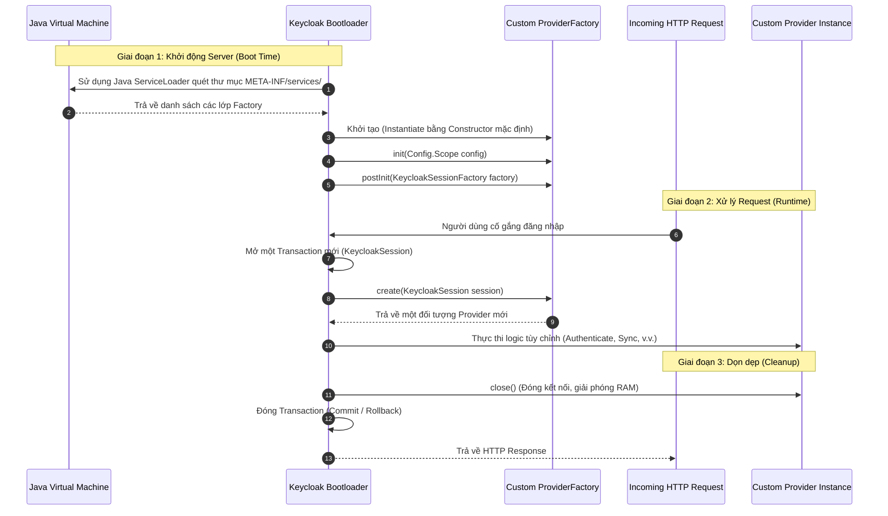

> [!NOTE]
> **Category:** Theory (Lý thuyết)
> **Goal:** Hiểu sâu sắc kiến trúc, vai trò và vòng đời của `ProviderFactory` trong hệ thống Service Provider Interface (SPI) của Keycloak, từ đó tránh được các lỗi nghiêm trọng về concurrency (đồng thời) và memory leak (rò rỉ bộ nhớ).

## 1. Lý thuyết chuyên sâu (Detailed Theory)

Trong kiến trúc của Keycloak, Service Provider Interface (SPI) là cơ chế mở rộng cốt lõi cho phép các nhà phát triển can thiệp vào hầu hết mọi hành vi của hệ thống (ví dụ: Custom User Federation, Event Listener, Custom Authenticator). 

Để quản lý các tiện ích mở rộng này, Keycloak áp dụng triệt để **Factory Design Pattern** thông qua interface `ProviderFactory`. Thay vì khởi tạo trực tiếp các object xử lý logic (`Provider`), Keycloak ủy quyền việc khởi tạo đó cho `ProviderFactory`.

**Tại sao lại phải tách biệt Factory và Provider?**
Hệ thống nhận diện danh tính như Keycloak là một hệ thống phân tán, xử lý hàng ngàn request đồng thời (highly concurrent). 
- Một `Provider` thường mang tính **Trạng thái (Stateful)**. Nó cần lưu giữ các biến ngữ cảnh tạm thời liên quan đến duy nhất một Giao dịch (Transaction) hoặc một HTTP Request, ví dụ như kết nối cơ sở dữ liệu tạm, hay bộ nhớ đệm luồng.
- Nếu Keycloak sử dụng kiến trúc Singleton cho `Provider`, nhiều request sẽ cùng ghi đè lên các thuộc tính của `Provider`, dẫn tới tình trạng **Race Condition** cực kỳ nguy hiểm (ví dụ: User A vô tình nhận được Access Token của User B).

Giải pháp là phân chia phạm vi vòng đời (Lifecycle Scopes):
- **ProviderFactory:** Đóng vai trò là một **Singleton**, chỉ được tạo ra một lần duy nhất khi Keycloak khởi động (Boot time). Nó là nơi lý tưởng để giữ các biến tĩnh (Static), cấu hình toàn cục (Global configurations), hoặc kết nối chia sẻ (Connection Pools).
- **Provider:** Đóng vai trò là **Request-scoped** (hoặc Session-scoped). Cứ mỗi một Keycloak Session (thường tương đương với một HTTP request), `ProviderFactory` sẽ sinh ra một bản sao (Instance) mới của `Provider` để phục vụ. Kết thúc request, bản sao này sẽ bị hủy.

## 2. Luồng nội bộ & Cơ chế cấp thấp (Internal Workflow & Low-level Mechanisms)

Cơ chế Keycloak tìm kiếm và quản lý vòng đời của Factory dựa vào tính năng cấp thấp của Java là `ServiceLoader`.



**Giải thích chi tiết các bước cấp thấp:**
1. **Java ServiceLoader:** Khi Keycloak boot, nó không thể tự "đoán" được mã nguồn của bạn. Nó đọc file văn bản thuần túy bên trong `META-INF/services/<Tên Interface>` để biết đường dẫn đầy đủ đến class Factory của bạn (ví dụ: `com.example.MyEventListenerFactory`).
2. **`init()`:** Hàm này chạy 1 lần. Thường dùng để đọc các cấu hình từ file `keycloak.conf` được truyền qua đối tượng `Config.Scope`.
3. **`postInit()`:** Hàm này chạy sau khi *tất cả* các ProviderFactories khác trong hệ thống đã được khởi tạo. Đây là nơi an toàn để gọi hoặc phụ thuộc vào các module khác.
4. **`create(KeycloakSession)`:** Đây là "trái tim" của Factory. Trong hàm này, bạn phải dùng từ khóa `new` để tạo một đối tượng Provider, tiêm `KeycloakSession` vào đó và trả về cho hệ thống.
5. **`close()` của Provider:** Sau khi request hoàn tất, Keycloak bắt buộc phải dọn dẹp. Nếu Provider của bạn mở một con trỏ DB, bạn phải đóng nó tại hàm `close()` này.

## 3. Thực hành tốt nhất & Bảo mật (Best Practices & Security)

> [!CAUTION]
> **Bảo vệ luồng (Thread-safety):** Lớp `ProviderFactory` được truy cập bởi nhiều luồng (Thread) cùng một lúc. Tuyệt đối KHÔNG LƯU TRỮ dữ liệu liên quan đến người dùng, request cụ thể hay `KeycloakSession` dưới dạng biến instance (biến cấp class) trong Factory. Điều này sẽ dẫn đến Race Condition và rò rỉ dữ liệu xuyên phiên (Cross-session data leakage).

> [!IMPORTANT]
> - **Chuyển logic nặng vào Factory:** Bất kỳ thao tác khởi tạo tài nguyên tốn kém nào (Tải tệp JSON dung lượng lớn, Khởi tạo Connection Pool, Phân tích biểu thức Regex) PHẢI được thực hiện trong hàm `init()` của Factory và lưu dưới dạng biến của Factory. Sau đó truyền tham chiếu vào `Provider`. Việc làm này trong hàm `create()` của Provider sẽ khiến hiệu năng CPU sụt giảm nghiêm trọng do nó phải thực hiện lặp đi lặp lại trên mỗi request.
> - **Xử lý ngoại lệ trong `close()`:** Lỗi xảy ra trong hàm `Provider.close()` có thể khiến Keycloak bị kẹt Transaction (Uncommitted Transaction), dẫn tới hiện tượng treo database (Database locks).

## 4. Cấu hình minh họa thực tế (Configuration Examples)

Dưới đây là một ví dụ minh họa về cách cấu trúc mã nguồn Java an toàn để hiện thực `ProviderFactory` cho một custom Event Listener.

**Mã nguồn: `MyEventListenerProviderFactory.java`**
```java
package com.example.spi;

import org.keycloak.Config;
import org.keycloak.events.EventListenerProvider;
import org.keycloak.events.EventListenerProviderFactory;
import org.keycloak.models.KeycloakSession;
import org.keycloak.models.KeycloakSessionFactory;

public class MyEventListenerProviderFactory implements EventListenerProviderFactory {

    private String staticMessage; // Biến tĩnh, an toàn để lưu ở Factory

    @Override
    public String getId() {
        return "my-custom-listener";
    }

    @Override
    public void init(Config.Scope config) {
        // Chạy 1 lần khi server boot
        // Lấy cấu hình từ file cấu hình của Keycloak
        this.staticMessage = config.get("customMessage", "Default Message");
        System.out.println("MyEventListenerProviderFactory is initializing...");
    }

    @Override
    public void postInit(KeycloakSessionFactory factory) {
        // Chạy sau khi mọi thứ đã khởi tạo xong
    }

    @Override
    public EventListenerProvider create(KeycloakSession session) {
        // Cực kỳ quan trọng: Luôn sinh ra một object MỚI
        // Truyền trạng thái Request (session) và trạng thái Toàn cục (staticMessage)
        return new MyEventListenerProvider(session, this.staticMessage);
    }

    @Override
    public void close() {
        // Đóng các resource cục bộ của toàn hệ thống (nếu có mở)
        // Lưu ý: Hàm này thuộc về Factory, chỉ gọi khi Keycloak Shutdown
    }
}
```

**Cấu hình ServiceLoader:**
Tạo tệp: `src/main/resources/META-INF/services/org.keycloak.events.EventListenerProviderFactory`
Nội dung tệp chỉ là tên package đầy đủ:
```text
com.example.spi.MyEventListenerProviderFactory
```

## 5. Trường hợp ngoại lệ (Edge Cases)

- **Quên tệp META-INF/services:** Đây là lỗi phổ biến nhất. Developer viết code rất chuẩn nhưng khởi động server Keycloak không thấy Provider đâu. *Nguyên nhân:* Java ServiceLoader không tìm thấy đăng ký class, nên Keycloak hoàn toàn ngó lơ đoạn code đó mà không báo lỗi.
- **Deadlock trong lúc Boot:** Nếu bạn thực hiện các thao tác chặn I/O (Blocking I/O) như gọi API bên thứ ba bị timeout bên trong hàm `init()`, tiến trình khởi động của toàn bộ Keycloak Server sẽ bị đứng vô thời hạn (Hang). *Khắc phục:* Nên set timeout nghiêm ngặt cho HTTP Clients dùng trong giai đoạn boot, hoặc chuyển công việc đó sang một luồng bất đồng bộ (Async Thread) nếu không bắt buộc chặn boot.
- **Vòng lặp khởi tạo (Initialization Loop):** Trong hàm `postInit()`, nếu bạn cố tình lấy một Provider khác thông qua `session.getProvider()`, và Provider đó lại gọi ngược lại bạn, nó sẽ tạo ra Deadlock do vòng lặp vô tận.

## 6. Câu hỏi Phỏng vấn (Interview Questions)

1. **(Junior)** Tại sao Keycloak không trực tiếp load class `Provider` mà phải thông qua `ProviderFactory`?
   - *Đáp án:* Để quản lý vòng đời bộ nhớ. `Provider` chứa trạng thái của 1 transaction/request, nếu tạo trực tiếp dưới dạng singleton thì sẽ gây nhiễu dữ liệu giữa các request. Factory giữ vai trò là Singleton để quản lý cấu hình, mỗi khi có request nó mới xuất (create) ra một Provider mới.
2. **(Junior)** Làm thế nào để Keycloak biết đến mã nguồn Custom SPI của bạn khi triển khai tệp JAR?
   - *Đáp án:* Bằng cơ chế `Java ServiceLoader`. Ta phải định nghĩa chính xác đường dẫn class trong thư mục `META-INF/services/` của gói JAR.
3. **(Senior)** Sự khác nhau giữa `ProviderFactory.close()` và `Provider.close()` là gì?
   - *Đáp án:* `ProviderFactory.close()` chỉ chạy 1 lần duy nhất khi tiến trình Keycloak Server bị tắt (Shutdown). Còn `Provider.close()` được chạy liên tục, ngay sau khi mỗi vòng đời của HTTP Request/Transaction kết thúc để giải phóng tài nguyên.
4. **(Senior)** Nếu bạn cần thiết lập kết nối đến một External Database trong Custom SPI, bạn sẽ khởi tạo Pool kết nối ở đâu để tránh sập server do quá tải kết nối?
   - *Đáp án:* Phải khởi tạo Connection Pool bên trong hàm `init()` của lớp `ProviderFactory` (Singleton) để giữ số lượng kết nối ổn định. Tuyệt đối không mở kết nối trong `Provider.create()` hoặc constructor của `Provider` vì mỗi request sẽ mở một socket mới gây sập DB.
5. **(Senior)** Điều gì xảy ra nếu bạn lưu trữ đối tượng `KeycloakSession` dưới dạng private field trong lớp `ProviderFactory`?
   - *Đáp án:* Sẽ gây ra hiện tượng Race Condition nghiêm trọng. Cả hàng nghìn người dùng truy cập vào Keycloak sẽ đều chia sẻ và ghi đè trạng thái của cùng một `KeycloakSession` cũ (thuộc về người gọi hàm `create()` cuối cùng), dẫn đến rò rỉ dữ liệu, sai lệch Token, và crash ứng dụng.

## 7. Tài liệu tham khảo (References)
- [Keycloak Server Developer Guide - Service Provider Interfaces (SPI)](https://www.keycloak.org/docs/latest/server_development/#_providers)
- [Java Platform SE 8 - ServiceLoader Documentation](https://docs.oracle.com/javase/8/docs/api/java/util/ServiceLoader.html)
