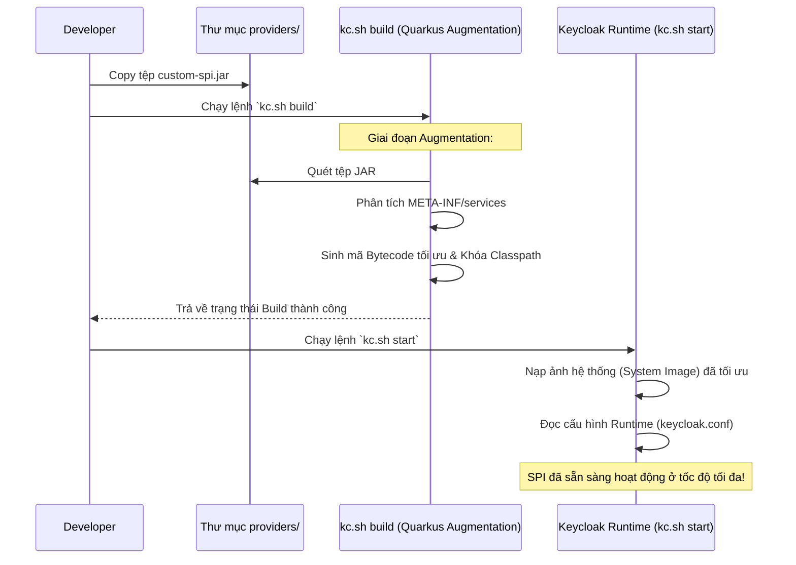

> [!NOTE]
> **Category:** Theory
> **Goal:** Nắm vững cơ chế triển khai (Deployment) và tối ưu hóa các bản dựng (Build) custom SPI vào môi trường Keycloak (Quarkus-based), hiểu rõ vòng đời đóng gói và tải module.

## 1. Lý thuyết chuyên sâu (Detailed Theory)

Triển khai SPI (Service Provider Interface) trong Keycloak là quá trình đưa mã nguồn tùy chỉnh (đã được đóng gói thành tệp JAR) vào môi trường thực thi của máy chủ Keycloak để nó nhận diện, nạp (load) và sử dụng như một tính năng hệ thống mở rộng.

Kể từ khi Keycloak chuyển đổi nền tảng lõi sang **Quarkus** (Keycloak.X - từ phiên bản 17+), mô hình triển khai đã thay đổi hoàn toàn so với phiên bản WildFly cũ:
- **Build-Time Optimization (Tối ưu hóa lúc biên dịch/khởi tạo)**: Thay vì quét các file JAR mỗi khi khởi động hoặc phát hiện khi đang chạy (Hot Deployment) một cách động, Quarkus áp dụng mô hình "Closed-world assumption". Keycloak yêu cầu một bước "Build" (`kc.sh build`) trước khi chạy, để quét toàn bộ classpath, biên dịch trước (AOT - Ahead of Time compilation), và xây dựng một runtime tối ưu.
- **Providers Directory**: Tệp JAR chứa SPI phải được đặt vào thư mục `providers/` của Keycloak. Khi lệnh `build` được chạy, cấu trúc SPI bên trong JAR sẽ được phân tích, ghi nhận vào bytecode tối ưu.

Mô hình này giúp Keycloak giảm thời gian khởi động (Startup time) và tối ưu hóa sử dụng bộ nhớ (Memory footprint), rất phù hợp với môi trường Cloud-Native và Container (Kubernetes).

## 2. Luồng nội bộ & Cơ chế cấp thấp (Internal Workflow & Low-level Mechanisms)

Quá trình triển khai một custom SPI JAR đi qua các giai đoạn nghiêm ngặt để tích hợp vào Core của Keycloak.



**Cơ chế tải Class (Classloading):**
- Trong môi trường Quarkus, hệ thống phân cấp ClassLoader phẳng hơn nhiều so với kiến trúc JBoss Modules của WildFly.
- Khi tệp JAR ở thư mục `providers/` được nạp trong bước Build, các class của SPI sẽ thuộc chung một ClassLoader hierarchy với mã nguồn cốt lõi của Keycloak. Điều này loại bỏ các lỗi phức tạp về khả năng hiển thị class (class visibility) nhưng đồng thời yêu cầu xung đột thư viện (dependency conflicts) phải được giải quyết từ trước trong file `pom.xml` của project SPI.

## 3. Thực hành tốt nhất & Bảo mật (Best Practices & Security)

> [!WARNING]
> Không bao giờ chèn (bundle) các thư viện lõi (Core libraries) đã có sẵn trong Keycloak (ví dụ: Jackson, Resteasy, Hibernate) vào bên trong SPI JAR của bạn (Fat JAR). Việc này sẽ gây xung đột phiên bản và lỗi ClassLoader nghiêm trọng như `NoClassDefFoundError` hoặc `NoSuchMethodError`. Hãy đặt scope của các thư viện này là `provided` trong Maven.

> [!IMPORTANT]
> Quá trình Hot Deployment (Tự động nạp lại mã khi đang chạy) KHÔNG ĐƯỢC HỖ TRỢ cho môi trường Production trên Keycloak Quarkus. Bạn phải build lại ảnh Container hoặc chạy lệnh `kc.sh build` mỗi khi thay đổi file JAR. Chỉ trong môi trường Dev (`kc.sh start-dev`), Keycloak mới hỗ trợ auto-reload một phần.

- **Kích thước JAR**: Giữ tệp JAR mở rộng càng nhỏ càng tốt, chỉ chứa các logic nghiệp vụ và các thư viện bên thứ 3 thật sự cần thiết không được Keycloak cung cấp mặc định.
- **Immutable Containers**: Trong thực tiễn DevOps, thư mục `providers/` phải được sao chép file JAR và chạy bước `kc.sh build` ngay trong Dockerfile, tạo ra một Docker Image dùng riêng không thể thay đổi (Immutable).

## 4. Cấu hình minh họa thực tế (Configuration Examples)

**Ví dụ về cấu hình Dockerfile tối ưu (Multi-stage build):**

Để triển khai một Custom SPI vào môi trường Production bằng Container, hãy tuân theo cấu trúc sau:

```dockerfile
# Stage 1: Build Keycloak Image tích hợp SPI
FROM quay.io/keycloak/keycloak:latest as builder

# Bật các tính năng cần thiết (nếu có)
ENV KC_FEATURES=scripts

# Copy file custom SPI JAR từ máy cục bộ (hoặc CI/CD pipeline) vào thư mục providers
COPY ./target/my-custom-authenticator-1.0.jar /opt/keycloak/providers/
COPY ./target/my-custom-event-listener-1.0.jar /opt/keycloak/providers/

# Thực thi lệnh build tối ưu hóa (Quarkus Augmentation)
RUN /opt/keycloak/bin/kc.sh build

# Stage 2: Chạy Image tối ưu hóa (Runtime)
FROM quay.io/keycloak/keycloak:latest

# Copy hệ thống đã được tối ưu từ stage builder
COPY --from=builder /opt/keycloak/ /opt/keycloak/

# Khai báo các thông số kết nối Database, v.v. (Nên truyền vào qua Environment variables khi run)
ENV KC_DB=postgres

# Mở cổng
EXPOSE 8080

# Chạy server ở chế độ Production
ENTRYPOINT ["/opt/keycloak/bin/kc.sh", "start"]
```

## 5. Trường hợp ngoại lệ (Edge Cases)

- **Dependency Class Collision (Xung đột thư viện)**: Bạn sử dụng thư viện `Guava` phiên bản 30, nhưng Keycloak sử dụng bản 31. Khi triển khai, phương thức bạn gọi chỉ tồn tại trong bản 30 bị "che khuất" bởi class của bản 31 do ClassLoader ưu tiên. Giải pháp: Sử dụng Maven Shade Plugin để "relocate" (đổi tên package) của thư viện bên thứ 3 (ví dụ từ `com.google.common` sang `com.mycompany.shaded.common`).
- **Lỗi thiếu file SPI Definition**: JAR được deploy thành công, `kc.sh build` báo không lỗi, nhưng trên Admin Console không thấy cấu hình tính năng mới. Nguyên nhân 99% do bạn quên tạo thư mục `META-INF/services/` hoặc ghi sai tên Fully Qualified Name của Provider Factory.
- **Cache tĩnh dẫn đến rò rỉ bộ nhớ**: Khi triển khai SPI, nếu trong class bạn sử dụng các cấu trúc dữ liệu tĩnh (`static HashMap`) để lưu trữ dữ liệu, sau nhiều lần restart / deploy nháp mà không dọn dẹp, nó có thể gây hết bộ nhớ (OOM).

## 6. Câu hỏi Phỏng vấn (Interview Questions)

1. **Junior**: Làm thế nào để deploy một file JAR tùy chỉnh (SPI) vào Keycloak phiên bản Quarkus?
   - *Đáp án*: Sao chép file JAR vào thư mục `providers/` và chạy lệnh `kc.sh build` để tối ưu hóa, sau đó chạy `kc.sh start`.
2. **Junior**: Tại sao dung lượng file SPI JAR lại quan trọng khi deploy?
   - *Đáp án*: File JAR quá lớn (đặc biệt khi gói nhầm các thư viện lõi đã có trong Keycloak) sẽ gây phình to hệ thống, tải chậm, và có nguy cơ cực lớn gây ra lỗi xung đột phiên bản thư viện.
3. **Senior**: Tính năng "Hot Deployment" trong Keycloak dựa trên Quarkus hoạt động như thế nào trong Production?
   - *Đáp án*: Keycloak Quarkus KHÔNG hỗ trợ Hot Deployment trong môi trường Production (`kc.sh start`). Nó áp dụng mô hình "Closed-world assumption" để tối ưu hóa build-time. Mọi thay đổi đều yêu cầu build lại.
4. **Senior**: Giải thích vai trò của quá trình Augmentation (`kc.sh build`) trong Quarkus đối với SPI?
   - *Đáp án*: Augmentation quét các annotations và META-INF/services, giải quyết CDI wiring, loại bỏ dead code, và sinh ra mã bytecode liên kết cứng. Quá trình này chuyển các thao tác tốn kém (thường thực hiện lúc startup của Java truyền thống) sang thời điểm build, giúp hệ thống startup siêu tốc.
5. **Senior**: Làm sao để xử lý tình huống custom SPI của bạn cần một phiên bản thư viện Jackson hoàn toàn khác với phiên bản Keycloak đang dùng?
   - *Đáp án*: Cần phải sử dụng Maven Shade Plugin để thực hiện việc "relocation" (đổi tên package) thư viện Jackson trong project SPI của bạn, tránh xung đột ClassLoader ở mức runtime của Keycloak.

## 7. Tài liệu tham khảo (References)

- [Keycloak Official Docs: Configuring Providers](https://www.keycloak.org/server/configuration-provider)
- [Quarkus Architecture: Build Time Boot](https://quarkus.io/guides/writing-extensions#build-step-processors)
- [Maven Shade Plugin Documentation](https://maven.apache.org/plugins/maven-shade-plugin/)
