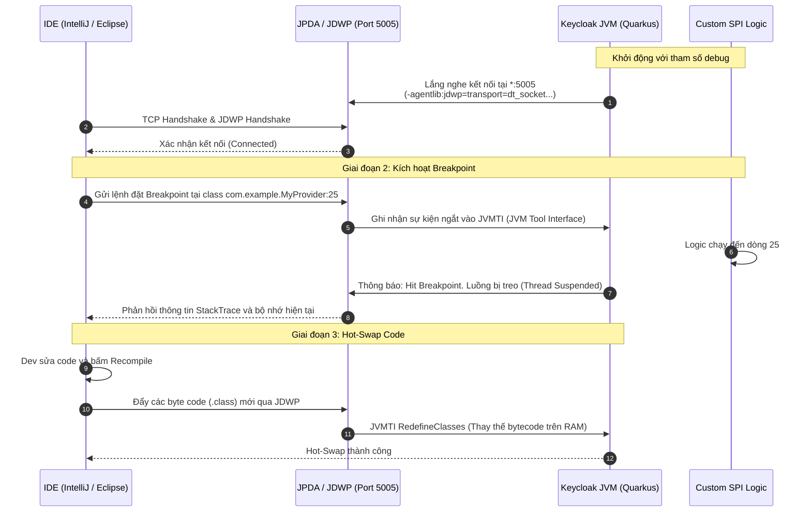

> [!NOTE]
> **Category:** Theory (Lý thuyết)
> **Goal:** Nắm vững các cơ chế cấu trúc, luồng hoạt động của Remote Debugging (JPDA) trong môi trường Quarkus, và cách thức kết nối IDE để gỡ lỗi mã nguồn mở rộng (Custom SPI) của Keycloak theo thời gian thực.

## 1. Lý thuyết chuyên sâu (Detailed Theory)

Mở rộng Keycloak thông qua Service Provider Interfaces (SPI) đồng nghĩa với việc bạn đang nhúng mã nguồn tùy chỉnh (đóng gói dưới dạng tệp `.jar`) vào sâu bên trong lõi của Keycloak. Khác với các ứng dụng Spring Boot hay Node.js độc lập, bạn không thể khởi chạy file JAR của SPI như một ứng dụng đơn lẻ (Standalone Application). Mã của bạn được gọi (invoke) bởi runtime của Keycloak.

Để biết chính xác luồng dữ liệu đang chạy như thế nào (giá trị biến, luồng thực thi), bạn phải sử dụng cơ chế **Remote Debugging** (Gỡ lỗi từ xa) được cung cấp bởi **JPDA (Java Platform Debugger Architecture)**. JPDA là một kiến trúc đa tầng của Máy ảo Java (JVM). Bằng cách khởi chạy Keycloak JVM ở chế độ Debug, JVM sẽ mở một cổng giao tiếp mạng (thường là 5005) dựa trên giao thức **JDWP (Java Debug Wire Protocol)**.

Các môi trường phát triển tích hợp (IDE) như IntelliJ IDEA hay Eclipse sẽ kết nối vào cổng này. Từ đó, IDE có thể gửi lệnh để tạm dừng luồng (Breakpoints), đọc bộ nhớ (Inspect variables), và thậm chí là **Hot-Swap** (thay thế mã nhị phân `.class` đang chạy trên RAM mà không cần khởi động lại máy chủ).

## 2. Luồng nội bộ & Cơ chế cấp thấp (Internal Workflow & Low-level Mechanisms)

Dưới đây là luồng tương tác cấp thấp giữa IDE (Developer) và Keycloak JVM thông qua giao thức JDWP.



**Giải thích chi tiết các bước cấp thấp:**
1. **JVM Arguments:** Khi bạn bật chế độ debug, thực chất Keycloak đang chèn cờ `-agentlib:jdwp=transport=dt_socket,server=y,suspend=n,address=*:5005` vào tiến trình khởi động Java.
2. **JDWP Protocol:** Giao thức mạng cho phép truyền tin hai chiều. IDE gửi tín hiệu "Tạm dừng tại file A, dòng B". JVM (thông qua JVMTI) sẽ liên tục theo dõi và dừng Thread tương ứng khi luồng xử lý chạy qua đó.
3. **Thread Suspension:** Khi trúng Breakpoint, Thread của Request hiện tại (hoặc tất cả các Thread, tùy cấu hình IDE) bị đóng băng (suspend). Trong lúc này, HTTP Request bên phía Client sẽ bị treo trạng thái `Pending` do không có phản hồi.
4. **Hot-Swap (RedefineClasses):** Tính năng quyền lực nhất của JVMTI. Khi mã nguồn Java thay đổi, IDE biên dịch lại. Thay vì restart Keycloak (rất chậm), bytecode mới được tiêm trực tiếp vào PermGen/Metaspace của JVM đang chạy.

## 3. Thực hành tốt nhất & Bảo mật (Best Practices & Security)

> [!CAUTION]
> Tuyệt đối KHÔNG BAO GIỜ mở port Debug (5005) hoặc sử dụng tham số `--debug` trên môi trường UAT hoặc Production. Cổng JDWP không có cơ chế xác thực. Bất kỳ kẻ tấn công nào kết nối được vào port này đều có thể thực thi mã tùy ý (Remote Code Execution - RCE) với quyền của Keycloak user.

> [!IMPORTANT]
> - **Sử dụng `suspend=y` để gỡ lỗi Boot-time:** Nếu SPI của bạn bị lỗi trong hàm `ProviderFactory.init()` (lúc khởi động), hãy thiết lập JVM argument `suspend=y`. Server Keycloak sẽ "đóng băng" ngay tại giây thứ 0 và chờ bạn kết nối IDE vào thì mới tiếp tục chạy quá trình khởi động.
> - **Giới hạn IP:** Kể cả trên môi trường Development/Staging dùng chung, hãy bind address (địa chỉ lắng nghe) cho JDWP vào `127.0.0.1:5005` thay vì `*:5005` (0.0.0.0) nếu máy chủ đó mở ra internet.

## 4. Cấu hình minh họa thực tế (Configuration Examples)

**Chạy Keycloak (Quarkus) ở chế độ Debug Local:**
Sử dụng script mặc định của Keycloak, chế độ dev (development mode) mặc định đã tự kích hoạt port 5005 (với địa chỉ localhost). Để bật tường minh, bạn dùng tham số `--debug`.
```bash
./kc.sh start-dev --debug
# Nếu bạn muốn tùy chỉnh port (ví dụ: bị trùng cổng)
./kc.sh start-dev --debug 5006
```

**Chạy Keycloak trong Docker Compose (Có Debug):**
Để debug một Keycloak chạy trong Container, bạn phải `expose` port ra máy host và cho phép JDWP lắng nghe trên tất cả các mạng nội bộ Docker (`*:5005`).

```yaml
version: '3.8'
services:
  keycloak:
    image: quay.io/keycloak/keycloak:latest
    command: start-dev --debug *:5005
    environment:
      KC_DB: postgres
      # ... (Các biến môi trường khác)
    ports:
      - "8080:8080"
      - "5005:5005" # Expose JDWP Port
```

**Cấu hình trên IntelliJ IDEA:**
1. Chọn `Run` -> `Edit Configurations...` -> `Add New Configuration` -> `Remote JVM Debug`.
2. Thiết lập Host: `localhost` (hoặc IP máy chủ), Port: `5005`.
3. Bấm `Debug`. IDE báo "Connected to the target VM" là thành công.

## 5. Trường hợp ngoại lệ (Edge Cases)

- **Lỗi "Address already in use: JVM_Bind":** Có một tiến trình khác trên hệ điều hành đang sử dụng port 5005 (thường gặp khi bạn chạy 2 project Java cùng lúc). *Khắc phục:* Đổi biến `--debug 5006` và cập nhật cổng trong IDE.
- **Hot-Swap Failed (Thất bại khi nạp lại mã):** Hot-swap chuẩn của JVM rất hạn chế. Nếu bạn thay đổi chữ ký hàm (đổi tên phương thức, thêm/xóa tham số), thêm/xóa field cấp class (thuộc tính), JVM sẽ báo `Hot Swap failed` (Unsupported operation). *Khắc phục:* Bạn bắt buộc phải Restart lại tiến trình Keycloak, hoặc cài đặt các công cụ JVM chuyên biệt như DCEVM hay JRebel.
- **Connection Refused trong Docker:** Thường do quên định cấu hình `*:5005` trong cú pháp lệnh. Nếu chỉ gõ `--debug 5005`, Quarkus mặc định chỉ bind vào `localhost` của mạng nội bộ container, máy host bên ngoài không thể TCP kết nối vào được.

## 6. Câu hỏi Phỏng vấn (Interview Questions)

1. **(Junior)** Làm cách nào để bạn in giá trị của biến trong Keycloak SPI ra màn hình console thay vì dùng Debug?
   - *Đáp án:* Sử dụng thư viện JBoss Logging (được tích hợp sẵn trong Keycloak) thay vì `System.out.println()`. Ví dụ: `import org.jboss.logging.Logger; Logger.getLogger(MySPI.class).infof("Value: %s", myVar);`. Nhưng để trace luồng phức tạp thì nên dùng Remote Debug.
2. **(Junior)** Cổng mặc định của Remote Debugging Java là gì và protocol nào được sử dụng?
   - *Đáp án:* Cổng mặc định thường là 5005, sử dụng giao thức JDWP (Java Debug Wire Protocol).
3. **(Senior)** Nếu logic SPI của bạn bị lỗi NullPointerException (NPE) ngay trong hàm `init()` của `ProviderFactory` khiến Keycloak crash ngay khi bật lên, làm sao bạn debug?
   - *Đáp án:* Ta phải sử dụng tham số `suspend=y` trong cấu hình agentlib. JVM sẽ tạm dừng toàn bộ tiến trình khởi động ngay từ byte đầu tiên, chờ kết nối từ IDE rồi mới bắt đầu boot. Khi IDE attach vào, break-point tại `init()` sẽ được kích hoạt an toàn.
4. **(Senior)** Hạn chế kỹ thuật của JVMTI HotSwap mặc định trên HotSpot JVM là gì?
   - *Đáp án:* HotSwap mặc định (được gọi là Method Body Replacement) chỉ cho phép sửa đổi mã bên trong thân (body) của một method đã tồn tại. Không hỗ trợ thêm/xóa class mới, thêm/xóa properties, hoặc đổi Method Signature.
5. **(Senior)** Nếu Hacker tìm thấy port 5005 đang mở trên máy chủ Keycloak Production, họ có thể khai thác nó như thế nào?
   - *Đáp án:* Giao thức JDWP cho phép client đánh giá (evaluate) tùy ý các biểu thức Java. Hacker có thể sử dụng các script exploit chuẩn như `jdwp-shellifier` để gửi một lệnh Runtime.exec("bash -c '...'") vào JVM, dẫn đến chiếm quyền kiểm soát toàn bộ máy chủ hệ điều hành (RCE).

## 7. Tài liệu tham khảo (References)
- [Keycloak Official Documentation - Developer Guide](https://www.keycloak.org/docs/latest/server_development/)
- [Oracle Java Documentation - Java Platform Debugger Architecture (JPDA)](https://docs.oracle.com/en/java/javase/11/docs/specs/jpda/jpda.html)
- [Quarkus Configuration - Debugging applications](https://quarkus.io/guides/maven-tooling#debugging)
