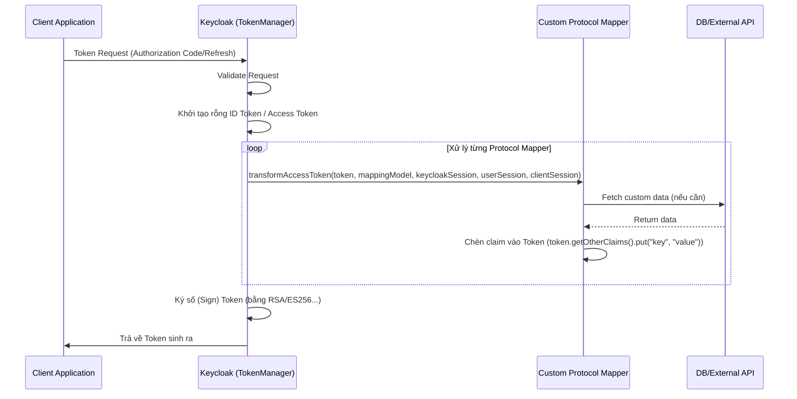

> [!NOTE]
> **Category:** Theory (Lý thuyết)
> **Goal:** Hiểu sâu về cấu trúc kiến trúc của Protocol Mapper trong Keycloak, cách thức nó hoạt động để nhúng các custom claims (dữ liệu tùy biến) vào Token (JWT) theo chuẩn OAuth2/OIDC.

## 1. Lý thuyết chuyên sâu (Detailed Theory)
Trong thế giới OAuth2.0 và OpenID Connect (OIDC), Token (như Access Token, ID Token) là phương tiện chuyên chở thông tin (claims) về người dùng và quyền hạn.
**Protocol Mapper** trong Keycloak là các module chịu trách nhiệm ánh xạ (map) dữ liệu từ mô hình đối tượng nội bộ của Keycloak (User, Group, Role, Attributes) vào các Token được tạo ra.

Mặc định, Keycloak cung cấp sẵn nhiều mapper:
- User Attribute Mapper: Đưa thuộc tính user (như `department`) vào token.
- User Role Mapper: Đưa các Role vào token.

Khi các cấu hình mặc định không đáp ứng đủ logic phức tạp (ví dụ: cần gọi đến một API từ External CRM hoặc chạy một thuật toán mã hóa tùy biến để tính toán giá trị Claim rồi nhúng vào Token), chúng ta cần viết **Custom Protocol Mapper**. Nó là một bản mở rộng của Keycloak Service Provider Interfaces (SPI).

## 2. Luồng nội bộ & Cơ chế cấp thấp (Internal Workflow & Low-level Mechanisms)
Quá trình tạo Token diễn ra trong class `TokenManager` của giao thức OIDC. Tại thời điểm Token được sinh ra, Keycloak sẽ chạy qua một chuỗi các Mapper được cấu hình cho Client cụ thể.



Cơ chế cấp thấp:
- Lớp custom cần extends `AbstractOIDCProtocolMapper` và implement các interface như `OIDCAccessTokenMapper`, `OIDCIDTokenMapper`, `UserInfoTokenMapper`.
- ProviderFactory sẽ đăng ký lớp này qua file `META-INF/services/org.keycloak.protocol.ProtocolMapper`.
- Token chỉ được ký (signed) SAU KHI tất cả các Mapper đã hoàn tất việc sửa đổi cấu trúc dữ liệu của nó.

## 3. Thực hành tốt nhất & Bảo mật (Best Practices & Security)

> [!WARNING]
> Mọi lệnh gọi API bên ngoài (External API/DB calls) bên trong phương thức của Custom Protocol Mapper cần cực kỳ cẩn trọng về độ trễ (Latency). Token creation là một quá trình đồng bộ (synchronous). Nếu API bên ngoài phản hồi chậm, quá trình đăng nhập của toàn bộ hệ thống sẽ bị chậm theo, gây nghẽn cổ chai (bottleneck).

> [!IMPORTANT]
> Hạn chế nhúng quá nhiều dữ liệu (Heavy payload) vào trong Access Token (hoặc ID Token). Token quá lớn có thể vượt quá giới hạn Header Size của các Reverse Proxy, Web Server (như Nginx mặc định limit 8KB headers). Thay vì thế, hãy lưu chỉ một định danh ID, và ứng dụng lấy thêm thông tin qua UserInfo endpoint.

- **Caching:** Nếu buộc phải fetch dữ liệu từ bên ngoài, hãy implement cơ chế cache cục bộ (sử dụng Infinispan của Keycloak) để lưu các kết quả đã truy vấn.

## 4. Cấu hình minh họa thực tế (Configuration Examples)
Cấu trúc cơ bản của một Custom Protocol Mapper bằng Java:
```java
public class MyCustomMapper extends AbstractOIDCProtocolMapper implements OIDCAccessTokenMapper, OIDCIDTokenMapper, UserInfoTokenMapper {

    public static final String PROVIDER_ID = "my-custom-mapper";

    @Override
    public String getDisplayCategory() {
        return TOKEN_MAPPER_CATEGORY;
    }

    @Override
    public String getDisplayType() {
        return "My Custom Claim Mapper";
    }

    @Override
    public void transformAccessToken(AccessToken token, ProtocolMapperModel mappingModel, KeycloakSession session, UserSessionModel userSession, AuthenticatedClientSessionModel clientSession) {
        // Logic nhúng custom claim
        token.getOtherClaims().put("custom_tenant_id", generateTenantId(userSession.getUser()));
        super.transformAccessToken(token, mappingModel, session, userSession, clientSession);
    }
}
```
Sau khi build ra file JAR và copy vào thư mục `providers/`, mapper này sẽ xuất hiện trong giao diện Admin khi cấu hình Client Scopes.

## 5. Trường hợp ngoại lệ (Edge Cases)
- **Token Format Mismatch:** Khi sử dụng Custom Protocol Mapper, bạn cần lưu ý định dạng JSON của Claim. Nếu Client mong đợi một Mảng (Array) nhưng Mapper của bạn trả về Chuỗi (String), ứng dụng đầu cuối (Client App) sẽ bị Crash khi parse Token.
- **Memory Leaks:** Nếu class Custom Mapper của bạn khởi tạo các kết nối Database (Connection Pool) ở mỗi lượt request mà không đóng, nó sẽ gây cạn kiệt tài nguyên (OOM - Out of Memory) trên server Keycloak.

## 6. Câu hỏi Phỏng vấn (Interview Questions)
- **Câu hỏi 1 (Junior):** Protocol Mapper trong Keycloak được sử dụng để làm gì?
  - *Đáp án Junior:* Được dùng để ánh xạ (đưa thêm) thông tin từ Keycloak vào trong JWT (Access Token, ID Token) để ứng dụng đích có thể sử dụng.
- **Câu hỏi 2 (Junior):** Bạn có thể sử dụng Protocol Mapper để sửa đổi cả ID Token và Access Token không?
  - *Đáp án Junior:* Có, cấu hình mapper trên giao diện Keycloak có cung cấp các Toggle (công tắc) cho phép bật/tắt việc map vào Access Token, ID Token, hoặc UserInfo.
- **Câu hỏi 3 (Senior):** Giải thích luồng gọi hàm của một Custom Protocol Mapper và tại sao việc gọi External API ở đây lại rủi ro?
  - *Đáp án Senior:* Hàm transform token được gọi trong lúc Keycloak đang sinh token một cách đồng bộ. Gọi External API làm tăng latency, nếu API đó chết (timeout), luồng sinh token cũng thất bại và user không thể đăng nhập.
- **Câu hỏi 4 (Senior):** Làm sao để chia sẻ chung một class kết nối tới API ngoại vi giữa nhiều Protocol Mapper mà không khởi tạo lại liên tục?
  - *Đáp án Senior:* ProtocolMapper thường có vòng đời ở dạng Singleton (do `ProtocolMapperFactory` tạo ra). Ta có thể chia sẻ state ở cấp Factory, hoặc lưu nó vào `KeycloakSession` attributes, hoặc tốt nhất là đóng gói client bên trong một `Provider` riêng biệt và inject nó thông qua `KeycloakSession.getProvider()`.
- **Câu hỏi 5 (Senior):** Giải thích quy trình đăng ký một Custom Mapper với kiến trúc Quarkus của Keycloak?
  - *Đáp án Senior:* Mã Java cần phải compile thành JAR. Phải tạo file `META-INF/services/org.keycloak.protocol.ProtocolMapper` chứa đường dẫn đầy đủ của class. Sau đó bỏ file JAR vào thư mục `/opt/keycloak/providers/` và chạy lệnh `kc.sh build` để Quarkus tối ưu hóa SPI vào core trước khi start server.

## 7. Tài liệu tham khảo (References)
- [Keycloak Server Developer Guide - Protocol Mappers](https://www.keycloak.org/docs/latest/server_development/#_protocol_mappers)
- [OpenID Connect Core 1.0 - Standard Claims](https://openid.net/specs/openid-connect-core-1_0.html)
