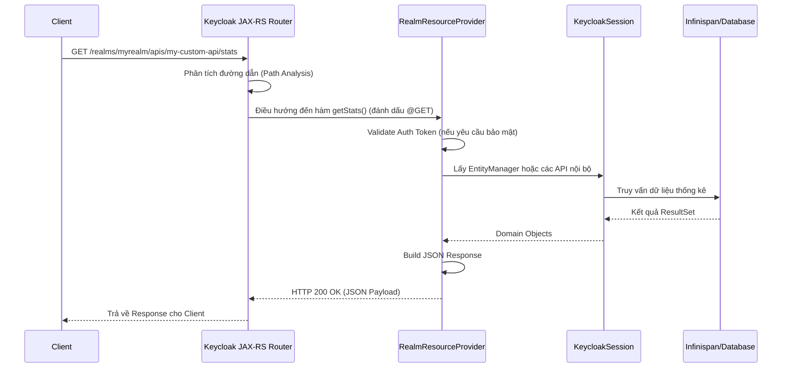

> [!NOTE]
> **Category:** Theory (Lý thuyết)
> **Goal:** Nghiên cứu về kiến trúc RealmResourceProvider SPI, cách thức mở rộng API mặc định của Keycloak bằng cách tạo các Custom REST Endpoints để phục vụ nghiệp vụ chuyên biệt.

## 1. Lý thuyết chuyên sâu (Detailed Theory)
Keycloak cung cấp một bộ Admin REST API vô cùng mạnh mẽ cho việc quản lý (CRUD users, clients, roles). Tuy nhiên, có những bài toán nghiệp vụ đặc thù mà API mặc định không thể đáp ứng một cách hiệu quả, ví dụ:
- Xóa hàng loạt dữ liệu rác (Bulk operations) trong một thao tác duy nhất.
- Truy vấn dữ liệu thống kê tùy biến (như lấy số lượng người dùng đã kích hoạt MFA trong vòng 30 ngày qua).
- Expose một endpoint không xác thực (public) cho một microservice khác gọi vào webhook.

Để giải quyết vấn đề này, Keycloak cung cấp **RealmResourceProvider SPI**. Đây là cơ chế cho phép nhà phát triển nhúng trực tiếp các điểm cuối RESTful (REST endpoints) dựa trên tiêu chuẩn JAX-RS (Java API for RESTful Web Services) vào bên trong hệ sinh thái của Keycloak. Endpoint mới này sẽ thừa hưởng cơ sở dữ liệu, các config, và cơ chế bảo mật của Realm hiện tại.

## 2. Luồng nội bộ & Cơ chế cấp thấp (Internal Workflow & Low-level Mechanisms)
Mọi Custom REST Endpoint sẽ được mount (gắn) dưới base URL:
`http://{host}:{port}/realms/{realm-name}/apis/{provider-id}`



Cơ chế cấp thấp:
- Khởi chạy bởi `RealmResourceProviderFactory`.
- Interface chính là `RealmResourceProvider` có duy nhất một hàm `Object getResource()`. Hàm này trả về một JAX-RS Controller (chứa các annotation `@GET`, `@POST`, `@Path`, `@Produces`).
- Bản thân class trả về sẽ nhận đối tượng siêu quan trọng là `KeycloakSession`, từ đó có thể lấy được toàn bộ trạng thái hệ thống.

## 3. Thực hành tốt nhất & Bảo mật (Best Practices & Security)

> [!WARNING]
> Mặc định các Custom REST Endpoint tự tạo ra là hoàn toàn **Công khai (Public)**. Không có cơ chế bảo vệ tự động nào được áp dụng. Nếu endpoint trả về thông tin nhạy cảm, bạn BẮT BUỘC phải lập trình thủ công việc kiểm tra Bearer Token ở đầu hàm.

> [!IMPORTANT]
> Cần thận trọng khi thao tác ghi (Write) trực tiếp vào Database thông qua Hibernate/JPA bên trong Custom Endpoint mà bỏ qua các API Event của Keycloak. Điều này có thể làm Cache của Keycloak bị sai lệch (Stale Cache) và không kích hoạt được các trigger. Hãy sử dụng các phương thức có sẵn như `session.users().addUser()` thay vì tự viết SQL Insert.

## 4. Cấu hình minh họa thực tế (Configuration Examples)
Bảo vệ một Custom Endpoint:
```java
@GET
@Path("/hello")
@Produces(MediaType.APPLICATION_JSON)
public Response getHello() {
    // 1. Lấy context và check auth
    AuthResult auth = new AppAuthManager.BearerTokenAuthenticator(session)
            .setRealm(session.getContext().getRealm())
            .setConnection(session.getContext().getConnection())
            .setHeaders(session.getContext().getRequestHeaders())
            .authenticate();

    if (auth == null || auth.getToken() == null) {
        return Response.status(Response.Status.UNAUTHORIZED).build();
    }

    // 2. Xử lý nghiệp vụ nếu token hợp lệ
    String username = auth.getUser().getUsername();
    return Response.ok("{\"message\": \"Hello " + username + "\"}").build();
}
```
Đoạn code trên trình bày chuẩn mực việc kiểm tra token hợp lệ trong Custom Endpoint.

## 5. Trường hợp ngoại lệ (Edge Cases)
- **CORS Error:** JAX-RS của Keycloak hỗ trợ cấu hình CORS mặc định, nhưng đối với các Custom Endpoints, đôi khi trình duyệt sẽ ném lỗi CORS vì request `OPTIONS` (Preflight) không được xử lý chính xác. Bạn cần tự thiết kế một phương thức với annotation `@OPTIONS` trên cùng Path để trả về Header `Access-Control-Allow-Origin` phù hợp.
- **Transaction Rollback:** Nếu nghiệp vụ trong endpoint thay đổi 10 users mà bị lỗi ở user thứ 9, bạn cần quản lý Transaction một cách cẩn thận, đảm bảo catch Exception và gọi `session.getTransactionManager().setRollbackOnly()` để tránh lưu dữ liệu rác.

## 6. Câu hỏi Phỏng vấn (Interview Questions)
- **Câu hỏi 1 (Junior):** Tại sao lại cần viết Custom REST Endpoint trong Keycloak?
  - *Đáp án Junior:* Để tạo ra các API trả về dữ liệu riêng biệt theo yêu cầu của ứng dụng mà API chuẩn của Keycloak (Admin API) không hỗ trợ.
- **Câu hỏi 2 (Junior):** Các thư viện nào được sử dụng để xây dựng các REST endpoint này?
  - *Đáp án Junior:* Dùng JAX-RS API (với các annotation như `@GET`, `@Path`, `@Produces` của thư viện `javax.ws.rs` hoặc `jakarta.ws.rs` ở bản mới).
- **Câu hỏi 3 (Senior):** Làm thế nào để giải quyết vấn đề bảo mật (Authentication) khi gọi vào một Custom REST Endpoint?
  - *Đáp án Senior:* Custom Endpoint mặc định là không bảo mật. Ta cần dùng `AppAuthManager.BearerTokenAuthenticator` để xác thực Access Token trong context request. Sau đó có thể kiểm tra tiếp Role của user (Authorization) trước khi trả dữ liệu.
- **Câu hỏi 4 (Senior):** Sự khác nhau giữa RealmResourceProvider và AdminRealmResourceProvider?
  - *Đáp án Senior:* `RealmResourceProvider` mount endpoint dưới `/realms/{realm}/apis/{provider-id}`, không yêu cầu tài khoản Admin. `AdminRealmResourceProvider` mount API dưới nhánh Admin console (đã xác thực và yêu cầu quyền Admin của realm).
- **Câu hỏi 5 (Senior):** KeycloakSession đóng vai trò gì khi viết plugin Custom Endpoint?
  - *Đáp án Senior:* Nó là God object (Context trung tâm) của Keycloak, cấp cho developer quyền truy cập vào Entity Manager, Cache provider, cấu hình hiện hành của Realm, và thông tin User request hiện tại.

## 7. Tài liệu tham khảo (References)
- [Keycloak SPI - Server Development (Custom REST Endpoints)](https://www.keycloak.org/docs/latest/server_development/#_extensions_rest)
- [Jakarta RESTful Web Services Specification](https://jakarta.ee/specifications/restful-ws/)
