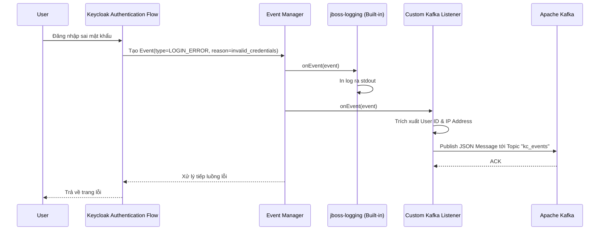

> [!NOTE]
> **Category:** Theory (Lý thuyết)
> **Goal:** Phân tích cơ chế bắt và xử lý sự kiện (Events) theo thời gian thực trong Keycloak thông qua Event Listener SPI, hỗ trợ việc audit và tích hợp với hệ thống ngoại vi.

## 1. Lý thuyết chuyên sâu (Detailed Theory)
Keycloak là một hệ thống IAM hoạt động liên tục với hàng trăm thao tác từ người dùng và hệ thống. Mọi hành động quan trọng (đăng nhập thành công, đăng nhập sai mật khẩu, xóa user, sửa cấu hình client) đều phát ra (emit) một **Event**.
- **User Event:** Các hành động liên quan đến phiên của người dùng (như `LOGIN`, `LOGOUT`, `REGISTER`, `UPDATE_PASSWORD`).
- **Admin Event:** Các hành động thay đổi cấu hình hệ thống bởi Administrator (như `CREATE_USER`, `DELETE_CLIENT`).

Mặc định, Keycloak có listener `jboss-logging` (in event ra console) và `jpa` (lưu vào database). Tuy nhiên, khi muốn tích hợp hệ thống cảnh báo (Gửi email/SMS khi user đổi mật khẩu, hoặc publish event lên Kafka/RabbitMQ để đồng bộ dữ liệu sang hệ thống khác), chúng ta cần sử dụng **Event Listener SPI**.

## 2. Luồng nội bộ & Cơ chế cấp thấp (Internal Workflow & Low-level Mechanisms)
Quy trình phát (dispatch) Event diễn ra đồng bộ nhưng có thể tách biệt nếu Event Listener đẩy dữ liệu vào queue.



Cơ chế cấp thấp:
- Lớp custom cần implement `EventListenerProvider`.
- Hàm `onEvent(Event event)` xử lý sự kiện của User.
- Hàm `onEvent(AdminEvent adminEvent, boolean includeRepresentation)` xử lý sự kiện của Admin.
- Sự kiện được Keycloak ném đi là đồng bộ (Blocking). Nghĩa là Event Listener của bạn được chạy trên cùng thread xử lý HTTP Request hiện hành.

## 3. Thực hành tốt nhất & Bảo mật (Best Practices & Security)

> [!WARNING]
> Vì Event Listener hoạt động **Đồng bộ (Synchronous)** với HTTP Request, KHÔNG ĐƯỢC thiết kế các tác vụ I/O nặng (như gọi API http hoặc xử lý tính toán tốn thời gian) trực tiếp trong hàm `onEvent`. Điều này sẽ làm chậm toàn bộ hệ thống đăng nhập. Hãy sử dụng Thread riêng (Async Executor) hoặc nhúng trực tiếp Message Queue client (như Kafka producer ở chế độ async/fire-and-forget).

> [!IMPORTANT]
> Cần cẩn trọng về việc rò rỉ thông tin nhạy cảm. Admin Event đôi khi chứa representation nguyên bản (như cấu hình chứa API Secret). Khi forward các event này ra bên ngoài, phải có bước làm sạch dữ liệu (Sanitize/Masking).

## 4. Cấu hình minh họa thực tế (Configuration Examples)
Mô phỏng một đoạn code của Custom Event Listener in cảnh báo đăng nhập thất bại:
```java
public class MyAuditListener implements EventListenerProvider {
    @Override
    public void onEvent(Event event) {
        if (event.getType() == EventType.LOGIN_ERROR) {
            String userId = event.getUserId();
            String ip = event.getIpAddress();
            String error = event.getError();
            // Đẩy vào queue hoặc gửi cảnh báo bất đồng bộ
            System.out.println("ALERT: Lỗi đăng nhập - User: " + userId + ", IP: " + ip + " - Lỗi: " + error);
        }
    }

    @Override
    public void onEvent(AdminEvent adminEvent, boolean includeRepresentation) {
        // Xử lý sự kiện admin
    }

    @Override
    public void close() { }
}
```
Sau khi cài đặt Plugin, phải vào giao diện Admin -> **Realm Settings** -> **Events** -> Bật (Add) Listener `my-audit-listener` trong danh sách các Event Listeners.

## 5. Trường hợp ngoại lệ (Edge Cases)
- **Deadlock hệ thống:** Khi sử dụng Hibernate để can thiệp thêm vào DB ngay trong `onEvent`, bạn có thể gặp tình trạng transaction block lẫn nhau vì Keycloak đang giữ commit lock ở vòng đời trước đó. Chỉ nên thực hiện các hoạt động đọc (Read-only) trong Listener.
- **Nghẽn Network:** Gửi message Kafka bị chập chờn sẽ khiến thread bị treo, do đó Keycloak server cạn kiệt số lượng thread ở worker pool (XUndertow / Quarkus worker) dẫn đến chết dịch vụ. Bắt buộc phải cài timeout cho mọi TCP connection trong Listener.

## 6. Câu hỏi Phỏng vấn (Interview Questions)
- **Câu hỏi 1 (Junior):** Event Listener trong Keycloak có chức năng gì?
  - *Đáp án Junior:* Dùng để "lắng nghe" và phản ứng lại các sự kiện diễn ra trong hệ thống, như đăng nhập, đăng xuất, đổi mật khẩu, hoặc quản trị tài khoản.
- **Câu hỏi 2 (Junior):** Trong Keycloak có mấy loại đối tượng Event được lắng nghe?
  - *Đáp án Junior:* Có hai loại: User Event (những hành động của người dùng đầu cuối) và Admin Event (các thao tác cấu hình của người quản trị).
- **Câu hỏi 3 (Senior):** Giải thích tại sao việc gọi một REST API từ xa (bên ngoài hệ thống) trực tiếp bên trong phương thức `onEvent` là một anti-pattern?
  - *Đáp án Senior:* Do Keycloak gọi Listener theo cơ chế đồng bộ trên luồng chính. Nếu REST API chậm, luồng HTTP của Keycloak cũng sẽ bị treo, làm giảm lượng request xử lý đồng thời, có thể gây sập cả hệ thống. Phải xử lý bằng cách ném event vào một luồng (thread) bất đồng bộ (như ExecutorService) hoặc message broker.
- **Câu hỏi 4 (Senior):** Cấu trúc nào của Event SPI được dùng để quản lý tài nguyên, tránh rò rỉ kết nối?
  - *Đáp án Senior:* Hàm `close()` bên trong `EventListenerProvider`. Keycloak session sẽ gọi hàm này sau khi transaction kết thúc để ta dọn dẹp các tài nguyên như đóng file handle hoặc giải phóng connection.
- **Câu hỏi 5 (Senior):** Có cách nào lấy được Request Header (ví dụ User-Agent) bên trong Event Listener không, khi mà Object Event không chứa field này?
  - *Đáp án Senior:* Có thể. Vì Provider được khởi tạo thông qua Factory (nhận KeycloakSession), ta có thể lấy Context của session (`session.getContext().getRequestHeaders()`) để bóc tách thông tin HTTP header.

## 7. Tài liệu tham khảo (References)
- [Keycloak SPI - Event Listener](https://www.keycloak.org/docs/latest/server_development/#_events_scripts)
- [Enterprise Integration Patterns - Publish/Subscribe Channel](https://www.enterpriseintegrationpatterns.com/)
