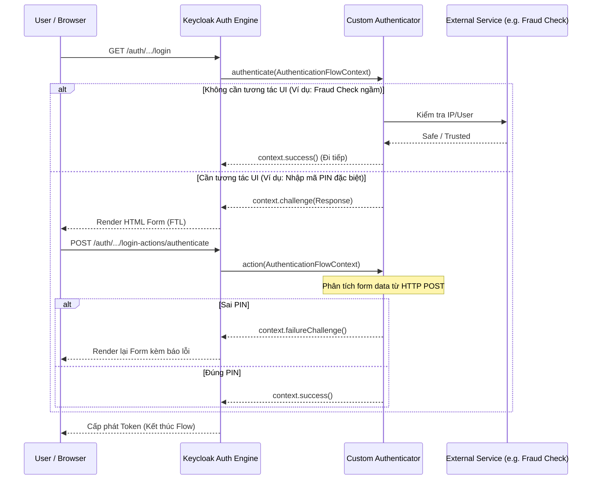

> [!NOTE]
> **Category:** Theory
> **Goal:** Cung cấp cái nhìn tổng quan kiến trúc và cơ sở lý thuyết về Authentication SPI trong Keycloak, hiểu rõ tại sao và khi nào cần phải xây dựng một Custom Login Authenticator.

## 1. Lý thuyết chuyên sâu (Detailed Theory)

Hệ thống Identity and Access Management (IAM) hiện đại không chỉ dừng lại ở việc xác thực bằng "Username và Password". Nhu cầu thực tế yêu cầu đa dạng hóa các phương thức đăng nhập: xác thực bằng sinh trắc học, thẻ từ, mã PIN nội bộ, hay qua một API của bên thứ ba chuyên kiểm tra danh sách đen (Blacklist IP/User).

Để đáp ứng điều này, Keycloak thiết kế **Authentication SPI** (Service Provider Interface). Đây là một API mạnh mẽ và can thiệp sâu nhất vào luồng cốt lõi của Keycloak. Khi viết một Custom Login Authenticator, bạn đang lập trình một "chốt chặn" (checkpoint) trong một Authentication Flow. 

Mỗi Authenticator là một nốt (node) trong một luồng (flow) dạng đồ thị có hướng. Kết quả của node này quyết định liệu Keycloak có tiếp tục chuyển sang node tiếp theo, cấp phát Access Token, hay từ chối và chặn người dùng lại.

Các thành phần cốt lõi bao gồm:
- **`Authenticator`**: Interface định nghĩa logic xác thực (ví dụ: hiển thị form, gọi API, kiểm tra cơ sở dữ liệu).
- **`AuthenticatorFactory`**: Chịu trách nhiệm khởi tạo `Authenticator` và định nghĩa metadata (tên hiển thị, các trường cấu hình trên Admin Console).
- **`AuthenticationFlowContext`**: Đối tượng chứa toàn bộ Context của phiên đăng nhập (thông tin User hiện tại, HTTP Request, HTTP Response, Session, Event builder).

## 2. Luồng nội bộ & Cơ chế cấp thấp (Internal Workflow & Low-level Mechanisms)

Khi một trình duyệt yêu cầu xác thực, Keycloak sẽ lấy Authentication Flow (Ví dụ: "Browser Flow") và chạy tuần tự qua các Execution đã định cấu hình.



**Chi tiết Cấp thấp:**
Trạng thái (State) của quá trình đăng nhập là cực kỳ phức tạp. Keycloak duy trì nó bằng Cookie (với tên là `AUTH_SESSION_ID`). Cookie này trỏ tới một bản ghi phân tán trong Infinispan (vùng nhớ cache của Keycloak). Mỗi khi bạn gọi `context.challenge()`, Keycloak sẽ đóng gói trạng thái hiện tại (execution step ID, client ID, session ID) và sinh ra một `action_url` nhúng vào Form HTML để đảm bảo request POST tiếp theo từ người dùng được định tuyến đúng vào phương thức `action()` của Authenticator tương ứng.

## 3. Thực hành tốt nhất & Bảo mật (Best Practices & Security)

> [!CAUTION]
> Tuyệt đối không bao giờ trả về các thông tin báo lỗi quá chi tiết (ví dụ: "User không tồn tại" hoặc "Lỗi kết nối cơ sở dữ liệu") ra giao diện người dùng. Điều này có thể dẫn đến lỗ hổng *User Enumeration* (Liệt kê người dùng) hoặc lộ cấu trúc hệ thống. Hãy sử dụng các message chung chung như `Invalid username or password`.

> [!TIP]
> Trong phương thức `authenticate()`, nếu có thể giải quyết được bài toán mà không cần hiển thị màn hình (ví dụ: kiểm tra IP nội bộ), hãy xử lý ngay và gọi `context.success()` hoặc `context.failure()`. Điều này gọi là "Silent Authentication", giúp cải thiện tốc độ đáng kể.

- **Sử dụng Keycloak Event System**: Luôn luôn ghi nhận các sự kiện bảo mật thông qua `context.getEvent()`. Ví dụ: Ghi log `LOGIN_ERROR` nếu xác thực thất bại để các hệ thống SIEM (Security Information and Event Management) có thể phát hiện kịp thời các cuộc tấn công.
- **Không Block Thread**: Luồng Authentication Engine của Keycloak chạy trên các worker threads (Undertow/Quarkus). Nếu Authenticator của bạn gọi một dịch vụ bên ngoài bị treo (timeout), thread sẽ bị block. Hãy set timeout rất thấp cho các lời gọi API ngoại vi.

## 4. Cấu hình minh họa thực tế (Configuration Examples)

Dưới đây là một bộ khung cơ bản (skeleton) cho một Custom Authenticator kiểm tra một Header bí mật:

**Lớp CustomAuthenticator.java:**
```java
public class SecretHeaderAuthenticator implements Authenticator {

    @Override
    public void authenticate(AuthenticationFlowContext context) {
        // Lấy HTTP Header từ request
        String secretHeader = context.getHttpRequest().getHttpHeaders().getHeaderString("X-Secret-Auth-Key");

        // Đọc cấu hình từ Admin Console (được cấu hình qua Factory)
        AuthenticatorConfigModel config = context.getAuthenticatorConfig();
        String expectedKey = config != null ? config.getConfig().get("expected_key") : "default-key";

        if (secretHeader != null && secretHeader.equals(expectedKey)) {
            // Xác thực thành công (Bypass password)
            context.success();
        } else {
            // Hiển thị form từ chối (hoặc form yêu cầu nhập thông tin bổ sung)
            Response challenge = context.form()
                    .setError("Missing or invalid secret key")
                    .createForm("error-page.ftl");
            context.challenge(challenge);
        }
    }

    @Override
    public void action(AuthenticationFlowContext context) {
        // Chỉ dùng khi có Form trả về (POST). Trong ví dụ này ta không cần action.
    }

    @Override
    public boolean requiresUser() {
        return false; // Trả về true nếu bạn cần User object trước bước này
    }

    @Override
    public boolean configuredFor(KeycloakSession session, RealmModel realm, UserModel user) {
        return true; 
    }

    @Override
    public void setRequiredActions(KeycloakSession session, RealmModel realm, UserModel user) {}

    @Override
    public void close() {}
}
```

## 5. Trường hợp ngoại lệ (Edge Cases)

- **Browser tắt Cookies**: Luồng Authentication của Keycloak hoàn toàn dựa vào Cookie (`AUTH_SESSION_ID`) để nối phương thức `authenticate()` với `action()`. Nếu trình duyệt của client block toàn bộ Cookies, khi form được submit lên, Keycloak sẽ văng lỗi `Cookie not found` và luồng bị hủy. Đây là hành vi mặc định và không thể dùng Custom Authenticator để sửa. Bạn phải đảm bảo ứng dụng Frontend/Client hỗ trợ Cookies.
- **Flow bị gián đoạn (User bỏ dở)**: Nếu user vào trang đăng nhập, `authenticate()` được gọi và state lưu vào Infinispan, nhưng user đóng trình duyệt (không gọi `action()`). Trạng thái này sẽ bị "treo" trên bộ nhớ server. Keycloak có một cơ chế Eviction tự động để dọn dẹp các Authentication Sessions quá hạn (thường là sau 30 phút hoặc 1 giờ, cấu hình tại Login Timeout).

## 6. Câu hỏi Phỏng vấn (Interview Questions)

1. **Junior**: Interface nào là điểm vào chính để viết một Custom Login Logic trong Keycloak?
   - *Đáp án*: Implement Interface `Authenticator` (và kèm theo `AuthenticatorFactory`).
2. **Junior**: Sự khác biệt giữa `context.success()` và `context.challenge(Response)` là gì?
   - *Đáp án*: `context.success()` báo hiệu bước này đã qua thành công, Keycloak sẽ chuyển sang bước xác thực tiếp theo. `context.challenge(Response)` dùng để trả về một giao diện HTML (form), tạm dừng luồng xác thực và chờ tương tác của người dùng.
3. **Senior**: Tại sao cấu trúc dữ liệu của AuthenticationFlowContext không phải là Thread-safe và làm sao để xử lý?
   - *Đáp án*: `AuthenticationFlowContext` được liên kết trực tiếp với Undertow HTTP Request hiện tại (single-thread per request). Nó không thread-safe nếu bạn truyền nó vào các luồng bất đồng bộ (ví dụ: `CompletableFuture`). Bắt buộc mọi thao tác gọi tới context phải nằm trong luồng HTTP gốc.
4. **Senior**: Nếu Authenticator của bạn cần lấy User ID nhưng tại thời điểm `authenticate()` được gọi, `context.getUser()` trả về `null`. Nguyên nhân là gì?
   - *Đáp án*: Do vị trí của execution này trong Flow. Nó được đặt TRƯỚC bước `Username Password Form`. Lúc này hệ thống chưa định danh được ai đang đăng nhập nên User là null. Cần điều chỉnh vị trí thứ tự trong Authentication Flow.
5. **Senior**: Bạn làm thế nào để pass một tham số cấu hình tĩnh (ví dụ URL của SMS Gateway) từ Admin Console xuống Authenticator?
   - *Đáp án*: Trong class `AuthenticatorFactory`, ghi đè phương thức `getConfigProperties()` để định nghĩa các trường nhập liệu (như Text, Password). Cấu hình này sẽ được lưu ở `AuthenticatorConfigModel` và có thể gọi ra bằng `context.getAuthenticatorConfig()` bên trong `Authenticator`.

## 7. Tài liệu tham khảo (References)

- [Keycloak Server Developer Guide - Authentication SPI](https://www.keycloak.org/docs/latest/server_development/#_auth_spi)
- [Infinispan Caching in Keycloak (For Auth Sessions)](https://www.keycloak.org/server/caching)
- [RFC 6265 - HTTP State Management Mechanism (Cookies)](https://datatracker.ietf.org/doc/html/rfc6265)
