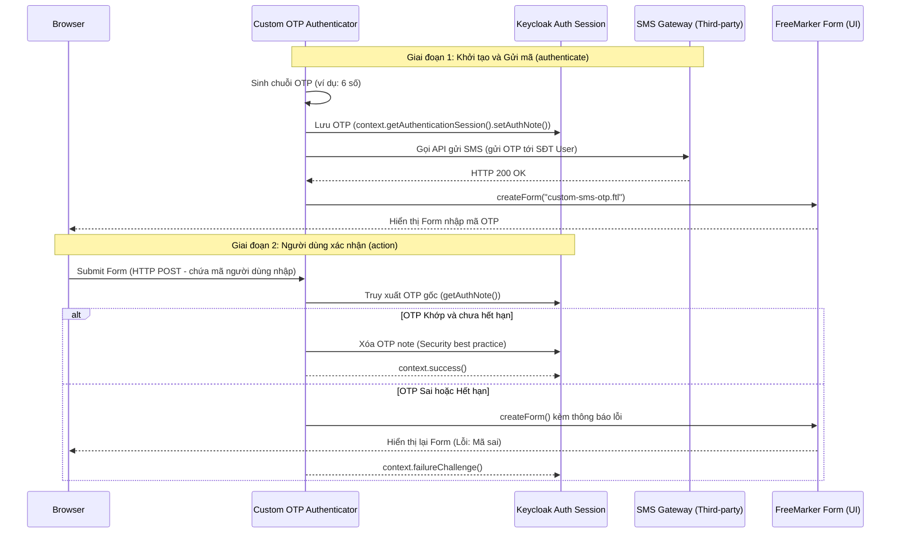

> [!NOTE]
> **Category:** Theory
> **Goal:** Cung cấp kiến thức chuyên sâu về cách xây dựng một Authenticator tùy chỉnh cho mã xác thực dùng một lần (Custom OTP), bao gồm quy trình tạo mã, gửi mã qua SMS/Email và xử lý logic xác thực với FreeMarker UI.

## 1. Lý thuyết chuyên sâu (Detailed Theory)

Mặc dù Keycloak cung cấp sẵn các cơ chế xác thực hai yếu tố (2FA) như Google Authenticator (TOTP/HOTP) hoặc WebAuthn, nhiều doanh nghiệp vẫn có nhu cầu triển khai **SMS OTP** hoặc **Email OTP** tùy chỉnh thông qua các nhà cung cấp dịch vụ bên thứ ba (như Twilio, AWS SNS, hoặc hệ thống SMS nội bộ).

Một Custom OTP Authenticator phải giải quyết hai bài toán cốt lõi trong một chu trình xử lý trạng thái tách rời (stateless request-response):
1. **Challenge (Gửi thách thức)**: Sinh ra một chuỗi ngẫu nhiên (OTP), lưu nó vào phiên bản làm việc (User Session hoặc Authentication Note), gửi chuỗi đó qua SMS/Email và render một giao diện form để người dùng nhập.
2. **Action (Xác nhận)**: Nhận dữ liệu POST từ form do người dùng gửi lên, so sánh với OTP đã lưu trong Session. Nếu trùng khớp, chuyển sang bước tiếp theo; nếu sai, hiển thị lỗi và yêu cầu nhập lại.

Việc thiết kế Custom OTP yêu cầu sử dụng kết hợp SPI `Authenticator`, SPI `AuthenticatorFactory` và Theme/FreeMarker (để tạo giao diện trang nhập mã).

## 2. Luồng nội bộ & Cơ chế cấp thấp (Internal Workflow & Low-level Mechanisms)



**Cơ chế lưu trữ trạng thái (Statefulness):**
Giao thức HTTP là phi trạng thái (Stateless). Vì vậy Keycloak cung cấp đối tượng `AuthenticationSessionModel` để lưu trữ dữ liệu tạm thời giữa quá trình hiển thị form (GET/Challenge) và quá trình xử lý form (POST/Action). Phương thức `setAuthNote(key, value)` là chuẩn mực để lưu OTP và Timestamp (để kiểm tra hết hạn). Dữ liệu này tự động bị hủy khi phiên xác thực (Authentication Flow) kết thúc.

## 3. Thực hành tốt nhất & Bảo mật (Best Practices & Security)

> [!CAUTION]
> Tuyệt đối **KHÔNG** lưu chuỗi OTP vào log hệ thống hoặc các biến toàn cục (Static/Singleton) trong mã nguồn. Việc này dễ dàng dẫn đến lỗ hổng bảo mật (Log Leakage) và rò rỉ dữ liệu xuyên luồng (Cross-thread data leak).

> [!IMPORTANT]
> Mọi Custom OTP Authenticator PHẢI cài đặt cơ chế **Rate Limiting** (Giới hạn số lần thử) và **Expiration** (Thời gian hết hạn, ví dụ 5 phút). Nếu không, kẻ tấn công có thể dễ dàng thực hiện Brute-Force hoặc vét cạn (Exhaustion attack) tài nguyên SMS của bạn gây thiệt hại kinh tế.

- **Dọn dẹp State**: Ngay sau khi người dùng nhập đúng OTP, bạn PHẢI gọi `removeAuthNote("otp_code")` để đảm bảo mã đó không bao giờ được dùng lại (chống lỗ hổng Replay Attack).
- **Masking thông tin**: Khi hiển thị trang yêu cầu nhập OTP, đừng hiển thị toàn bộ số điện thoại. Hãy che khuất (masking), ví dụ: `Đã gửi mã tới số +84*****123`.

## 4. Cấu hình minh họa thực tế (Configuration Examples)

Một trích đoạn cấu trúc code cốt lõi trong file `SmsOtpAuthenticator.java`:

```java
@Override
public void authenticate(AuthenticationFlowContext context) {
    // 1. Lấy thông tin User và SĐT
    UserModel user = context.getUser();
    String phoneNumber = user.getFirstAttribute("phoneNumber");

    // 2. Sinh mã OTP (6 số ngẫu nhiên)
    String otp = generateOtpCode();

    // 3. Lưu OTP và thời gian tạo vào Session
    context.getAuthenticationSession().setAuthNote("sms_otp", otp);
    context.getAuthenticationSession().setAuthNote("sms_otp_time", String.valueOf(System.currentTimeMillis()));

    // 4. Gọi API gửi SMS (Pseudo-code)
    smsClient.sendSms(phoneNumber, "Your code is: " + otp);

    // 5. Render giao diện FTL (thư mục theme)
    Response challenge = context.form()
            .setAttribute("phoneNumber", mask(phoneNumber))
            .createForm("sms-otp-validation.ftl");
            
    context.challenge(challenge); // Tạm dừng flow, chờ User nhập
}

@Override
public void action(AuthenticationFlowContext context) {
    // 1. Đọc mã từ HTTP POST formData
    MultivaluedMap<String, String> formData = context.getHttpRequest().getDecodedFormParameters();
    String enteredCode = formData.getFirst("otp_code");

    // 2. Lấy mã thực tế trong Session
    String savedCode = context.getAuthenticationSession().getAuthNote("sms_otp");
    long timeSaved = Long.parseLong(context.getAuthenticationSession().getAuthNote("sms_otp_time"));

    // 3. Kiểm tra hạn mức (Ví dụ 5 phút = 300,000 ms)
    if (System.currentTimeMillis() - timeSaved > 300_000) {
        context.getAuthenticationSession().removeAuthNote("sms_otp");
        Response challenge = context.form().setError("OTP Expired").createForm("sms-otp-validation.ftl");
        context.failureChallenge(AuthenticationFlowError.EXPIRED_CODE, challenge);
        return;
    }

    // 4. Kiểm tra sự trùng khớp
    if (savedCode != null && savedCode.equals(enteredCode)) {
        // Thành công: Xóa mã
        context.getAuthenticationSession().removeAuthNote("sms_otp");
        context.success();
    } else {
        // Thất bại
        Response challenge = context.form().setError("Invalid OTP").createForm("sms-otp-validation.ftl");
        context.failureChallenge(AuthenticationFlowError.INVALID_CREDENTIALS, challenge);
    }
}
```

## 5. Trường hợp ngoại lệ (Edge Cases)

- **User nhấn Refresh hoặc nút Back trình duyệt**: Keycloak có thể gọi lại hàm `authenticate()`. Nếu không kiểm tra xem OTP đã được sinh ra trước đó chưa (bằng cách check `getAuthNote`), bạn có thể vô tình gửi thêm một SMS mới, làm người dùng bối rối vì nhận 2 tin nhắn liên tục và lãng phí tiền SMS. Cách xử lý: Kiểm tra `getAuthNote`, nếu đã có và chưa hết hạn, chỉ việc gọi `createForm` thay vì sinh mã gửi lại.
- **Dịch vụ SMS bên thứ ba bị sập (Timeout)**: Gọi API SMS là một Network I/O. Nếu Twilio phản hồi quá chậm, luồng Authentication bị kẹt. Hãy luôn thiết lập `ConnectTimeout` và `ReadTimeout` rất ngắn (ví dụ: 3 giây) cho HTTP Client. Nếu lỗi, hiển thị thông báo "Hệ thống bận, vui lòng thử lại sau" thông qua `context.failureChallenge(...)`.

## 6. Câu hỏi Phỏng vấn (Interview Questions)

1. **Junior**: Trong Keycloak Custom Authenticator, sự khác biệt giữa hàm `authenticate()` và `action()` là gì?
   - *Đáp án*: `authenticate()` được gọi đầu tiên để khởi tạo tiến trình (ví dụ: sinh mã OTP, gọi API gửi tin nhắn, hiển thị màn hình). `action()` được gọi khi người dùng Submit Form trên trình duyệt để kiểm tra dữ liệu gửi lên.
2. **Junior**: Nơi nào an toàn nhất để lưu trữ mã OTP tạm thời thay vì lưu vào Database?
   - *Đáp án*: Lưu vào `AuthenticationSession` thông qua phương thức `setAuthNote()`.
3. **Senior**: Việc mã OTP được tạo bằng lớp `java.util.Random` có an toàn không?
   - *Đáp án*: Không an toàn. `java.util.Random` là bộ tạo số giả ngẫu nhiên có thể dự đoán được (predictable). Phải sử dụng `java.security.SecureRandom` cho mọi tác vụ sinh mã bảo mật mật mã.
4. **Senior**: Nếu hệ thống có hàng triệu request, và ta muốn dùng RabbitMQ/Kafka để gửi tin nhắn SMS một cách bất đồng bộ (Asynchronous) trong lúc gọi `authenticate()`, điều gì có thể xảy ra?
   - *Đáp án*: Sẽ xảy ra vấn đề "Race Condition". Nếu đẩy message qua Queue, tiến trình `authenticate()` sẽ trả form FTL về cho người dùng ngay lập tức. Người dùng có thể sẽ nhận SMS chậm (do queue trễ), nhưng nếu họ bấm "Gửi lại", bạn sẽ gặp rắc rối vì quản lý state bất đồng bộ. Tốt nhất, OTP SMS nên gọi đồng bộ nhanh (Fast sync HTTP).
5. **Senior**: Làm sao để tích hợp giới hạn Brute-Force của Keycloak mặc định (Brute Force Protection) vào Custom OTP?
   - *Đáp án*: Keycloak mặc định chỉ bảo vệ cho mật khẩu. Với OTP, bạn nên gọi `context.getEvent().error(Errors.INVALID_USER_CREDENTIALS)` khi nhập sai để kích hoạt bộ đếm Brute Force, đồng thời cấu hình Brute Force Protection trong Realm Settings.

## 7. Tài liệu tham khảo (References)

- [Keycloak Authentication SPI](https://www.keycloak.org/docs/latest/server_development/#_auth_spi)
- [OWASP - Authentication Cheat Sheet (OTP Implementation)](https://cheatsheetseries.owasp.org/cheatsheets/Authentication_Cheat_Sheet.html)
- [Java SecureRandom Documentation](https://docs.oracle.com/en/java/javase/11/docs/api/java.base/java/security/SecureRandom.html)
