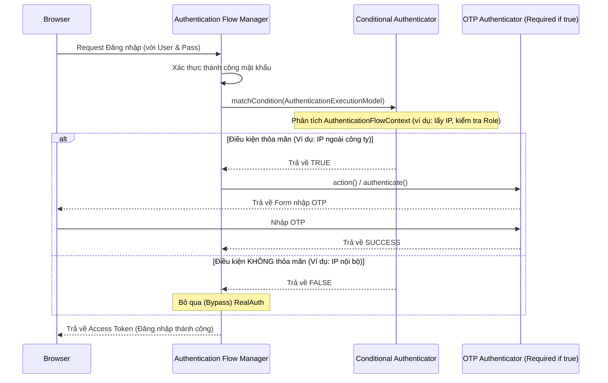

> [!NOTE]
> **Category:** Theory
> **Goal:** Hiểu sâu về luồng xác thực có điều kiện (Conditional Authentication) trong Keycloak. Nắm rõ cách hoạt động của `ConditionalAuthenticator` và các cơ chế can thiệp linh hoạt (bypass, require) dựa trên ngữ cảnh (context) của người dùng như địa chỉ IP, vai trò (role) hay tiêu đề HTTP.

## 1. Lý thuyết chuyên sâu (Detailed Theory)

Trong các hệ thống Enterprise, xác thực tĩnh (luôn bắt buộc một quy trình cố định) thường gây khó chịu cho người dùng (friction) và làm giảm trải nghiệm UI/UX (ví dụ: bắt nhập OTP mọi lúc mọi nơi).

**Conditional Logic (Xác thực có điều kiện)** là khả năng cấu hình một luồng Authentication Flow sao cho một bước xác thực (Authenticator) cụ thể chỉ được kích hoạt (Executed) khi một tập hợp các điều kiện nhất định được thỏa mãn.

Trong Keycloak, để thực hiện tính năng này, framework cung cấp một Interface đặc biệt là `ConditionalAuthenticator`. Nó không trực tiếp xác thực mật khẩu hay OTP, mà đóng vai trò như một **bộ lọc (Filter / Gatekeeper)**. Nó kiểm tra Context (thông tin User, Headers, IP, Request) và đưa ra quyết định Boolean:
- **True (Thỏa mãn)**: Hệ thống sẽ tiến hành thực thi (Execute) Authenticator liền kề phía sau nó trong luồng xác thực.
- **False (Không thỏa mãn)**: Hệ thống sẽ bỏ qua (Bypass) Authenticator đó và đi tới bước tiếp theo.

Việc thiết kế hệ thống có điều kiện giải quyết bài toán: **Cân bằng giữa Bảo mật (Security) và Trải nghiệm người dùng (Usability)**. Ví dụ: "Nếu IP là mạng nội bộ công ty (Intranet), không cần hỏi OTP; nếu là mạng Public, bắt buộc hỏi OTP".

## 2. Luồng nội bộ & Cơ chế cấp thấp (Internal Workflow & Low-level Mechanisms)

Khi một Authentication Flow (có chứa Sub-Flow dạng Conditional) được kích hoạt, máy trạng thái (State Machine) của Keycloak sẽ duyệt qua các execution steps.



**Cơ chế đánh giá cấp thấp:**
1. Một Execution (Bước thực thi) trong Keycloak Admin Console phải được thiết lập là `CONDITIONAL` thay vì `REQUIRED` hay `ALTERNATIVE`.
2. Phương thức trung tâm là `boolean matchCondition(AuthenticationFlowContext context)`. Keycloak cung cấp toàn bộ context của HTTP request và Session của user thông qua tham số này.
3. Nếu `matchCondition` trả về `true`, Keycloak sẽ tìm tất cả các Authenticators được thiết lập chung trong Sub-flow đó (cùng cấp bậc) và thực thi chúng.

## 3. Thực hành tốt nhất & Bảo mật (Best Practices & Security)

> [!TIP]
> Hãy tận dụng các Conditional Authenticators có sẵn của Keycloak trước khi tự viết (như Condition - User Role, Condition - User configured OTP). Chỉ tự viết khi cần logic kinh doanh rất đặc thù (như gọi API phân tích rủi ro của bên thứ ba).

> [!WARNING]
> Không nên thực hiện các tác vụ chặn I/O quá lâu (như truy vấn Database nặng hoặc gọi API đồng bộ) bên trong hàm `matchCondition()`. Vì đây là bước kiểm tra đồng bộ trong chuỗi luồng xử lý chính, làm như vậy sẽ gây hiện tượng cổ chai (bottleneck) làm giảm Throughput của hệ thống.

- **Thứ tự thực thi (Execution Order)**: Hãy luôn đặt các Conditional Authenticators lên TRƯỚC (vị trí đầu tiên) trong Sub-Flow, nếu không logic điều kiện sẽ không được đánh giá kịp thời để quyết định cho các bước phía dưới.
- **Tính trích xuất (Decoupling)**: Mỗi Condition nên kiểm tra một điều kiện duy nhất (Single Responsibility). Ví dụ: Không gộp kiểm tra IP và kiểm tra Role vào cùng một class. Hãy tách thành 2 Conditions và dùng cấu hình `AND`/`OR` trên giao diện Keycloak.

## 4. Cấu hình minh họa thực tế (Configuration Examples)

Dưới đây là một ví dụ viết Custom Conditional Authenticator kiểm tra xem User có địa chỉ email kết thúc bằng đuôi doanh nghiệp cụ thể không.

**Lớp Condition: `DomainConditionalAuthenticator.java`**

```java
import org.keycloak.authentication.AuthenticationFlowContext;
import org.keycloak.authentication.authenticators.conditional.ConditionalAuthenticator;
import org.keycloak.models.KeycloakSession;
import org.keycloak.models.RealmModel;
import org.keycloak.models.UserModel;

public class DomainConditionalAuthenticator implements ConditionalAuthenticator {

    public static final String SINGLETON_ID = "cond-domain-check";
    
    @Override
    public boolean matchCondition(AuthenticationFlowContext context) {
        UserModel user = context.getUser();
        if (user == null || user.getEmail() == null) {
            return false;
        }
        
        // Lấy cấu hình (nếu có định nghĩa từ ProviderFactory)
        // Trong ví dụ này ta hardcode để dễ hiểu
        String requiredDomain = "@mycompany.com";
        
        // Nếu email là của công ty -> Trả về TRUE để kích hoạt bước tiếp theo (ví dụ: Yêu cầu cập nhật Profile)
        return user.getEmail().toLowerCase().endsWith(requiredDomain);
    }

    @Override
    public void action(AuthenticationFlowContext context) {
        // Không dùng trong Conditional Authenticator
    }

    @Override
    public boolean requiresUser() {
        // Cần User Model để lấy email
        return true; 
    }

    @Override
    public void setRequiredActions(KeycloakSession session, RealmModel realm, UserModel user) {}

    @Override
    public void close() {}
}
```

## 5. Trường hợp ngoại lệ (Edge Cases)

- **User Model là null**: Trong một số luồng (như luồng Reset Password bước đầu tiên), người dùng chưa được định danh. Nếu bạn cấu hình hàm `requiresUser()` trả về `true`, Keycloak sẽ tự động bypass Condition nếu context chưa có User thay vì ném ra Exception (Lỗi Null Pointer).
- **Lừa đảo IP (IP Spoofing) khi kiểm tra Condition**: Nếu hệ thống của bạn dựa vào `context.getConnection().getRemoteAddr()` để quyết định bypass OTP, kẻ tấn công có thể làm giả IP nội bộ thông qua tiêu đề `X-Forwarded-For`. Giải pháp: Cần thiết lập đúng Reverse Proxy configuration (ví dụ: `PROXY_ADDRESS_FORWARDING=true` trong môi trường JBoss/Quarkus) để Keycloak chỉ tin tưởng header từ Proxy đã được xác thực, tránh bị bypass OTP trái phép.

## 6. Câu hỏi Phỏng vấn (Interview Questions)

1. **Junior**: Chức năng chính của Conditional Authenticator trong Keycloak là gì?
   - *Đáp án*: Nó là một loại bộ lọc xác định xem liệu một bước xác thực cụ thể (như OTP) có cần được thực thi hay không, dựa trên các điều kiện của request, user hoặc cấu hình.
2. **Junior**: Sub-Flow chứa điều kiện phải được cấu hình loại (Requirement) nào trên Admin Console?
   - *Đáp án*: Phải được cấu hình là `CONDITIONAL`.
3. **Senior**: Tại sao phương thức `requiresUser()` trong `ConditionalAuthenticator` lại quan trọng?
   - *Đáp án*: Nó báo cho Authentication engine của Keycloak biết logic điều kiện này có phụ thuộc vào thông tin người dùng hay không. Nếu `true`, và luồng xác thực lúc đó chưa xác định được danh tính (VD: chưa nhập user/pass), Keycloak sẽ hoãn hoặc bỏ qua điều kiện đó một cách an toàn mà không gây sập hệ thống (NPE).
4. **Senior**: Nếu có hai Condition (A và B) trong cùng một Conditional Sub-Flow, Keycloak xử lý toán tử Logic giữa chúng như thế nào?
   - *Đáp án*: Theo mặc định, Keycloak sẽ coi chúng là điều kiện **AND** (tất cả các điều kiện phải thỏa mãn/trả về true). Tuy nhiên, bạn có thể thay đổi thuộc tính `Condition evaluation` thành **OR** nếu cần trên Admin Console đối với cấp độ Sub-Flow.

## 7. Tài liệu tham khảo (References)

- [Keycloak Authentication Flow Documentation](https://www.keycloak.org/docs/latest/server_admin/#_authentication_flows)
- [Keycloak Server Developer Guide - Custom Conditional Authenticator](https://www.keycloak.org/docs/latest/server_development/#_conditional_authenticators)
- [RFC 7239: Forwarded HTTP Extension (Security considerations for IP context)](https://datatracker.ietf.org/doc/html/rfc7239)
