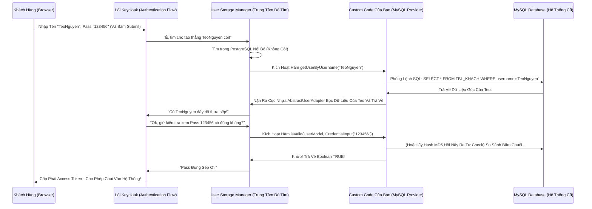

# Lesson 1: Móc Nối Cơ Sở Dữ Liệu Ngoại Lai (External Database)

> [!NOTE]
> **Category:** Theory & Practical (Lý thuyết & Thực hành)
> **Goal:** Học cách implements các Interface Thần Thánh `UserStorageProvider`, `UserLookupProvider`, `CredentialInputValidator` để biến một bảng Database `tbl_khachhang` vô danh trong MySQL cũ kỹ thành Nguồn Dữ Liệu Xác Thực Chính Thức của Keycloak. 

## 1. Lý thuyết chuyên sâu (Detailed Theory)

### 1.1. Bản Chất Của Sự Lừa Dối (The Art of Deception)
Kiến trúc SPI của Keycloak được thiết kế để tách rời **Lõi Logic** (Cấp phát Token, Quản lý Session) ra khỏi **Nơi Lưu Trữ Dữ Liệu** (Database). Khi một khách hàng gõ Username/Password trên màn hình đăng nhập, Keycloak sẽ trải qua 2 bước dò tìm:
1. **Dò trong Local Database (Của Keycloak):** Xem thằng User này có tồn tại trong DB của mình không.
2. **Dò trong danh sách các Federation / User Storage (Của Bạn Viết):** Nếu Local DB không có, nó sẽ tuần tự gọi hàm `getUserByUsername()` vào các Provider mà bạn đã viết.

Nếu Code Java của bạn chọc sang MySQL cũ, tìm thấy User, và trả về cho Keycloak một Object `UserModel` (Là một Interface đại diện cho cấu trúc User của Keycloak). Keycloak lập tức "tin sái cổ" rằng thằng User này là thật! 
Tiếp theo, khi Keycloak cần kiểm tra Mật Khẩu, nó lại gọi tiếp vào hàm `isValid(RealmModel, UserModel, CredentialInput)` trong Code của bạn. Code của bạn lại chọc sang MySQL kiểm tra Hash Password. Nếu khớp, trả về `true`. Thế là Đăng Nhập Thành Công!

### 1.2. Bộ Ba Interface Sát Thủ
Để làm được phép thuật trên, Class Java của bạn không chỉ implements 1 mà phải ráp nối nhiều Interface cùng lúc (Theo triết lý Interface Segregation của SOLID):
- `UserStorageProvider`: Interface gốc rễ. Bắt buộc phải có để xưng danh mình là một Nơi Chứa User.
- `UserLookupProvider`: Cấp cho bạn siêu năng lực Tìm Kiếm: `getUserById`, `getUserByUsername`, `getUserByEmail`. (Keycloak sẽ gọi mấy hàm này để truy xuất người).
- `CredentialInputValidator`: Cấp cho bạn siêu năng lực Kiểm Tra Mật Khẩu: `isValid()`, `isConfiguredFor()`, `supportsCredentialType()`. (Chuyên dùng để Xác Thực Password khách nhập vào).

Nếu bạn KHÔNG implements `UserLookupProvider`, Keycloak sẽ mù màu không biết tìm User ở đâu. Nếu KHÔNG implements `CredentialInputValidator`, bạn chỉ có thể lôi được danh sách User lên giao diện Admin để ngắm chứ không cho khách Login được (Vì không có hàm kiểm tra Pass)!

---

## 2. Luồng nội bộ & Cơ chế cấp thấp (Internal Workflow & Low-level Mechanisms)

Hành Trình Oanh Cáp Bọc Thép Của Việc "Đá Luồng" Sang Database Ngoại Lai:

---

## 3. Thực hành tốt nhất & Bảo mật (Best Practices & Security)

> [!CAUTION]
> **Tuyệt Đỉnh Tẩy Khách Mạng Bọc Thép (Thảm Họa Rác Bộ Nhớ Nóng - N+1 Query Khét Lẹt)**
> **Tội Ác Truy Vấn DB Dày Đặc Trong Vòng Đời Của 1 User:** Trong lúc Khách hàng đang thao tác Login, duyệt web, lấy Token... Lõi Keycloak có một thói quen rất "ngáo" là nó sẽ gọi hàm `getUserByUsername()` hoặc `getUserById()` KHÔNG CHỈ 1 LẦN, mà có thể lên tới 5-10 LẦN cho cùng một Request! Nếu Trong Code Java Của Bạn, Mỗi Lần Keycloak Gọi Hàm `getUser...` Là Bạn Lại Phóng 1 Câu Lệnh `SELECT * FROM MySQL` Ra Ngoài... Thì Hệ Thống MySQL Sẽ Chết Ngộp Trong Lượng Kết Nối Khổng Lồ (N+1 Query Problem)!
> **Hậu Quả Chết Ngộp Cục Bộ:** 
> 100 User Login Cùng Lúc -> Bắn 1000 Câu Lệnh SQL Sang Hệ Thống Cũ (Vốn Dĩ Đã Yếu Sinh Lý) -> MySQL Treo 100% CPU -> Toàn Bộ Công Ty Đứng Hình Chửi Thề Gọi Cảnh Sát!
> **Biện Pháp Sống Còn Lớp Trọng Lực Cõi Âm:** BẮT BUỘC Phải Áp Dụng **Local Request Cache (Bộ Nhớ Đệm Trong 1 Vòng Đời Phiên Bản)**. Keycloak Cung Cấp Đối Tượng `session.getAttribute()` (Chỉ Sống Trọng Tròn 1 HTTP Request). Khi Hàm `getUserByUsername` Được Gọi Lần Đầu, Bạn Xuống DB Lấy Lên, Xong Lưu Nó Vào Biến Local Session: `session.setAttribute("user_teo", userModel)`. 
> Lần Thứ 2, Thứ 3, Thứ 10 Trong Cùng 1 Milisec Đó Mà Keycloak Có Dở Chứng Gọi Lại Hàm Nhờ Lấy Thằng Teo... Bạn Đừng Xuống DB Nữa! Lôi Thẳng Biến `user_teo` Trong RAM Ra Mà Trả Về (Memory Caching)! Cứu Rỗi Hàng Triệu Chu Kỳ Máy!
> 
> *Lưu ý:* Keycloak cũng có Bật Sẵn Cache Infinispan Mức Độ Realm Cho Mấy Thằng Custom Storage Này (Nó tự động Cache Object UserModel của bạn trong Memory Cluster). Nhưng Request Caching (Như Đã Nói Ở Trên) Vẫn Là Lá Chắn Phòng Ngự Cấp Thấp Tuyệt Đối Cần Thiết Bổ Trợ Nhau!

---

## 4. Câu hỏi Phỏng vấn (Interview Questions)

**1. Khách Hàng Hỏi: "Anh Ơi, Khi Em Tích Hợp Cái User Storage Này Để Đọc Dữ Liệu Từ Database Oracle Cũ. Lỡ Một Ngày Nào Đó Cái Mạng LAN Từ Keycloak Sang Con Oracle Bị Đứt Hoặc Con Oracle Sập Nguồn Thì Sao? Lúc Đó User Đang Xài Có Bị Văng Ra Hay Không? Có Ai Log In Được Không?"**
- **Senior:** Dạ Câu Hỏi Rất Sát Thực Tế Ạ. Khi Viết Custom User Storage, Mình Phải Hiểu Rõ Về Cơ Chế Cache Của Keycloak Để Đánh Giá Tác Động:
  - **Với Khách Đang Xài (Đã Có Session & Token):** Keycloak Dùng Kỹ Thuật Sinh Ra JWT Vô Hướng (Stateless) Và Chỉ Chạm Vào Session Nội Bộ Của Keycloak. Khách Đang Gọi API Bằng Token Bất Biến Sẽ KHÔNG Bị Văng Ngay Lập Tức! Tuy Nhiên, Khi Token Hết Hạn Và Họ Cần Dùng `Refresh Token` Để Đổi Lấy Token Mới, Keycloak (Tùy Cấu Hình Check-Status) Có Thể Sẽ Kích Hoạt Hàm Dò Tìm Ngược Về User Storage Để Xem User Đó Có Vừa Bị Xóa Khỏi Oracle Hay Không. Nếu Oracle Đứt Mạng -> Quá Trình Refresh Thất Bại -> Khách Lúc Đó Mới Bị Văng!
  - **Với Khách Mới Login:** Chắc Chắn 100% Là Chết Lập Tức (Trừ Khi User Đó Vừa Login Cách Đây Vài Phút Vẫn Còn Kẹt Trong Bộ Nhớ Infinispan Cache Của Keycloak, Có Thể Tranh Thủ Bypass DB Đi Thẳng Vào).
  - **Cách Phòng Chống Rủi Ro:** Trong Kiến Trúc Enterprise, Bọn Em Không Bao Giờ Cho Keycloak Chọc Trực Tiếp Sang DB Cũ Read-Time (Đọc Chết Thẳng). Bọn Em Sẽ Dùng Một Cơ Chế Khác Là **Synchronization (Đồng Bộ Hóa Dữ Liệu Chạy Ngầm)**. Tức Là Cho Code Java Đọc DB Oracle Vào Ban Đêm, Hút Toàn Bộ Hàng Triệu Khách Hàng Ném Về Lưu Trữ Ở Local Database PostgreSQL Của Keycloak (Nhập Cư Dữ Liệu Luôn). Sau Đó Keycloak Chỉ Chơi Trực Tiếp Với DB Nội Bộ Của Nó. Oracle Có Sập Hay Cháy Nhà Kho Thì Keycloak Vẫn Trơ Trơ Chạy Tốc Độ Ánh Sáng Nhờ DB Local! (Đó là lý do Keycloak cung cấp Giao diện `ImportSynchronization`).

---

## 5. Tài liệu tham khảo (References)
- **Keycloak Documentation:** Server Developer Guide - User Storage SPI.
