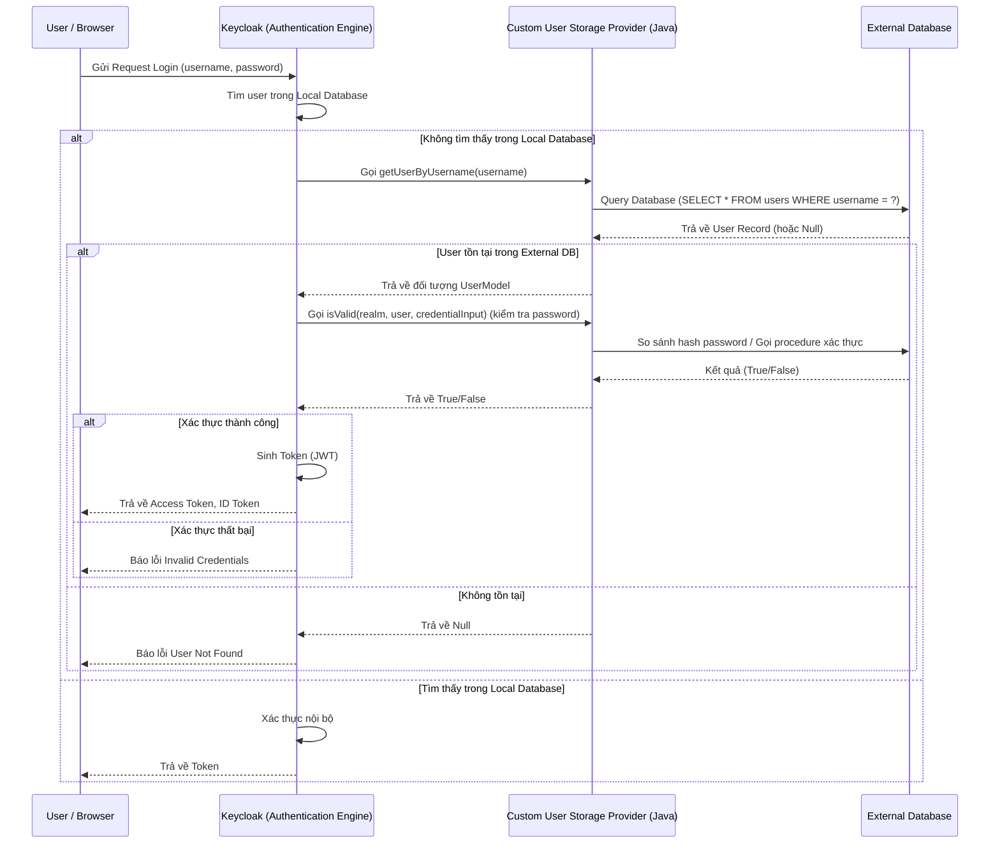

> [!NOTE]
> **Category:** Theory
> **Goal:** Hiểu sâu về kiến trúc, cơ chế hoạt động và lý do sử dụng Custom User Storage SPI trong Keycloak để tích hợp với External Database.

## 1. Lý thuyết chuyên sâu (Detailed Theory)

Trong các hệ thống Enterprise, thông tin người dùng thường không nằm sẵn trong Keycloak mà được lưu trữ ở các hệ thống có sẵn (Legacy Systems) như Relational Database (MySQL, PostgreSQL, Oracle), NoSQL, hoặc các hệ thống ERP/CRM. Việc di chuyển toàn bộ dữ liệu người dùng (Migration) sang database nội bộ của Keycloak đôi khi là không khả thi do các ràng buộc về đồng bộ dữ liệu, chính sách bảo mật, hoặc vì các ứng dụng khác vẫn đang đọc/ghi trực tiếp vào cơ sở dữ liệu đó.

Để giải quyết bài toán này, Keycloak cung cấp **User Storage SPI (Service Provider Interface)**. Đây là một cơ chế mở rộng cho phép Keycloak kết nối trực tiếp đến các External Database hoặc hệ thống định danh bên ngoài. Thay vì copy dữ liệu, Keycloak sẽ ủy quyền (delegate) việc tìm kiếm, xác thực (authentication), và quản lý thông tin người dùng cho User Storage Provider mà chúng ta tự triển khai (Custom Provider).

**Tại sao lại sử dụng Custom User Storage SPI?**
- **Tránh Data Duplication:** Dữ liệu người dùng chỉ tồn tại ở một nơi duy nhất (Single Source of Truth), giảm thiểu rủi ro sai lệch dữ liệu giữa Keycloak và hệ thống cũ.
- **Phù hợp với kiến trúc Legacy:** Các ứng dụng cũ vẫn tiếp tục hoạt động bình thường mà không cần thay đổi.
- **Bảo mật:** Không cần lưu trữ mật khẩu (hoặc hash của mật khẩu) trên Keycloak nếu chính sách bảo mật không cho phép.

## 2. Luồng nội bộ & Cơ chế cấp thấp (Internal Workflow & Low-level Mechanisms)

Khi một người dùng thực hiện Login, Keycloak sẽ tìm kiếm người dùng trong Local Database trước. Nếu không thấy (hoặc dựa trên cấu hình), Keycloak sẽ tuần tự gọi đến các User Storage Providers đã được cấu hình trong Realm.



**Chi tiết cấp thấp:**
- Custom Provider phải implements các Interface cốt lõi như `UserStorageProvider`, `UserLookupProvider`, `CredentialInputValidator`.
- Keycloak sử dụng JBoss Marshalling và Hibernate để quản lý transaction. Khi SPI trả về `UserModel`, Keycloak sẽ wrap (gói) đối tượng này bằng bộ đệm (Local Cache) nếu được cấu hình.
- Các interface này là Stateful hoặc Stateless tùy thuộc vào việc chúng ta có inject `EntityManager` hay kết nối REST client.

## 3. Thực hành tốt nhất & Bảo mật (Best Practices & Security)

- **Connection Pooling:** Không mở kết nối mới đến External Database cho mỗi Request. Luôn sử dụng Connection Pool (như HikariCP, hoặc tận dụng JNDI Data Source cấu hình sẵn trên Quarkus/Wildfly).
- **Caching:** Kích hoạt User Cache (Infinispan) cho Custom Provider. Nếu External Database thay đổi, cần có cơ chế Evict Cache (thông qua REST API hoặc Message Broker) để tránh việc Keycloak sử dụng dữ liệu cũ (Stale Data).
- **Read-Only vs Read-Write:** Nếu Keycloak không được phép thay đổi dữ liệu trên External DB, hãy implement Provider ở chế độ Read-Only. Không implement interface `UserRegistrationProvider`.
- **Security:** Mã hóa chuỗi kết nối (Connection String) và thông tin đăng nhập vào DB. Không bao giờ log thông tin mật khẩu của người dùng ra file log trong quá trình debug SPI.

> [!WARNING]
> Nếu External Database phản hồi chậm, toàn bộ quá trình đăng nhập của Keycloak sẽ bị treo (Bottleneck). Cần thiết lập Timeout nghiêm ngặt khi query tới External DB.

## 4. Cấu hình minh họa thực tế (Configuration Examples)

Dưới đây là một phần mã nguồn Java tối giản minh họa một Custom User Storage Provider class:

```java
public class MyCustomUserStorageProvider implements UserStorageProvider, 
        UserLookupProvider, CredentialInputValidator {

    private KeycloakSession session;
    private ComponentModel model;
    private Connection dbConnection; // Được khởi tạo thông qua DataSource

    public MyCustomUserStorageProvider(KeycloakSession session, ComponentModel model) {
        this.session = session;
        this.model = model;
        // Khởi tạo connection pool từ properties trong model
    }

    @Override
    public UserModel getUserByUsername(RealmModel realm, String username) {
        // Thực thi SQL query đến External Database
        // Nếu thấy, trả về AbstractUserAdapterFederatedStorage
        return null; // Giả lập
    }

    @Override
    public boolean isValid(RealmModel realm, UserModel user, CredentialInput credentialInput) {
        if (!(credentialInput instanceof UserLoginCredentialModel)) return false;
        String password = credentialInput.getChallengeResponse();
        // So sánh mật khẩu từ DB với mật khẩu user nhập vào
        return checkPasswordInExternalDb(user.getUsername(), password);
    }

    @Override
    public void close() {
        // Đóng kết nối hoặc dọn dẹp resource (được Keycloak gọi cuối mỗi transaction)
    }
}
```

## 5. Trường hợp ngoại lệ (Edge Cases)

- **External Database bị Offline (Downtime):** Nếu Keycloak không thể kết nối đến External DB, người dùng sẽ không thể đăng nhập. **Khắc phục:** Sử dụng kiến trúc High Availability (HA) cho External DB. Hoặc bật tính năng `Import Users` trong Keycloak để cache user nội bộ trong Keycloak DB, cho phép đăng nhập tạm thời dựa vào cache.
- **Trùng lặp Username (Username Collision):** Người dùng có username `admin` tồn tại ở cả Local Keycloak DB và External DB. **Khắc phục:** Keycloak ưu tiên Local DB trước. Nếu cần, cấu hình "Priority" của các Provider hoặc bắt buộc namespace (vd: `ext_admin`).
- **Mật khẩu sử dụng thuật toán Hash cũ (Legacy Hashing):** DB cũ dùng MD5 hoặc SHA-1. **Khắc phục:** Implement thuật toán so sánh tương ứng trong `CredentialInputValidator`, đồng thời có thể dùng cơ chế tự động chuyển đổi sang bcrypt/pbkdf2 khi người dùng đăng nhập thành công lần đầu.

## 6. Câu hỏi Phỏng vấn (Interview Questions)

1. **(Junior)** User Storage SPI trong Keycloak dùng để làm gì? Nêu một ví dụ thực tế.
   - *Đáp án:* Dùng để tích hợp với DB ngoài chứa thông tin người dùng có sẵn, giúp đăng nhập bằng user cũ mà không cần migrate dữ liệu vào Keycloak.
2. **(Junior)** Những Interface nào bắt buộc phải implement để Keycloak có thể tìm kiếm và xác thực mật khẩu người dùng từ database ngoài?
   - *Đáp án:* `UserLookupProvider` (tìm user) và `CredentialInputValidator` (kiểm tra password).
3. **(Senior)** Sự khác biệt giữa chế độ "Import Users" (ON) và "Import Users" (OFF) trong User Storage Federation là gì?
   - *Đáp án:* ON: Keycloak copy thông tin user vào Local DB ngay lần đăng nhập đầu, sau đó chỉ đồng bộ khi cần. OFF: Keycloak không lưu thông tin (ngoại trừ ID mapping), mọi request đều phải query DB ngoài.
4. **(Senior)** Làm thế nào để giải quyết vấn đề hiệu năng nếu Custom User Storage Provider phải gọi qua HTTP REST API tới một hệ thống Identity cũ rất chậm?
   - *Đáp án:* Sử dụng Caching (Infinispan) cho các queries. Tăng số luồng hoặc thiết lập Timeout ngắt sớm (Circuit Breaker).
5. **(Senior)** Keycloak gọi phương thức `close()` của Provider khi nào? Nếu không dọn dẹp tài nguyên ở đây thì có sao không?
   - *Đáp án:* Gọi cuối mỗi HTTP Request/Transaction. Nếu không đóng Connection/File, server sẽ bị cạn kiệt tài nguyên (Resource Leak) và crash.

## 7. Tài liệu tham khảo (References)

- Keycloak Server Developer Guide: [User Storage SPI](https://www.keycloak.org/docs/latest/server_development/#_user-storage-spi)
- Keycloak JavaDocs: `org.keycloak.storage.UserStorageProvider`
