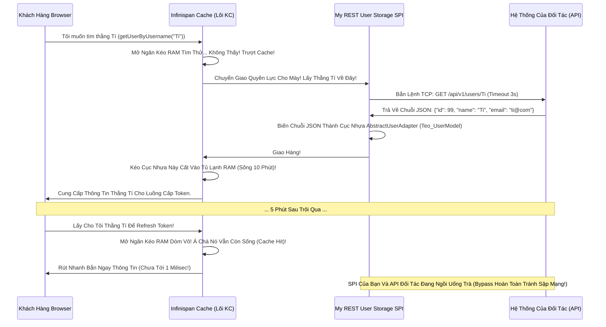

# Lesson 2: Bọc Dữ Liệu Bằng Gọi Mạng (REST Storage)

> [!NOTE]
> **Category:** Theory & Practical (Lý thuyết & Thực hành)
> **Goal:** Trong thế giới Microservices, không phải lúc nào đối tác cũng mở Cổng Database (Port 3306, 1521) cho Keycloak chọc thẳng vào. Họ chỉ cung cấp một đường dẫn API HTTPS Đóng Kín như `https://api.partner.com/v1/users/{username}`. Bài học này hướng dẫn cách gọi REST API trong User Storage Provider, đồng thời tối ưu hóa Cổ Chai Mạng Bất Đồng Bộ.

## 1. Lý thuyết chuyên sâu (Detailed Theory)

### 1.1. User Storage Bằng HTTP Có Chết Người Không?
Việc biến Keycloak thành một cỗ máy đi "Bào" API của bên thứ ba tiềm ẩn rủi ro về độ trễ cực cao.
Cứ tưởng tượng: Khách gõ tên đăng nhập `admin` và pass. 
- Keycloak kích hoạt `getUserByUsername("admin")`. Code của bạn chạy hàm `HttpClient` bắn HTTP GET sang Partner API. Mất 500ms mới trả về JSON tên, tuổi, địa chỉ.
- Bạn parse JSON đó thành `UserModel` trả về cho lõi.
- Keycloak kích hoạt tiếp `isValid()` để check Pass. Bạn lại phải bắn HTTP POST sang Partner API `https://api.partner.com/v1/auth` truyền kèm password thô. Mất thêm 500ms nữa để đợi Partner check hash và trả về TRUE.
Tổng cộng mất 1 giây cho 1 lần đăng nhập! Nếu 1000 người vào cùng lúc, lượng Thread chờ HTTP Response sẽ dồn ứ làm tràn bộ nhớ của máy chủ Quarkus.

### 1.2. Giải Pháp Hóa Giải Sự Chậm Trễ Mạng
Khi viết User Storage bằng REST API, bạn BẮT BUỘC phải là một Master về Caching (Đệm Nhớ) và Timeout (Ngắt Bỏ):
1. **Lớp Đệm Của Keycloak (Infinispan Cache):** Keycloak có sẵn chức năng bọc Cache cho User Storage. Đảm bảo bạn bật chức năng này trên giao diện Admin. Khi Partner API trả về JSON của `admin` lần đầu, nó sẽ lưu Trực Tiếp cái Object `UserModel` đó vào RAM Infinispan (VD: 30 phút). Các Request lấy thông tin sau này sẽ Lướt thẳng qua RAM, bỏ qua lớp mạng!
2. **Quy Tắc Time-out Bàn Thờ:** Khi setup `HttpClient` trong Code, chỉ được phép set Timeout Connect là 2 giây, Read Timeout là 3 giây. Nếu API Partner ngủ gật, phải Cắt Dây Ngay Lập Tức, ném Lỗi ra cho Keycloak xử lý (Hất User văng ra) chứ không được ôm Thread đợi vô cực.
3. **HTTP Connection Pooling:** Tuyệt đối không được gõ lệnh `new HttpClient()` hay `new RestTemplate()` ở bên TRONG lòng các hàm `getUser`! Bạn phải khởi tạo đối tượng Client này ở dạng **Singleton** (Chỉ sinh 1 lần duy nhất) trong lúc khởi động Factory (`UserStorageProviderFactory.init()`) và cấp cho nó một Connection Pool có khả năng tái sử dụng (VD: Max 200 Connections).

---

## 2. Luồng nội bộ & Cơ chế cấp thấp (Internal Workflow & Low-level Mechanisms)

Hành Trình Oanh Cáp Bọc Thép Biến Lời Gọi Mạng Thành Thực Thể Khách Hàng:

---

## 3. Thực hành tốt nhất & Bảo mật (Best Practices & Security)

> [!WARNING]
> **Tuyệt Đỉnh Tẩy Khách Mạng Bọc Thép (Thảm Họa Bán Đứng Thông Tin Mật Khẩu Khách Hàng Dọc Đường Nối)**
> **Tội Ác Ném Password Khách Hàng Qua Kênh Chữ Nổi (Plain Text Over HTTP):** Code Java của bạn thực thi hàm kiểm tra mật khẩu `isValid(RealmModel, UserModel, CredentialInput)`. Dữ liệu trong `CredentialInput.getChallengeResponse()` chính là cái Mật Khẩu Chữ Nổi (Plain Text) mà khách hàng vừa gõ trên bàn phím. Cậu Lập trình viên hồn nhiên nối chuỗi: Bắn HTTP POST `http://api.partner.com/auth` Body: `{"user": "teo", "pass": "Teo123"}` qua mạng internet công cộng! 
> **Hậu Quả Chết Khét:** 
> Gói tin chạy vòng vèo qua hàng chục con Router nhà mạng. Hacker ngồi quán Cafe gắn máy đánh hơi Packet (Wireshark) chụp trọn toàn bộ Request của bạn. Mọi Mật Khẩu của Ngân Hàng Công Ty Đều Phơi Bày Truồng Cởi Trên Không Gian Mạng Bị Đánh Cắp Hàng Loạt!
> **Biện Pháp Sống Còn Chặt Đức Đuôi:** Khi Làm Chức Năng `isValid` (Xác thực) Sang Hệ Thống Ngoài:
> 1. **BẮT BUỘC ĐƯỜNG ỐNG TLS (HTTPS):** Chỉ được phép bắn API sang Partner bằng địa chỉ `https://...`. Từ chối kết nối nếu Partner cố chấp dùng `http://`.
> 2. **Kiểm Tra Hàm Băm Chéo (Nên Đàm Phán):** Thay vì ném thẳng Pass Chữ Nổi sang bên kia. Hãy xin API của đối tác trả về CHUỖI ĐÃ BĂM (Hash - Ví dụ PBKDF2 hoặc MD5 Salted) của thằng khách hàng về đây! Tự Code Java bên Keycloak sẽ lấy Pass Chữ Nổi mà khách vừa gõ, tự băm ra bằng đúng cái thuật toán đó tại não bộ của Keycloak, rồi lấy 2 cục Mã Hóa So Sánh Với Nhau Trong Lõi! Tuyệt đối không đem Đồ Zin ném vứt ra đường! Vừa an toàn, vừa tăng tốc độ mạng (Chỉ cần lấy Hash về lúc gọi `getUser` là đủ, không cần gọi API check Pass nữa)!

---

## 4. Câu hỏi Phỏng vấn (Interview Questions)

**1. Em Hiểu Sự Khác Biết Nhau Điểm Nào Giữa Kỹ Thuật "User Storage Bằng Cách Đồng Bộ Hóa Đám Đông (Import Synchronization - Ban Đêm Chạy Ngầm Bơm Code Vào Database)" Và Kỹ Thuật "Lấy Dữ Liệu Tra Luận Tại Chỗ Không Lưu Trữ Bám (Non-Imported - Liên Kết Tức Thời)" Trong Keycloak Không? Nếu Công Ty Mình Có Tới 5 Triệu Lượng Khách Ở Hệ Thống Cũ Bắn Bằng API, Em Sẽ Tư Vấn Sếp Dùng Cách Nào?**
- **Senior:** Dạ Thưa Sếp, Đây Là Hai Trường Phái Chiến Lược Bất Hủ Của Keycloak Ạ:
  - **Import Synchronization (Nhập Cư Dữ Liệu):** Khi Mình Viết Cái User Storage, Mình Implement Giao Diện `ImportedUserValidation`. Mỗi Lần Gặp 1 Thằng User Mới Từ DB Ngoài, Code Sẽ Chạy Lệnh Hút Thằng Đó, Biến Nó Thành User Đích Thực Bơm Vào Bảng PostgreSQL Của Keycloak (Cấp Một Cái ID Nhập Cư). Từ Đó Về Sau Thằng Này Sống Trong DB Keycloak! Mình Cũng Phải Viết 1 Hàm Định Kỳ Nửa Đêm Đi Quét Hệ Thống Cũ Xem Có Ai Đổi Tên Tuổi Gì Không Để Bơm Lại Qua Cho Khớp Nhau.
    - *Ưu Điểm:* Nhanh Vô Địch (Lúc Đăng Nhập), Tìm Kiếm Search Chặt Chẽ Khỏe Re!
    - *Khuyết Điểm:* Đội Mồ Sống Dậy Hai DB Song Song Khác Nhau Dễ Dẫn Tới Rác Dữ Liệu Xung Đột Sync.
  - **Non-Imported (Lưu Luyến Không Chạm - Federation):** Keycloak Tuyệt Đối Không Ghi Bất Cứ Thông Tin Nào Của Khách Vào PostgreSQL Của Mình Nhé! (Nó Chỉ Sinh Ra Một Cái Bảng Trung Gian Lưu Cái ID Móc Nối Của Khách Gọi Là `FEDERATED_IDENTITY`). Khi Đăng Nhập Nó Nhờ Vả Dòng Máu (Infinispan Cache) Chứa Object Tạm Dịch Ra Chứ Xóa Cache Là Bay Màu Dữ Liệu Trong Keycloak!
    - *Ưu Điểm:* Dữ Liệu Nguồn Cội Chỉ Nằm Ở Đúng 1 Điểm Gốc Của Công Ty Cũ. Chân Lý Duy Nhất Lệnh Khúc Tới Ngay Lệnh! Không Sợ Bị Lệch Tên Lệch Số Điện Thoại Oanh Tĩnh Lụa Thép Lệnh Đáy DB Chữ Khớp Oanh Cáp Trọng Lõi Tự Trị Trượt Mạng Bọt Đỉnh Chóp Đáy Lụa Lệnh Tĩnh Cáp Mạch Máu Cắt Mạng Khung Cắt Khúc Tới Chặt Oanh Tĩnh.
  - **Với 5 Triệu Dòng Data Qua API Chậm Chạp:** Em Phải Tư Vấn Sếp Bỏ Ngay Ý Định Hút Dữ Liệu (Import Synchronization)! Bởi Vì Việc Chạy Một Cái Vòng Lặp For Kéo 5 Triệu Người Về Mỗi Đêm Qua Kết Nối HTTP Sẽ Sập Cả Cổng Mạng, Chiếm Ngót Vài Ngày Trời Đứt Đoạn Lệnh Đáy DB Chữ Khớp Oanh Cáp Trọng Lõi Tự Trị Trượt Mạng Bọt Đỉnh Chóp Đáy Lụa Chữ Nghĩa Cũ Mạch Cáp 1 Phiên Trút Code API Oanh Lụa Bọt Giao Diện Lệnh Đáy. Bắt Buộc Phải Chọn Trường Phái **Non-Imported (Giao Dịch Tại Chỗ)** Kết Hợp Với Bộ Đệm Memory Cache Cực Khủng (Vài Gb RAM Infinispan). Thằng Nào Login Mới Kéo Qua Rồi Cất Vào Tủ Lạnh. Chấp Nhận Truy Vấn Từng Phần Một Khúc Tới Chặt Oanh Tĩnh Lỗ Lủng Bọt Khung Oanh Cáp Lệnh Mạch Cắt Oanh Trọng Lực OIDC Đáy Lụa Cấu Trúc Khung Rỗng XML Nặng Nề Lấy Lực Lượng Đông Của Cache Đánh Nhẹ Cổ Chai API Chậm!

---

## 5. Tài liệu tham khảo (References)
- **Keycloak Documentation:** Server Developer Guide - User Storage SPI - Non-Imported vs Imported.
