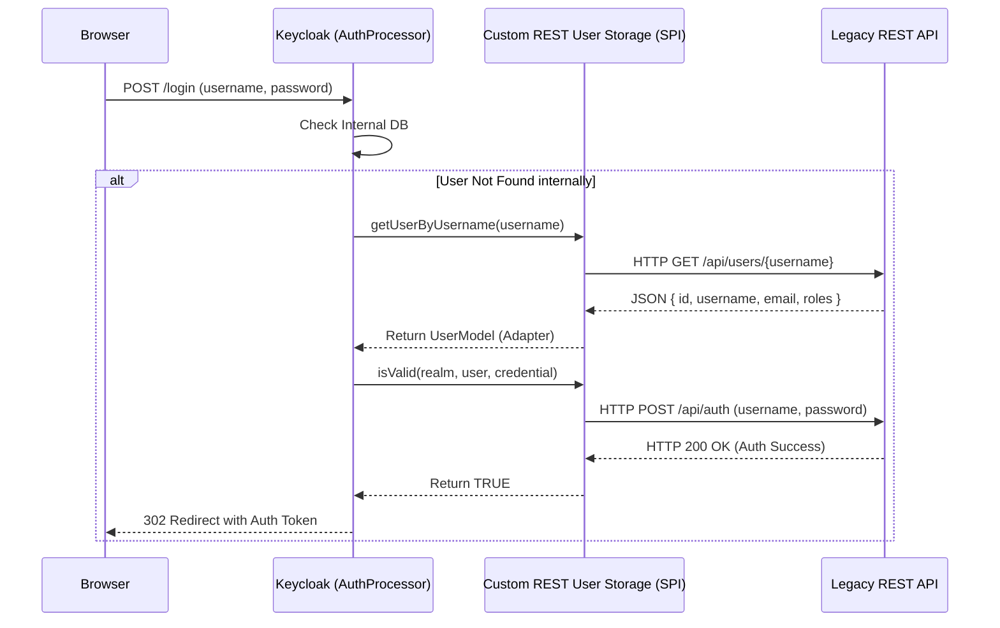

> [!NOTE]
> **Category:** Theory (Lý thuyết)
> **Goal:** Hiểu sâu về cách mở rộng Keycloak để xác thực người dùng dựa trên cơ sở dữ liệu bên ngoài thông qua RESTful API, sử dụng User Storage SPI.

## 1. Lý thuyết chuyên sâu (Detailed Theory)

Một trong những tính năng mạnh mẽ nhất của Keycloak là khả năng **Federation** (Liên kết). Mặc định, Keycloak lưu trữ thông tin người dùng trong cơ sở dữ liệu nội bộ của nó (như PostgreSQL, MySQL). Tuy nhiên, trong các doanh nghiệp đã có sẵn hệ thống ERP, CRM hoặc một Legacy System với hàng triệu người dùng, việc đồng bộ (sync) toàn bộ dữ liệu này vào Keycloak là không thực tế và có thể gây rủi ro về tính nhất quán dữ liệu.

Giải pháp là sử dụng **User Storage SPI (Service Provider Interface)**. SPI này cho phép Keycloak kết nối với bất kỳ Data Source ngoại vi nào. Trong đó, việc viết một Provider kết nối thông qua **REST API** là phương pháp hiện đại và phổ biến nhất (để giao tiếp với Microservices hoặc Legacy API).

**Bản chất của REST User Storage Provider:**
- Khi người dùng đăng nhập, Keycloak sẽ ủy quyền (delegate) việc tra cứu người dùng (User Lookup) và xác thực mật khẩu (Credential Validation) cho một ứng dụng bên thứ 3 (thông qua các cuộc gọi HTTP GET/POST).
- Tùy vào cấu hình, Keycloak có thể hoạt động hoàn toàn phi trạng thái (không lưu user vào DB của Keycloak) hoặc hoạt động ở chế độ **Import Mode** (copy user cache vào Keycloak nội bộ để tăng tốc cho các lần đăng nhập sau).

## 2. Luồng nội bộ & Cơ chế cấp thấp (Internal Workflow & Low-level Mechanisms)

Để triển khai REST Storage, nhà phát triển (Developer) phải viết một Custom Java Code kế thừa các Interface cốt lõi của Keycloak và đóng gói thành tệp `.jar` để triển khai vào thư mục `providers/` của máy chủ Keycloak.

Các Interface quan trọng cần triển khai:
1. `UserStorageProviderFactory`: Nơi khởi tạo kết nối mạng và quản lý vòng đời của Provider.
2. `UserLookupProvider`: Định nghĩa cách Keycloak tìm kiếm người dùng (theo Username, theo Email).
3. `CredentialInputValidator`: Giao diện xử lý việc xác thực mật khẩu (validate password).



**Cơ chế Adapter:**
Dữ liệu trả về từ External API thường ở dạng JSON không chuẩn theo Keycloak. Provider của bạn sẽ phải thực hiện Mapping (chuyển đổi) dữ liệu JSON này thành một đối tượng `AbstractUserAdapter`. Adapter này đóng vai trò như một Proxy, đánh lừa Keycloak rằng người dùng này đang tồn tại bên trong nó.

## 3. Thực hành tốt nhất & Bảo mật (Best Practices & Security)

> [!WARNING]
> **Rủi ro Timeout và Khóa luồng (Thread Blocking):** Keycloak gọi User Storage Provider một cách **đồng bộ (Synchronous)**. Nếu Legacy API phản hồi quá chậm (ví dụ mất 5 giây), luồng (Thread) xử lý request của Keycloak sẽ bị treo. Dưới tải cao, điều này dẫn đến cạn kiệt Thread Pool (Thread Exhaustion) và Keycloak sẽ sập. LUÔN LUÔN cấu hình HTTP Timeout (Connect Timeout và Read Timeout) chặt chẽ trong HTTP Client của SPI (vd: tối đa 500ms).

> [!IMPORTANT]
> **Bảo mật kết nối:** REST API bên ngoài không bao giờ được phép mở công khai mà không có xác thực. Provider của bạn nên gửi các API Key, Client Certificate (mTLS) hoặc Mutual Authentication khi gọi đến Legacy API. Sử dụng HTTPS là bắt buộc để tránh lộ mật khẩu dạng bản rõ (Plaintext) trên đường truyền nội bộ.

- **Sử dụng Caching:** Nếu thông tin người dùng hiếm khi thay đổi, hãy kích hoạt bộ đệm (Cache Policy: `DEFAULT` hoặc `EVICT_DAILY`) cho User Storage. Điều này giảm thiểu số lượng HTTP Request gọi tới Legacy API.

## 4. Cấu hình minh họa thực tế (Configuration Examples)

Ví dụ dưới đây mô phỏng phương thức `isValid` trong class `MyRestUserStorageProvider` (viết bằng Java) implement `CredentialInputValidator`:

```java
@Override
public boolean isValid(RealmModel realm, UserModel user, CredentialInput input) {
    if (!supportsCredentialType(input.getType())) return false;

    // HTTP Client (ví dụ sử dụng Apache HttpClient hoặc Java 11 HttpClient)
    String username = user.getUsername();
    String password = input.getChallengeResponse(); // Mật khẩu người dùng nhập
    
    try {
        // Gửi POST request tới API bên ngoài
        URL url = new URL("https://legacy-api.internal.local/v1/auth");
        HttpURLConnection conn = (HttpURLConnection) url.openConnection();
        conn.setRequestMethod("POST");
        conn.setRequestProperty("Content-Type", "application/json");
        conn.setDoOutput(true);
        
        String jsonPayload = String.format("{\"username\":\"%s\", \"password\":\"%s\"}", username, password);
        try(OutputStream os = conn.getOutputStream()) {
            byte[] inputBytes = jsonPayload.getBytes("utf-8");
            os.write(inputBytes, 0, inputBytes.length);
        }
        
        int responseCode = conn.getResponseCode();
        return responseCode == 200; // API trả về 200 OK tức là xác thực thành công
        
    } catch (Exception e) {
        log.error("Failed to authenticate via REST API", e);
        return false;
    }
}
```

Sau khi compile `.jar` và đưa vào Keycloak, bạn vào Admin Console -> **User Federation** -> Chọn Provider vừa tạo (ví dụ: `my-rest-provider`) và kích hoạt.

## 5. Trường hợp ngoại lệ (Edge Cases)

- **Legacy System đang bảo trì (Downtime):** Nếu API trả về HTTP 500 hoặc 503, Keycloak sẽ không thể xác thực người dùng. Nếu bạn cấu hình Keycloak ở chế độ `Fail On Error`, toàn bộ quá trình đăng nhập thất bại. Nếu muốn người dùng (đã từng đăng nhập) vẫn có thể vào bằng mật khẩu lưu tạm, hãy cân nhắc chiến lược kiến trúc Caching hoặc Offline sync.
- **Thay đổi mật khẩu (Password Update):** Nếu người dùng muốn đổi mật khẩu trên giao diện Account Console của Keycloak, Provider phải implement thêm interface `UserRegistrationProvider` và `CredentialInputUpdater` để dịch lệnh đổi mật khẩu đó thành một HTTP PUT/PATCH đẩy về Legacy API. Nếu API bên thứ 3 là "Read-only", Keycloak phải bị vô hiệu hóa quyền đổi mật khẩu của các user đến từ nguồn đó.

## 6. Câu hỏi Phỏng vấn (Interview Questions)

**Câu 1 (Junior):** User Storage SPI trong Keycloak dùng để làm gì?
*Đáp án:* Để kết nối Keycloak với cơ sở dữ liệu người dùng bên ngoài (như LDAP, Active Directory hoặc REST API) thay vì lưu tất cả người dùng trong database của chính Keycloak.

**Câu 2 (Junior):** Nếu người dùng đến từ REST API bên ngoài, thông tin session và token có được Keycloak tạo ra như bình thường không?
*Đáp án:* Có. Keycloak coi họ như người dùng nội bộ sau khi lấy được dữ liệu qua Adapter. Nó vẫn tạo JWT Token và quản lý Session hoàn toàn trong Keycloak.

**Câu 3 (Senior):** Làm sao để ngăn chặn hiện tượng Thread Exhaustion trong Keycloak khi Legacy REST API bị chậm?
*Đáp án:* Bắt buộc phải cài đặt `connect_timeout` và `read_timeout` trên HTTP Client ở mức thấp (ví dụ: 1000ms). Ngoài ra có thể sử dụng cơ chế Circuit Breaker (như Resilience4j) bên trong Java class của Provider.

**Câu 4 (Senior):** Sự khác biệt giữa việc bật và tắt tính năng "Import Users" (User Synchronization) khi dùng Custom SPI là gì?
*Đáp án:* Nếu Bật (ON), khi người dùng được tìm thấy ở hệ thống ngoài, Keycloak sẽ tạo một bản sao vật lý của User đó vào bảng `user_entity` của DB Keycloak nội bộ. Các lần tra cứu sau sẽ rất nhanh nhưng dữ liệu có thể bị lỗi thời (Stale). Nếu Tắt (OFF), Keycloak không lưu bản cứng nào, mọi request tra cứu thông tin cơ bản đều phải chạy qua SPI tới API ngoài (tốc độ chậm hơn nhưng dữ liệu luôn là thời gian thực).

**Câu 5 (Senior):** Khi viết một Custom REST User Provider, làm sao để gán role mặc định cho người dùng mỗi khi tải thông tin từ API?
*Đáp án:* Bên trong lớp Adapter (kế thừa `AbstractUserAdapter`), override phương thức `getRoleMappings()`. Khi đó, bạn đọc mảng Role từ JSON API trả về, và ánh xạ chúng sang đối tượng `RoleModel` của Realm hiện tại trong Keycloak.

## 7. Tài liệu tham khảo (References)

- [Keycloak Server Developer Guide - User Storage SPI](https://www.keycloak.org/docs/latest/server_development/#_user-storage-spi)
- [OWASP REST Security Cheat Sheet](https://cheatsheetseries.owasp.org/cheatsheets/REST_Security_Cheat_Sheet.html)
