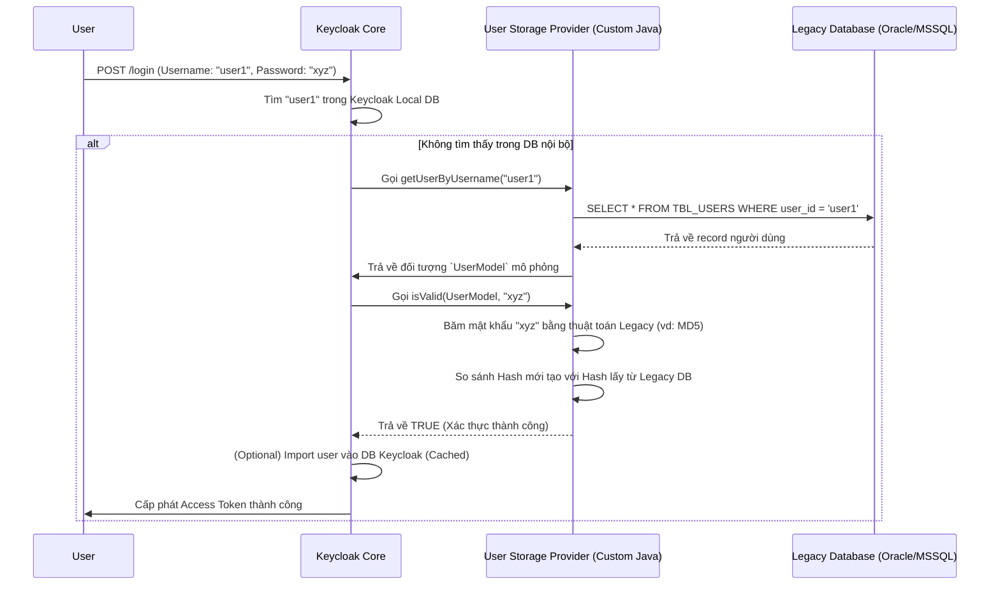

> [!NOTE]
> **Category:** Architecture/Design (Kiến trúc/Thiết kế)
> **Goal:** Hiểu sâu về kiến trúc User Storage SPI trong Keycloak để giải quyết bài toán tích hợp, đồng bộ hóa và quản lý xác thực với các cơ sở dữ liệu hệ thống cũ (Legacy Systems).

## 1. Lý thuyết chuyên sâu (Detailed Theory)

Một trong những thách thức lớn nhất khi doanh nghiệp chuyển đổi số và áp dụng IAM (Identity and Access Management) hiện đại như Keycloak là: **Hàng triệu người dùng đang nằm trong hệ thống cũ (Legacy Database)**. Các hệ thống này có thể là Oracle DB, MS SQL, cấu trúc bảng tự chế, hoặc dùng thuật toán băm (hashing) mật khẩu cổ điển (như MD5, SHA-1). 

Không thể dễ dàng di chuyển (migrate) toàn bộ người dùng vào Keycloak ngay lập tức vì các ứng dụng cũ vẫn đang kết nối trực tiếp vào DB đó. Giải pháp của Keycloak là cung cấp cơ chế **User Storage SPI (Service Provider Interface)**.

**User Storage SPI (Federation):** Thay vì sao chép dữ liệu, Keycloak cho phép bạn viết một plugin (Provider) bằng ngôn ngữ Java. Plugin này sẽ kết nối trực tiếp vào Legacy DB. Khi người dùng gõ username/password trên màn hình Keycloak, Keycloak sẽ gọi plugin này. Plugin sẽ truy vấn vào DB cũ để xác thực mật khẩu. 

Nhờ cơ chế này, Keycloak đóng vai trò như một Proxy thông minh. Người dùng vẫn xác thực bằng tài khoản cũ, nhưng hệ thống mới nhận được Token hiện đại (JWT/SAML).

## 2. Luồng nội bộ & Cơ chế cấp thấp (Internal Workflow & Low-level Mechanisms)

Quá trình xác thực thông qua User Storage SPI không đồng bộ hóa mật khẩu vào Keycloak, mật khẩu vẫn nằm ở Legacy DB.



**Cơ chế Import (Caching) vs Non-Import:**
SPI hỗ trợ hai chế độ. 
1. **Import:** Lần đầu user đăng nhập thành công, Keycloak copy ID, Username, Email vào DB nội bộ của nó (không copy password). Các lần sau, Keycloak tìm thấy user ở nội bộ ngay, giảm độ trễ, nó chỉ gọi SPI để check password.
2. **Non-Import (No-cache):** Keycloak không lưu bất cứ thông tin gì, mọi request (kể cả tìm user, check pass) đều phải chọc xuống Legacy DB thông qua SPI. Phù hợp nếu Legacy DB thường xuyên bị đổi dữ liệu bởi app khác.

## 3. Thực hành tốt nhất & Bảo mật (Best Practices & Security)

> [!WARNING]
> **Performance Overhead:** Nếu Legacy DB chậm, việc login trên Keycloak sẽ cực kỳ chậm. Gây hiệu ứng thắt cổ chai (Bottleneck) làm treo thread pool của Keycloak. Hãy dùng Connection Pooling (HikariCP) bên trong mã Java SPI của bạn.

> [!IMPORTANT]
> **Phasing out Legacy (Chiến lược loại bỏ dần):** Mục tiêu cuối cùng là từ bỏ Legacy DB. Hãy áp dụng chiến thuật "Migration on the fly". Khi SPI xác thực mật khẩu thành công bằng MD5, SPI nên cập nhật luôn mật khẩu (bằng cơ chế PBKDF2 của Keycloak) vào DB Keycloak, sau đó ngắt kết nối user đó khỏi Legacy. Dần dần 100% user sẽ chuyển sang dùng Keycloak DB.

- **Bảo mật thuật toán cũ:** Các hệ thống cũ thường băm MD5 hoặc SHA1 (dễ bị bẻ khóa). Nếu sử dụng SPI, bạn phải đảm bảo kết nối mạng (Network) từ cụm Keycloak đến Legacy DB được mã hóa qua TLS/VPN, không truyền dữ liệu dạng plain-text trên đường truyền nội bộ.
- **Read-Only vs Read-Write:** Luôn implement các Interface `UserLookupProvider` và `CredentialInputValidator` (chỉ đọc). Trừ khi cực kỳ cần thiết mới implement `UserRegistrationProvider` (cho phép thêm user mới từ Keycloak dội ngược xuống Legacy DB), vì nó có thể phá vỡ tính toàn vẹn dữ liệu của hệ thống cũ.

## 4. Cấu hình minh họa thực tế (Configuration Examples)

Bạn không cấu hình SPI bằng UI, mà phải lập trình Java. Dưới đây là cấu trúc cơ bản của một Custom User Storage Provider (dùng JPA/Hibernate để nối vào Legacy DB).

**1. Khai báo Factory (UserStorageProviderFactory):**
```java
public class LegacyUserStorageProviderFactory implements UserStorageProviderFactory<LegacyUserStorageProvider> {
    public static final String PROVIDER_ID = "legacy-user-db";

    @Override
    public LegacyUserStorageProvider create(KeycloakSession session, ComponentModel model) {
        // Khởi tạo Provider và inject EntityManager/Connection DB
        return new LegacyUserStorageProvider(session, model);
    }
    
    @Override
    public String getId() { return PROVIDER_ID; }
}
```

**2. Implement Provider Logic (UserLookupProvider, CredentialInputValidator):**
```java
public class LegacyUserStorageProvider implements UserStorageProvider, UserLookupProvider, CredentialInputValidator {
    
    @Override
    public UserModel getUserByUsername(String username, RealmModel realm) {
        // Query cơ sở dữ liệu cũ
        LegacyUser user = entityManager.find(LegacyUser.class, username);
        if (user == null) return null;
        // Map LegacyUser sang UserModel của Keycloak
        return new UserAdapter(session, realm, model, user);
    }

    @Override
    public boolean isValid(RealmModel realm, UserModel user, CredentialInput input) {
        if (!supportsCredentialType(input.getType())) return false;
        
        String password = input.getChallengeResponse();
        // Giả sử legacy dùng MD5
        String hashedInput = md5Hash(password); 
        LegacyUser legacyUser = getLegacyUser(user.getUsername());
        
        return legacyUser.getPasswordHash().equals(hashedInput);
    }
    // ... các phương thức râu ria khác ...
}
```
**Deploy:** Đóng gói thành `legacy-provider.jar`, nhét vào file `META-INF/services/org.keycloak.storage.UserStorageProviderFactory` để đăng ký. Chép jar vào thư mục `/opt/keycloak/providers/`. Khởi động lại Server.

## 5. Trường hợp ngoại lệ (Edge Cases)

- **Legacy DB Down (Database cũ chết):** Nếu hệ thống cũ rớt mạng, mọi nỗ lực đăng nhập của user (dù đã được import thông tin cơ bản) đều thất bại vì Keycloak không lưu mật khẩu. Giải pháp: Có chiến lược DB Replica hoặc tạm thời bật Fallback mode nếu logic nghiệp vụ cho phép.
- **Xung đột Username:** User A tồn tại ở cả Local Keycloak DB và Legacy DB (do admin nhập tay). Keycloak luôn ưu tiên tìm trong Local DB trước. Nghĩa là User A sẽ được xác thực bằng mật khẩu nội bộ, SPI không bao giờ được gọi. Điều này gây khó hiểu ("sao đổi pass ở app cũ mà login app mới báo sai?").
- **Giao dịch (Transactions):** Provider chạy trong cùng một JTA transaction với luồng login của Keycloak. Nếu mã Java kết nối Legacy DB gặp lỗi và văng Exception, toàn bộ quá trình login (của user đó) bị rollback, người dùng thấy trang Lỗi 500. Phải bắt (`try-catch`) cẩn thận và trả về `null` hoặc log lỗi để Keycloak xử lý duyên dáng (Graceful degradation).

## 6. Câu hỏi Phỏng vấn (Interview Questions)

1. **Junior:** User Storage SPI trong Keycloak dùng để làm gì?
   - *Đáp án:* Dùng để liên kết (federate) Keycloak với một cơ sở dữ liệu người dùng từ hệ thống cũ bên ngoài mà không cần phải thực hiện di chuyển (migrate) hay sao chép toàn bộ dữ liệu người dùng.
2. **Junior:** Mật khẩu của người dùng có được sao chép vào Database của Keycloak khi dùng User Storage SPI không?
   - *Đáp án:* Mặc định là KHÔNG. Mật khẩu vẫn nằm ở Database cũ. Keycloak chỉ đóng vai trò nhận password người dùng gõ vào, truyền cho SPI xử lý so sánh băm và chờ kết quả.
3. **Senior:** Sự khác biệt giữa chế độ "Import User" và "Non-Import" trong Storage SPI là gì?
   - *Đáp án:* "Import" sẽ tạo ra một bản sao (shadow copy) các thuộc tính cơ bản (tên, email) của user vào Local DB của Keycloak sau lần đăng nhập thành công đầu tiên, giúp liên kết (link) user với Roles/Groups của Keycloak dễ dàng. "Non-Import" không lưu gì cả, dữ liệu chỉ tồn tại in-memory trong phiên chạy, phù hợp nếu dữ liệu DB ngoài thay đổi liên tục.
4. **Senior:** Công ty có kế hoạch bỏ hoàn toàn Legacy DB sau 1 năm. Thiết kế chiến lược "Migration on the fly" bằng SPI như thế nào?
   - *Đáp án:* Viết SPI. Trong hàm `isValid` xác thực mật khẩu, nếu xác thực bằng Legacy DB thành công, gọi API nội bộ của Keycloak: `user.credentialManager().updateCredential(UserCredentialModel.password(inputPassword))`. Điều này lưu PBKDF2 hash vào Keycloak DB. Đồng thời unlink user khỏi SPI (chuyển đổi federation link). Các lần login sau, Keycloak tự dùng Local DB.
5. **Senior:** Điều gì xảy ra nếu lập trình viên SPI không xử lý đóng (close) các Connection tới Database cũ sau mỗi lần xác thực?
   - *Đáp án:* Gây rò rỉ kết nối (Connection Leak). Vì Keycloak xử lý hàng ngàn request đồng thời, Pool kết nối tới Legacy DB sẽ cạn kiệt (Exhausted). Keycloak thread sẽ bị treo chờ connection, dẫn đến hệ thống login sụp đổ hoàn toàn. Cần quản lý chặt chẽ vòng đời của connection trong Java code.

## 7. Tài liệu tham khảo (References)

- [Keycloak User Storage SPI Documentation](https://www.keycloak.org/docs/latest/server_development/#_user-storage-spi)
- [Legacy Password Migration Strategies](https://www.keycloak.org/docs/latest/server_admin/#_migration_on_the_fly)
- [Hibernate / JPA Connection Management](https://hibernate.org/orm/documentation/)
